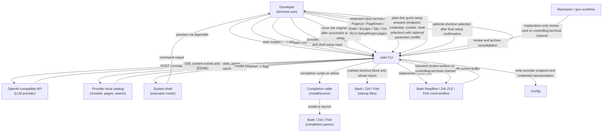
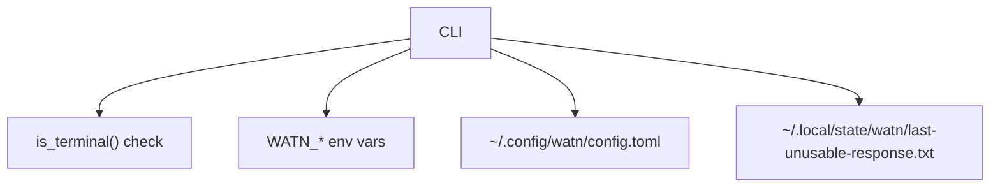

# 3. Context and Scope

## Business context

| Partner / User | Input to system | Output from system |
|---|---|---|
| Developer | Positional question, stdin, flags (`-1`/`-2`/`-3`, `-x`, `--model`, `--provider`, review override, flag-only review switch); one existing command through `watn explain` as a single argument, after `--`, or on stdin; review decision keys (`e`/`r`/`c`, `d`/`?` view toggle, `D` disable review) and model-choice input in the review card; setup commands; one-question navigation and editing; typed model filter queries | In non-review mode, incrementally flushed shell command content on stdout and final metadata on stderr; in eligible review mode, a complete Candidate after `[DONE]`, a simple or detailed transient review surface on the controlling-terminal channel, and only the accepted Candidate or the Candidate released by a permanent review disable on the command-output channel; for `watn explain`, an explanation-only review card on the controlling-terminal channel with no command released to stdout, or the quick setup, setup wizard, or setup guidance when no usable model is configured; focused setup flows, first-run setup, guidance, or the existing confirmation prompt |
| Shell user / completion caller | `watn completions <SHELL>` with one of `bash`, `elvish`, `fish`, `powershell`, or `zsh` | The selected shell's completion script on stdout only; the caller installs or sources it |
| LLM provider and provider-local catalog | API key, completion endpoint, provider-local catalog endpoint, search query | HTTP POST to `/v1/chat/completions` and HTTP GET to `/models`, paginated `/models`, and `/models?search=...`; the same provider credential is used and catalog requests never receive chat completions |
| System shell | Confirmation response (`y`/`n`/Enter) | Executed command (when confirmed) |
| Shell startup file | Optional selected-shell installation | One marked native widget block and a reload instruction; malformed or failed targets remain unchanged |
| Bash/Zsh/Fish line editor | Ctrl-W and the complete current command buffer | In review mode, final acceptance records a `#`-prefixed history comment of the original Intent and places only the accepted Candidate in the shell line-editor buffer without evaluation; a permanent disable releases the current Candidate to the same buffer with a re-enable instruction on stderr; cancellation or failure records no review history and preserves the buffer; a leading `# ` is stripped before asking so recalled comments can be re-asked |
| Maintainer / givn workflow | Repository-wide scenario review, dispositions, and archive | Duplicate-title, overlap, subset, and net-delta evidence; an archived permanent tree with the same Watn runtime contract |

## Technical context

| Interface | Technology / Protocol | Direction |
|---|---|---|
| LLM provider | HTTPS + SSE (OpenAI chat-completions, complete with `[DONE]`) | Outbound |
| Legacy `[litellm]` data | TOML configuration | Read and preserved as unrelated data; not contacted by streamlined setup |
| Config file | TOML | Read (user path), atomic snapshot write after command confirmation, provider-local catalog state, credential representation, and tier/reasoning assignment with Unix mode `0600` |
| Unusable-response state file | Plain text, overwritten per unusable provider response | Write only; the most recent unusable response for a bug report; never read as configuration |
| Environment | `WATN_*` variables | Read |
| Stdin | TTY or pipe | TTY detection and question/input read |
| Stdout | Raw text or ANSI-rendered | Write |
| Confirmation prompt | stdin line read | Read
| Completion selector | Lowercase shell value on the CLI; closed parser contract | Read; invalid values produce a non-zero argument error containing `unsupported shell '<value>'; choose bash, elvish, fish, powershell, or zsh` |
| Completion output | Generated Bash, Elvish, Fish, PowerShell, or Zsh script | Outbound to stdout only; no config, provider, or shell-startup interface is touched |
| Shell widget boundary | Native line-editor buffer plus `watn` on `PATH` | Reads one quoted question, captures stdout, keeps stderr visible, and replaces/repaints only after zero status and non-empty output |
| Review surface boundary | Controlling-terminal channel, ANSI redraw, and review keys | Shows a small transient Command flow review in a simple default view or a detailed view without writing review-surface text to stdout; direct decision keys accept/edit/reject/cancel, switch the view, or disable the review permanently with the current Candidate released to the command-output channel, rejection opens a model chooser, and the typed results are `Accepted(candidate)`, `Cancelled`, `RejectRequested`, `RegenerateWith`, `DisableReviewPermanently`, or `Unavailable` |
| Explanation entry point | One developer-supplied command as a single CLI argument, after `--`, or on standard input | Opens the explanation-only review card on the controlling-terminal channel when a usable model is configured; otherwise delegates to quick setup, the setup wizard, or setup guidance instead of opening the card; the command is delivered verbatim, never evaluated or executed, and no command is released to stdout; a failed explanation request keeps the card reviewable and reports the failure with the mapped exit status; an unusable response keeps the card reviewable with a named reason, is captured in the state file, and is named on stderr |
