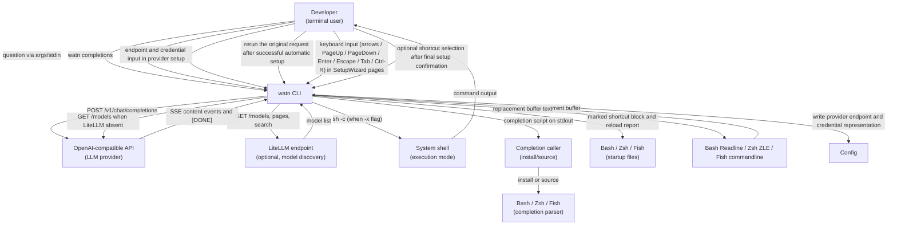
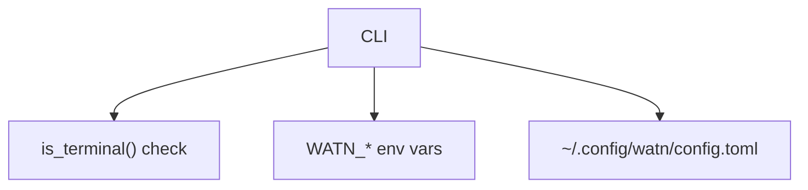

# 3. Context and Scope

## Business context

| Partner / User | Input to system | Output from system |
|---|---|---|
| Developer | Positional question, stdin, flags (`-1`/`-2`/`-3`, `-x`, `--model`, `--provider`); page navigation and editing in the shared `watn setup` wizard; `watn models` model-page entry; typed model filter queries | Incrementally flushed shell command content on stdout, then final metadata on stderr; buffered reasoning on stderr only after successful completion with `-v`; five-page SetupWizard with visible tabs, cursor, green border around the focused input region, visible filter query, continuously updated model suggestions, provider credential choice, model tables, and save/discard prompt; saved provider/tier setup; actionable non-TTY setup guidance; or confirmation prompt |
| Shell user / completion caller | `watn completions <SHELL>` with one of `bash`, `elvish`, `fish`, `powershell`, or `zsh` | The selected shell's completion script on stdout only; the caller installs or sources it |
| LLM provider | API key, endpoint URL (config) | HTTP POST to `/v1/chat/completions`; SSE must end with `[DONE]` for success |
| LiteLLM (optional) | Endpoint URL (config), optional credential, search query (typed by user) | HTTP GET to `/models`, paginated `/models`, and HTTP GET to `/models?search=...`; never receives chat completions |
| System shell | Confirmation response (`y`/`n`/Enter) | Executed command (when confirmed) |
| Shell startup file | Optional selected-shell installation | One marked native widget block and a reload instruction; malformed or failed targets remain unchanged |
| Bash/Zsh/Fish line editor | Ctrl-W and the complete current command buffer | A successful non-empty `watn` result inserted below a comment line containing the original request, without evaluation; failures preserve the buffer |

## Technical context

| Interface | Technology / Protocol | Direction |
|---|---|---|
| LLM provider | HTTPS + SSE (OpenAI chat-completions, complete with `[DONE]`) | Outbound |
| LiteLLM | HTTPS + JSON | Outbound (optional) |
| Config file | TOML | Read (user path), direct write (provider endpoint, credential representation, tier + reasoning assignment) with Unix mode `0600` after every save |
| Environment | `WATN_*` variables | Read |
| Stdin | TTY or pipe | TTY detection and question/input read |
| Stdout | Raw text or ANSI-rendered | Write |
| Confirmation prompt | stdin line read | Read
| Completion selector | Lowercase shell value on the CLI; closed parser contract | Read; invalid values produce a non-zero argument error containing `unsupported shell '<value>'; choose bash, elvish, fish, powershell, or zsh` |
| Completion output | Generated Bash, Elvish, Fish, PowerShell, or Zsh script | Outbound to stdout only; no config, provider, or shell-startup interface is touched |
| Shell widget boundary | Native line-editor buffer plus `watn` on `PATH` | Reads one quoted question, captures stdout, keeps stderr visible, and replaces/repaints only after zero status and non-empty output |
