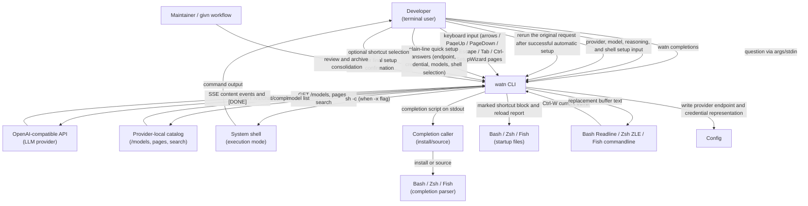
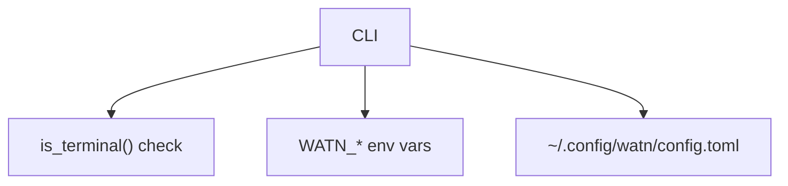

# 3. Context and Scope

## Business context

| Partner / User | Input to system | Output from system |
|---|---|---|
| Developer | Positional question, stdin, flags (`-1`/`-2`/`-3`, `-x`, `--model`, `--provider`); `watn setup`, `watn provider`, `watn models`, `watn shell`, and `watn quicksetup`; one-question navigation and editing; typed model filter queries | Incrementally flushed shell command content on stdout, then final metadata on stderr; buffered reasoning on stderr only after successful completion with `-v`; focused setup flows with provider choices, credential source, catalog status, separate model/reasoning questions, review, shell desired state, and safe cancellation; plain-line first-run quick setup with suggested endpoint, credential reference, and models; saved provider/model setup; actionable non-TTY setup guidance; or confirmation prompt |
| Shell user / completion caller | `watn completions <SHELL>` with one of `bash`, `elvish`, `fish`, `powershell`, or `zsh` | The selected shell's completion script on stdout only; the caller installs or sources it |
| LLM provider and provider-local catalog | API key, completion endpoint, provider-local catalog endpoint, search query | HTTP POST to `/v1/chat/completions` and HTTP GET to `/models`, paginated `/models`, and `/models?search=...`; the same provider credential is used and catalog requests never receive chat completions |
| System shell | Confirmation response (`y`/`n`/Enter) | Executed command (when confirmed) |
| Shell startup file | Optional selected-shell installation | One marked native widget block and a reload instruction; malformed or failed targets remain unchanged |
| Bash/Zsh/Fish line editor | Ctrl-W and the complete current command buffer | A successful non-empty `watn` result recorded as a `#`-prefixed history comment of the original request plus a buffer holding only the generated command, without evaluation; a leading `# ` is stripped before asking so recalled comments can be re-asked; failures preserve the buffer |
| Maintainer / givn workflow | Repository-wide scenario review, dispositions, and archive | Duplicate-title, overlap, subset, and net-delta evidence; an archived permanent tree with the same Watn runtime contract |

## Technical context

| Interface | Technology / Protocol | Direction |
|---|---|---|
| LLM provider | HTTPS + SSE (OpenAI chat-completions, complete with `[DONE]`) | Outbound |
| Legacy `[litellm]` data | TOML configuration | Read and preserved as unrelated data; not contacted by streamlined setup |
| Config file | TOML | Read (user path), atomic snapshot write after command confirmation, provider-local catalog state, credential representation, and tier/reasoning assignment with Unix mode `0600` |
| Environment | `WATN_*` variables | Read |
| Stdin | TTY or pipe | TTY detection and question/input read |
| Stdout | Raw text or ANSI-rendered | Write |
| Confirmation prompt | stdin line read | Read
| Completion selector | Lowercase shell value on the CLI; closed parser contract | Read; invalid values produce a non-zero argument error containing `unsupported shell '<value>'; choose bash, elvish, fish, powershell, or zsh` |
| Completion output | Generated Bash, Elvish, Fish, PowerShell, or Zsh script | Outbound to stdout only; no config, provider, or shell-startup interface is touched |
| Shell widget boundary | Native line-editor buffer plus `watn` on `PATH` | Reads one quoted question, captures stdout, keeps stderr visible, and replaces/repaints only after zero status and non-empty output |
