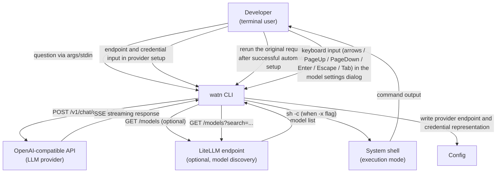
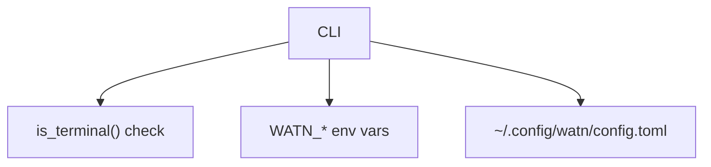

# 3. Context and Scope

## Business context

| Partner / User | Input to system | Output from system |
|---|---|---|
| Developer | Positional question, stdin, flags (`-1`/`-2`/`-3`, `-x`, `--model`, `--provider`); endpoint and credential choices in `watn provider`; keyboard input in the model settings dialog (arrows, PageUp/PageDown, Enter, Escape, Tab) | Shell command + metadata (model, tok/s, cost); saved provider setup; actionable non-TTY setup guidance; or confirmation prompt |
| LLM provider | API key, endpoint URL (config) | HTTP POST to `/v1/chat/completions` |
| LiteLLM (optional) | Endpoint URL (config), search query (typed by user) | HTTP GET to `/models`, HTTP GET to `/models?search=...` |
| System shell | Confirmation response (`y`/`n`/Enter) | Executed command (when confirmed) |

## Technical context

| Interface | Technology / Protocol | Direction |
|---|---|---|
| LLM provider | HTTPS + SSE (OpenAI chat-completions) | Outbound |
| LiteLLM | HTTPS + JSON | Outbound (optional) |
| Config file | TOML | Read (user path), direct write (provider endpoint, credential representation, tier + reasoning assignment) with Unix mode `0600` after every save |
| Environment | `WATN_*` variables | Read |
| Stdin | TTY or pipe | TTY detection and question/input read |
| Stdout | Raw text or ANSI-rendered | Write |
| Confirmation prompt | stdin line read | Read
