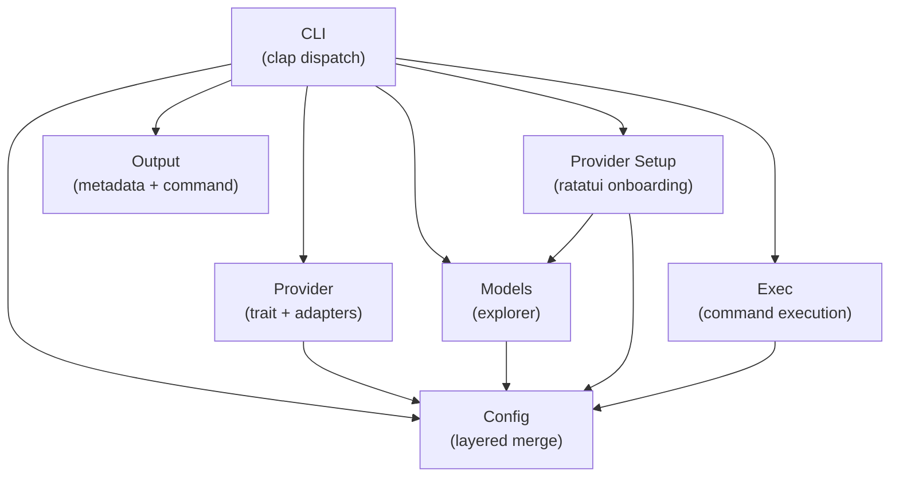

# 5. Building Block View

## Level 1 — System overview

| Building block | Responsibility |
|---|---|
| CLI | Parse args (`-1`/`-2`/`-3` tier flags, `-x`, subcommands), route errors to exit codes |
| Config | Load and merge from built-in defaults, user config file, env, CLI |
| Provider | Chat with any OpenAI-compatible API via the Provider trait |
| Provider Setup | Guide endpoint and credential selection in a TTY, render a bordered source list plus aligned detail table and guidance paragraph, validate input, return a typed result, persist the selected fixed provider through its caller, and restore the terminal on every exit |
| Output | Format response with metadata header (model, tok/s, cost) + command body |
| Models | Query the provider `/models` endpoint; interactive tier selection via the existing dialoguer/ratatui paths; return a typed setup result and persist tiers through the direct config writer |
| Exec | Print command, prompt confirmation, invoke `sh -c` if confirmed |

## Level 2 — Key building blocks

### Provider

**Responsibility:** Abstract over any OpenAI-compatible chat completions API.

| Element | Responsibility |
|---|---|
| `Provider` trait | Defines `chat_completions_streaming()` (SSE streaming) |
| `OpenAICompatibleProvider` | Concrete implementation: builds HTTP request (conditionally adds `reasoning` body field), parses SSE chunks (extracts both `content` and `reasoning` from delta) |
| `ProviderRegistry` | Maps provider names (from config) to `Box<dyn Provider>` instances |

### Config

**Responsibility:** Load, merge, expose configuration values, and bootstrap the config file on first run.

| Element | Responsibility |
|---|---|
| `ConfigLoader` | Ordered chain: defaults → user config → env → CLI overrides |
| `EnvReader` | Read `WATN_*` environment variables |
| `ProviderReadiness` | Decide locally whether a configured provider and credential can be resolved without probing the network or consulting the E2E transport override |
| `CredentialResolver` | Apply saved-literal/reference precedence, expand a complete `${VARIABLE}` reference at request or model-discovery time, and fall back only when `api_key` is absent |
| `Config` struct | Serde-deserializable root config with `providers`, `tiers`, `pricing`, `litellm` |
| `AutoInit` | On first run (no config file exists), writes a commented-out template to the standard XDG path before proceeding |

### Models

**Responsibility:** Discover available models and let user assign tiers.

| Element | Responsibility |
|---|---|
| `ModelExplorer` | Query provider `/models` endpoint (with optional `?search=` and pagination params), parse response |
| `SettingsDialog` | Ratatui keyboard-driven dialog: walks small/normal/thinking in a guided sequence; per level shows filter paragraphs, active tier tabs, a highlighted metadata table, reasoning strength, and a scrollbar for overflow; arrow/page keys browse, Enter advances, Escape goes back, confirm persists choices |
| `ModelPicker` | Shared model-search and local-filter logic used by the dialog and test seam; remote search results use a stale-result guard |
| `TierSelector` | Fallback interactive prompts for non-dialog paths |
| `ConfigWriter` | Persist selected tier assignments and per-level reasoning strengths through the existing direct writer, enforcing Unix mode `0600` after every save |

### Exec

**Responsibility:** Execute returned command in system shell.

 | Element | Responsibility |
 |---|---|
 | `Executor` | Print command, read stdin for confirmation, run `sh -c <cmd>` |
