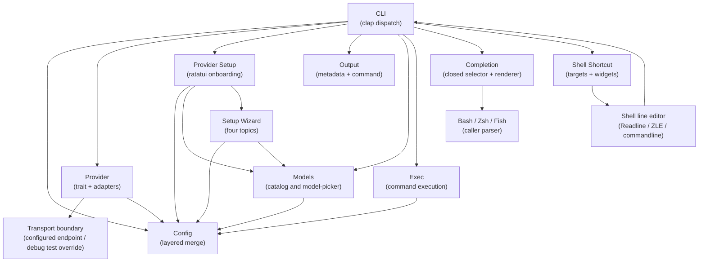

# 5. Building Block View

## Level 1 — System overview

| Building block | Responsibility |
|---|---|
| CLI | Parse args (`-1`/`-2`/`-3` tier flags, `-x`, retained subcommands), route errors to exit codes, and dispatch first-run setup before readiness |
| Config | Read an existence-aware persisted config without writes, preserve authoritative credential sources, and atomically commit a reviewed draft |
| Provider | Chat with any OpenAI-compatible API via the Provider trait; parse SSE incrementally, invoke the synchronous content sink, accumulate reasoning privately, and require `[DONE]` |
| Transport boundary | Resolve the configured endpoint for all normal/release requests; permit a non-empty test override only in debug `test-support` outbound construction, without touching config or readiness |
| Provider discovery | Guide explicit provider identity and credential-source selection in a TTY, perform allowlisted presence-only discovery, validate input, and restore the terminal on every exit |
| Setup Wizard | Own the Provider, Model roles, Shell integration, and Review topics; show provenance, contextual help, responsive layout, role review state, save/discard prompt, and shell intents; commit the complete draft only at Finish |
| Output | Flush each command content chunk once, own spinner finish/clear behavior, and render final metadata separately after successful completion |
| Models | Resolve a dedicated LiteLLM-or-provider catalog source; query list, page, and search endpoints; choose local filtering for complete catalogs and provider search for incomplete catalogs; apply validated reasoning defaults; provide labeled suggestions and manual fallback to the draft |
| Exec | Use the already rendered aggregate command for confirmation and invoke `sh -c` only after successful stream completion; never reprint the command |
| Completion | Parse the closed `CompletionShell` selector, derive scripts from the authoritative Clap command definition, render Bash/Elvish/Fish/PowerShell/Zsh, and write only successful script bytes to stdout |
| Shell parser boundary | Consume an installed completion script; parser acceptance is verified separately for Bash, Elvish, Fish, PowerShell, and Zsh when the executable is available and is not a provider or configuration dependency |
| Shell Shortcut | Resolve selected Bash/Zsh/Fish targets, generate native marked blocks, validate marker counts, replace existing blocks atomically, attempt targets independently, return per-target reports plus aggregate failure, and emit widgets that keep the request visible as a comment above the generated command without evaluation; Fish constructs the separator as an actual newline |
| Line editor boundary | Bind Ctrl-W, read the complete current buffer, call `command watn -- "$question"`, replace the buffer with a request comment above the generated command using a real Fish line break, and never evaluate the captured text |

## Level 2 — Key building blocks

### Current setup decomposition

The active setup implementation uses a `SetupDraft` session aggregate rather
than independent page-owned saves. Its runtime-only state includes field
origins (`Loaded from config`, `Detected from environment`, `Recommended
default`, and `Entered by you`), credential source kind, catalog status, model
role review state, and shell intent. The four rendered topics are Provider,
Model roles, Shell integration, and Review. Finish validates and commits the
supported configuration once; shell marker reconciliation follows the commit
and can return a saved-with-shell-failures outcome.

### Provider

**Responsibility:** Abstract over any OpenAI-compatible chat completions API.

| Element | Responsibility |
|---|---|
| `Provider` trait | Defines `chat_completions_streaming()` with a synchronous content-event sink |
| `OpenAICompatibleProvider` | Concrete implementation: builds HTTP request (conditionally adds `reasoning` body field), parses buffered SSE lines, extracts content/reasoning/model/usage, invokes the content sink, and rejects EOF without `[DONE]` |
| `ProviderRegistry` | Public provider lookup boundary that maps provider names (from config) to `Box<dyn Provider>` instances; it remains useful even when the binary currently registers one active provider |

The transport boundary is the only production endpoint-resolution seam. URL
builders receive an effective endpoint and remain free of environment lookups.

### Catalog source

The catalog-source resolver selects `[litellm]` when configured and otherwise
uses the active provider. It carries the raw credential source until the
request boundary, where a literal or exact environment reference is expanded.
An absent LiteLLM key produces no Authorization header. The active provider
resolver used by chat is separate and is never replaced by the catalog source.

### Setup persistence

The four-topic wizard has no durable transition before Review's Finish. Provider,
model roles, reasoning, and shell intents remain in memory; Finish validates and
commits supported config once, then reconciles shell files independently. This
keeps first-run cancellation file-free and existing-config cancellation
byte-for-byte unchanged while still exposing saved partial shell failures.

### Config

**Responsibility:** Read persisted configuration without side effects, expose existence and authoritative values, and commit a reviewed draft at Finish.

| Element | Responsibility |
|---|---|
| `ConfigLoader` | Ordered chain: defaults → user config → env → CLI overrides |
| `EnvReader` | Read `WATN_*` environment variables |
| `ProviderReadiness` | Decide locally whether a configured provider and credential can be resolved without probing the network or consulting the E2E transport override |
| `CredentialResolver` | Apply saved-literal/reference precedence, expand a complete `${VARIABLE}` reference at request or model-discovery time, and fall back only when `api_key` is absent |
| `Config` struct | Serde-deserializable root config with `providers`, `tiers`, `pricing`, `litellm` |
| `ConfigRead` | Checks physical path existence before parsing and returns default state plus `exists = false` without creating a directory, template, or file |

### Models

**Responsibility:** Discover available models and let user assign tiers.

| Element | Responsibility |
|---|---|
| `ModelExplorer` | Query provider `/models` endpoint (with optional `?search=` and pagination params), parse response, and expose catalog completeness |
| `Model roles topic` | Shows Small / fast, Balanced / normal, and Thinking together, accepts catalog suggestions or manual IDs, tracks explicit review after provider changes, and derives metadata-aware reasoning |
| `model-picker` | Provides model-search and local-filter logic; the wizard selects the complete-catalog local path or incomplete-catalog remote path, and remote results use a stale-generation guard |
| `ConfigWriter` | Commits provider, all role assignments, reasoning, and preserved supported settings once at Finish with secure replacement |

### Exec

**Responsibility:** Execute returned command in system shell.

 | Element | Responsibility |
 |---|---|
   | `Executor` | Read stdin for confirmation and run the already rendered `sh -c <cmd>` only after the stream succeeds; it does not print the aggregate again |

### Completion

**Responsibility:** Generate a shell completion script without entering normal
configuration or provider execution.

| Element | Responsibility |
|---|---|
| `CompletionShell` | Closed selector accepting only `bash`, `elvish`, `fish`, `powershell`, and `zsh`; rejects every other value with the literal `unsupported shell '<value>'; choose bash, elvish, fish, powershell, or zsh` parser contract |
| Completion-generation branch | `run_completions` calls `Cli::command()` and maps the validated selector to the corresponding `clap_complete` renderer; it does not maintain a second command tree |
| Output boundary | Writes the selected script to stdout only, leaves stderr empty, and returns before config auto-init, provider resolution, network access, or spinner setup |

## Repository hygiene boundary

The cleanup keeps architectural and consumer boundaries explicit:

- Remove only the unused `_config` parameter from `build_registry()` after the
  implementation is complete.
- Retain public `ProviderRegistry`, `ProviderSetupResult`, and the
  `cancellation_result` and `configured_result` wrapper functions. Current
  feature steps consume the setup result wrappers, and external consumers of the
  public library modules cannot be ruled out.
- Remove only `WatnWorld` fields proven write-only by repository-wide search
  after the active scenarios are migrated. Fields read or written by permanent
  feature steps remain.
