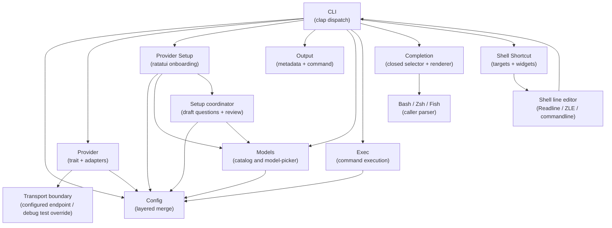

# 5. Building Block View

## Level 1 — System overview

| Building block | Responsibility |
|---|---|
| CLI | Parse args (`-1`/`-2`/`-3` tier flags, `-x`, subcommands), route errors to exit codes; run the streaming call on a worker thread, poll completion and the interrupt flag, and bound cancellation by a 500 ms grace before exiting 130 |
| Config | Load and merge from built-in defaults, user config file, env, CLI; preserve credential sources, provider-local catalog state, and atomic candidate snapshots |
| Provider | Chat with any OpenAI-compatible API via the Provider trait; parse SSE incrementally, invoke the synchronous content sink, accumulate reasoning privately, require `[DONE]`, and abort with `Interrupted` when the shared interrupt flag is set |
| Transport boundary | Resolve the configured endpoint for all normal/release requests; permit a non-empty test override only in debug `test-support` outbound construction, without touching config or readiness |
| Provider Setup | Guide explicit provider identity, endpoint, and credential selection in a TTY, validate input, return a typed result, migrate the selected provider to its canonical name at final confirmation, and restore the terminal on every exit |
| Setup Wizard | Own the coordinated draft, focused provider/model/shell ranges, separate model/reasoning questions, catalog status, review, back-navigation, and shell desired state; no coordinated field is saved before final confirmation |
| Output | Flush each command content chunk once, own spinner finish/clear behavior, and render final metadata separately after successful completion |
| Models | Resolve a provider-local catalog source; query list, page, and search endpoints with the provider credential; choose local filtering for complete catalogs and provider search for incomplete catalogs; offer catalog suggestions plus custom reasoning; return a typed setup result and persist roles without replacing provider-owned fields |
| Exec | Use the already rendered aggregate command for confirmation and invoke `sh -c` only after successful stream completion; never reprint the command |
| Completion | Parse the closed `CompletionShell` selector, derive scripts from the authoritative Clap command definition, render Bash/Elvish/Fish/PowerShell/Zsh, and write only successful script bytes to stdout |
| Shell parser boundary | Consume an installed completion script; parser acceptance is verified separately for Bash, Elvish, Fish, PowerShell, and Zsh when the executable is available and is not a provider or configuration dependency |
| Shell Shortcut | Resolve selected Bash/Zsh/Fish targets, generate native marked blocks, validate marker counts, replace existing blocks atomically, attempt targets independently, return per-target reports plus aggregate failure, and emit widgets that keep the request visible as a comment above the generated command without evaluation; Fish constructs the separator as an actual newline |
| Line editor boundary | Bind Ctrl-W, read the complete current buffer, call `command watn -- "$question"`, replace the buffer with a request comment above the generated command using a real Fish line break, and never evaluate the captured text |
| Specification ownership | Treat active `.feature` files as one permanent behavior inventory; surface duplicate titles, shape matches, subsets, and long-scenario dispositions before archive. |

## Level 2 — Key building blocks

### Provider

**Responsibility:** Abstract over any OpenAI-compatible chat completions API.

| Element | Responsibility |
|---|---|
| `Provider` trait | Defines `chat_completions_streaming()` with a synchronous content-event sink |
| `OpenAICompatibleProvider` | Concrete implementation: builds HTTP request (conditionally adds `reasoning` body field), parses buffered SSE lines, extracts content/reasoning/model/usage, invokes the content sink, rejects EOF without `[DONE]`, and returns `Interrupted` at the next SSE line when the shared interrupt flag is set |
| `ProviderRegistry` | Public provider lookup boundary that maps provider names (from config) to `Box<dyn Provider>` instances; it remains useful even when the binary currently registers one active provider |

The transport boundary is the only production endpoint-resolution seam. URL
builders receive an effective endpoint and remain free of environment lookups.

### Catalog source

The catalog resolver uses the selected provider's saved or derived catalog base
and its credential source. The legacy `[litellm]` section remains readable and
is copied through unrelated config writes, but it is not contacted, migrated, or
used as a fallback by setup or model discovery. List, page, and search requests
share the provider-local source and exact Authorization behavior.

### Setup persistence

The coordinator's final review is the only durable boundary for coordinated
setup. It writes one complete candidate snapshot or leaves the baseline
unchanged. Focused provider and model commands save only their owned fields at
their own final confirmations. A selected arbitrary provider name migrates to
`custom` in the same successful snapshot; shell target writes remain independent
after config success.

### Config

**Responsibility:** Load, merge, expose configuration values, distinguish absent and malformed files, and write confirmed candidate snapshots without implicit template creation.

| Element | Responsibility |
|---|---|
| `ConfigLoader` | Ordered chain: defaults → user config → env → CLI overrides |
| `EnvReader` | Read `WATN_*` environment variables |
| `ProviderReadiness` | Decide locally whether a configured provider and credential can be resolved without probing the network or consulting the E2E transport override |
| `CredentialResolver` | Apply saved-literal/reference precedence, expand a complete `${VARIABLE}` reference at request or model-discovery time, and fall back only when `api_key` is absent |
| `Config` struct | Serde-deserializable root config with `providers`, `tiers`, `pricing`, `litellm` |
| `SetupRequired` | Decide locally whether provider or any required model role is incomplete; a first-run file is created only after final setup confirmation |

### Models

**Responsibility:** Discover available models and let user assign tiers.

| Element | Responsibility |
|---|---|
| `ModelExplorer` | Query the selected provider's `/models` endpoint (with optional `?search=` and pagination params), reject unusable identifiers, and expose catalog completeness/status |
| `SetupWizard` model questions | Own separate model and reasoning questions, page event loop, visible query, focused-widget border styling, search-worker lifecycle, manual fallback, and final review boundary |
| `model-picker` | Provides model-search and local-filter logic; the wizard selects the complete-catalog local path or incomplete-catalog remote path, and remote results use a stale-generation guard |
| `ConfigWriter` | Serialize a candidate snapshot atomically, persist selected tier assignments and verbatim reasoning strings, enforce Unix mode `0600`, and preserve unrelated fields |

### Exec

**Responsibility:** Execute returned command in system shell.

 | Element | Responsibility |
 |---|---|
   | `Executor` | Read stdin for confirmation and run the already rendered `sh -c <cmd>` only after the stream succeeds; it does not print the aggregate again |

### Completion

**Responsibility:** Generate a shell completion script without entering normal
configuration or provider execution.

| Element | Responsibility |
|---|---|
| `CompletionShell` | Closed selector accepting only `bash`, `elvish`, `fish`, `powershell`, and `zsh`; rejects every other value with the literal `unsupported shell '<value>'; choose bash, elvish, fish, powershell, or zsh` parser contract |
| Completion-generation branch | `run_completions` calls `Cli::command()` and maps the validated selector to the corresponding `clap_complete` renderer; it does not maintain a second command tree |
| Output boundary | Writes the selected script to stdout only, leaves stderr empty, and returns before config creation, provider resolution, network access, or spinner setup |

## Repository hygiene boundary

The cleanup keeps architectural and consumer boundaries explicit:

- Remove only the unused `_config` parameter from `build_registry()` after the
  implementation is complete.
- Retain public `ProviderRegistry`, `ProviderSetupResult`, and the
  `cancellation_result` and `configured_result` wrapper functions. Current
  feature steps consume the setup result wrappers, and external consumers of the
  public library modules cannot be ruled out.
- Remove only `WatnWorld` fields proven write-only by repository-wide search
  after the active scenarios are migrated. Fields read or written by permanent
  feature steps remain.
