# 6. Runtime View

## Current streamlined setup flows

The setup runtime is a draft state machine with four command entry points. The
coordinator sequence is provider, completion endpoint, credential, provider-
local catalog status, small model, small reasoning, normal model, normal
reasoning, thinking model, thinking reasoning, completion shell desired state,
Ctrl-W desired state, and final review. The provider and models flows use only
their owned ranges; the shell flow has no configuration write.

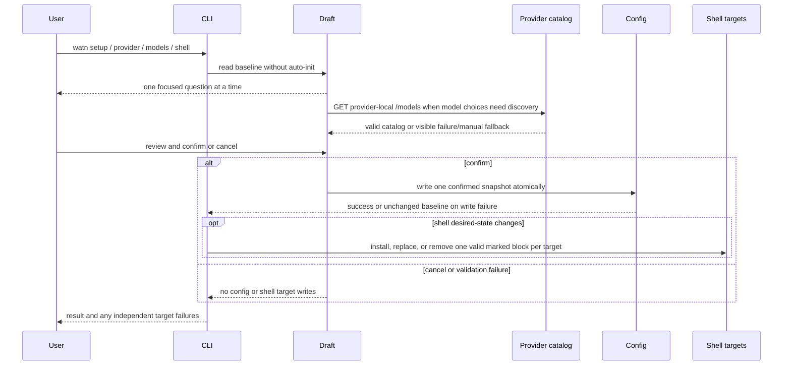

Provider catalog requests use the selected provider's saved or derived catalog
base and the provider credential. A legacy `[litellm]` section is carried as
unrelated configuration but is never contacted by setup or model discovery.
The final review is the only coordinated configuration write boundary. An
interactive request with a missing provider, credential, or required model role
enters the same coordinator; a non-TTY request prints guidance and makes no
catalog or chat request. Successful implicit setup exits without replaying the
original question.

## Scenario: Ask a question with default tier

**Trigger:** User runs `watn "find files modified today"`.

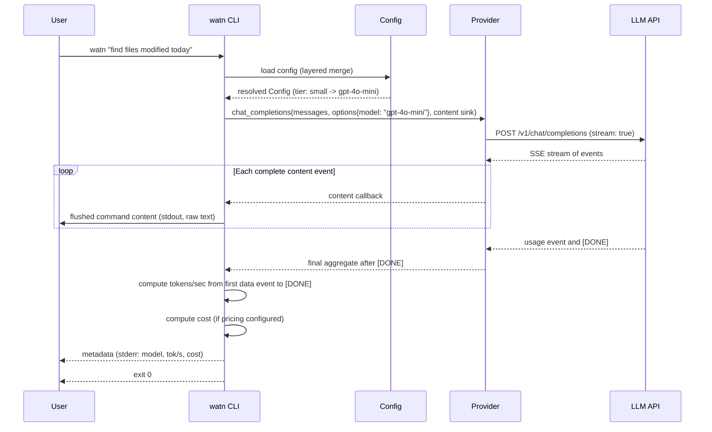

**Steps:**
1. CLI parses args, defaults to tier `-1` (small/fast)
2. Config resolves selected tier to model name
3. Provider sends POST with `stream: true`
4. Provider reads complete SSE events through a buffered reader and invokes the
   synchronous content callback; there is no channel
5. The callback writes and flushes each content delta once, finishing the
   spinner on first content
6. After `[DONE]`, compute tok/s from the first data event to the completion
   marker and use authoritative final usage/model values
7. Print metadata: response model, tokens/sec, cost (if pricing configured)
8. Exit 0; the command is not printed again from the final aggregate

## Scenario: Generate a shell completion script

**Trigger:** A caller runs `watn completions <SHELL>` for `bash`, `zsh`, or
`fish`.

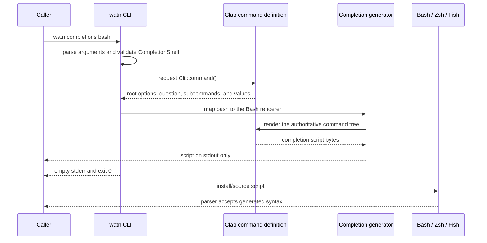

**Steps:**
1. Parse the subcommand and the closed selector before normal command dispatch.
2. Return before configuration loading, config creation, provider resolution,
   model discovery, network access, or spinner setup.
3. Render from the same command definition used by Clap parsing and help.
4. Write only the selected script to stdout; successful stderr is empty.
5. Generate twice for each supported shell and compare bytes exactly.
6. Pass each generated script through the corresponding installed shell parser.

The regular no-config scenario snapshots the absent isolated
`$XDG_CONFIG_HOME/watn/config.toml` and a provider-request sentinel at zero hits
before invocation. The file remains absent, no file is written in that isolated
config directory, and the sentinel remains at zero afterward. The generated
script contains the complete root option list, preserves the `question`
positional acceptance from `Cli::command()` even when a renderer does not emit
a literal placeholder, all root subcommands, and selector values `bash`,
`elvish`, `fish`, `powershell`, and `zsh` where the renderer exposes them.

## Scenario: Completion selector error and help

`watn completions nushell` stops in argument parsing with a non-zero status
and stderr containing the literal
`unsupported shell 'nushell'; choose bash, elvish, fish, powershell, or zsh`. It does not enter
the generation or configuration path. `watn completions --help` exits 0 and
prints `Usage: watn completions <SHELL>`, the five supported values, and the
instruction that the generated script is written to stdout for the caller to
install or source; stderr remains empty.

The subcommand reserves an unquoted first token `completions`. Existing question
text beginning with that token must be quoted as one argument or passed after
`--`.

## Scenario: Optional shell shortcut during setup

**Trigger:** A user reaches the shell desired-state questions in explicit,
coordinated, or focused shell setup and confirms the desired completion and
shortcut selections.

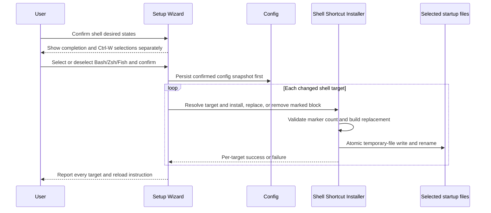

Declining either shell question performs no target inspection or shell-file I/O.
A selected shell with no target file creates only its own parent directories; a
deselected shell with one valid block removes only that block. Duplicate,
unmatched, or reversed markers fail before writing. Every changed target is
attempted independently; a later failure does not roll back earlier successful
renames, and the aggregate setup result is non-zero when any target failed.

## Scenario: Ctrl-W generates a command without evaluation

**Trigger:** A user presses Ctrl-W in an installed Bash, Zsh, or Fish line editor.

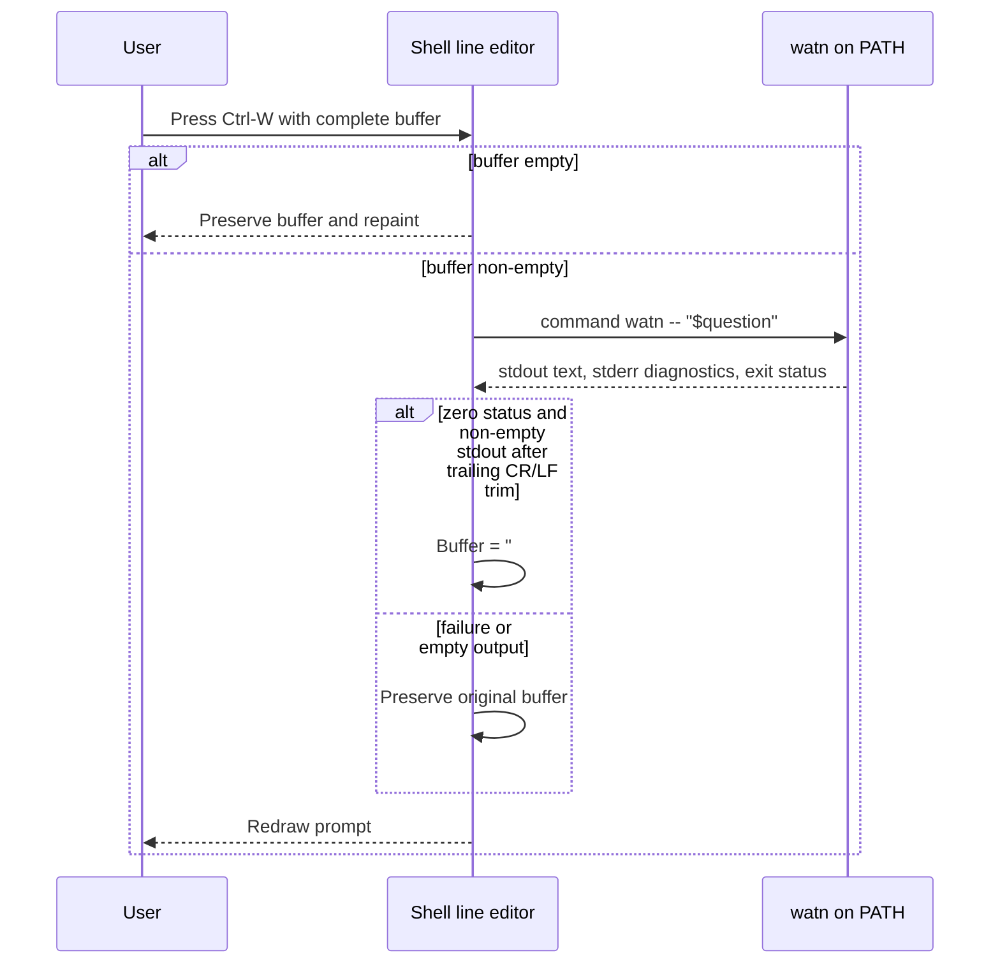

The request is flattened (CR, LF, and TAB become spaces) so it forms exactly
one comment line. Embedded line breaks in the generated result remain buffer
text. When the user presses Enter, the shell ignores the comment and executes
only the generated command. The shell never passes the captured result to an
evaluator, so text that resembles a second command is not executed by the
shortcut. Fish constructs the replacement as one collected buffer with an
actual line break; the visible characters `\\n` are never used as the
separator.

## Scenario: Ask with execution (`-x`)

**Trigger:** User runs `watn -x "echo hello"`.

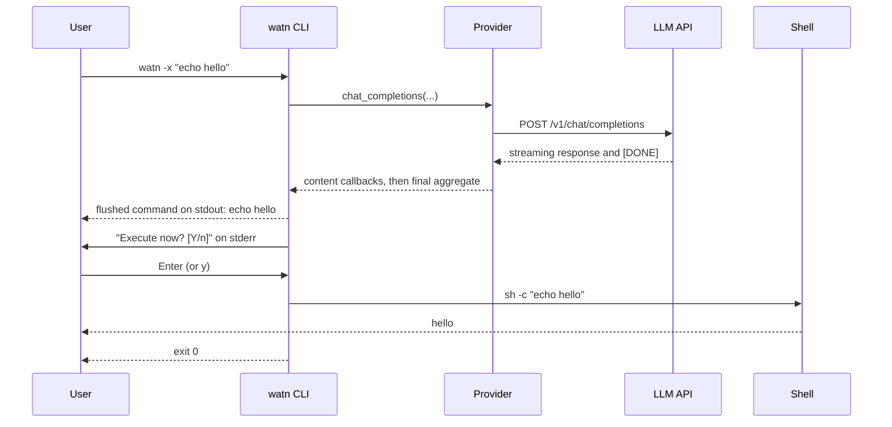

**Steps:**
1. CLI detects `-x` flag
2. Normal question flow streams command content and requires `[DONE]`.
3. After successful completion, the CLI terminates the streamed line and prompts
   "Execute now? [Y/n]" to stderr without printing the aggregate a second time
4. Reads one line from stdin
5. Empty line or `y`/`Y`: executes via `sh -c <cmd>` with inherited stdio
6. `n`/`N`: exits 0 without executing; any stream or output failure skips the prompt

## Scenario: Isolated debug test transport

**Trigger:** A test-support debug binary is run with a loopback endpoint
override.

```mermaid
sequenceDiagram
    participant Harness as Test harness
    participant CLI as watn debug test-support binary
    participant Config as Config
    participant Transport as Transport boundary
    participant ConfigTwin as Configured provider twin
    participant TestTwin as Isolated provider twin

    Harness->>ConfigTwin: start loopback twin at <base>/v1
    Harness->>TestTwin: start loopback twin at <base>/v1
    Harness->>Config: write configured endpoint, key, and default model
    Harness->>CLI: set WATN_TEST_ENDPOINT_OVERRIDE=<test-twin>/v1
    CLI->>Config: load configured provider
    Config-->>CLI: configured endpoint and credential
    CLI->>Transport: resolve outbound endpoint
    Transport-->>CLI: test twin endpoint (debug + test-support only)
    CLI->>TestTwin: POST /v1/chat/completions with Bearer key
    TestTwin-->>CLI: configured test response
    CLI-->>Harness: response and exit 0
    Harness->>Config: read persisted TOML
    Config-->>Harness: configured endpoint unchanged; override absent
```

The harness asserts the exact full URL, `POST /v1/chat/completions`, one hit on
the isolated twin, zero hits on the configured competing twin, and the exact
`Authorization: Bearer sk-configured` header. The source guard makes a
release-profile binary with `test-support` use the configured-endpoint branch;
release verification inspects that exact artifact and its target runtime
libraries.

## Scenario: Normal debug requests ignore test routing

The harness builds and copies both the default-feature debug binary and the
debug `test-support` binary from Cargo's shared target cache. With a configured
loopback provider twin and a separate competing twin selected by
`WATN_TEST_ENDPOINT_OVERRIDE`, it invokes exactly one child: the copied
default-feature debug binary. That child must request the configured
`<base>/v1/chat/completions` URL with `Authorization: Bearer sk-configured`,
return the configured response, and leave the competing twin at zero requests.
The test-support debug copy is intentionally not invoked in this scenario; its
override-honoring behavior is covered by the isolated-routing scenario. The
single configured hit is asserted for this child rather than inferred from a
two-child aggregate.

## Scenario: Missing or whitespace override fallback

The debug test-support binary is run once with the override absent and once
with whitespace. In both flows the transport boundary returns the configured
`<base>/v1` endpoint. The configured twin receives exactly one
`POST /v1/chat/completions` with the exact Authorization header; the competing
twin receives zero requests; and the persisted configured endpoint is exact.

## Scenario: Readiness ignores transport override

The readiness predicate resolves the configured provider and credential without
constructing an HTTP URL. With a competing loopback override present, it
returns ready and both local twins receive zero requests. The configured
endpoint in the provider record is unchanged.

## Scenario: Ask with thinking tier and verbose flag

**Trigger:** User runs `watn -3 -v "design a distributed queue"`.

```mermaid
sequenceDiagram
    participant User as User
    participant CLI as watn CLI
    participant Config as Config
    participant Prov as Provider
    participant API as LLM API

    User->>CLI: watn -3 -v "design a distributed queue"
    CLI->>Config: load config (layered merge)
    Config-->>CLI: resolved Config (tier: thinking -> o3-mini)
    CLI->>CLI: reasoning_effort from [tiers.reasoning] (thinking -> high by default), verbose = true
    CLI->>Prov: chat_completions(messages, options{model, reasoning_effort: "high"}, content sink)
    Prov->>API: POST /v1/chat/completions (body includes reasoning_effort: "high")
    API-->>Prov: SSE stream of chunks with content + reasoning fields
    loop Each complete content event
        Prov-->>CLI: content callback; accumulate reasoning privately
    end
    API-->>Prov: usage event and [DONE]
    Prov-->>CLI: StreamingResponse { full_content, reasoning_content, usage }
    CLI->>CLI: compute tokens/sec, cost, and finish command line
    CLI-->>User: command content (stdout, already streamed)
    CLI-->>User: buffered reasoning and metadata (stderr)
    CLI-->>User: exit 0
```

**Steps:**
1. CLI parses args, detects tier `-3` (thinking) and flag `-v` (verbose)
2. Config resolves thinking tier to model name
3. CLI resolves `reasoning_effort` from the tier's configured strength (default
   "high" for thinking when unset) and sets `verbose = true`; builds the POST body with `reasoning_effort`
4. Provider builds POST body with `reasoning_effort: "high"` in addition to standard fields
5. Provider reads SSE events, invokes the content sink, and extracts
   `delta["reasoning"]` or `delta["reasoning_content"]` into its private aggregate
6. Content is accumulated into `full_content` and flushed to stdout once per delta
7. Reasoning is not written to stderr while the stream is active
8. After `[DONE]`, compute tok/s from the first data event to the marker and use
   final usage/model values
9. When `-v` is active, print buffered reasoning to stderr, then final metadata;
   on failure, print neither

## Scenario: Keyboard-driven SetupWizard model pages

**Trigger:** User runs `watn models` from a terminal.

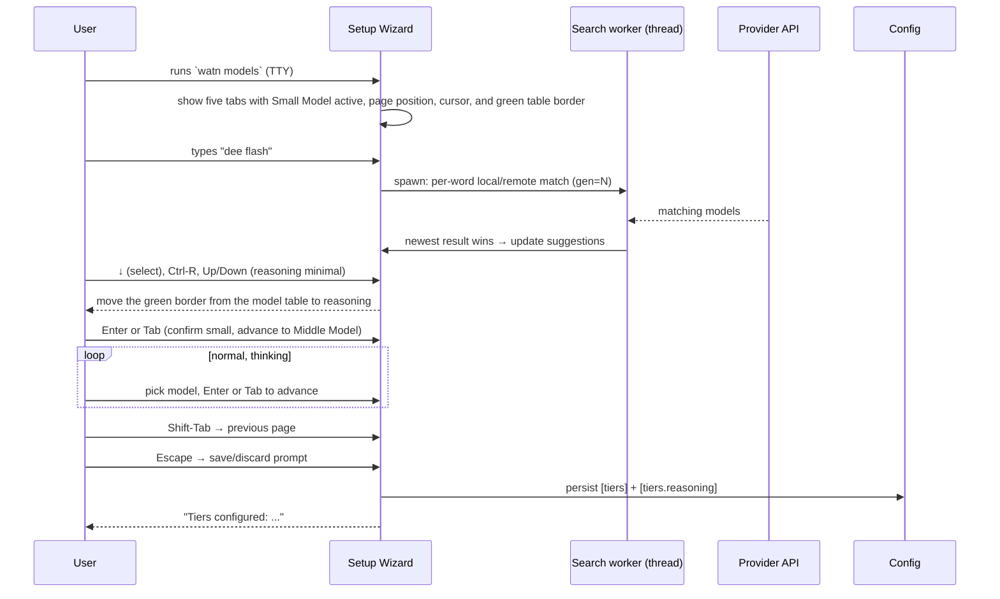

**Steps:**
1. The wizard opens on the Small Model page with five tabs, a border, filter
   paragraph, aligned model table, visible selected-row cursor, green border on
   the focused table, and scrollbar when needed.
2. Keystrokes update the visible filter; results match per-word,
   order-independent and are debounced with a stale-result guard.
3. Arrow/page keys move selection; Enter and Tab accept/advance; Shift-Tab
   returns to the previous page.
4. Ctrl-R focuses the closed reasoning set (off/low/minimal/medium/high) on a
   model page, moves the green border to the reasoning block, and leaves the
   model table in its inactive style; mandatory models exclude off.
5. Escape opens a save/discard prompt; saving persists the provider and all
   completed model choices.

## Scenario: Model exploration

**Trigger:** User runs `watn models`.


## Scenario: Model-picker search in the SetupWizard

**Trigger:** User runs `watn models`, types a search query on a SetupWizard model page.

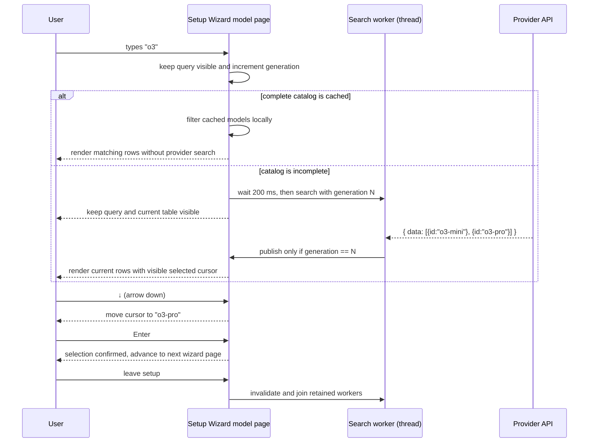

**Steps:**
1. The setup wizard enters raw terminal mode and shows the active page/tab.
2. Keystrokes append to or remove from the live query string.
3. Each change keeps the query visible and advances the generation counter.
4. A complete cached catalog is filtered locally. An incomplete catalog starts
   a blocking worker after a 200 ms quiet interval; the worker calls
   `GET /models?search=<query>`.
5. The worker captures the generation at spawn time. Before request, before
   publish, and before apply, an advanced generation discards the stale result.
6. Valid results update the suggestion list; the terminal is repainted without
   blocking further filter input.
7. Arrow keys move the table cursor; Ctrl-R toggles reasoning focus and
   Up/Down chooses one of the current model's supported efforts.
8. Enter or Tab confirms the selection and advances; Shift-Tab returns;
   Escape opens save/discard rather than clearing the query.
9. A 4xx/5xx on a non-empty search shows "Model search is not supported by
   this provider" and retains the previous suggestions.
10. After final selection or save/discard, the wizard invalidates and joins all
    retained search workers, restores cooked terminal mode, and returns
    provider/completed model drafts to the caller.

## Scenario: Config loading

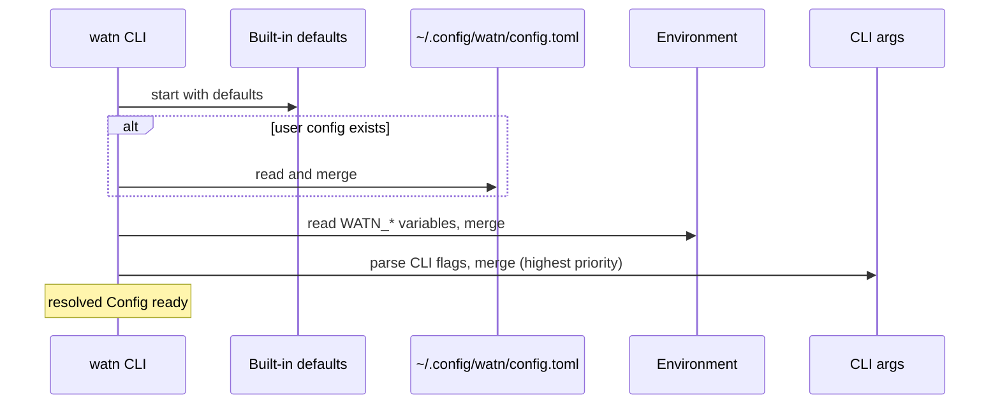

**Notes:** Missing files are silently skipped. Malformed TOML produces exit code 1 with a parse-error diagnostic on stderr.

## Scenario: First normal use with no recognized provider

**Trigger:** User runs `watn "hello"` without a configured provider or supported
provider credential environment variable and provider selection is implicit.

```mermaid
sequenceDiagram
    participant User as User
    participant CLI as watn CLI
    participant Setup as Setup Wizard
    participant Config as Config
    participant Twin as OpenAI-compatible endpoint

    User->>CLI: watn "hello"
    CLI->>Config: load config and inspect provider readiness
    Config-->>CLI: Missing
    alt stdin is not a TTY
        CLI-->>User: actionable `watn provider` and config-path guidance
        CLI-->>User: exit 1; no ratatui and no network request
    else stdin is a TTY
        CLI->>Setup: open coordinated setup draft
        User->>Setup: enter provider, endpoint, and credential
        Setup->>Twin: GET provider-local /models
        Twin-->>Setup: model catalog or catalog failure
        User->>Setup: select models, reasoning, shell desired states, and review
        Setup->>Config: write one complete snapshot only after final confirmation
        CLI-->>User: setup complete; exit 0
        Note over CLI: original question is not sent; user reruns it
    end
```

**Steps:**
1. Load the config and check actual provider data plus recognized environment
   variables; do not use a network probe for readiness.
2. If stdin is not a TTY, print actionable setup guidance and exit 1 without
   initializing ratatui.
3. If stdin is a TTY, open the shared setup wizard when no implicit provider is
   ready.
4. Keep the endpoint and either the literal credential or the `${VARIABLE}`
   reference in the draft without printing the resolved secret.
5. Probe the provider-local catalog and walk separate model and reasoning
   questions in the same process and terminal.
6. Save one complete snapshot only after review confirmation. Do not send or resume the
   original question.

## Scenario: Explicit provider setup

**Trigger:** User runs `watn provider`.

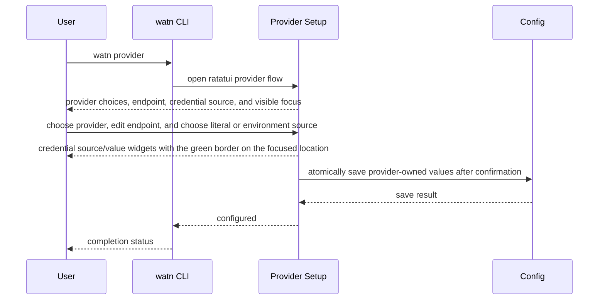

The explicit command ends after provider configuration. It does not invoke
model setup; only the automatic first-use TTY path performs that chain. An
explicit `--provider` or `WATN_PROVIDER` selection never enters automatic
onboarding and retains normal unknown-provider and missing-key errors.

## Scenario: Coordinated setup flow

**Trigger:** User runs `watn setup` from a terminal.

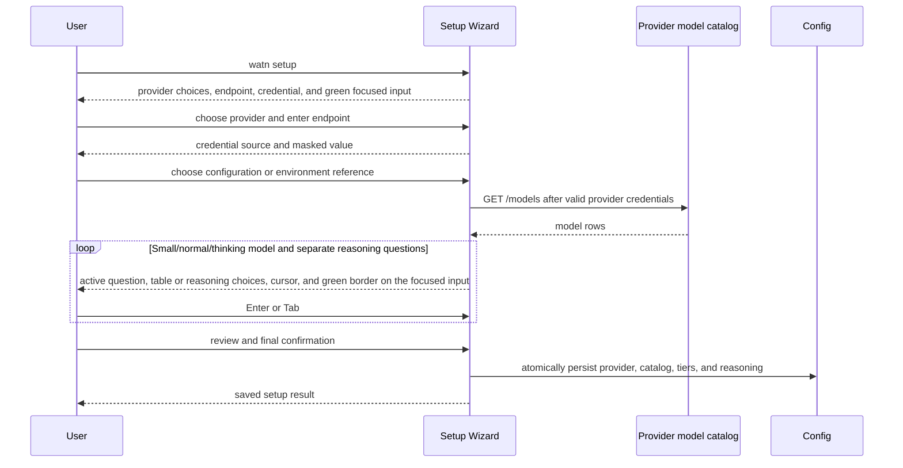

## Scenario: Catalog discovery from the selected provider

**Trigger:** User runs `watn models` with a provider-local catalog and an
unrelated legacy `[litellm]` section.

```mermaid
sequenceDiagram
    participant User as User
    participant CLI as watn models
    participant Config as Config
    participant Catalog as Provider-local catalog
    participant Legacy as Legacy LiteLLM source

    User->>CLI: watn models
    CLI->>Config: load active provider and provider-local catalog state
    Config-->>CLI: catalog endpoint + raw provider credential; legacy section unchanged
    CLI->>Catalog: GET /models or paginated /models with provider Bearer key
    Catalog-->>CLI: model metadata
    CLI-->>Legacy: no discovery request
    User->>CLI: assign small, normal, and thinking tiers
    CLI->>Config: save tier assignments only
    Note over CLI,Provider: Later chat requests still use Provider, never Catalog
```

The source is resolved once per discovery operation. The selected provider's
credential is expanded at request time. Search and pagination reuse the same
provider-local endpoint and credential policy. The legacy LiteLLM section is
preserved as unrelated configuration and receives zero requests.

## Scenario: Catalog failure before coordinated confirmation

**Trigger:** User enters a provider credential in `watn setup`, then catalog
discovery fails before final review confirmation.

```mermaid
sequenceDiagram
    participant User as User
    participant Wizard as Setup Wizard
    participant Config as Config
    participant Catalog as Catalog source

    User->>Wizard: confirm endpoint and credential source
    Wizard->>Wizard: validate and resolve credential
    Wizard->>Catalog: request model catalog
    Catalog-->>Wizard: error
    Wizard-->>User: catalog failure; switch to manual model entry or correction
    User->>Wizard: cancel before final review confirmation
    Config-->>User: baseline remains unchanged
```

Cancellation before final review performs no write, including after credential
validation or a successful catalog probe. Neither path sends the original chat
question. A focused provider command has its own confirmation boundary and does
not probe the catalog.

## Scenario: Reasoning policy and stale search generation

The shared reasoning resolver rejects only blank values, honors disabled and
mandatory metadata, and is used before both tier persistence and chat request
construction. Non-empty custom values remain exact strings; `off` is omitted.
Search workers receive monotonically increasing generations; a late worker may
finish its HTTP request but cannot apply its result after a newer generation has
been applied. The wizard joins or discards workers before returning to the
caller.

## Scenario: Completion marker and first-event timing

The provider can send `[DONE]` and keep its HTTP connection open. Watn completes
from the marker rather than waiting for the server-side close. The elapsed-time
clock starts at the first non-DONE data line, before decoding, and ends at the
marker.

```mermaid
sequenceDiagram
    participant CLI as watn CLI
    participant Prov as Provider
    participant API as LLM API
    participant User as User

    CLI->>Prov: request with content sink
    Prov->>API: POST /v1/chat/completions
    API-->>Prov: first data line
    Prov->>Prov: set first_event_at before JSON decode
    API-->>Prov: content event
    Prov-->>CLI: content callback
    CLI-->>User: flushed command prefix; spinner cleared
    API-->>Prov: usage-only event (choices empty)
    API-->>Prov: [DONE]
    Prov-->>CLI: final model, usage, reasoning, elapsed
    CLI-->>User: final metadata and optional buffered reasoning
    CLI-->>User: exit 0 before API closes connection
```

The response model and usage are read at the top level of every valid event.
Thus a choices-empty usage event can select the response model for metadata and
pricing. A later usage event replaces earlier usage. The final aggregate command
is used for trimming and optional execution, not rendered a second time.

## Scenario: Truncated or failed provider stream

Valid content remains visible when a provider closes without `[DONE]` or resets
the connection after a content event. Both cases finish the spinner and report a
network error with status 3. Neither prints final success metadata or enters
execution confirmation.

```mermaid
sequenceDiagram
    participant CLI as watn CLI
    participant Spinner
    participant Prov as Provider
    participant API as LLM API
    participant User as User

    CLI->>Spinner: start
    CLI->>Prov: request with content sink
    Prov->>API: POST /v1/chat/completions
    API-->>Prov: valid content event
    Prov-->>CLI: content callback
    CLI-->>User: flushed visible prefix
    API--xProv: clean EOF without [DONE] or connection reset
    Prov-->>CLI: NetworkError
    CLI->>Spinner: finish and clear
    CLI-->>User: preserve prefix and print network error
    CLI-->>User: omit metadata and execute prompt; exit 3
```

Malformed nonessential data events take a different path: the provider ignores
the malformed event, continues reading, and can still expose later valid content
before `[DONE]`.

## Scenario: Output failure during streaming

The callback owns stdout writes and flushes. If the output sink fails after a
prefix is visible, the provider stops through the existing I/O error path.

```mermaid
sequenceDiagram
    participant CLI as watn CLI
    participant Spinner
    participant Prov as Provider
    participant Out as Output sink
    participant User as User

    CLI->>Spinner: start
    Prov-->>CLI: first content callback
    CLI->>Out: write and flush prefix
    Out-->>CLI: success
    Prov-->>CLI: next content callback
    CLI->>Out: write or flush next chunk
    Out-->>CLI: I/O error
    CLI->>Spinner: finish and clear
    CLI-->>User: preserve prefix and report I/O error
    CLI-->>User: omit metadata and execution; exit 1
```

The direct output-writer test observes the prefix, status 1, spinner lifecycle,
absence of final metadata, and absence of the execute prompt without relying on
a platform-specific closed-pipe behavior.

## Scenario: Cancelling a running completion

Ctrl+C is acknowledged while a completion is in flight: the SSE parser checks
the shared interrupt flag at every line, and a worker-thread watchdog bounds the
remaining phases (stalled stream, connection pending) by a 500 ms grace before
a hard exit. The already-streamed stdout prefix stays and no error is printed.
On the join path the spinner is finished and partial output is completed; on
the grace path the process exits 130 directly without cleanup. Exit status 130
in both cases.

```mermaid
sequenceDiagram
    participant User as User
    participant CLI as watn CLI (main)
    participant Worker as Streaming worker thread
    participant Prov as Provider
    participant API as LLM API

    CLI->>Worker: spawn chat_completions_streaming(..., interrupt flag)
    Worker->>Prov: request with content sink
    Prov->>API: POST /v1/chat/completions
    API-->>Prov: SSE events
    Prov-->>Worker: content callback
    Worker-->>CLI: flushed command content (stdout)
    User--xCLI: Ctrl+C (SIGINT)
    CLI->>CLI: set interrupt flag
    alt stream flowing
        Worker->>Worker: next SSE line sees the flag
        Worker-->>CLI: Err(Interrupted)
        CLI->>CLI: finish spinner, finish partial output
        CLI-->>User: exit 130, no error text
    else stream stalled or connection pending
        CLI->>CLI: wait up to 500 ms for worker
        CLI->>CLI: detach worker and exit 130
    end
```

The streaming case (join path) preserves the visible prefix and finishes the
spinner; the grace path terminates bounded by the grace window without cleanup.
Neither prints final success metadata (`model · tok/s`), runs execution
confirmation, or reports an error message.
