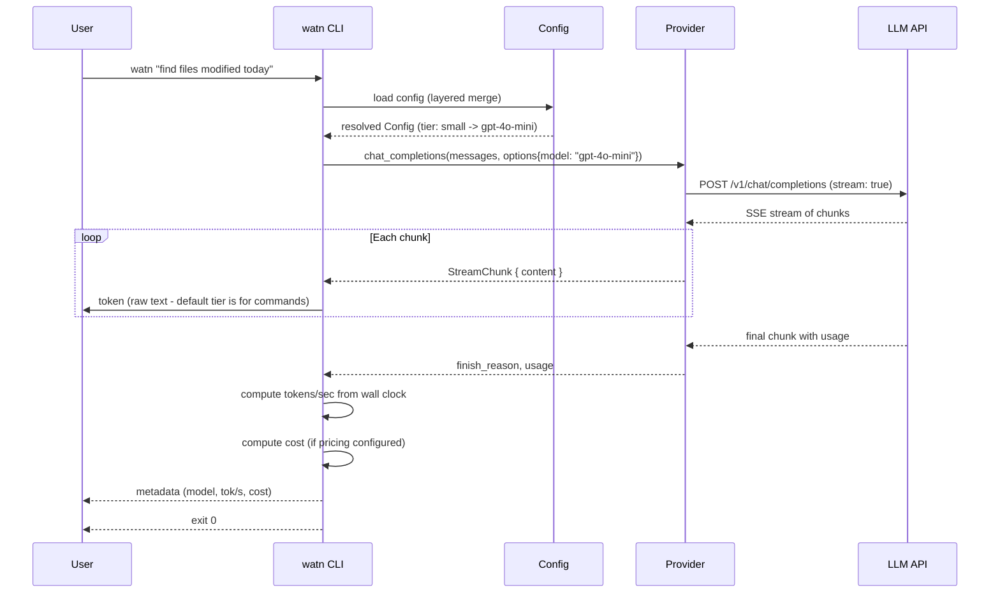
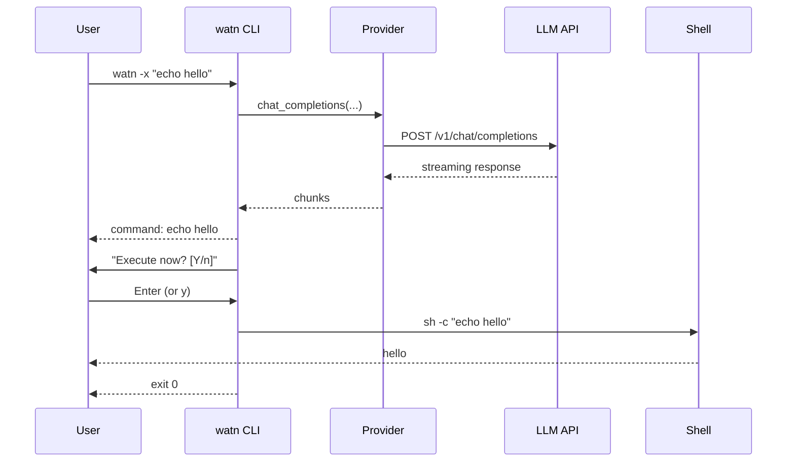
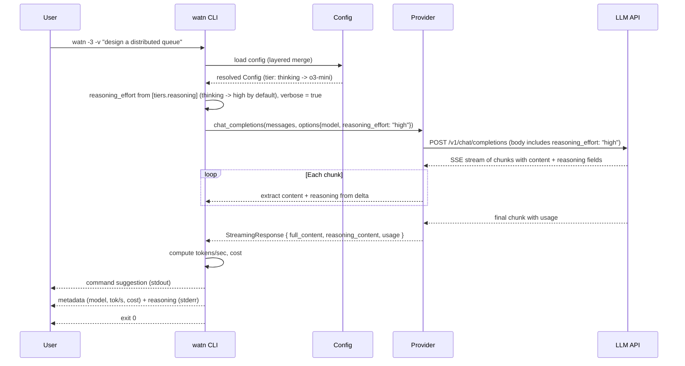
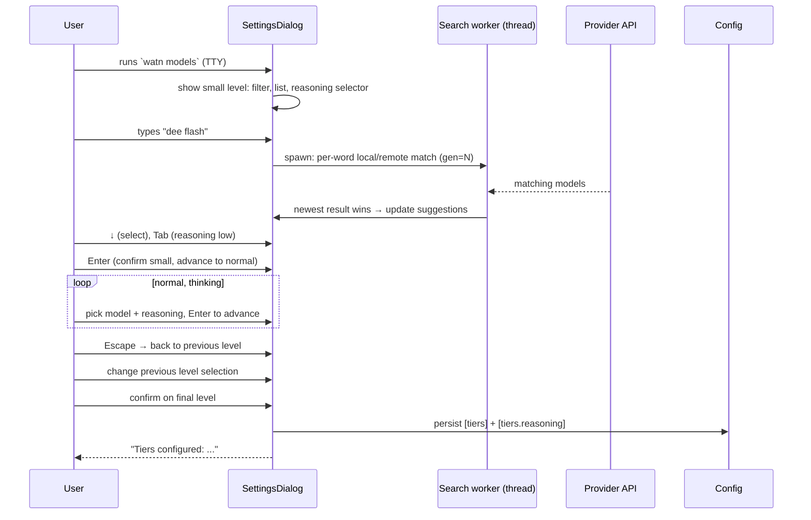
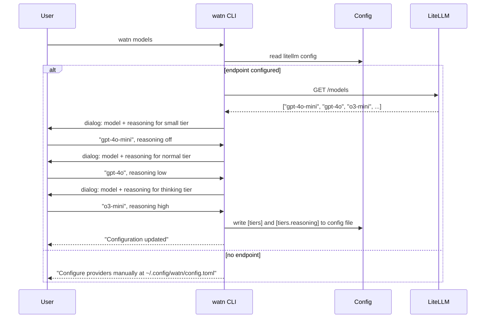
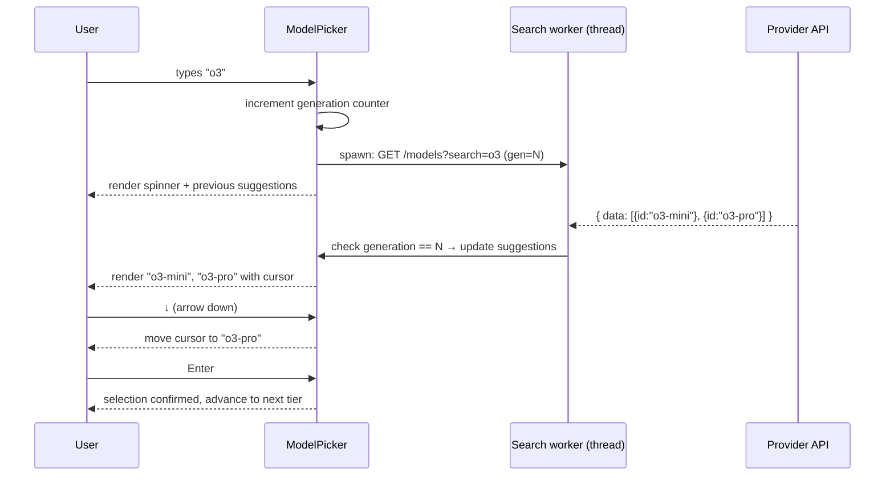
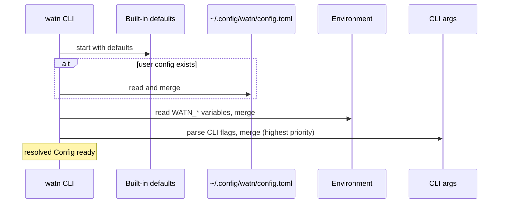

# 6. Runtime View

## Scenario: Ask a question with default tier

**Trigger:** User runs `watn "find files modified today"`.



**Steps:**
1. CLI parses args, defaults to tier `-1` (small/fast)
2. Config resolves selected tier to model name
3. Provider sends POST with `stream: true`
4. Provider reads SSE chunks, pushes each onto a channel
5. CLI reads channel and writes tokens to stdout
6. After stream ends, compute tok/s from elapsed time and usage
7. Print metadata: model name, tokens/sec, cost (if pricing configured)
8. Exit 0

## Scenario: Ask with execution (`-x`)

**Trigger:** User runs `watn -x "echo hello"`.



**Steps:**
1. CLI detects `-x` flag
2. Normal question flow executes (get command from LLM)
3. CLI prints the command, then prompts "Execute now? [Y/n]" to stderr
4. Reads one line from stdin
5. Empty line or `y`/`Y`: executes via `sh -c <cmd>` with inherited stdio
6. `n`/`N`: exits 0 without executing

## Scenario: Ask with thinking tier and verbose flag

**Trigger:** User runs `watn -3 -v "design a distributed queue"`.



**Steps:**
1. CLI parses args, detects tier `-3` (thinking) and flag `-v` (verbose)
2. Config resolves thinking tier to model name
3. CLI resolves `reasoning_effort` from the tier's configured strength (default
   "high" for thinking when unset) and sets `verbose = true`; builds the POST body with `reasoning_effort`
4. Provider builds POST body with `reasoning_effort: "high"` in addition to standard fields
5. Provider reads SSE chunks, extracting both `delta["content"]` and `delta["reasoning"]`
6. Content is accumulated into `full_content` as before
7. Reasoning is accumulated into `reasoning_content`
8. After stream ends, compute tok/s from elapsed time and usage
9. Command output printed to stdout; metadata + reasoning content printed to stderr

## Scenario: Keyboard-driven model settings dialog

**Trigger:** User runs `watn models` from a terminal.



**Steps:**
1. Dialog opens on the small level with filter, model list, reasoning selector.
2. Keystrokes update the visible filter; results match per-word,
   order-independent and are debounced with a stale-result guard.
3. Arrow/page keys move selection; Enter accepts the model and advances to the
   next level; Escape returns to the previous level.
4. Tab cycles reasoning strength (off/low/medium/high) for the current level.
5. Confirming on the thinking level persists per-level model and reasoning
   choices to config and prints confirmation.

## Scenario: Model exploration

**Trigger:** User runs `watn models`.



## Scenario: Autosuggest model picker

**Trigger:** User runs `watn models`, types a search query in the tier picker.



**Steps:**
1. Picker enters raw terminal mode.
2. Keystrokes append to or remove from the live query string.
3. Each change bumps an `Arc<AtomicU64>` generation counter and spawns a
   blocking worker thread that calls `GET /models?search=<query>`.
4. Worker thread captures the generation at spawn time. On response, if the
   generation has advanced, the result is discarded (stale-result guard).
5. Valid results update the suggestion list; the terminal is repainted.
6. Arrow keys move a highlight cursor; Enter confirms the selection.
7. Escape clears the query and restores the first-page default list.
8. A 4xx/5xx on a non-empty search shows "Model search is not supported by
   this provider" and retains the previous suggestions.
9. After selection, the picker restores cooked terminal mode and returns
   the chosen `ModelEntry` to `run_models`.

## Scenario: Config loading



**Notes:** Missing files are silently skipped. Malformed TOML produces exit code 1 with a parse-error diagnostic on stderr.

## Scenario: First normal use with no recognized provider

**Trigger:** User runs `watn "hello"` without a configured provider or supported
provider credential environment variable and provider selection is implicit.

```mermaid
sequenceDiagram
    participant User as User
    participant CLI as watn CLI
    participant Setup as Provider Setup
    participant Config as Config
    participant Models as Model Setup
    participant Twin as OpenAI-compatible endpoint

    User->>CLI: watn "hello"
    CLI->>Config: load config and inspect provider readiness
    Config-->>CLI: Missing
    alt stdin is not a TTY
        CLI-->>User: actionable `watn provider` and config-path guidance
        CLI-->>User: exit 1; no ratatui and no network request
    else stdin is a TTY
        CLI->>Setup: open ratatui provider flow
        User->>Setup: accept OpenRouter endpoint and enter credential source
        Setup->>Config: save endpoint and literal or `${VARIABLE}` credential
        CLI->>Models: start existing model setup in-process
        Models->>Twin: GET /models
        Twin-->>Models: model catalog
        User->>Models: select small, normal, and thinking models
        Models->>Config: save tier assignments
        CLI-->>User: setup complete; exit 0
        Note over CLI: original question is not sent; user reruns it
    end
```

**Steps:**
1. Load the config and check actual provider data plus recognized environment
   variables; do not use a network probe for readiness.
2. If stdin is not a TTY, print actionable setup guidance and exit 1 without
   initializing ratatui.
3. If stdin is a TTY, open the provider setup dialog when no implicit provider
   is ready.
4. Save the endpoint and either the literal credential or the `${VARIABLE}`
   reference without printing the resolved secret.
5. Invoke the existing model setup function in the same process and terminal.
6. Save all three model tiers and exit successfully. Do not send or resume the
   original question.

## Scenario: Explicit provider setup

**Trigger:** User runs `watn provider`.

```mermaid
sequenceDiagram
    participant User as User
    participant CLI as watn CLI
    participant Setup as Provider Setup
    participant Config as Config

    User->>CLI: watn provider
    CLI->>Setup: open ratatui provider flow
    Setup-->>User: OpenRouter endpoint default and credential-source choices
    User->>Setup: accept or edit endpoint; choose literal or environment source
    Setup->>Config: save default provider and credential representation
    Config-->>Setup: save result
    Setup-->>CLI: configured
    CLI-->>User: completion status
```

The explicit command ends after provider configuration. It does not invoke
model setup; only the automatic first-use TTY path performs that chain. An
explicit `--provider` or `WATN_PROVIDER` selection never enters automatic
onboarding and retains normal unknown-provider and missing-key errors.
