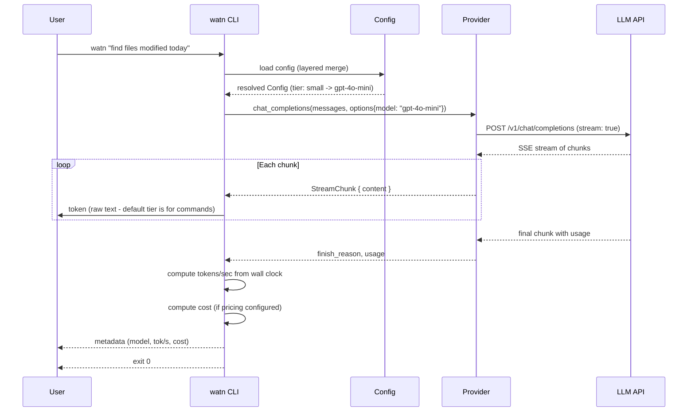
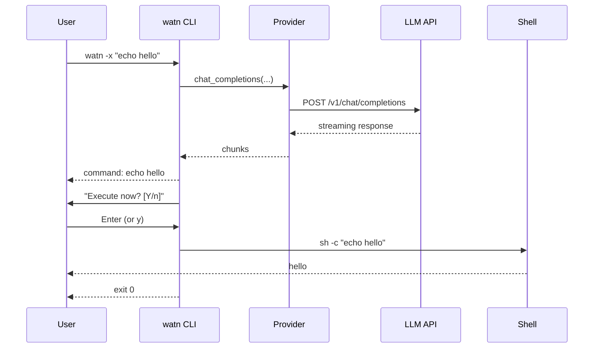
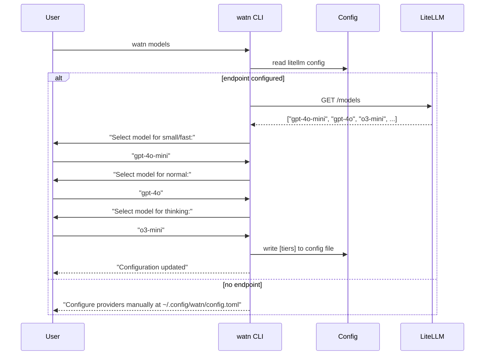
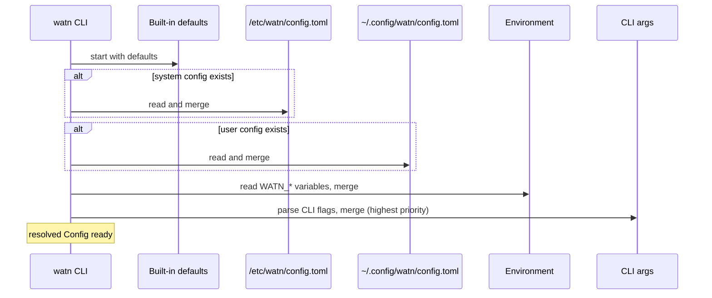

# 6. Runtime View

## Scenario: Ask a question with default tier

**Trigger:** User runs `watn "find files modified today"`.

**Steps:**
1. CLI parses args, defaults to tier `-1` (small/fast)
2. Config resolves selected tier to model name
3. Provider sends POST with `stream: true`
4. Provider reads SSE chunks, pushes each onto a channel
5. CLI reads channel and writes tokens to stdout
6. After stream ends, compute tok/s from elapsed time and usage
7. Print metadata: model name, tokens/sec, cost (if pricing configured)
8. Exit 0

## Scenario: Ask with execution (`-x`)

**Trigger:** User runs `watn -x "echo hello"`.

**Steps:**
1. CLI detects `-x` flag
2. Normal question flow executes (get command from LLM)
3. CLI prints the command, then prompts "Execute now? [Y/n]" to stderr
4. Reads one line from stdin
5. Empty line or `y`/`Y`: executes via `sh -c <cmd>` with inherited stdio
6. `n`/`N`: exits 0 without executing

## Scenario: Model exploration

**Trigger:** User runs `watn models`.

## Scenario: Config loading

**Notes:** Missing files are silently skipped. Malformed TOML produces exit code 1 with a parse-error diagnostic on stderr.