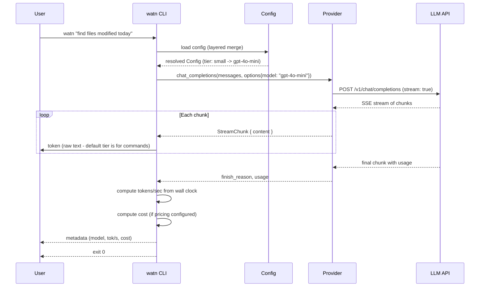
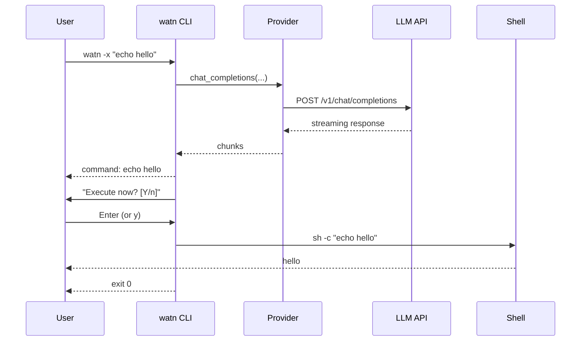
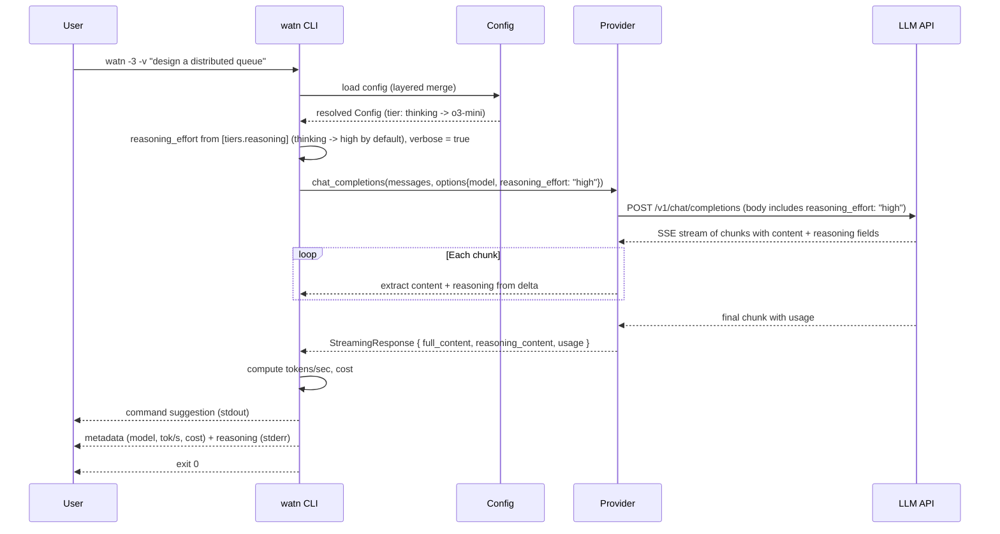
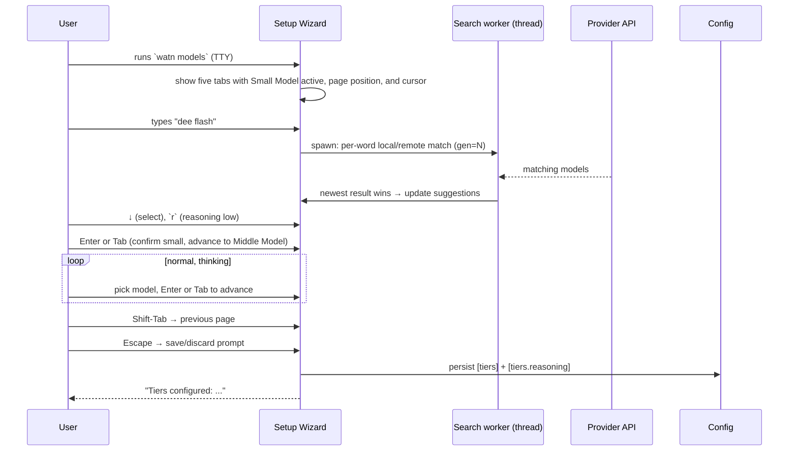
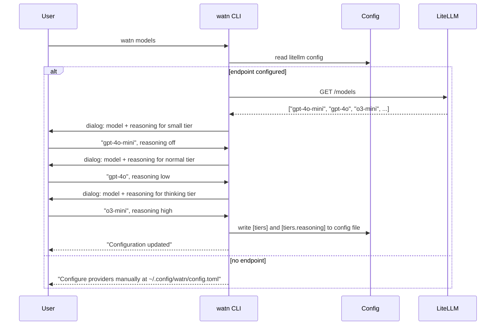
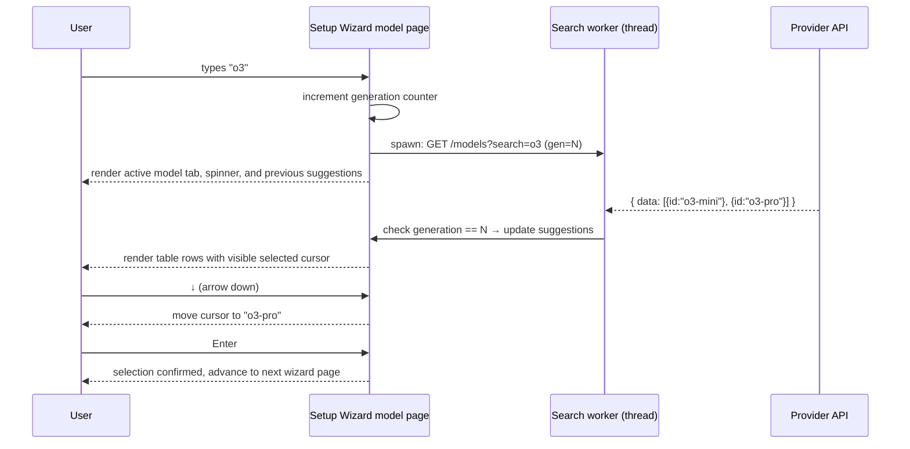
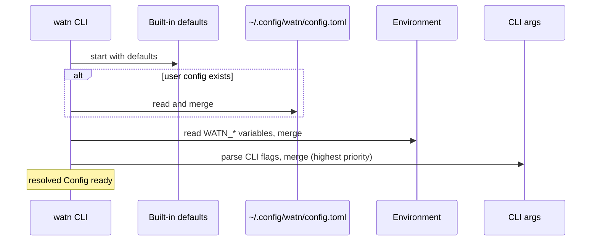
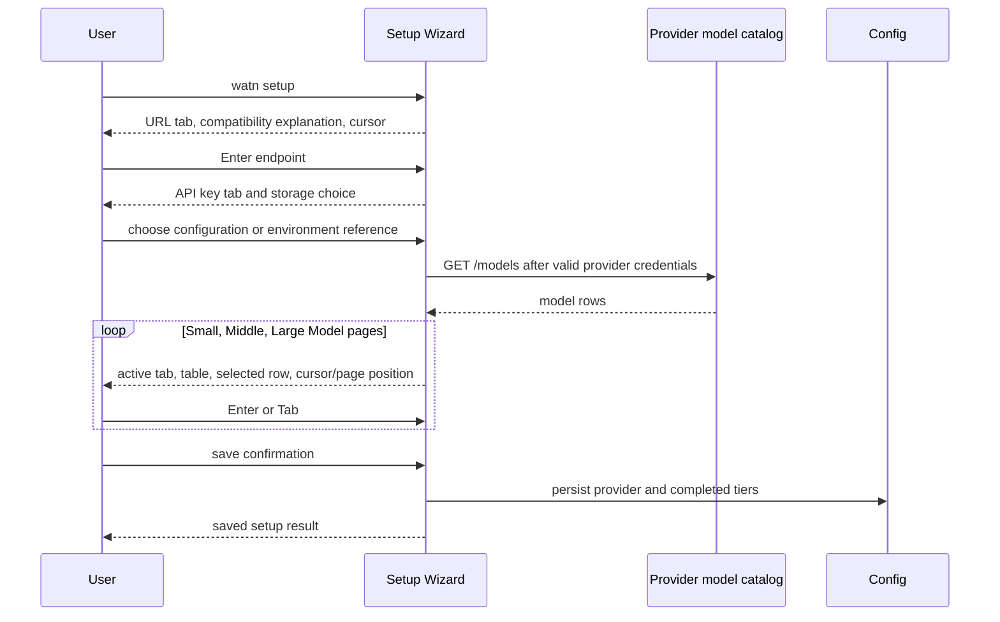

# 6. Runtime View

## Scenario: Ask a question with default tier

**Trigger:** User runs `watn "find files modified today"`.



**Steps:**
1. CLI parses args, defaults to tier `-1` (small/fast)
2. Config resolves selected tier to model name
3. Provider sends POST with `stream: true`
4. Provider reads SSE chunks, pushes each onto a channel
5. CLI reads channel and writes tokens to stdout
6. After stream ends, compute tok/s from elapsed time and usage
7. Print metadata: model name, tokens/sec, cost (if pricing configured)
8. Exit 0

## Scenario: Ask with execution (`-x`)

**Trigger:** User runs `watn -x "echo hello"`.



**Steps:**
1. CLI detects `-x` flag
2. Normal question flow executes (get command from LLM)
3. CLI prints the command, then prompts "Execute now? [Y/n]" to stderr
4. Reads one line from stdin
5. Empty line or `y`/`Y`: executes via `sh -c <cmd>` with inherited stdio
6. `n`/`N`: exits 0 without executing

## Scenario: Isolated debug test transport

**Trigger:** A test-support debug binary is run with a loopback endpoint
override.

```mermaid
sequenceDiagram
    participant Harness as Test harness
    participant CLI as watn debug test-support binary
    participant Config as Config
    participant Transport as Transport boundary
    participant ConfigTwin as Configured provider twin
    participant TestTwin as Isolated provider twin

    Harness->>ConfigTwin: start loopback twin at <base>/v1
    Harness->>TestTwin: start loopback twin at <base>/v1
    Harness->>Config: write configured endpoint, key, and default model
    Harness->>CLI: set WATN_TEST_ENDPOINT_OVERRIDE=<test-twin>/v1
    CLI->>Config: load configured provider
    Config-->>CLI: configured endpoint and credential
    CLI->>Transport: resolve outbound endpoint
    Transport-->>CLI: test twin endpoint (debug + test-support only)
    CLI->>TestTwin: POST /v1/chat/completions with Bearer key
    TestTwin-->>CLI: configured test response
    CLI-->>Harness: response and exit 0
    Harness->>Config: read persisted TOML
    Config-->>Harness: configured endpoint unchanged; override absent
```

The harness asserts the exact full URL, `POST /v1/chat/completions`, one hit on
the isolated twin, zero hits on the configured competing twin, and the exact
`Authorization: Bearer sk-configured` header. The source guard makes a
release-profile binary with `test-support` use the configured-endpoint branch;
runtime proof of that branch is deferred to
`release-truth-and-repository-cleanup`.

## Scenario: Normal debug requests ignore test routing

The harness builds and copies both the default-feature debug binary and the
debug `test-support` binary from Cargo's shared target cache. With a configured
loopback provider twin and a separate competing twin selected by
`WATN_TEST_ENDPOINT_OVERRIDE`, it invokes exactly one child: the copied
default-feature debug binary. That child must request the configured
`<base>/v1/chat/completions` URL with `Authorization: Bearer sk-configured`,
return the configured response, and leave the competing twin at zero requests.
The test-support debug copy is intentionally not invoked in this scenario; its
override-honoring behavior is covered by the isolated-routing scenario. The
single configured hit is asserted for this child rather than inferred from a
two-child aggregate.

## Scenario: Missing or whitespace override fallback

The debug test-support binary is run once with the override absent and once
with whitespace. In both flows the transport boundary returns the configured
`<base>/v1` endpoint. The configured twin receives exactly one
`POST /v1/chat/completions` with the exact Authorization header; the competing
twin receives zero requests; and the persisted configured endpoint is exact.

## Scenario: Readiness ignores transport override

The readiness predicate resolves the configured provider and credential without
constructing an HTTP URL. With a competing loopback override present, it
returns ready and both local twins receive zero requests. The configured
endpoint in the provider record is unchanged.

## Scenario: Ask with thinking tier and verbose flag

**Trigger:** User runs `watn -3 -v "design a distributed queue"`.



**Steps:**
1. CLI parses args, detects tier `-3` (thinking) and flag `-v` (verbose)
2. Config resolves thinking tier to model name
3. CLI resolves `reasoning_effort` from the tier's configured strength (default
   "high" for thinking when unset) and sets `verbose = true`; builds the POST body with `reasoning_effort`
4. Provider builds POST body with `reasoning_effort: "high"` in addition to standard fields
5. Provider reads SSE chunks, extracting both `delta["content"]` and `delta["reasoning"]`
6. Content is accumulated into `full_content` as before
7. Reasoning is accumulated into `reasoning_content`
8. After stream ends, compute tok/s from elapsed time and usage
9. Command output printed to stdout; metadata + reasoning content printed to stderr

## Scenario: Keyboard-driven model settings dialog

**Trigger:** User runs `watn models` from a terminal.



**Steps:**
1. The wizard opens on the Small Model page with five tabs, a border, filter
   paragraph, aligned model table, visible selected-row cursor, and scrollbar
   when needed.
2. Keystrokes update the visible filter; results match per-word,
   order-independent and are debounced with a stale-result guard.
3. Arrow/page keys move selection; Enter and Tab accept/advance; Shift-Tab
   returns to the previous page.
4. `r` cycles reasoning strength (off/low/medium/high) on a model page.
5. Escape opens a save/discard prompt; saving persists the provider and all
   completed model choices.

## Scenario: Model exploration

**Trigger:** User runs `watn models`.



## Scenario: Autosuggest model picker

**Trigger:** User runs `watn models`, types a search query in the tier picker.



**Steps:**
1. The setup wizard enters raw terminal mode and shows the active page/tab.
2. Keystrokes append to or remove from the live query string.
3. Each change bumps an `Arc<AtomicU64>` generation counter and spawns a
   blocking worker thread that calls `GET /models?search=<query>`.
4. Worker thread captures the generation at spawn time. On response, if the
   generation has advanced, the result is discarded (stale-result guard).
5. Valid results update the suggestion list; the terminal is repainted.
6. Arrow keys move the table cursor; Ctrl-R toggles reasoning focus and
   Up/Down chooses one of the current model's supported efforts.
7. Enter or Tab confirms the selection and advances; Shift-Tab returns;
   Escape opens save/discard rather than clearing the query.
8. A 4xx/5xx on a non-empty search shows "Model search is not supported by
   this provider" and retains the previous suggestions.
9. After final selection or save/discard, the wizard restores cooked terminal
   mode and returns provider/completed model drafts to the caller.

## Scenario: Config loading



**Notes:** Missing files are silently skipped. Malformed TOML produces exit code 1 with a parse-error diagnostic on stderr.

## Scenario: First normal use with no recognized provider

**Trigger:** User runs `watn "hello"` without a configured provider or supported
provider credential environment variable and provider selection is implicit.

```mermaid
sequenceDiagram
    participant User as User
    participant CLI as watn CLI
    participant Setup as Setup Wizard
    participant Config as Config
    participant Twin as OpenAI-compatible endpoint

    User->>CLI: watn "hello"
    CLI->>Config: load config and inspect provider readiness
    Config-->>CLI: Missing
    alt stdin is not a TTY
        CLI-->>User: actionable `watn provider` and config-path guidance
        CLI-->>User: exit 1; no ratatui and no network request
    else stdin is a TTY
        CLI->>Setup: open five-page setup wizard
        User->>Setup: enter endpoint and choose credential storage
        Setup->>Twin: GET /models
        Twin-->>Setup: model catalog
        User->>Setup: select small, middle, and large models
        Setup->>Config: save provider and completed tier assignments
        CLI-->>User: setup complete; exit 0
        Note over CLI: original question is not sent; user reruns it
    end
```

**Steps:**
1. Load the config and check actual provider data plus recognized environment
   variables; do not use a network probe for readiness.
2. If stdin is not a TTY, print actionable setup guidance and exit 1 without
   initializing ratatui.
3. If stdin is a TTY, open the shared setup wizard when no implicit provider is
   ready.
4. Save the endpoint and either the literal credential or the `${VARIABLE}`
   reference without printing the resolved secret.
5. Discover models and walk the three model pages in the same process and
   terminal.
6. Save all three model tiers and exit successfully. Do not send or resume the
   original question.

## Scenario: Explicit provider setup

**Trigger:** User runs `watn provider`.

```mermaid
sequenceDiagram
    participant User as User
    participant CLI as watn CLI
    participant Setup as Provider Setup
    participant Config as Config

    User->>CLI: watn provider
    CLI->>Setup: open ratatui provider flow
    Setup-->>User: URL tab, compatibility explanation, and visible cursor
    User->>Setup: accept or edit endpoint; choose literal or environment source
    Setup->>Config: save default provider and credential representation
    Config-->>Setup: save result
    Setup-->>CLI: configured
    CLI-->>User: completion status
```

The explicit command ends after provider configuration. It does not invoke
model setup; only the automatic first-use TTY path performs that chain. An
explicit `--provider` or `WATN_PROVIDER` selection never enters automatic
onboarding and retains normal unknown-provider and missing-key errors.

## Scenario: Unified setup wizard

**Trigger:** User runs `watn setup` from a terminal.


