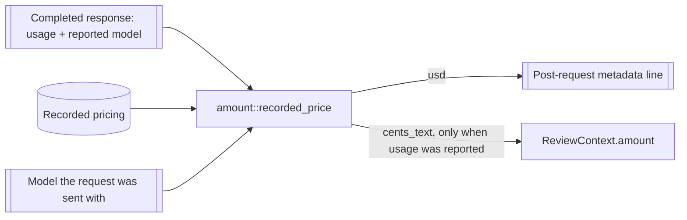

# Design: amount-from-requested-model

## Overview

One lookup rule, used everywhere a cost is derived: the recorded price of the
model the provider reported, else the recorded price of the model the request
was sent with. One rendering rule, used everywhere the Amount appears: cents
with one significant digit and never more than four decimal places.

## Architecture impact

| Module | Change |
|---|---|
| `src/amount.rs` | New `recorded_price(pricing, reported_model, requested_model) -> Option<&ModelPricing>`: reported model first, requested model second, `None` when neither has an entry. `BilledAmount::cents_text()` renders one significant digit of a cent, never more than four decimal places, trailing zeros trimmed, whole cents from one cent on |
| `src/main.rs` | The two metadata sites and `surface_amount` call `recorded_price`; `surface_amount` takes the requested model; the review path tracks `accepted_model` across a regeneration so the final metadata line prices the request that produced the accepted candidate |
| `tests/steps/interactive_shell_shortcut_steps.rs` | The harness builds a pricing map from the scenario's recorded prices and calls the production `recorded_price`, so the in-process scenarios exercise the same rule |
| `tests/steps/observe_request_cost_e2e_steps.rs` | `commit_e2e_transcript` takes the owning change's directory instead of a hard-coded one, so the two money scenarios commit this change's transcripts rather than leaving the previous change's evidence in place; a progress line sharing the header's row no longer takes the model label and the amount with it |

## Decisions

- **Decides D1: the requested model's recorded price applies when the model the
  provider reported has none.** Realized in `amount::recorded_price` and its
  three call sites; asserted by `A provider's unknown model falls back to the
  requested model's recorded price` (0.01 cents from 0.04/1.00) and
  `The metadata line prices a request from the requested model when the
  reported model has none`. Rejected option, recorded in the proposal: keep the
  exact rule and mark the gap, because the identifiers rarely agree on
  OpenRouter and the marker would leave every alias configuration unpriced.

- **Decides D2: the Amount renders as cents with one significant digit, never
  more than four decimal places, whole cents from one cent on, trailing zeros
  trimmed.** Realized in `BilledAmount::cents_text()` and asserted by the unit
  tests `one_significant_digit_carries_the_value_past_its_leading_zeroes`,
  `four_decimal_places_is_the_smallest_step_shown`, and
  `an_amount_of_a_cent_or_more_reads_as_whole_cents`, plus every scenario that
  names an Amount. The operator's examples fix the form: `0.0009`, `0.001`,
  `0.1` are wanted; `0.1000`, `0.1001`, and `0.11` are not. Consequences:
  `0.0234` reads `0.02`, `0.575` reads `0.6`, `1.35` reads `1`, and an amount
  below 0.00005 cents reads `0` — the previous form kept one more decimal at a
  time until a non-zero digit was visible, which this rule deliberately
  replaces with a hard four-decimal cap. Rejected option: keep the four-decimal
  form with the no-zero guarantee, because it prints digits the operator
  rejected as noise (`0.1001`) and the guarantee is worth less than the cap.

## Visual Design Contract

- **Interface**: terminal — the review surface and the explanation card, drawn
  with crossterm on the controlling terminal. No HTML, CSS, or JavaScript is
  rendered anywhere in this product, so the Web UI classification does not
  hold.
- **Rendered reference**: the simple-view header at 100 columns
  `◆ gpt-4o-mini · 1 ¢` for a whole-cent amount, `◆ deepseek-v4-flash-latest ·
  0.02 ¢` for a sub-cent amount, and `◆ deepseek-flash-latest · 0.0009 ¢` for
  the smallest shown step; the explanation card carries the same label and
  amount.
- **Evidence kind**: terminal transcripts, committed by this change's two
  `@e2e` scenarios under `evidence/visual/`.
- **States covered**: the review surface's simple-view header and the
  explanation card. The detailed view and the narrow-terminal header change no
  layout here; their amount placement is covered in-process and keeps the
  existing shortening rule.

## Verification

- Regular: `./run-tests.sh`. E2E: `./run-tests.sh --e2e` (the two money
  scenarios drive the real terminal).
- Single scenario: `./run-tests.sh --name "<scenario title>"`.
- Strict mode: unchanged (`.fail_on_skipped()` plus the skipped-count exit).
- Every permanent scenario whose expectation D2 changes is carried in this
  change as `@givn.modified` and pre-applied to `givn/specs/`, because the
  runner executes both the permanent and the delta spec while the change is
  open; the archive merge then replaces each scenario by title with identical
  text.
- The operator's own configuration proves the intent end to end: a piped
  request whose configured model is `~deepseek/deepseek-flash-latest` and whose
  provider reportedly answers as `deepseek/deepseek-v4.1-flash` now prints a
  cost on the metadata line, where it printed none before.

## Out of scope

As recorded in the proposal: capturing prices under canonical identifiers,
catalog calls at request time, markers in place of an absent Amount, and
routing behaviour.
