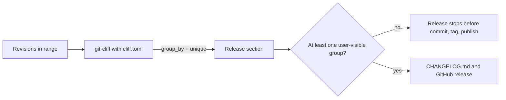

# Design: changelog-release-notes

## Overview

The changelog's selection rules move into the release tooling configuration
(`cliff.toml`): only user-visible groups survive, and repeated subjects collapse
to one entry. The release workflow gains an early guard so a release range
without a user-visible change stops before the version commit, tag, and
publish. CI installs the pinned changelog tool for the acceptance suite, and
two release-truth scenarios prove the configuration against a real git fixture.

No production Rust code changes. No rendered screen changes either: the
release output is a Markdown file, so no `## Visual Design Contract` section
applies.

## Use-Case Traceability

- Owning use-case ID: none (fragment `corpus-infra` owns the capability
  `release-truth`; `givn/specs/fragments/fragment.md` records
  `Interactions: none`).
- Ideation source: none
- Confirmed Personas: `terminal-developer--interactive` — reads the published
  release notes as the review lens; not a Gherkin actor.

| Use-case contract element | Technical decision | Capability / E2E evidence |
|---|---|---|
| Fragment `corpus-infra` owns `release-truth` | Extend the capability with the changelog selection rules | `givn/changes/changelog-release-notes/specs/fragments/release-truth.feature` |
| Fragment records no interactions | No inventory rows; the changelog is repository output, not a Watn interaction | Interaction Coverage Matrix below |
| Persona reads what a release changed | One entry per change, taken from the release note; documentation/refactoring/cleanup never appear | Scenario "Repeated revisions of one change yield one changelog entry" |
| Release documentation is truthful | The section is generated from actual revisions; the release stops rather than ship an empty section | Scenario "A changelog section keeps only user-visible groups" and the D1 guard |

Persona disposition: `terminal-developer--interactive` is the only confirmed
persona. Its stable core is shell-interaction-focused, so its direct relevance
to changelog wording is limited; it is named as the consumer of the published
release notes, and no persona contract element is contradicted. No other
persona is invented or promoted.

## Technology Decisions

| Technology | Version | Resolution |
|---|---|---|
| git-cliff | 2.13.1 | Existing project pin in `.github/workflows/release.yml` (release tools cache key and `Install pinned release tools`); verified 2026-09-24. The `unique(attribute="message")` template filter was exercised against this exact version in a local probe before this design. |
| Tera template filter `unique` | bundled with git-cliff 2.13.1 | Verified 2026-09-24 with a three-commit fixture: two identical `feat` subjects collapsed to one line while distinct subjects stayed. |
| cucumber-rs | existing workspace dependency (`Cargo.lock`) | Unchanged; the new scenarios reuse `tests/features_runner.rs`. |

Alternatives considered:

- Collapse in the release workflow's Python post-processing instead of the
  template. Rejected: the same configuration must produce the same file on a
  developer's machine and in CI; a post-processing step would make local
  previews diverge from released notes.
- Derive the changelog from archived change directories instead of revisions.
  Rejected: the archived corpus is not reachable for a range that predates the
  archive, and the release note already travels in every revision subject.

## Decisions

- Decides D1: a release whose range contains no user-visible change stops
  before the version commit, tag, and publish. The guard sits in
  `.github/workflows/release.yml` twice: in the prepare job's `Generate
  reviewed changelog` step and in the publish job's `Validate release identity`
  step, which also covers the tag-recovery dispatch that skips prepare. The
  `github_release` group check remains as a backstop. Workflow YAML is outside
  the acceptance suite, so the guard is verified by review of the workflow
  diff; the generation it guards is proven by the two scenarios.

Additional decisions:

- Collapse repeated subjects with `unique(attribute="message")` inside each
  group in `cliff.toml`. The filter compares the subject text only, so two
  changes with byte-identical release notes would collapse into one entry;
  release notes are unique sentences and a cross-change collision is caught in
  review. A composite type+scope+subject key is not expressible with the
  filter. The same subject cannot span two groups because the subject fixes
  the type.
- Keep `Breaking Changes`, `Features`, `Bug Fixes`, `Performance`, and
  `Reverts`; every other type and the unconventional fallback are skipped, so
  specific skip rules for docs, plans, review, archive, chores, and merges
  become redundant. The `^fix(e2e)` skip stays ahead of the generic fix rule:
  end-to-end test fixups are not user-visible.
- Leave published release sections untouched (proposal's out of scope).

## Step Definitions

| Capability | Step definition file |
|---|---|
| release-truth (regular) | `tests/steps/release_truth_steps.rs` |
| release-truth (`@e2e` fixture) | `tests/steps/release_truth_e2e_steps.rs` |

Both files are already declared in `tests/steps/mod.rs`; the change adds steps
to them. The `@e2e` scenario's fixture and assertion steps live in the e2e
file; the generation step is shared from the regular file because it is the
capability's common real interface (a git-cliff subprocess), not an e2e-only
driver.

New steps:

| File | Step | Binding |
|---|---|---|
| `release_truth_e2e_steps.rs` | `Given a release range with three revisions of one change that share the release note "<note>"` (the `<note>` is a cucumber expression capture) | Creates a temp git repository with a base commit and three commits whose subject is `feat(<capability>): <note>` and whose body names a distinct scenario. |
| `release_truth_e2e_steps.rs` | `And a documentation revision in the same range` | Adds a `docs(...)` commit to the same fixture. |
| `release_truth_e2e_steps.rs` | `Then the changelog lists "<note>" exactly once` | Counts occurrences of the capitalized note in the captured stdout; exactly one. |
| `release_truth_e2e_steps.rs` | `And the changelog lists no documentation entry` | Asserts the documentation commit's text is absent from stdout. |
| `release_truth_steps.rs` | `Given a release range with a feature, a bug fix, a performance change, a revert, and a breaking change` | Creates a temp git repository with one commit per type (`feat`, `fix`, `perf`, `revert`, and a `feat!`). |
| `release_truth_steps.rs` | `And a documentation, a refactoring, a test, a chore, and an uncategorised revision in the same range` | Adds `docs`, `refactor`, `test`, `chore`, and `misc: ...` commits; the uncategorised message reaches the fallback parser in both configurations. |
| `release_truth_steps.rs` | `When I generate the changelog for the release range` | Runs the pinned `git-cliff --config <workspace>/cliff.toml <base>..HEAD` in the fixture and captures stdout; shared by both scenarios. |
| `release_truth_steps.rs` | `Then the changelog section lists the feature, the bug fix, the performance change, the revert, and the breaking change` | Asserts the five group headings and their entries. |
| `release_truth_steps.rs` | `And the changelog section contains no "Documentation", "Refactoring", or "Other Changes" group` | Asserts none of the three headings appears. |

Test runner command (from `verify.command` in `givn/commands.yaml`):

```
./run-tests.sh
```

Single-scenario run commands:

```
./run-tests.sh --name "Repeated revisions of one change yield one changelog entry"
./run-tests.sh --e2e --name "Repeated revisions of one change yield one changelog entry"
./run-tests.sh --name "A changelog section keeps only user-visible groups"
```

## Internal Primitives

No production primitives. Test-local helpers live beside the steps:

| Primitive | Type | Purpose |
|---|---|---|
| `ChangelogFixture` | test helper struct | A temp git repository with a base commit, a `commit(message)` operation, and a `range()` method |
| `generate_changelog(fixture)` | test helper function | Runs `git-cliff` with the workspace `cliff.toml` over the fixture range and returns stdout |
| `find_git_cliff()` | test helper function | Resolves `git-cliff` on `PATH`; on failure names the pinned install command (`cargo install git-cliff --version 2.13.1 --locked`) |

## Strict Mode (mandatory)

`cucumber-rs` with `.fail_on_skipped()` on the `Cucumber` builder — already
configured at `tests/features_runner.rs:210`; undefined or pending steps fail
the runner.

Not-implemented stub for this language: `unimplemented!()` (or `todo!()`);
step bodies are never empty. The setup task proves strictness by observing the
undefined-step failure before the first RED.

## Local Runnability & Digital Twins (mandatory)

Local run command — the full test surface for this capability:

```
./run-tests.sh
./run-tests.sh --e2e
```

Isolated network: not applicable — no service or container is involved.

Digital twins — no external or third-party dependency exists:

| External dependency | Digital twin (fake/stub/emulator) | Runs where |
|---|---|---|
| none | — | The changelog tool is a local binary; the fixture is a local git repository |

Anticipated interface obstacles and their fix: the fixture commits inherit the
host's global git configuration (GPG signing, hooks, identity). Fix: the
fixture sets `user.name`, `user.email`, `commit.gpgsign=false`, and
`core.hooksPath` to an empty directory in the fixture repository's local
configuration, so commits are deterministic and do not sign.

## E2E Smoke Test Infrastructure

Interface type: CLI — the changelog generator (`git-cliff`) reads the
project's configuration over a real git repository; its stdout is the
observable artifact.

E2E runner command (→ `verify.e2e_command`):

```
./run-tests.sh --e2e
```

E2E step location: `tests/steps/release_truth_e2e_steps.rs`.

Local test infrastructure: real `git` (fixture repository) and the pinned
`git-cliff` 2.13.1 binary on `PATH`; no server, browser, port, or network.

E2E framework choice and justification: `cucumber-rs` with a subprocess driver
for the real `git-cliff` CLI — the release tooling's consumer interface is the
command line, and the scenario asserts on its stdout.

Interaction Coverage Matrix: the fragment `corpus-infra` records no
interactions, so no inventory rows exist. The capability's single `@e2e`
scenario is listed for completeness:

| Inventory entry | @e2e scenario title | Real interface | Driving mechanism |
|---|---|---|---|
| none (fragment records no interactions) | Repeated revisions of one change yield one changelog entry | CLI | Spawn `git-cliff --config cliff.toml <range>` against a fixture git repository and read stdout |

E2E strict-mode proof: the setup task runs the scenario before any step
definition exists and records the non-zero undefined-step failure from
`.fail_on_skipped()`.

E2E scope: read `givn instructions specs --change changelog-release-notes`;
the one-E2E-per-distinct-action policy is not restated here.

## Black-Box-First

The regular scenario "A changelog section keeps only user-visible groups"
tests group selection — an invariant the `@e2e` scenario does not cover (the
`@e2e` scenario proves the collapse of repeated subjects and the exclusion of
one documentation revision). Both drive the real `git-cliff` interface; the
regular scenario exists because group selection is a distinct invariant, not
a weaker duplicate.

## Architecture Impact



- `cliff.toml`: group parsers reduce to the five user-visible groups plus a
  skip-all fallback; the body template deduplicates each group by message.
- `.github/workflows/release.yml`: the `Generate reviewed changelog` step
  gains the D1 guard (extract the release section, require at least one `### `
  group before proceeding).
- `.github/workflows/ci.yml`: the acceptance job installs and caches the
  pinned `git-cliff` 2.13.1 for both test scopes.
- `tests/steps/release_truth_steps.rs` and
  `tests/steps/release_truth_e2e_steps.rs`: new steps and fixture helpers.
- `docs/arc42/12-glossary.md`: `Release note` and `Changelog` added.
- `.github/workflows/release.yml` and `ci.yml` pin the tool by version; no new
  service, module, or dependency enters the Rust build.

## Data Model Changes

None.

## Open Technical Questions

None.
