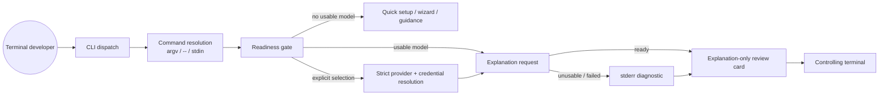

# Design: explain-failure-guidance

## Scope

`watn explain '<command>'` stops degrading silently when no usable model is
configured or the explanation request fails. The explanation path adopts the
question path's readiness rule: when no usable provider or model is available
and no provider or model was explicitly selected, it delegates to the existing
setup surfaces (quick setup, setup wizard, or setup guidance) instead of
opening the card. When a usable model exists but the request fails, the card
still opens with the developer's command and `purpose-unavailable`, and the
failure is reported on stderr with the mapped non-zero exit status. An unusable
provider response is named on stderr while the card keeps the command
reviewable. No new dependency, no new card surface, and no change to the
verbatim-delivery contract are introduced.

## Behaviour contract

`run_explain_command` evaluates its paths in this fixed order: reject `-x`,
resolve the command, require the explanation terminal, load configuration,
handle readiness, resolve provider/model/credential, request, open the card.
The following table is the complete user-visible contract.

| # | Failure mode | User-visible result | Exit code |
|---|---|---|---|
| 1 | `watn -x explain` or `watn explain -x` | `explain never executes a command; remove -x` / usage error; no card | 2 |
| 2 | Empty command, empty standard input, second positional argument | Usage error; no card | 2 |
| 3 | No controlling terminal (terminal stderr, `/dev/tty`, `TERM != dumb`) | `explain requires a terminal for the explanation card`; no card | 1 |
| 4 | Malformed configuration file | Configuration parse diagnostic; no card | 1 |
| 5 | No usable provider/model, no explicit selection, standard input is not a terminal | The existing setup guidance (`No provider is configured. Run \`watn setup\` (or \`watn provider\`) in a terminal or edit ~/.config/watn/config.toml.`) on stderr; no card; no provider request | 1 |
| 6 | No usable provider/model, no explicit selection, terminal stdin, no configuration file | Quick setup runs; on completion the configuration is saved and stderr reports `setup complete; rerun \`watn explain\` with the command`; the original command is not explained; no provider request | 0 |
| 7 | No usable provider/model, no explicit selection, terminal stdin, configuration file exists | The setup wizard runs; on completion the configuration is saved and stderr reports the same rerun hint; the original command is not explained | 0 |
| 8 | Setup cancelled by Escape / Ctrl+C | Existing setup cancellation contract; no card; no explanation | 1 / 130 |
| 9 | `watn --provider missing explain` with an unknown provider | The existing `unknown provider: <name>` error on stderr; no card; no request | 1 |
| 10 | `watn --provider openrouter explain` (or `--model` / `WATN_PROVIDER`) with an unresolvable credential | The existing `authentication error: api key environment variable '<NAME>' is not set` (or `api key not found for provider '<name>'`) on stderr; no card; no request | 2 |
| 11 | `watn --provider custom explain` whose model cannot be resolved (no `default_model`, no explicit `--model`) | The existing `config error: no default model configured` on stderr; no card | 1 |
| 12 | Ready provider, explanation request fails (HTTP, authentication, network) | `explain request failed: <error>` on stderr; the card still opens with the developer's command and `purpose-unavailable`; after the card closes the invocation exits with the mapped status | 2 (auth/API), 3 (network), 1 (config/IO) |
| 13 | Explanation request interrupted by Ctrl+C | No card; the shared interrupt flag is checked after the fetch and before the card opens; existing interrupt contract | 130 |
| 14 | Ready provider, response is not usable as an explanation (invalid, mismatched, non-covering) | `explain response was not usable: <reason>` on stderr; the card opens with the developer's command and `purpose-unavailable`; the invocation succeeds | 0 |
| 15 | Ready provider, response covers the command | The card opens with the developer's command and the model-written stage purposes | 0 |
| 16 | Card cannot open (terminal lost after the gate, render failure) | `explain unavailable: <reason>` on stderr; no command released | 1 |

Rules that hold on every path:

- The explained command is never generated, replaced, edited, re-split, joined,
  evaluated, or executed. `-x` remains rejected.
- The card, when it opens, renders through the controlling-terminal channel;
  stdout stays empty.
- The mapped request-failure exit status (the "Ready provider, explanation
  request fails" row above) is applied after the card closes, not before, so
  the developer can still read the command and its local stages.
- The unusable-response path (the "response is not usable as an explanation"
  row above) stays 0 because the request succeeded and the safe degradation
  is deliberate; only the visibility of the degradation changes.
- The shared interrupt flag is re-checked after the explanation fetch and
  before the card opens, so Ctrl+C during the request exits 130 and no card
  opens even when the provider returns after the interrupt.

## Setup delegation

The readiness rule is copied from the question path in `main.rs` (the block
around lines 349-381), with the same predicates and the same surfaces:

1. `explicit_selection = --provider present || --model present || WATN_PROVIDER set`.
   `WATN_MODEL` alone is not an explicit selection, matching the question path.
2. When `!explicit_selection && (!config::provider_ready(...) || !config::model_roles_ready(...))`:
   - non-terminal standard input -> `watn::provider::setup::print_setup_guidance()` (unchanged text), exit 1;
   - terminal standard input and `!config::config_file_exists()` -> `watn::quicksetup::run()`, then the rerun hint, exit 0;
   - terminal standard input and a configuration file exists -> `watn::setup::run_with_config(&config, SetupEntryPoint::Setup)`, `watn::setup::apply_result(...)`, then the rerun hint, exit 0.
3. Cancellation maps through `exit_setup_cancellation` (Escape 1, Ctrl+C 130);
   setup errors print and map through `exit_code`.
4. After a successful setup the original command is not explained; the rerun
   hint is printed once on stderr and the process exits 0. This mirrors the
   question path's deliberate no-resume contract (ADR-0026, R-015).

The delegation deliberately requires terminal standard input because quick
setup reads its answers from standard input and the question path gates
automatic onboarding on `stdin.is_terminal()` (ADR-0011, QS-016). The setup
wizard renders through stdout, not through the card's controlling-terminal
channel, so it is never started while standard input carries the command.

### Explain runtime flow

```mermaid
sequenceDiagram
    participant User as Terminal developer
    participant CLI as watn explain
    participant Config
    participant Setup as Quick setup / Setup wizard
    participant Provider as OpenAI-compatible API
    participant TTY as Controlling-terminal channel

    User->>CLI: watn explain <command> / -- / stdin
    CLI->>CLI: reject -x; resolve one command; require terminal
    CLI->>Config: load config (malformed = exit 1)
    alt explicit provider/model selected
        CLI->>CLI: resolve provider, model, and credential strictly (errors exit 1/2)
    else no usable provider or model
        alt stdin is a terminal and no config file
            CLI->>Setup: quick setup
        else stdin is a terminal and a config file exists
            CLI->>Setup: setup wizard
        else stdin is not a terminal
            CLI->>User: setup guidance on stderr
            CLI-->>User: exit 1, no card
        end
        Setup-->>CLI: saved / cancelled / failed
        CLI-->>User: rerun hint on stderr, exit 0 (or cancellation status)
    end
    CLI->>Provider: POST /v1/chat/completions with the exact command
    alt request succeeds with usable purposes
        Provider-->>CLI: structured response
        CLI->>CLI: apply_explanation_outcome -> Ready
    else request succeeds without usable purposes
        Provider-->>CLI: response
        CLI->>User: explain response was not usable on stderr
        CLI->>CLI: apply_explanation_outcome -> Unusable, local stages
    else request interrupted by Ctrl+C
        CLI->>CLI: shared interrupt flag set during the fetch
        CLI-->>User: exit 130, no card
    else request fails
        Provider--xCLI: HTTP / network / authentication error
        CLI->>User: explain request failed on stderr
        CLI->>CLI: keep the developer's command with local stages
    end
    CLI->>TTY: explanation-only review card
    User->>TTY: arrows, Enter, or Escape
    TTY-->>CLI: close; release nothing
    CLI-->>User: exit 0, or the mapped request-failure status
```

## Architecture impact



- `src/main.rs`: `run_explain_command` gains the readiness/setup block copied
  from the question path, the strict explicit-selection resolution, and the
  failure reporting. It records an optional failure exit status and applies it
  after `run_explanation_card` returns. After the explanation fetch and before
  opening the card it checks the shared interrupt flag (and/or an
  `Err(Error::Interrupted)` from the fetch), exits 130, and opens no card.
- `src/review/response.rs`: new pure `ExplanationOutcome` and
  `apply_explanation_outcome(command, raw)`. `apply_explanation` keeps its
  current signature and delegates, so the existing unit tests remain valid.
  A new `ReviewResponseError::explain_reason()` maps every variant to
  explain-domain wording so the diagnostic never leaks the review-path
  anti-term "candidate".
- `src/review/session.rs`: `explain_command_candidate` changes its return type
  from `ReviewCandidate` to `Result<ExplanationOutcome, Error>`; it no longer
  swallows the provider error.
- `src/review/mod.rs`: export `ExplanationOutcome` and
  `apply_explanation_outcome`.
- No data-model change: `ReviewCandidate`, `ReviewContext`, `PurposeStatus`,
  and `ReviewPanelState` are reused unchanged. No new dependency.
- The `-x` execution prompt's Explain choice (`run_explanation_card` call site)
  is unchanged: it stays best-effort, never starts setup, and never requests
  purposes, preserving the archived `explain-command` decision.

### Purpose application semantics

`apply_explanation_outcome` keeps the existing strict trust rules and adds the
outcome discriminator:

1. Build the candidate from the developer's command
   (`ReviewCandidate::from_command`), which derives the command flow locally.
2. Parse the provider payload with the existing `ReviewResponse` contract. If
   the payload validates and echoes the command and stages exactly, return
   `Ready` with the model-written purposes.
3. Otherwise, if the payload is JSON-shaped and its stages form an ordered,
   non-overlapping, verbatim cover of the developer's command with a non-empty
   purpose per stage, return `Ready` with that split and its purposes.
4. Otherwise return `Unusable { candidate, reason }` where `reason` is the
   `ReviewResponseError` from the failed validation (for example
   `CommandMismatch`, `InvalidJson`). The candidate keeps the developer's
   command and the locally derived flow with `purpose-unavailable`.

The provider's own `command` text is never displayed and never replaces the
developer's command.

### Explain-domain diagnostic wording

`ReviewResponseError`'s `Display` is written for the review path: it names a
"candidate" and a "review response". Both are review-path terms; `candidate` is
an explicit anti-term for an Explained command
(`docs/arc42/12-glossary.md`). The `explain response was not usable: <reason>`
diagnostic therefore never prints `Display` directly. A small explain-domain
mapping, `ReviewResponseError::explain_reason()`, converts each variant:

| Variant | Explain-domain reason |
|---|---|
| `InvalidJson(error)` | `invalid explanation JSON: {error}` |
| `UnsupportedVersion(version)` | `unsupported explanation version: {version}` |
| `EmptyCommand` | `the explanation is empty` |
| `CommandMismatch` | `the explanation does not match the explained command` |
| `StageMismatch` | `the explanation stages do not match the command flow` |
| `MissingPurpose` | `the explanation is missing a stage purpose` |
| `InvalidLoadingResponse` | `the explanation has no delayed-purpose request` |

Rule: no user-visible explain diagnostic may contain the words `candidate` or
`review response`. The review path keeps `Display` unchanged because
"candidate" is correct there.

## CLI behaviour decisions

- **Explicit selection:** top-level `--provider`, `--model`, and
  `WATN_PROVIDER` (written before the subcommand, for example
  `watn --provider missing explain '<command>'`) skip the setup delegation.
  Resolution order mirrors the question path: model first, then provider, then
  credential. `watn --provider missing explain` with a resolvable default model
  reports `unknown provider` (exit 1); `watn --provider openrouter explain`
  without a credential reports the authentication error (exit 2);
  `watn --provider custom explain` with a `[providers.custom]` section that has
  no `default_model` reports `no default model configured` (exit 1).
- **Setup surfaces:** quick setup is used only when no configuration file
  exists; the wizard when one exists. Both keep their existing behaviour and
  persistence boundaries. Explain only adds the rerun hint.
- **Failure reporting channels:** all new diagnostics go to stderr. The card
  never changes its visible content because of a request failure; it shows
  `purpose-unavailable` exactly as before.
- **Failure exit status:** recorded when the request fails and applied after
  the card closes. `Interrupted` — the shared interrupt flag checked after the
  fetch, or an `Err(Error::Interrupted)` — bypasses the card entirely and exits
  130.
- **Unusable response:** a visible diagnostic with exit 0. The response was
  received; the model's purposes were simply not trustworthy, and the
  established safe-degradation contract keeps the command reviewable.
- **`-x` explain choice:** unchanged best-effort; out of scope.
- **`--review-panel`/`--no-review-panel`/`-v`:** unchanged, inert for explain.

## Use-case traceability

| Use-case element (`use-shell`) | Technical decision | Evidence |
|---|---|---|
| Capability `explain-command` | `run_explain_command` keeps ownership; readiness delegation added | `givn/changes/explain-failure-guidance/specs/use-shell/explain-command.feature` |
| Precondition: a usable model fills in stage purposes; without one watn starts setup or prints guidance | Readiness gate copied from the question path; explicit selection skips it | "An unconfigured machine starts quick setup instead of explaining"; "An existing configuration without a usable model completes the setup wizard"; "A command supplied through standard input without a usable model reports setup guidance"; "A configured provider without a usable credential is not contacted" |
| Rule: an explained command is never evaluated, re-split, joined, or executed | Command resolution unchanged; `-x` rejection unchanged | "Enter closes the explanation card without releasing the command"; "Explain never executes the command" (permanent) |
| Rule: an interrupted explanation request opens no card | Interrupt flag re-checked after the fetch, before the card | "Interrupting the explanation request opens no card" |
| Extension: a failed explanation keeps the command reviewable and reports the failure | `ExplanationOutcome` + mapped exit status after the card | "A failed explanation keeps the command reviewable"; "A network failure reports the mapped exit status" |
| Extension: an unusable response keeps the command reviewable and is named | Distinct `explain response was not usable` diagnostic with explain-domain wording | "An explanation that does not cover the command is not trusted" |
| Extension: explicit provider selection preserves its errors | Strict resolution branch | "An explicit provider selection with a broken configuration reports its error"; "An explicit provider without a resolvable model reports its error" |
| Persona `terminal-developer--interactive` | The card, verbatim delivery, and close-only decisions are unchanged; the failure paths keep the command readable | All card scenarios |

## Test runner, strict mode, and single-scenario runs

- **Regular runner:** `./run-tests.sh` (tags `not @wip and not @e2e`), wrapping
  `cargo test --locked --test features_runner --features test-support`.
- **E2E runner:** `./run-tests.sh --e2e` (tags `@e2e and not @wip`).
- **Single scenario:** `./run-tests.sh --name "<title>"`.
- Feature files are collected from `givn/specs/**` and
  `givn/changes/*/specs/**` by `tests/features_runner.rs`.
- **Strict mode:** `.fail_on_skipped()` is already set in the runner, and the
  runner exits 1 when `stats.skipped > 0`. Rust has no empty-step-pass hazard:
  every new step body starts as `unimplemented!()` until implemented. Undefined
  steps fail via `.fail_on_skipped()`.
- **Proof of strictness (setup task):** temporarily add a scenario with an
  undefined step, run it with `./run-tests.sh --name "<temp title>"`, confirm a
  non-zero exit and a skipped/undefined finding, then remove the temporary
  scenario before implementation.

### Permanent-spec lockstep

`tests/features_runner.rs` collects both `givn/specs/**` and
`givn/changes/*/specs/**` and only drops scenario titles tagged `@givn.removed`.
A `@givn.modified` title therefore runs twice: once from the permanent spec and
once from the delta. When the implementation lands, the permanent
`givn/specs/use-shell/explain-command.feature` scenarios must receive the delta
bodies in lockstep, or the stale permanent copies fail on the new readiness
gate. Eight permanent scenarios currently assume an unconfigured machine and
must be re-based to a ready provider:

1. "Enter closes the explanation card without releasing the command"
2. "Shell metacharacters and embedded quoting reach the card unchanged"
3. "A command beginning with a dash passes after the option terminator"
4. "A command read from standard input keeps its quoting and line breaks"
5. "A piped command without the marker is explained"
6. "A positional command takes precedence over standard input"
7. "The review-panel switches are inert for explain"
8. "The explanation card opens even when the review surface is disabled"

The delta carries the re-based bodies for all eight (the last one added during
design review), so the archive merge produces the same text; the implementation
must apply the permanent edits in the same commit as the corresponding step
changes. The remaining `@givn.modified` scenarios ("A configured provider
without a usable credential is not contacted", "A failed explanation keeps the
command reviewable", "An explanation that does not cover the command is not
trusted") are already provider-backed and only gain their new assertions in the
same lockstep.

## Version freshness

No new language, framework, library, database, or container version is
introduced. Versions below come from the project lockfile (`Cargo.lock`, the
source of truth for existing dependencies), verified during this design:

| Technology | Version | Source |
|---|---|---|
| Rust edition | 2021 | `Cargo.toml`; toolchain pinned by `rust-toolchain.toml` (1.97.1) |
| clap | 4.6.6 | `Cargo.lock` |
| cucumber (cucumber-rs) | 0.23.0 | `Cargo.lock` |
| crossterm | 0.29.0 | `Cargo.lock` |
| portable-pty | 0.9.0 | `Cargo.lock` (dev-dependency) |
| httpmock | 0.8.3 | `Cargo.lock` (dev-dependency) |

## Step definition locations

One capability, two existing files following the `interactive_shell_shortcut`
pattern; both files already exist and are registered in `tests/steps/mod.rs`:

- Regular/integration steps: `tests/steps/explain_command_steps.rs`.
- E2E smoke steps: `tests/steps/explain_command_e2e_steps.rs` (no new steps:
  the single `@e2e` scenario is unchanged).

Reused existing steps: `no config file exists` (`ask_steps.rs`); `a configured
provider without a usable credential`, `a configured provider whose explanation
request fails`, `a configured provider whose explanation does not cover the
command`, `I run \`watn explain\` with this single argument:`, `the explanation
card should show the stage:`, `the explanation card should show
purpose-unavailable`, `the explanation card should not show the text {string}`,
`no provider request should have been made`, `watn should report a usage
error`, `watn should report a configuration error`, `no explanation card should
open`, `the command-output channel should contain no command`
(`explain_command_steps.rs`); `the exit status should be {int}`
(`ask_steps.rs`); `watn should exit successfully`
(`interactive_shell_shortcut_e2e_steps.rs`); `the file "..." should not exist`
(`preserve_ctrl_w_requests_steps.rs`); `a provider accepts a connection and
never sends a response` (`cancel_completion_steps.rs`); `a configured provider
with catalog models "model-small", "model-middle", and "model-large"`
(`streamlined_setup_steps.rs`); `I configure the provider and models through
the wizard`, `I complete the optional shell pages without integrations`
(`setup_wizard_steps.rs`); `the persisted review surface is disabled`, `the
review surface should be disabled in the configuration`
(`interactive_shell_shortcut_steps.rs`); the quick-setup answer steps
`I accept the suggested endpoint`, `I answer the credential with {string}`,
`I accept the suggested small model`, `I accept the pre-filled normal model`,
`I accept the pre-filled thinking model`, `I keep the pre-selected shell
integrations and confirm`, `the quick setup should announce that no
configuration was found` (`quicksetup_steps.rs`).

New step responsibilities:

| Step | Behaviour |
|---|---|
| `a configured provider whose explanation returns no stage purposes` | Register the default chat mock with a non-JSON payload (`output`) and write the isolated ready-provider configuration, so the request is made and the response is unusable |
| `I run \`watn explain\` with this single argument and let the setup flow start:` | Start the real binary in a PTY through `sh -c '"$WATN_BIN" explain "$WATN_COMMAND"'` **without** redirecting stdout (the wizard renders through stdout), then wait for the `watn · setup` frame |
| `the setup flow should start` | Assert the PTY transcript contains `watn · setup` and contains no `esc close` card frame |
| `I abandon the setup flow` | Press Escape, wait for the `discard` save/discard hint, press `n`, finish the PTY session and capture the exit status |
| `I run \`watn explain\` with this single argument and let quick setup start:` | Start the real binary in a PTY without redirecting stdout; wait for the `Completion endpoint` question |
| `watn should report that setup is complete and the command must be rerun` | Assert the finished transcript contains the rerun hint (`setup complete` and `watn explain`); shared by the quick-setup and wizard scenarios |
| `I run \`watn explain\` in a terminal with this command on standard input and let it report setup guidance:` | Write the docstring to a temp file, start the PTY with `explain < file` (piped stdin, no positional), finish the session, and capture the exit status |
| `watn should report that setup is required` | Assert the transcript contains the setup guidance naming `watn setup` |
| `I run \`watn --provider missing explain\` with this single argument in a terminal:` | Start the PTY with the top-level explicit provider flag before the subcommand, finish the session, capture the exit status and transcript |
| `I run \`watn --provider openrouter explain\` with this single argument in a terminal:` | Same, with the default provider and no credential in the child environment |
| `I run \`watn --provider custom explain\` with this single argument in a terminal:` | Same, with the model-less custom provider configuration |
| `a configured provider whose endpoint refuses connections` | Bind a local `TcpListener` on an ephemeral port, record the port, drop the listener, and write the isolated ready-provider configuration against that closed port, so the request fails at connect time with a network error (exit 3) |
| `a configured provider with no default model` | Write `[defaults] provider = "custom"` and a `[providers.custom]` section with endpoint and credential but no `default_model`, no `[tiers]`, and no `defaults.model`, so strict model resolution fails with `no default model configured` (exit 1) |
| `I run \`watn explain\` with this single argument and interrupt the request:` | Start the PTY against the hanging provider, wait until the request is in flight, send Ctrl+C (`\x03`), finish the session, and capture the exit status |
| `watn should report an unknown provider error` | Assert the transcript contains `unknown provider` |
| `watn should report a missing credential error` | Assert the transcript contains `api key` |
| `watn should report that the explanation request failed` | Assert the transcript contains `explain request failed` |
| `watn should report that the explanation response was not usable` | Assert the transcript contains `explain response was not usable` |

The wizard-completion scenario drives the real wizard through the existing
`tests/steps/streamlined_setup_steps.rs` catalog fixture and
`tests/steps/setup_wizard_steps.rs` page-by-page steps
(`I configure the provider and models through the wizard`,
`I complete the optional shell pages without integrations`); the hanging-provider
scenario reuses the `HangServer` twin from `tests/steps/cancel_completion_steps.rs`.

Hardened existing step: `no explanation card should open` additionally consults
the live PTY snapshot when a session is still open, so the wizard scenario
asserts the absence of the card against the real transcript rather than an
empty default.

## E2E smoke test infrastructure

- **E2E runner command:** `./run-tests.sh --e2e` (`verify.e2e_command` in
  `givn/commands.yaml`), filtered to `@e2e and not @wip`.
- **E2E step location:** `tests/steps/explain_command_e2e_steps.rs`, separate
  from the regular steps.
- **Real interface:** the compiled `watn` binary in a `portable-pty` session.
  The single `@e2e` scenario ("Developer explains an existing command in the
  review card") is unchanged: it passes the command as one quoted argv element
  through `sh -c`, drives the card with real arrow keys and `Escape`, and
  asserts the PTY transcript plus the redirected stdout and a filesystem marker.
- **Local test infrastructure:** the in-process `httpmock` twin is the digital
  twin for the OpenAI-compatible provider; the harness writes an isolated
  `$XDG_CONFIG_HOME/watn/config.toml` whose provider endpoint is the mock. No
  container, database, port, or live network access is needed.
- **Framework choice:** cucumber-rs 0.23 with the project's `features_runner`
  harness; it already provides PTY helpers, the mock twin, and scenario
  filtering.
- **E2E strict-mode proof:** the same `.fail_on_skipped()` configuration as the
  regular runner; the setup task's proof-of-strictness check covers the shared
  runner, so both scopes fail on undefined or pending steps.

## Local runnability and digital twins

- **Local run:** `cargo run --release -- explain 'git log --oneline | head -5'`
  (manual). The declared `run.command` remains `cargo run --release -- --help`.
- **External dependencies:** the only external service is the configured LLM
  provider endpoint. In tests it is replaced by the in-process `httpmock` twin;
  no scenario contacts a live service.
- **Anticipated interface obstacles and fixes:**
  1. *Wizard/quick-setup output is stdout, not `/dev/tty`.* The card redirects
     stdout to keep the command-output channel empty, but the setup surfaces
     render through stdout. The two new setup-delegation steps therefore start
     the PTY without the `> "$WATN_OUT"` redirection; the card scenarios keep
     the redirection.
  2. *A piped command with an unready provider must reach the guidance path.*
     The terminal gate requires terminal stderr and `/dev/tty`, which the PTY
     provides, while stdin is redirected from a file, so `stdin.is_terminal()`
     is false and the guidance branch is reached deterministically.
  3. *Wizard cancellation needs a deterministic exit.* The step sends Escape
     then `n`, which maps to `SetupCancellation::Escape` and exit 1.
  4. *Explicit-selection errors need a terminal.* The terminal gate precedes
     configuration, so these scenarios run in the PTY and assert the merged
     transcript plus the captured exit status rather than separated streams.
  5. *Zero-hit sentinel.* The registered chat mock id is asserted at zero calls
     for the setup-delegation scenarios.
  6. *Quick-setup answers.* The existing quick-setup answer steps operate on
     `world.pty_session`, so they are reused unchanged after the new explain
     step starts the session; the PTY helper's temporary `HOME` (and
     `$XDG_CONFIG_HOME`) in `tests/steps/mod.rs` prevents any real
     configuration or shell-target write.

## Visual Design Contract

- **Interface:** terminal
- **Viewports:** not applicable to a terminal surface; the test PTY is 120x40
  and the card is a bounded inline panel (existing `InlineLayout`).
- **Design system:** `docs/design/design-system.md`; this change adds no token
  or primitive. The new failure presentation is plain stderr text.
- **Screens covered:** the explanation-only review card for `watn explain`
  (unchanged) and the new plain-text setup/request diagnostics on stderr.
- **Rendered reference:** the existing review-card renderer
  (`src/review/card.rs`); no new reference view is added.
- **Capture mechanism and evidence path:** the single `@e2e` scenario keeps its
  existing ANSI-stripped PTY transcript evidence. No new `@e2e` scenario is
  added, so no new transcript is committed; the regular setup-delegation and
  failure scenarios assert on live/finished PTY transcripts and do not commit
  visual evidence.
- **Motion:** none; the card is static text with cursor movement and performs
  no animation, so no motion rule or `prefers-reduced-motion` handling applies.
- **Terminal baseline:** the card frame, the labeled close hint (`esc close`),
  the `watn` header, the absence of internal identifiers (`explain_only`), the
  absence of duplicated stage/purpose content, the English language, and the
  absence of an error state on the happy path all remain asserted by the
  unchanged `@e2e` scenario. The new stderr diagnostics are plain English
  sentences with no internal identifiers; they do not introduce a card state.

## Interaction Coverage Matrix

| Inventory entry | @e2e scenario title | Real interface | Driving mechanism |
|---|---|---|---|
| explain-command / explain an existing command in the review card | Developer explains an existing command in the review card | CLI | Real `watn` binary in a `portable-pty` session: the command is passed as exactly one argv element, the PTY transcript is read for the card's stages and purposes, `Escape` closes the card, and the redirected stdout plus a filesystem marker prove nothing was released or executed |

Normalization note: the unready-model delegation is a precondition variant of
the same consumer action (`watn explain <command>`), not a distinct action.
Per the canonical interaction policy it adds no inventory entry and no second
`@e2e` scenario. The setup interactions it delegates to are already inventoried
under `configure-interactive` (`quicksetup`, `unified-setup-wizard`) and
`configure-model` (`streamlined-setup`, "reject incomplete request"). The
delegation itself is covered by the regular PTY scenarios listed in the step
table.

## Black-Box-First policy

Every new scenario drives the real `watn` binary. The only internal tests
retained are the existing unit tests for `apply_explanation` in
`src/review/response.rs`, extended with the `apply_explanation_outcome`
`Ready`/`Unusable` discrimination. They are retained because the response-shape
matrix (exact echo, covering split, mismatched command, fabricated stages,
non-JSON payload, `loading` status) is infeasible to drive exhaustively through
the binary without a mock per shape; the Gherkin scenarios cover representative
shapes end-to-end and remain the executable contract.

## Executable-spec invariant

`verify.command` (`./run-tests.sh`) executes the Gherkin scenarios in
`givn/specs/**` and `givn/changes/explain-failure-guidance/specs/**` through the
cucumber-rs `features_runner`. There is no parallel hand-maintained test file.

## Internal Primitives

New or changed production primitives this change introduces, and what relies on
them:

| Primitive | Location | Kind | Relied on by |
|---|---|---|---|
| `ExplanationOutcome` (`Ready` / `Unusable { candidate, reason }`) | `src/review/response.rs` | result enum | `run_explain_command`, `explain_command_candidate`, the response unit tests |
| `apply_explanation_outcome(command, raw) -> ExplanationOutcome` | `src/review/response.rs` | pure response transform | Provider-backed explanation scenarios; `apply_explanation` delegates to it |
| `ReviewResponseError::explain_reason() -> String` | `src/review/response.rs` | explain-domain wording map | The `explain response was not usable: <reason>` diagnostic; keeps the review-path anti-term "candidate" out of explain output |
| `explain_command_candidate(...) -> Result<ExplanationOutcome, Error>` | `src/review/session.rs` | provider fetch + apply | Provider-backed scenarios and the binary explain path; no longer swallows the request error |
| `run_explain_command` readiness/setup block | `src/main.rs` | orchestration change | Setup-delegation, guidance, and explicit-error scenarios |
| Failure status applied after the card closes | `src/main.rs` | orchestration change | "A failed explanation keeps the command reviewable"; "A network failure reports the mapped exit status" |
| Interrupt check between fetch and card | `src/main.rs` | orchestration change | "Interrupting the explanation request opens no card" |
| Rerun hint after successful setup | `src/main.rs` | user-visible diagnostic | "An unconfigured machine starts quick setup instead of explaining"; "An existing configuration without a usable model completes the setup wizard" |

`apply_explanation` keeps its existing signature and delegates to the new
outcome function, so its existing unit tests remain valid. No new struct,
trait, or dependency is introduced; `ReviewCandidate`, `ReviewContext`,
`ReviewPanelState`, and `ReviewResponse` are reused unchanged.

## Risks introduced

- Explain now has a configuration-writing side effect when no usable model is
  configured; a developer who only wanted the local stage card must cancel the
  setup surface or configure a model. The guidance/quick-setup/wizard split and
  the rerun hint make the delegation visible.
- A request failure now exits non-zero after the card closes, which changes the
  exit status of `watn explain` for scripts on that path; the card and stdout
  behaviour are unchanged.
- The quick-setup delegation writes shell integration blocks through the
  existing quick-setup behaviour, exactly as the question path's first run
  does; it adds no new write boundary.
- The `-x` Explain choice keeps the old best-effort behaviour and therefore
  stays inconsistent with the direct `watn explain` failure reporting; this is
  deliberate and recorded as out of scope.
