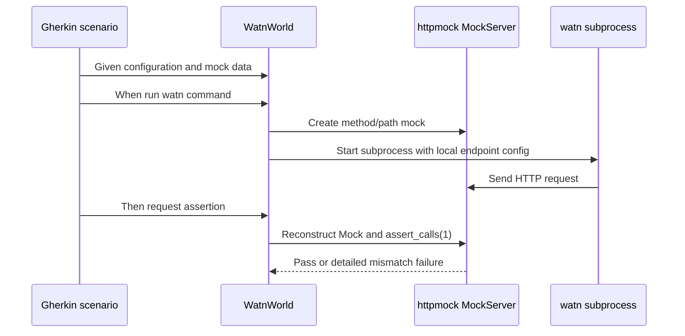

# Design: implement-empty-step-assertions

## Technical Decisions

The change stays in the Rust Cucumber test harness. It does not add request
logging or alter the `watn` binary.

The dev-dependency is `httpmock` 0.8.3, verified in `Cargo.lock` and against
the current docs.rs page. Its `Mock` handle supports `Mock::new`,
`assert_calls`, and request matchers for method, path, and headers. The
deprecated `hits` call is replaced with `calls` where the existing harness
only needs a count.

The literal URL and provider arguments in the feature steps remain domain
language. The test harness routes the configured endpoint to the local mock
server; the assertions verify the request method and path on that server. The
base URL is dynamic by design and is not compared with the illustrative URL in
the scenario.

The authorization assertion is enforced by adding an `Authorization` header
matcher to the chat-completion mock for scenarios that provide
`WATN_OPENAI_API_KEY`. A request without the expected `Bearer <key>` value does
not match the mock and causes `assert_calls(1)` to fail.

## Architecture Impact

The test world records the IDs of the chat-completion and model-list mocks in
addition to the existing server reference. Mock setup returns those IDs to
the world. The four step definitions reconstruct a `Mock` from the ID and
server reference at assertion time.



Affected files:

- `Cargo.toml` and `Cargo.lock`: update the test-only `httpmock` dependency.
- `tests/features_runner.rs`: add mock IDs and the optional expected auth
  header to `WatnWorld`.
- `tests/steps/mod.rs`: capture mock IDs and configure the auth matcher.
- `tests/steps/ask_steps.rs`: implement the four request assertions and wire
  the environment-provided key into the mock expectation.

All Gherkin steps remain in `tests/steps/ask_steps.rs`. This is an existing
repository constraint: Cucumber-rs 0.23 registers the inventory globally, and
the repository's step modules explicitly document that splitting definitions
causes duplicate registration. The capability-specific helper logic remains
in `tests/steps/mod.rs` beside the shared mock infrastructure.

## Data Model

No production or persisted data model changes.

`WatnWorld` gains these test-only fields:

- `chat_mock_id: Option<usize>` — the POST `/chat/completions` mock.
- `models_mock_id: Option<usize>` — the GET `/models` mock.
- `required_auth_header: Option<String>` — the complete expected value,
  including the `Bearer ` prefix.

## Runner And Strict Mode

The feature runner is the existing `tests/features_runner.rs` Cucumber-rs
runner. It discovers both `givn/specs/**` and the active change's
`givn/changes/**/specs/**` files.

- Verification: `cargo test --test features_runner -- --tags 'not @wip'`
- E2E verification: `cargo test --test features_runner -- --tags '@e2e and not @wip'`
- Single scenario: `cargo test --test features_runner -- --name 'Configured custom provider receives a chat request'`

Strict mode is `Cucumber::fail_on_skipped()` in
`tests/features_runner.rs`. It makes undefined or skipped steps fail the
runner. A step body must never be empty; an unfinished Rust step uses
`unimplemented!("...")` until it is implemented. The four affected steps are
implemented with explicit mock assertions rather than relying on the runner's
step completion status.

## E2E Infrastructure

The capability's real interface is the CLI. The E2E scenarios invoke the
compiled `watn` binary as a real subprocess, pass configuration through its
normal XDG config path, and communicate with it over HTTP through
`httpmock::MockServer` on loopback.

The same Cucumber step file drives both the existing integration scenarios and
these CLI E2E scenarios because the Cucumber-rs registry is global in this
repository. No browser or browser driver is applicable.

The local test command is:

```text
cargo test --test features_runner -- --tags 'not @wip'
```

Each scenario creates or reuses a dedicated local `httpmock` server. The
server is reset by its lifecycle and no live provider, model endpoint, or
internet connection is required. The mock server is the deterministic digital
twin for the external OpenAI-compatible provider and model-list service. No
database, queue, container, or separately running application server is
needed.

## Interaction Coverage Matrix

| Inventory entry | @e2e scenario title | Real interface | Driving mechanism |
|---|---|---|---|
| run watn with a configured custom provider | Configured custom provider receives a chat request | CLI | Cucumber-rs launches the compiled `watn` subprocess with `--provider custom` and a question; the local httpmock server receives the request |
| run watn models against a configured provider's model endpoint | Model discovery queries the configured model endpoint | CLI | Cucumber-rs launches `watn models` as a subprocess, supplies the three selection indexes on stdin, and the local httpmock server matches `GET /models` |
| run watn with a provider API key supplied through an environment variable | Environment API key is sent with the provider request | CLI | Cucumber-rs launches the compiled subprocess with `WATN_OPENAI_API_KEY`; the chat mock requires the resulting Authorization header |

The primary E2E assertions are the externally received HTTP requests at the
mock provider boundary. The mock is the external service visible to the CLI;
the test does not inspect private application state instead of driving the
CLI.
