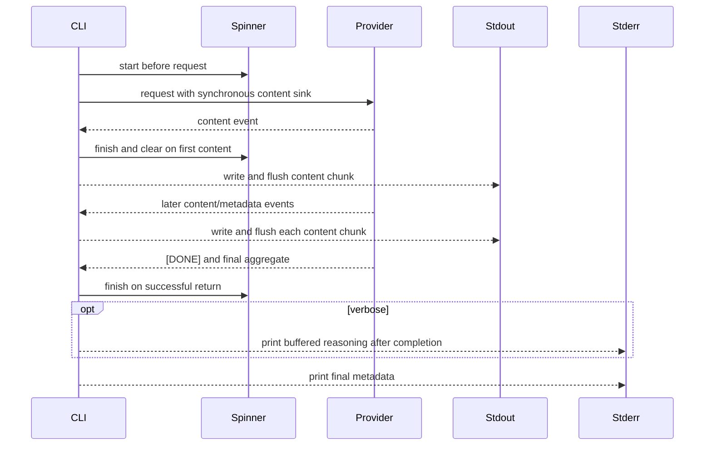

# Design: incremental-sse-rendering

## Scope And Decisions

- Keep the existing blocking `reqwest` client. Streaming does not require an
  async runtime, a worker thread, or a channel because one CLI consumer owns the
  response and terminal output.
- Change the provider boundary from a final-result-only call to a synchronous
  callback contract. The callback receives command-content events and returns a
  `Result`; provider and CLI errors therefore share the existing `Error` path.
- The provider still returns one final `StreamingResponse` containing the
  accumulated command, reasoning, response model, usage, and elapsed time after
  a successful stream. Reasoning is not a user-visible incremental event.
- Parse the response with a buffered blocking reader. Do not materialize the
  complete response body before parsing it.
- Treat the active provider as the only chat-completion source. LiteLLM and
  model discovery are unaffected.
- Keep the existing spinner worker and `Drop` cleanup. The CLI owns the spinner
  through an `Option`, stops it on the first content event, and finishes it on
  success or every error path.
- Require a literal `[DONE]` SSE data payload for successful completion. A clean
  EOF without `[DONE]` is a truncated stream and maps to the existing network
  error category.
- Do not add a new runtime dependency. The existing Cargo dependencies and
  Cucumber runner are sufficient.

## Architecture Impact

### Provider stream contract

Add a public stream event value in `src/provider/mod.rs` containing only a
non-empty command-content variant. Extend the provider operation so the caller
supplies a mutable synchronous callback, conceptually:

```text
chat_completions_streaming(messages, options, |event| -> Result<(), Error>)
```

There is no `mpsc` channel and no background producer. The callback is invoked
only after a complete JSON SSE data event has been parsed, and only for a
content delta. Reasoning is accumulated by the provider and remains available
in the final aggregate; it is never sent to stderr from the callback.

The returned `StreamingResponse` remains the final aggregate:

```text
StreamingResponse {
    final_usage: optional prompt/completion token counts,
    model: response model or requested model fallback,
    full_content: all content deltas in order,
    elapsed_secs: time from the first non-DONE data event to DONE,
    reasoning_content: all reasoning deltas in order, when non-empty,
}
```

The provider parser performs these operations for every response line:

1. Read through a `BufRead` boundary, retaining partial lines and accepting a
   final line without a trailing newline.
2. Ignore blank lines and non-data SSE lines. Accept `data:` with zero or one
   optional following space.
3. For the first non-`[DONE]` data line, set `first_event_at` before JSON
   decoding. This records provider-event arrival rather than request-start
   time, even when the event is later malformed.
4. Treat the exact `[DONE]` data payload as successful termination, stop reading
   immediately, and return without waiting for the server to close its HTTP
   connection.
5. Ignore a malformed JSON data event and continue reading later events. A
   malformed event contributes neither content nor metadata, although its
   arrival still establishes the first-event timing boundary.
6. Read top-level `model` independently of `choices`, so a valid choices-empty
   usage event can replace the requested-model fallback.
7. Read top-level `usage` independently of `choices`, including when `choices`
   is empty. Later usage replaces earlier usage because it is authoritative.
8. Read content and reasoning fields from each choice delta. Append content and
   reasoning to their respective aggregates, then invoke the callback
   immediately for each non-empty content delta.
9. If the reader reaches EOF before `[DONE]`, return
   `Error::NetworkError("...stream...DONE...")` rather than an empty successful
   response. Content already delivered through the callback remains visible.

The parser accepts both `reasoning` and the common `reasoning_content` delta
field and maps them to the private reasoning aggregate. Reader failures are
mapped to `Error::NetworkError`. A response status failure is handled before the
body is read and keeps the existing authentication/API error mapping.

### CLI rendering

`src/main.rs` installs a callback before invoking the provider. The callback has
one responsibility: render command content. It does not render reasoning and it
does not own background work.



For a content event the callback:

- finishes and drops the spinner on the first non-empty content chunk;
- writes the chunk directly to stdout;
- flushes stdout immediately;
- returns any write or flush failure as the existing `Error::IoError`.

There is deliberately no reasoning callback output. The CLI prints the
provider's final `reasoning_content` only after `[DONE]`, only when `--verbose`
is active, and only after the command stream has been terminated successfully.
If the stream fails, buffered reasoning is discarded from user-visible output.

After successful stream completion, the CLI finishes any still-running spinner,
terminates the streamed command output with the existing command-line spacing,
prints buffered reasoning when requested, computes cost and tok/s from the final
aggregate, and prints metadata once. The response model, not the requested model,
selects pricing and appears in final metadata. The final aggregate command is
trimmed for `-x` but is not printed a second time. Execute confirmation is
entered only after the provider returns successfully and all final output has
been written.

After a stream error, the CLI finishes the spinner, preserves the already
visible command prefix, and reports the mapped error. It does not print buffered
reasoning, final success metadata, or an execute prompt. A network read failure
or EOF without `[DONE]` exits with the existing network status 3. A callback,
stream-termination, metadata, or verbose-output write/flush failure exits with
the existing I/O status 1; the visible prefix remains and later completion
actions are skipped.

### Error and timing rules

- `first_event_at` is set when the first non-`[DONE]` data line is received,
  before JSON decoding. If no such event is received, elapsed time is zero.
- Successful elapsed time ends when `[DONE]` is observed. It is not measured
  from request start and does not include time spent waiting for a server close
  after `[DONE]`.
- Usage from a later usage-only event replaces earlier usage so final provider
  accounting is authoritative.
- A response model in any valid event replaces the requested-model fallback,
  even when that event has no choices.
- A malformed data event contributes neither content nor metadata and does not
  abort the connection; if it is the first data line, it still starts elapsed
  time measurement.
- `[DONE]` is mandatory. A stream ending without it is not a successful empty
  response, even if valid content was already emitted.
- A content callback error is propagated unchanged as `Error::IoError`; it is
  not converted to a network error and the provider does not continue reading.
- The existing response-status mapping is preserved: authentication failures
  remain status 2/API failures, network/read/truncation failures are status 3,
  and output I/O failures are status 1.

### Output and execution invariants

Each content delta is written once. On success, the renderer appends only the
existing terminating spacing; it does not render `full_content` again. The
generated command therefore appears as one complete output line exactly once.
Execution output is a separate assertion and is possible only after successful
stream completion and confirmation. A mid-stream or output failure cannot reach
the execution prompt.

## Files And Data Changes

Production changes:

- `src/provider/mod.rs`: content-only stream event type and callback-based
  provider contract.
- `src/provider/openai_compat.rs`: buffered incremental SSE parser, content
  event emission, independent model/usage extraction, timing, mandatory DONE,
  and EOF handling.
- `src/main.rs`: callback-driven stdout rendering, spinner ownership, buffered
  verbose reasoning, final aggregate accounting, and error cleanup.
- `src/output/render.rs`: streamed command termination and metadata-only
  rendering with propagated write/flush errors.
- `src/output/spinner.rs`: only if a small direct lifecycle test seam is needed;
  no lifecycle behavior change beyond existing start/finish/Drop semantics.

Test changes:

- `tests/features_runner.rs`: add capability-specific streaming state to the
  Cucumber world and register the capability step modules.
- `tests/steps/incremental_sse_rendering_steps.rs`: non-E2E provider fixture,
  response framing helper, parser/output assertions, controlled output writer,
  and shared streaming state. New step bodies must be real implementations, not
  no-op stubs.
- `tests/steps/incremental_sse_rendering_e2e_steps.rs`: PTY and subprocess
  driving steps for the `@e2e` scenarios. It asserts terminal/stdout/stderr
  behavior first and uses server state only as additional evidence.
- `src/output/spinner.rs` and/or `src/provider/openai_compat.rs` unit tests for
  lifecycle and parser edge cases that are not clearer through the CLI.

No persisted configuration format, provider selection rule, or public output
metadata fields change. The event callback is an API change inside the current
binary-oriented crate and is used only by the CLI provider consumer in this
change.

## Test Infrastructure

### Digital twin

The only external dependency is an OpenAI-compatible chat provider. Each
scenario starts a loopback TCP streaming twin in the test process. The twin
accepts one HTTP request, writes valid HTTP event-stream headers, and controls
body delivery with flushes, byte-sized writes, release conditions, a clean
close, or an intentional connection reset. It never contacts a live service and
does not persist credentials or request bodies.

The shared test state owns the listener, response thread, release handles,
connection milestones, and join handle. World cleanup releases any blocked
response and joins the thread. Each scenario writes an isolated XDG config
pointing the active provider at the twin.

The timing fixtures are intentionally release-gated so buffered production
cannot pass them through final-only assertions:

- delayed and verbose streams flush the first command content before holding a
  later completion event; the assertion runs before release, and verbose stderr
  must not contain reasoning before completion;
- partial-read streams send one complete content event one byte at a time, then
  hold the next event until the callback has exposed the content;
- malformed-event streams send malformed data, then flush valid content and
  hold `[DONE]` until the valid content is observed;
- the DONE stream sends `[DONE]`, keeps the connection open, and records child
  completion before the test releases the server-side connection;
- EOF streams close without `[DONE]`, while failure streams reset the
  connection after a visible prefix.

The usage-only fixture records the requested model, emits a different response
model in a choices-empty usage event, configures pricing only for the response
model, and asserts exact response-model metadata, non-zero cost, and positive
throughput.

### Local runnability

No application server, database, container, or external process is needed. The
complete local verification command is the configured `verify.command` in
`givn/commands.yaml`; it builds both debug binaries, sets their explicit paths,
and runs the Cucumber feature runner. Manual production execution remains
`cargo run -- "question"` against a user-configured provider. The loopback twin
is the digital twin for every provider request.

### Real interface and E2E runner

This capability is CLI-only. The real interface is a built `watn` subprocess;
interactive cases use a real pseudo-terminal so stdin is a TTY and crossterm
raw mode is exercised. There is no browser or API-only substitute for the
retained E2E interactions.

The E2E runner is the configured wrapper command. It builds explicit default
and test-support debug copies, then runs the real Cucumber runner with the E2E
tag filter:

```text
./run-tests.sh --e2e
```

The runner is strict because `tests/features_runner.rs` calls
`.fail_on_skipped()`. During RED, an unimplemented Rust step uses
`unimplemented!("<step contract>")`; no such body may remain when `@wip` is
removed. The E2E scenarios use the capability's PTY and subprocess steps,
separate from the non-E2E parser and controlled-writer steps. Their primary
assertions inspect terminal or captured stdout/stderr output; request counts,
release milestones, and config files are secondary checks.

The delayed scenario covers spinner startup and first-content cleanup. Its PTY
asserts a progress frame before content and clear-line terminal evidence after
the first content. The mid-stream failure scenario independently asserts the
same cleanup evidence on the error path, plus status 3, the visible prefix, no
successful metadata, and no execute prompt.

### Step binding boundaries

The capability step module must not redeclare expressions already registered by
`tests/steps/ask_steps.rs`. It reuses the existing ordinary launch step
`I run \`watn "..."\``, the existing `stderr should contain` and
`stderr should not contain` assertions where their post-exit semantics are
appropriate, and the existing parameterized exit-status steps. Live release
and pre-confirmation observations use distinct wording such as `start the
streaming command`, `release the delayed event`, and `generated command line ...
appears exactly once`; those expressions belong only to the capability module.
The raw-terminal launch uses `start the executable streaming command` rather
than an existing `ask_steps.rs` `watn -x` expression. The piped-confirmation
step remains distinct from the existing `and answer with` wording. This keeps
Cucumber registration unambiguous while allowing shared launch and status
behavior to be reused.

### Coverage process boundaries

| Process | Started by | Instrumented artifact | Profile output | Merge step | Non-zero production probe |
|---|---|---|---|---|---|
| Cucumber runner and child watn binaries | configured coverage commands | `cargo llvm-cov` debug binaries and test runner | existing collision-safe `coverage/profraw/%p-%m.profraw` pattern | `cargo llvm-cov ... --cobertura` | streamed provider request, callback rendering, and failure cleanup |

Normal verification does not require coverage tooling. Coverage verification
uses `measure-coverage.sh` and `merge-coverages.sh` from `givn/commands.yaml`.
The measurement disables cargo-llvm-cov's default workspace-test exclusion so
`tests/features_runner.rs` is present in both Cobertura reports, ignores only
registry/toolchain/target artifacts, and merges per-file/per-line hits rather
than adding duplicate report totals. Branch coverage is not claimed because
the installed cargo-llvm-cov branch mode requires a nightly compiler.

## Interaction Coverage Matrix

| Inventory entry | @e2e scenario title | Real interface | Driving mechanism |
|---|---|---|---|
| invoke watn for a question and observe a generated command while the provider is streaming | Command text appears before a delayed stream completes | CLI | A real built `watn` process is started in a `portable-pty` terminal; the step observes spinner startup, first flushed content, and spinner clear-line cleanup before releasing the delayed event, then waits for exit and reads terminal output. |
| invoke watn with verbose output and observe command and reasoning on their separate channels | Verbose streaming keeps reasoning on stderr and command text on stdout | CLI | A real built `watn -v` subprocess is run against the loopback streaming twin; the step observes stdout content before release and absence of buffered reasoning before release, then asserts final stdout/stderr separately. |
| observe a provider failure after command content has become visible | A mid-stream failure preserves visible content and exits unsuccessfully | CLI | A real built `watn` process is started in a `portable-pty` terminal; the twin resets the connection after a flushed prefix, and the step asserts prefix, network status 3, clear-line cleanup, no metadata, and no execute prompt. |
| invoke watn with execute enabled from a raw terminal and confirm the generated command | Raw terminal confirmation happens after the complete command arrives | CLI | A real built `watn -x` process runs under `portable-pty`; the step checks the generated line and absence of execution output before sending a raw Enter key, then asserts each line exactly once. |
| invoke watn with execute enabled from piped input and confirm the generated command | Piped confirmation remains available after streamed output | CLI | A real built `watn -x` subprocess receives `y\n` through piped stdin; assertions count the complete generated command line separately from the execution output line. |

Every retained `@e2e` scenario maps to exactly one inventory entry. The regular
parser, usage, DONE-held-connection, partial-read, malformed-event, and EOF
scenarios drive the real CLI through loopback twins; the controlled-output-writer
scenario uses the reviewed renderer seam because an unwritable process stdout
cannot be injected through a portable subprocess boundary. Its assertions are
limited to renderer state, visible prefix, and propagated I/O error.

## Single-Scenario Commands

The configured verification wrapper executes every feature under both
`givn/specs/` and the active change directory because `tests/features_runner.rs`
collects both trees. The non-E2E command is:

```text
./run-tests.sh
```

The wrapper's single-scenario equivalent uses the same explicit binary
bootstrap and the Cucumber `--name` filter documented below.

To run one named scenario during RED/GREEN/REFACTOR, use the same binary
bootstrap and replace the final filter with the exact scenario name:

```text
root=$(mktemp -d /tmp/watn-transport.XXXXXX) && trap 'rm -rf "$root"' EXIT && cargo build --bin watn && cp target/debug/watn "$root/default-debug" && cargo build --features test-support --bin watn && cp target/debug/watn "$root/test-support-debug" && WATN_DEFAULT_DEBUG_BIN="$root/default-debug" WATN_TEST_SUPPORT_DEBUG_BIN="$root/test-support-debug" cargo test --test features_runner --features test-support -- --name "<scenario title>"
```

The exact scenario title is substituted for `<scenario title>`; the command
must not be changed to a bare Rust unit-test invocation.

## Implementation Order

Implement one scenario at a time in this order:

1. Callback contract, no-channel consumption, and incremental content emission
   for the delayed-stream scenario, including spinner startup and first-content
   cleanup evidence.
2. Buffered reasoning separation and final metadata accounting, with the
   verbose scenario observing stdout before release and no reasoning before
   completion.
3. Usage-only event extraction, response-model selection, exact-once output,
   and throughput/cost accounting.
4. Mandatory DONE termination, connection-close independence, partial reads,
   and malformed-event tolerance.
5. Mid-stream reset, EOF truncation, output I/O failure, spinner cleanup, and
   omission of final metadata and execution after every error.
6. Raw-terminal and piped confirmation after complete streamed output, with
   separate exact-line assertions for generated and executed output.
7. Direct parser and spinner lifecycle tests, then refactor without behavior
   changes.

Each item is RED, GREEN, REFACTOR, one atomic scenario commit, and an immediate
commit-hash entry in `tasks.md`.
