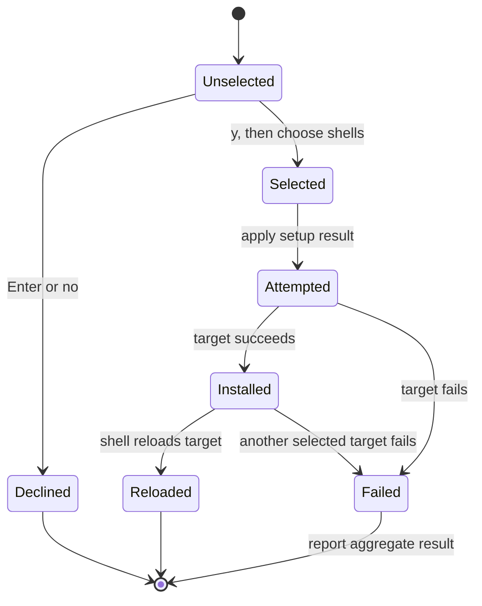
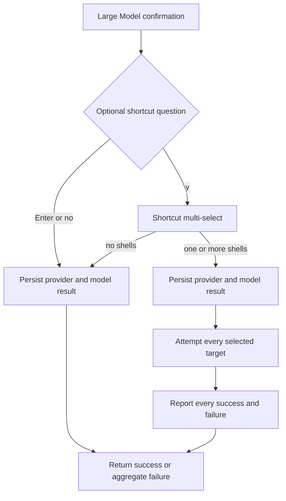
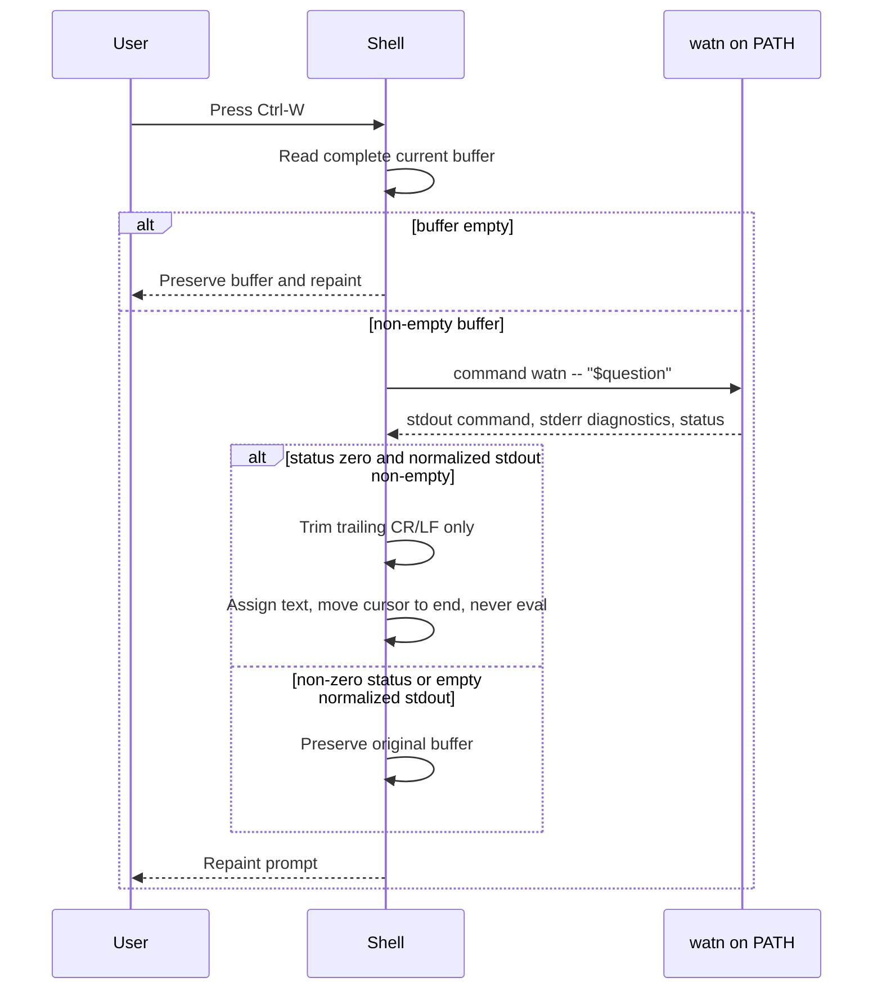

# Design: interactive-shell-shortcut

## Domain Model

### Ubiquitous Language

- **Supported shell**: Bash, Zsh, or Fish, each with its own startup file and
  widget syntax.
- **Shortcut selection**: the zero-or-more supported shells chosen during the
  optional setup interaction.
- **Shortcut target**: the resolved startup file belonging to one selected
  shell.
- **Generated block**: the delimited `watn shell shortcut` content owned by the
  installer inside one shortcut target.
- **Widget**: the shell-specific function bound to Ctrl-W that replaces the
  current command buffer with a successful `watn` result.
- **Target result**: the success or failure report for one selected shell,
  including its target path and reload guidance when it was modified.
- **Aggregate installation failure**: the result returned after every selected
  target has been attempted when one or more target results failed.

### Boundaries And Invariants

- Shortcut selection is runtime setup state, not persisted provider or model
  configuration.
- The optional shortcut question is part of the shared setup flow used by
  explicit `watn setup` and implicit first-use setup. It follows the final Large
  Model confirmation and is not a sixth setup tab. Enter accepts the default
  decline; `y` enters the multi-select.
- Preselection uses only the basename of `$SHELL`. Existing target files,
  target contents, and the full `$SHELL` path do not influence preselection.
- A target with no marker pair is valid input. A target with shortcut markers
  must contain exactly one opening marker and exactly one closing marker, with
  the opening marker before the closing marker. Duplicate, unmatched, or
  reversed markers are invalid.
- Marker validation completes before any target write, temporary-file creation,
  or parent-directory creation. A malformed target remains byte-for-byte
  unchanged.
- Installation changes only selected targets and preserves content outside the
  generated block. Reinstalling replaces the existing generated block instead
  of appending a duplicate.
- Every selected target is attempted independently. Successful target changes
  are never rolled back because another target fails. The installer reports all
  target results and returns an aggregate installation failure if any target
  failed.
- A widget reads the complete current buffer as one quoted question and never
  evaluates generated output. It invokes `command watn -- "$question"`.
- A widget removes only trailing CR and LF characters from successful stdout.
  Embedded line breaks and other non-line-terminator characters remain in the
  buffer.
- A widget never changes the current buffer on empty input, a non-zero `watn`
  status, including partial stdout, or empty normalized output.
- A successful replacement puts the cursor at the end of the inserted buffer
  and redraws the prompt. An unchanged buffer is also redrawn after the
  shortcut event.
- The setup flow remains cancellable, provider/model persistence remains
  independent of shortcut selection, and `Provider` and `Models` entry points
  do not expose the shortcut interaction.

### Lifecycle



## Technology Decisions

- Use a new `src/shell_shortcut.rs` module with a closed `Shell` enum, target
  resolution, generated block text, marker validation/replacement, atomic
  installation, and target-result aggregation. Reuse the existing `Error`
  type and standard filesystem APIs.
- Resolve Bash and Zsh targets from an absolute, non-empty `HOME` value as
  `$HOME/.bashrc` and `$HOME/.zshrc`. Resolve Fish from a non-empty absolute
  `XDG_CONFIG_HOME` value as `$XDG_CONFIG_HOME/fish/config.fish`; when that
  variable is unset or empty, use `$HOME/.config/fish/config.fish`. A missing,
  empty, or non-absolute required base path is a target-resolution failure for
  the affected selected shell, not a reason to substitute the process current
  directory.
- A missing target file is treated as empty content. Parent directories are
  created only after the target is selected, resolved, read successfully, and
  its marker layout has passed validation. An unreadable target, directory at
  the target path, unsafe symlink target, parent creation failure, or write/
  rename failure becomes a target failure that includes the exact resolved path
  when one exists and the operating-system reason.
- Detect the current shell for preselection by taking only the basename of
  `$SHELL`. Exact basenames `bash`, `zsh`, and `fish` preselect their matching
  options. Missing, unsupported, or malformed values preselect nothing. Target
  existence is never used as detection evidence.
- Use stable comment markers in every generated target:
  `# >>> watn shell shortcut >>>` and `# <<< watn shell shortcut <<<`.
  The marker parser counts each exact marker string. Zero opening and zero
  closing markers means append; exactly one of each in the correct order means
  replace. Any other count or ordering fails before a write, including two
  complete pairs, duplicate opening/closing markers, and one-sided pairs.
- Build the complete replacement in memory while preserving all bytes outside
  the marker pair. For a selected target, create a uniquely named temporary
  file in the target's parent directory with exclusive creation, write all
  bytes, flush and `sync_all`, preserve the existing target mode when replacing
  an existing file, and atomically rename the temporary file over the target.
  Clean up the temporary file on every pre-rename error. Do not truncate the
  target in place. Sync the containing directory when the platform supports
  it. A failure before rename leaves the original target unchanged; a successful
  rename is not rolled back because a different selected target later fails.
- Generate static shell-specific blocks that call the installed `watn` command
  through `PATH`. Every generated widget uses the exact invocation
  `command watn -- "$question"`; no repository, build, test-binary, or absolute
  executable path is embedded.
- Keep widget bodies shell-native: Bash uses `READLINE_LINE`, `READLINE_POINT`,
  and `bind -x`; Zsh uses `BUFFER`, `CURSOR`, `zle -N`, `bindkey`, and
  `zle redisplay`; Fish uses `commandline`, `string collect`, `bind`, and
  `commandline -f repaint`.
- Treat command substitution as capture only. Redirect only stdout into the
  result variable so stderr remains visible diagnostics. Preserve the command
  status before normalization. Normalize successful stdout by removing
  trailing CR and LF characters only; do not trim spaces and do not remove
  embedded line breaks. Assign output only when the status is zero and the
  normalized result is non-empty.
- Add a transient `ShellShortcut` interaction to the shared `Setup` entry point
  after the Large Model confirmation. It is not included in the five rendered
  setup tabs. Enter on the optional question declines without shell I/O; `y`
  opens the three-item multi-select. `Provider` and `Models` retain their
  existing page ranges and return no shortcut selection.
- Extend the wizard result with the runtime shortcut selection. After the
  existing provider/model persistence succeeds, apply every selected target in
  stable Bash, Zsh, Fish order. Print every target result and reload instruction
  to stderr before returning. A non-empty failure list returns one aggregate
  `ConfigError` after all attempts; successful target changes and persisted
  provider/model settings are retained.

## Architecture Impact

### Production Modules

- `src/shell_shortcut.rs`: supported-shell domain, environment-based target
  resolution, basename-only detection/preselection, generated Bash/Zsh/Fish
  blocks, exact marker validation, atomic replacement, installation, and
  aggregate target reports.
- `src/lib.rs`: expose the new module to the setup wizard and test steps.
- `src/setup.rs`: add the post-Large-Model optional question, multi-select
  focus/selection state, keyboard handling, rendering, result propagation, and
  installation report return path without adding a sixth tab.
- `src/main.rs`: invoke shortcut installation for explicit setup and implicit
  first-use setup, print every shell result and reload instruction to stderr,
  and return the aggregate failure after all selected targets are attempted.
  Existing provider/model callers pass through an empty shortcut selection.
- `src/error.rs`: retain the existing error taxonomy; shell target failures use
  `ConfigError` with the shell, exact target path when resolvable, and the
  underlying path/read/write/marker reason. The aggregate error contains all
  failed target results.

### Setup State Flow



The optional interaction is reachable from explicit `watn setup` and implicit
first-use setup, but not from `watn provider` or `watn models`. The permanent
five-tab setup scenario remains unchanged: its final Enter follows the default
decline and never opens the multi-select. Syntax-focused E2E scenarios validate
the generated Bash and Fish artifacts and run the Bash widget through a shell
process; no setup PTY is required.

### Widget Runtime Flow



## Data Model

No persisted configuration schema changes. New runtime-only values are:

- selected supported shells in stable display/install order;
- the current optional shortcut question state;
- multi-select cursor and selected flags;
- resolved target metadata, including path-resolution failure details;
- per-target installation results containing shell, target path when available,
  success/failure, reason, and reload guidance;
- an aggregate installation result that is successful only when every selected
  target succeeds.

The generated blocks are startup-file text, not a second persisted
configuration format. The exact marker strings are stable external ownership
boundaries.

## Test Infrastructure

### Step Definitions

Use one regular and one E2E step file for this capability:

- `tests/steps/interactive_shell_shortcut_steps.rs`: isolated HOME/XDG target
  fixtures, basename-only selection/detection assertions, target path and
  marker contract checks, atomic-write/error probes, generated syntax checks for
  all three shells, and Bash widget subprocess probes.
- `tests/steps/interactive_shell_shortcut_e2e_steps.rs`: the real installed
  shell-process checks for generated Bash/Fish configuration and the generated
  Bash widget. This file owns the only two `@e2e` scenarios and does not drive a
  terminal emulator or launch Zsh.
- `tests/steps/mod.rs`: register both capability modules. Extend `WatnWorld`
  only with shortcut target snapshots, selected shells, fake `watn` path,
  widget subprocess state, and captured setup reports.

Regular tests use isolated HOME/XDG directories and a deterministic filesystem
failure seam for paths that cannot be written. They assert target bytes before
and after failures, including that no temporary file remains. Generated
contract checks cover Bash, Zsh, and Fish markers, bindings, shell-native buffer
variables, repaint behavior, and the exact `command watn -- "$question"`
invocation. Regular Bash subprocess probes cover quoting, leading options,
reserved tokens, empty input, status handling, trailing terminators, embedded
line breaks, buffer contents, and cursor position. Parser checks run `bash -n`
and `fish -n` against the generated configuration text; Zsh syntax remains a
static contract check when its executable is unavailable.

No scenario depends on an interactive terminal emulator. Cursor and prompt
redraw are represented by the generated shell contract and Bash buffer/cursor
subprocess checks, while the real shell parser checks provide the runtime syntax
boundary the installed configuration must satisfy.

### Runner And Strict Mode

- Regular verification command: `./run-tests.sh`.
- E2E verification command: `./run-tests.sh --e2e`.
- The runner collects `.feature` files under `givn/specs/**` and active change
  specs under `givn/changes/*/specs/**`.
- Strict mode is `.fail_on_skipped()` in `tests/features_runner.rs`, combined
  with the wrapper filters `not @wip and not @e2e` and `@e2e and not @wip`.
- Every new step starts as an explicit `unimplemented!()` RED body. The strict
  proof targets one new scenario and must fail non-zero before its GREEN
  implementation.
- Single-scenario command:

```text
root=$(mktemp -d /tmp/watn-shortcut.XXXXXX) && trap 'rm -rf "$root"' EXIT && cargo build --bin watn && cp target/debug/watn "$root/default-debug" && cargo build --features test-support --bin watn && cp target/debug/watn "$root/test-support-debug" && WATN_DEFAULT_DEBUG_BIN="$root/default-debug" WATN_TEST_SUPPORT_DEBUG_BIN="$root/test-support-debug" cargo test --test features_runner --features test-support -- --name "Generated shell blocks use the installed watn command and preserve shell syntax"
```

### E2E Smoke-Test Infrastructure

- Interface type: generated shell configuration and a real Bash/Fish process,
  not a browser, API, or terminal emulator.
- `interactive_shell_shortcut_e2e_steps.rs` writes selected targets under an
  isolated HOME/XDG tree, runs `bash -n` and `fish -n` against the generated
  files, and runs the generated Bash widget through `bash --noprofile --norc -c`.
  Assertions inspect shell exit status and captured buffer output as the
  primary interface result; filesystem checks are secondary.
- The Bash process receives a temporary fake `watn` executable on `PATH`. Its
  received question and a no-evaluation sentinel are captured without starting
  a PTY or relying on terminal redraw timing.
- No live provider, shell startup file, developer HOME, or external service is
  used. The shortcut scenarios do not need the model-catalog twin.
- Strict E2E mode is the same `.fail_on_skipped()` runner with the
  `@e2e and not @wip` filter.

### Local Runnability And Digital Twins

- Manual local command: `cargo run -- setup`.
- Full automated command: `./run-tests.sh`; E2E smoke command:
  `./run-tests.sh --e2e`.
- The application is a single CLI. There is no database, queue, or required
  application server. The provider model API is the only external service
  contacted by setup and is represented in tests by an isolated loopback
  `httpmock::MockServer` twin. No scenario uses a live network service.

### Interaction Coverage Matrix

| Inventory entry | @e2e scenario title | Real interface | Driving mechanism |
|---|---|---|---|
| generate selected shell shortcut configurations and verify their shell syntax | Generated Bash and Fish configurations pass shell syntax checks | Shell configuration plus Bash/Fish subprocesses | `interactive_shell_shortcut_e2e_steps.rs` installs isolated targets, runs `bash -n` and `fish -n` against the generated files, and asserts both parser processes exit successfully. |
| run the generated Bash widget through Bash with a current command buffer | The generated Bash widget runs through Bash without evaluating its result | Bash subprocess | `interactive_shell_shortcut_e2e_steps.rs` sources the generated block in `bash --noprofile --norc -c`, supplies a fake `watn` on PATH, captures the replacement buffer, and asserts the no-evaluation sentinel. |

Zsh values, empty selections, basename preselection, filesystem/path failures,
marker failures, aggregate partial installation, output failures, quoting,
reserved tokens, and multiline output are regular variants of these two
interactions. They use isolated subprocess/file fixtures and do not add extra
E2E scenarios or inventory entries.

## Coverage Process Boundaries

| Process | Started by | Instrumented artifact | Profile output | Merge step | Non-zero production probe |
|---|---|---|---|---|---|
| Cucumber runner and child `watn` binaries | `measure-coverage.sh` | instrumented runner and explicit debug binaries | `coverage/profraw/%p-%m.profraw` | `merge-coverages.sh` per-line union | setup shortcut installation, marker replacement, aggregate reporting, and widget invocation |
| Bash/Fish parser and Bash child with fake `watn` | shortcut E2E step | generated shell files plus Bash/Fish processes | inherited collision-safe `LLVM_PROFILE_FILE` | existing merge wrapper | Bash/Fish syntax acceptance, Bash replacement buffer, and no-eval sentinel |

Branch coverage remains unclaimed if the current toolchain reports no valid
branches, matching the repository's established coverage contract.

## Implementation Order

1. Register capability step modules, extend test state, add explicit RED stubs,
   and prove strict failure for one scenario.
2. Add shell target resolution, basename-only preselection, generated blocks,
   exact marker validation, atomic writes, and independent report aggregation
   with regular selection and file scenarios.
3. Add the optional post-Large-Model setup interaction and apply-result
   reporting for both explicit setup and implicit first-use setup. Keep the
   existing five-tab setup scenario on its normal Enter/default-decline path.
4. Add regular Bash widget probes, Bash/Fish parser checks, all-shell generated
   syntax/contract checks, and the non-interactive Bash E2E process check.
5. Remove completed `@wip` tags, run regular/E2E verification, coverage, review,
   and archive.
