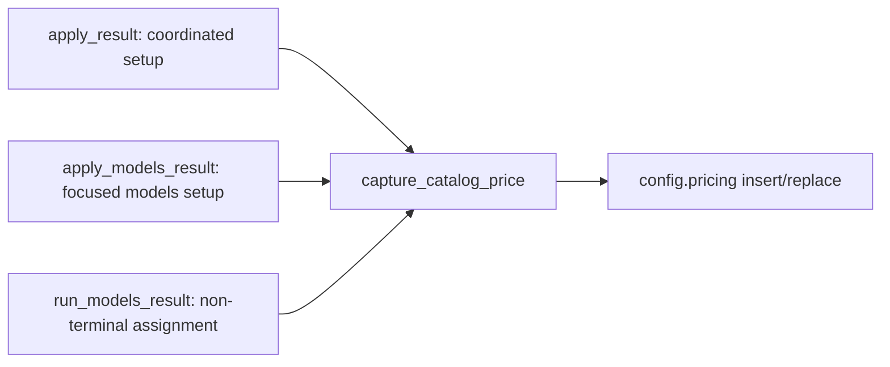

# Design: model-pricing-visibility

## Technical Direction

Watn remains a Rust command-line application using the toolchain pinned in
`rust-toolchain.toml` and the dependency versions locked in `Cargo.lock`. The
change adds no dependency. The blocking OpenAI-compatible HTTP transport,
`cucumber-rs` executable-spec runner, Ratatui/Crossterm setup surface, and
`httpmock` local provider twins remain in use.

The root cause is a unit conflation: the provider publishes a price in USD per
token, while watn configuration and cost estimation use USD per one million
tokens. The catalog parser stored the raw per-token value into the same type
that every consumer reads as per-million. The fix normalizes the unit once at
the catalog parse boundary, so `ModelEntry.pricing` keeps its existing
`Option<ModelPricing>` type but now always means $/1M.

## Data Model

No new type is introduced. The existing `ModelPricing` contract is enforced as
"always USD per 1M tokens":

- `src/models/list.rs` parses the OpenRouter-style `pricing.prompt` and
  `pricing.completion` components. A model has a catalog price only when
  **both** components are present and non-negative; otherwise
  `ModelEntry.pricing` is `None`. A missing component is not treated as zero,
  so a negative sentinel and a partial object can never overwrite a recorded
  price with a fake zero.
- Each accepted component is converted once:
  `per_million = round6(per_token * 1_000_000.0)`, where `round6` rounds to six
  decimal places to remove binary-float noise (for example `1.5e-7 * 1e6`
  would otherwise persist as `0.15000000000000002`).
- `ModelPricing` stays exactly as persisted: `input`/`output` in USD per 1M.
  The configuration file format does not change.

The provider-quoted per-token value is called the Catalog price in the
glossary; the persisted per-million value is the Pricing entry.

## Architecture Impact

### Catalog parsing

`src/models/list.rs`:

- `fetch_models` currently duplicates the parsing loop of
  `parse_model_data`. That duplication is the reason one boundary could drift;
  `fetch_models` is reduced to reuse `parse_model_data`. This is an
  at-the-source fix, not a drive-by refactor: both network paths must produce
  identical pricing semantics.
- `parse_model_data` builds `ModelPricing` from `per_million_tokens` of each
  accepted component, or `None` for absent, partial, or negative components.

### Display

- `src/models/mod.rs::format_model_entry` renders
  `$<input:.2>/1M in, $<output:.2>/1M out` directly from the $/1M value.
- `src/setup.rs::draw_model` renders the pricing cell as
  `$<input:.2>/$<output:.2>` and its column header becomes `Pricing ($/1M)`.
  The layout tests match the substring `Pricing`, so the header stays
  compatible.

Live-catalog evidence for two decimals per 1M: the smallest positive price in
the OpenRouter catalog is `$0.017/1M`, which renders `$0.02`; no live entry
rounds to `$0.00`. True zero renders `$0.00` and is a real free-model price.

### Capture

`src/setup.rs` gains one rule used by every write path:

```
capture_catalog_price(config, entry):
    if entry.pricing is Some(pricing):
        config.pricing[entry.id] = pricing
```

Call sites:



- `apply_result` and `apply_models_result` call it for each non-empty
  `LevelChoice` before `save_config`.
- `run_models_result`'s non-terminal branch (piped stdin) calls it for the
  three selected `ModelEntry` values before `save_config`; the file does not
  otherwise change its tier/reasoning behavior.
- Absent or invalid catalog price leaves any existing entry untouched;
  entries for models that were not chosen are preserved because insertion is
  keyed by model id.

## Use-Case Traceability

Use case: `configure-model` (no confirmed Personas, Actor `Watn user`).

| Use-case guarantee / rule | Technical decision | Evidence |
|---|---|---|
| Main flow 1–2: discover and assign model tiers | Catalog price normalized once and displayed per 1M | `Interactive model table shows published prices per million tokens`; `Model picker shows metadata when available` |
| Main flow 4: persist and apply the choices | `capture_catalog_price` on all three write paths | `Models setup configures all three roles from an available catalog` (focused), `Coordinated setup completes provider models reasoning and shell choices` (coordinated), `Non-terminal model assignment records published prices` (piped) |
| Success guarantee: requests use selected model tier and reasoning policy | Captured price feeds the unchanged cost lookup; no routing change | Composition of the capture scenarios with the permanent `Cost is displayed when pricing is configured`; no new cost-formula scenario |
| Minimal guarantee: discovery or cancellation does not corrupt existing configuration | Keyed insert-only capture; no entry created without a valid catalog price | `Non-terminal model assignment records published prices` (unchosen and unpriced entries preserved, sentinel not recorded); `Focused model setup preserves provider-owned and unrelated fields` (permanent, unchanged) |
| Rules: per-level reasoning applied only to the selected level | Untouched by this change | Permanent reasoning scenarios |
| Extension: missing catalog source leaves active provider unchanged | Untouched; capture only runs on confirmed choices | `Unavailable catalog allows manual model identifiers` (permanent, unchanged) |

## Step Definition Locations

All bindings are registered by `tests/steps/mod.rs`. The existing step files
are reused, one primary binding file per capability:

| Capability | Step file | New or changed bindings |
|---|---|---|
| models | `tests/steps/ask_steps.rs` | Rich-catalog fixture prices become per-token and gain a sentinel and a bare model; new table-driven priced-catalog given for the terminal scenarios; `the config file should record pricing for ...`, `the config file should not record pricing for ...`, given that seeds `[pricing]`, sentinel-pricing fixture |
| ratatui-model-picker | `tests/steps/model_picker_layout_steps.rs` | `the model table should show ...`, `the model table header should show ...` |
| ratatui-model-picker | `tests/steps/ask_steps.rs` | Formatter fixture uses the normalized $/1M value; existing "entry shows a price"/"shows no price" steps are reused |
| streamlined-setup | `tests/steps/streamlined_setup_steps.rs` | Table-driven priced-catalog given (shared with the ratatui table scenario) |
| streamlined-setup | `tests/steps/provider_setup_steps.rs` | Priced variant of `the ephemeral E2E transport returns models [...] for "/models"` used by the coordinated e2e |
| streamlined-setup | `tests/steps/streamlined_setup_e2e_steps.rs` | Existing choose-role steps reused unchanged |

The priced-catalog table given lives with the regular streamlined-setup steps
because both a regular scenario and a streamlined scenario consume it;
cucumber-rs registers steps globally.

### Test fixture units

The Gherkin priced tables are written in USD per 1M tokens (the user-facing
unit). The mock catalog must publish the provider's per-token unit, so the
table helper emits `value / 1_000_000.0` as the `pricing.prompt` and
`pricing.completion` JSON strings. The rich-metadata fixture in
`tests/steps/ask_steps.rs` carries per-token strings directly
(`0.00000015`, `0.0000006`, `-1` for the sentinel, and a bare entry with no
`pricing` object). Config assertion steps parse the written TOML and compare
`ModelPricing` values, so no float formatting is asserted textually.

## Test Runner

- Regular command: `./run-tests.sh` (builds the default and `test-support`
  binaries, runs `cargo test --test features_runner --features test-support`
  with `not @wip and not @e2e`).
- E2E command: `./run-tests.sh --e2e` (`@e2e and not @wip`).
- Single scenario: `./run-tests.sh --name "Non-terminal model assignment records published prices"`.
- Strict mode: `.fail_on_skipped()` is set on the `Cucumber` builder in
  `tests/features_runner.rs:208`, and the runner exits non-zero when failed or
  skipped counts are non-zero (`tests/features_runner.rs:225`). The
  proof-of-strictness task runs one scenario with a deliberately undefined
  step before implementation and requires a non-zero exit.

## Interaction Coverage Matrix

Every entry from `givn/specs/configure-model/usecase.md` `## Interactions`.
The real interface is the built CLI for every entry; terminal flows are driven
through a PTY, non-terminal flows through a piped subprocess. Provider HTTP is
served by in-process `httpmock` twins.

| Inventory entry (capability · action) | @e2e scenario title | Real interface | Driving mechanism |
|---|---|---|---|
| reasoning-policy · persist minimal reasoning | Minimal reasoning is persisted and sent | CLI | `run_binary_with_state` + `httpmock` chat stream, body assertion |
| streamlined-setup · coordinate all setup choices | Coordinated setup completes provider models reasoning and shell choices | CLI (terminal) | PTY `start_pty_session`, `pty_write` keystrokes |
| streamlined-setup · configure provider from environment | Provider setup configures an OpenAI provider with an environment credential | CLI (terminal) | PTY `start_pty_session`, `pty_write` keystrokes |
| streamlined-setup · configure all model roles | Models setup configures all three roles from an available catalog | CLI (terminal) | PTY `start_pty_session`, typed filter + Enter per role |
| streamlined-setup · configure shell integration | Shell setup independently configures completion and Ctrl-W integrations | CLI (terminal) | PTY `start_pty_session`, shell choice keystrokes |
| streamlined-setup · reject incomplete request | Incomplete interactive request opens setup and does not send the original request | CLI (terminal) | PTY `start_pty_session`, `httpmock` chat-request count |
| reasoning · send thinking reasoning | Thinking tier sends reasoning without printing it | CLI | `run_binary_with_state` + `httpmock` body/print assertion |
| reasoning · print verbose thinking reasoning | Thinking tier with verbose flag prints reasoning to stderr | CLI | `run_binary_with_state`, stderr assertion |
| reasoning · print small-tier reasoning | Verbose flag with small tier prints reasoning if present | CLI | `run_binary_with_state`, stderr assertion |
| reasoning · suppress small-tier reasoning | Small tier without verbose flag does not print reasoning | CLI | `run_binary_with_state`, stderr assertion |
| reasoning · preserve default-tier behavior | Verbose flag with default tier does not alter existing model behavior | CLI | `run_binary_with_state`, request-body assertion |
| reasoning · inspect verbose help | Help output includes verbose flag | CLI | `run_binary_with_state`, stdout assertion |
| reasoning · combine verbose and execute | Thinking tier with verbose and execute flags | CLI | `run_binary_with_state`, stdout/stderr assertions |
| ratatui-model-picker · configure three levels | Configure model and reasoning for all three levels in the dialog | CLI (terminal) | PTY `start_pty_session`, typed filter + reasoning navigation |
| ratatui-model-picker · browse model list | Browse the model list with arrow keys and page keys | CLI (terminal) | PTY `start_pty_session`, arrow/page keystrokes |
| ratatui-model-picker · filter model suggestions | Type a filter and see the matching suggestions | CLI (terminal) | PTY `start_pty_session`, typed filter |
| ratatui-model-picker · revise previous level | Return to a previous level and change its selection before confirming | CLI (terminal) | PTY `start_pty_session`, back navigation keystrokes |
| ratatui-model-picker · apply per-level reasoning | Configured per-level reasoning takes effect on a request | CLI | `run_binary_with_state` + `httpmock` body assertion |
| credential-sources · discover with environment credential | Interactive model discovery uses an OpenRouter environment credential | CLI (terminal) | PTY `start_pty_session`, env credential resolution |
| credential-sources · prefer saved credential | A literal saved credential is authoritative over environment fallback | CLI (terminal) | PTY `start_pty_session`, `httpmock` auth-header assertion |
| models · discover and assign tiers | Discover models and select tiers interactively | CLI | `run_binary_with_state` piping indices + `httpmock` catalog |
| models · browse without LiteLLM | Model explorer without LiteLLM endpoint configured | CLI | `run_binary_with_state`, guidance assertion |
| catalog-source · use configured LiteLLM catalog | Configured LiteLLM is used for model catalog requests | CLI | `run_binary_with_state` + `httpmock` LiteLLM catalog hits |
| catalog-source · preserve chat provider | LiteLLM discovery does not replace the active chat provider | CLI | `run_binary_with_state`, saved-provider assertion |
| model-autosuggest · find a model outside first page | Find a model outside the initial page while assigning tiers | CLI (terminal) | PTY `start_pty_session`, search request to `httpmock` |

This change adds no inventory entry and changes no consumer action. It
strengthens existing actions, so no new `@e2e` scenario is required; two
existing `@e2e` scenarios are modified to assert the strengthened contract.

## E2E Infrastructure

- E2E runner: `./run-tests.sh --e2e`.
- E2E step locations: `tests/steps/streamlined_setup_e2e_steps.rs` for the
  modified focused models scenario, `tests/steps/provider_setup_steps.rs` for
  the coordinated transport step, and existing PTY helpers.
- Local test infrastructure: a prebuilt `test-support` debug binary
  (`WATN_TEST_SUPPORT_DEBUG_BIN`), in-process `httpmock` servers for every
  provider endpoint, and a `portable_pty` session at 120x40 for terminal
  flows. No database, container, or network dependency.
- Framework: `cucumber-rs` (already the project runner) driving the real CLI
  subprocess or PTY; matching the real interface (terminal or pipe).
- Strictness: identical to the regular runner (`.fail_on_skipped()` plus the
  non-zero exit on skipped/failed).

## Black-Box-First Justification

All new behaviour is expressed as CLI or terminal scenarios against the real
binary. No internal unit test is added as the sole evidence; Rust unit tests
are only inner-loop support while implementing. The table scenario drives the
real terminal render, and the capture scenarios drive the real binary and read
the config file it wrote.

## Local Runnability and Digital Twins

- Local run: `cargo run -- "list files"` with a `watn` config pointing at any
  OpenAI-compatible endpoint; `cargo build` needs no external service.
- Test run: `./run-tests.sh` and `./run-tests.sh --e2e` bring up all test
  dependencies in-process.
- External dependencies: none in production beyond the configured provider.
  In tests, every provider and catalog is a digital twin: an `httpmock` server
  bound to `127.0.0.1` inside the test process, isolated from other projects
  and from the host network. No scenario depends on a live third-party
  service, including the OpenRouter API.
- Anticipated interface obstacles: none. The pricing values under test are
  supplied by the twin, so the scenarios are deterministic offline. The PTY
  terminal size is fixed by the harness, keeping the pricing column width
  stable.

## Version Freshness

No version-bearing technology is added or changed. The Rust toolchain stays
pinned by `rust-toolchain.toml`; all crates stay at the versions already
locked in `Cargo.lock`.

## Justification of Technical Choices

1. **Why normalize during parse instead of keeping a per-token type?** After
   consolidating the two parse paths, `parse_model_data` is the single catalog
   origin. Converting there gives `ModelPricing` one meaning everywhere,
   matches every consumer, and removes the fixture unit ambiguity. A second
   per-token type would preserve the split that caused the defect.
2. **Why require both components?** A partial `pricing` object must not
   produce a plausible-looking zero for the missing side and overwrite a
   user-recorded price. OpenRouter publishes both components for every priced
   model.
3. **Why treat negative components as absent?** Live OpenRouter data publishes
   `-1` for dynamically priced routers. A negative amount is not a price; it
   must not display as money or overwrite a recorded price.
4. **Why round to six decimals per million?** It removes binary-float noise
   from the conversion so the persisted TOML stays clean (`0.15`, not
   `0.15000000000000002`) while keeping sub-cent precision; the smallest live
   price is `$0.017/1M`.
5. **Why keep insert-only capture?** Models that were not chosen may have
   user-supplied prices; the capture only owns the ids the user just chose
   with a valid catalog price.
