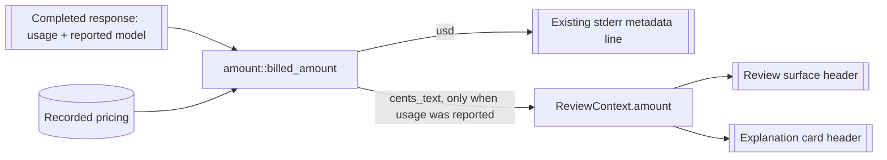

# Design: observe-request-cost

## Overview

The surface that a request produced shows the Amount billed for that request,
at the Model label. The request's Amount is already computed inline on two
paths; this change extracts one computation, teaches it to distinguish "no
usage report" from "reported zero", and presents its result in the review
surface and the explanation card.

## Architecture impact

| Module | Change |
|---|---|
| `src/amount.rs` (new) | The Amount as a domain value: `billed_amount(usage, price) -> Option<BilledAmount>`, `BilledAmount { usd, usage_reported }`, `cents_text()` |
| `src/lib.rs` | Export the new module |
| `src/review/panel.rs` | `ReviewContext` gains `amount: Option<String>` (the cents text) |
| `src/review/card.rs` | `header_right` becomes budget-aware in both views: it reserves the Amount's width, ellipsizes the Model label first, and falls back to today's behaviour when the Amount cannot fit |
| `src/main.rs` | The direct path and the review path call `amount::billed_amount` instead of computing inline; the review path and the explanation path fill `ReviewContext.amount` |
| `src/output/render.rs` | Unchanged: `print_metadata` still prints the same four-decimal dollar value for the same input |



## Data model

```rust
/// The money one completed request was billed, in USD.
pub struct BilledAmount {
    usd: f64,
    /// Whether the response carried a usage report at all.
    usage_reported: bool,
}

/// `None` when no recorded price matches the reported model; otherwise the
/// amount, with `usage_reported` recording whether a report existed.
pub fn billed_amount(
    usage: Option<&TokenUsage>,
    price: Option<&ModelPricing>,
) -> Option<BilledAmount>;
```

- `usd()` keeps the existing stderr output byte-identical: a price entry with
  no usage report still yields `0.0` and still prints `$0.0000`.
- `reported()` distinguishes the two cases the surface must treat differently.
- `cents_text()` renders for the surface: four decimals of a cent
  (`format!("{:.4}", usd * 100.0)`), trailing zeros trimmed, a genuine zero as
  `0`. Four decimals of a cent is a $1e-6 granularity, so a request the
  provider accounted for cannot be displayed as zero.

## Decisions

- **Decides D1 (seed Q3): the cents display is four decimals, trailing zeros
  trimmed, and a genuinely zero amount renders as `0`.** A billed amount too
  small for four decimals (for example one token at a price below $0.05 per
  million, which is under 0.00005 cents) keeps one more decimal at a time until
  it is visible, so a request the provider accounted for never reads as zero.
  Realized in `BilledAmount::cents_text()` and asserted by the scenarios `The review
  surface shows the billed amount of the request that produced it` (0.0234),
  `A rejected candidate's replacement carries its own billed amount` (0.575),
  `The billed model's amount is shown under the requested model name` (0.35),
  `The explanation card shows the billed amount of its explanation request`
  (0.0192) and `A reported zero usage shows a zero amount` (`0`). The two
  rejected alternatives — two decimals, which would let a billed request read
  `0.00`, and four-decimal dollars, which is not the unit the operator asked
  for — are recorded in the seed; the four-decimal-cents form is the only one
  that keeps every billed amount non-zero and the unit the operator asked for.

Design-review decisions applied to this design:

- **Driver split.** The nine in-process scenarios are bound to in-process
  steps; the two `@e2e` scenarios are the only ones that drive a real
  subprocess on a pseudo-terminal. This keeps one end-to-end scenario per
  interaction and lets the other scenarios fail in RED without a terminal.
- **The detailed view carries the Amount too**, with its own label text and
  the same reservation rule; the new scenario `The detailed view keeps the
  billed amount at the model name` covers it.
- **The durable architecture chapters and glossary stay ahead of the code.**
  The change's delta for the review goal amends the rule that still says the
  simple view names only the model; `docs/arc42/04-solution-strategy.md` and
  the review-presentation quality scenario in
  `docs/arc42/10-quality-requirements.md` are reconciled in this change.
- **Four scenarios are recorded regression guards.** `A model with no recorded
  price leaves the model name without an amount`, `A request the provider did
  not account for shows no amount`, `A failed request shows no billed amount`,
  and `The billed amount never reaches command output` are already green before
  this change. `tasks.md` marks them as such and checks them off with the
  nearest scenario that does fail in RED; no RED evidence is fabricated for
  them.
- **The permanent Ctrl-W scenario is strengthened.** `Developer accepts an
  explained candidate from Ctrl-W` becomes a `@givn.modified` scenario in this
  change: the Bash command line must be exactly the accepted candidate and must
  not contain a billed amount.

## Header layout

`render_card_lines` passes the right segment's width budget to
`header_right`. Given an Amount:

1. Build the suffix ` · {amount} ¢`.
2. If `budget >= suffix_width + 2` (the `◆ ` marker plus at least one label
   character), render `◆ {ellipsized label} · {amount} ¢`, where the label is
   ellipsized to `budget - suffix_width - 2`.
3. Otherwise fall back to today's rendering: the label ellipsized to the whole
   budget, no amount.

The same rule applies to both views with their own label text — the Model
short name in the simple view, `tier {n} · {provider}/{model}` in the detailed
view. The detailed label is longer, so at narrow widths the detailed view
reaches the fallback sooner than the simple view; that is the defined
behaviour, not a defect.

Consequences: at 40 columns with `deepseek-v4-flash-latest` priced, the simple
header reads `◆ deepsee… · 0.0234 ¢`; the amount keeps its width down to a
roughly 12-column suffix budget, below which the existing narrow-terminal
behaviour applies and no amount claims to be visible. No Amount is ever
rendered without a label character before it.

## Plumbing the Amount into a surface

| Site | Change |
|---|---|
| `run_review_path` (`src/main.rs:1051`) | Fill `ReviewContext.amount` from the response that produced the candidate, before `ReviewPanelState::new` |
| `ReviewPanelState::apply_regeneration` (`src/review/panel.rs:217`) | Take the regenerated request's Amount and store it in the context, so a successful regeneration replaces the previous value instead of leaving it behind |
| `apply_regeneration_failure` (`src/review/panel.rs:206`) | Leave the state untouched, so the preserved candidate keeps its own request's Amount |
| `run_explanation_card` (`src/main.rs:726`) | Take the Amount as a parameter; its only call site (`src/main.rs:1018`) computes it from the explanation response |
| explanation outcome branches (`src/main.rs:982`, `:985`) | Both the usable and the unusable response carry usage, so both fill the Amount; the failed-request branch (`:1001`) has no response and fills nothing |

## Step definitions and runner

- Unit/integration steps: `tests/steps/observe_request_cost_steps.rs`
  (registered from `tests/steps/mod.rs`), one file for this capability. The
  nine in-process scenarios bind there; they reuse the existing in-process
  review harness steps (`Given an installed Bash shortcut and a provider
  candidate …`, `When I invoke Ctrl-W with current input …`, `When I switch to
  the detailed view`, `When I press the accept shortcut`) and add the Amount
  steps: the recorded price, the reported usage, and the amount assertions.
  They must not use the pseudo-terminal-bound step texts, which belong to the
  end-to-end drivers.
- E2E steps: `tests/steps/observe_request_cost_e2e_steps.rs`, using the
  existing PTY harness (`portable-pty`) and the existing mock provider.
- Runner: `verify.command` is `./run-tests.sh` and `verify.e2e_command` is
  `./run-tests.sh --e2e` (`givn/commands.yaml`). Both execute the `.feature`
  files: the harness collects `givn/specs/**` and every
  `givn/changes/*/specs/**` (`tests/features_runner.rs:171`, `:176`).
- Single-scenario run: `./run-tests.sh --name "<scenario title>"`, and
  `./run-tests.sh --e2e --name "<scenario title>"` for an E2E scenario.
- Strict mode: `tests/features_runner.rs:210` calls `.fail_on_skipped()` and
  exits non-zero when any scenario is skipped (`:227`). A step with no
  definition fails the scenario. The project's not-implemented mechanism is
  the `@wip` tag: `run-tests.sh` selects `not @wip and not @e2e` (or
  `@e2e and not @wip`), so a scenario is excluded until its steps exist, and
  the implementer removes `@wip` in the same commit as the steps. Where a stub
  is unavoidable, the Rust pattern is `unimplemented!("<reason>")`, which
  panics and fails the scenario. No scenario may keep `@wip` at review.

## Use-case traceability

| Use-case guarantee / rule | Technical decision | Capability | E2E evidence |
|---|---|---|---|
| Success guarantee: the Amount is visible with the Model label while the terminal is wide enough | `ReviewContext.amount`; budget-aware `header_right` | visible-request-amount | The review surface shows the billed amount of the request that produced it |
| Rule: shown only when usage was reported and a price matches the reported model | `BilledAmount::reported`; `Option<BilledAmount>` keyed on the price entry | visible-request-amount | The review surface shows the billed amount of the request that produced it; A model with no recorded price leaves the model name without an amount |
| Rule: an unaccounted request is never zero; a reported zero is shown | `usage_reported` distinct from `usd` | visible-request-amount | A request the provider did not account for shows no amount; A reported zero usage shows a zero amount |
| Rule: the billed model's Amount under the requested label | Amount keyed on `response.model`; label keyed on `ReviewContext.model` | visible-request-amount | The billed model's amount is shown under the requested model name |
| Rule: transient, replaced on a new request, preserved when the next request fails | `ReviewContext.amount` rebuilt with each candidate | visible-request-amount | A failed regeneration keeps the preserved candidate's billed amount |
| Rule: never command output | The Amount travels only through `ReviewContext`, never the output channel | visible-request-amount | The billed amount never reaches command output |
| Rule: the explanation card carries its request's Amount | `billed_amount` called on the explanation response, filling the card's context | visible-request-amount | The explanation card shows the billed amount of its explanation request |
| Rule: the Amount gates nothing | No review decision reads `ReviewContext.amount` | visible-request-amount | existing `interactive-shell-shortcut` scenarios, unchanged |
| Minimal guarantee: silence, no substitute | `None` renders exactly as today | visible-request-amount | A model with no recorded price leaves the model name without an amount |
| Persona impact: `terminal-developer--interactive` (cost stance) sees the money where the decision happens | Amount at the Model label in both views | visible-request-amount | both `@e2e` scenarios |

Actors in the scenarios stay `Terminal developer`, `Watn`, and `Provider`; the
Persona is the review lens, not an actor.

## Interaction Coverage Matrix

| Inventory entry | @e2e scenario title | Real interface | Driving mechanism |
|---|---|---|---|
| ask interactively and read the billed amount in the review surface | The review surface shows the billed amount of the request that produced it | CLI / terminal | Real `watn` subprocess on a `portable-pty` terminal: type the question, wait for the card, read the rendered rows |
| explain an existing command and read the explanation request's billed amount | The explanation card shows the billed amount of its explanation request | CLI / terminal | Real `watn explain` subprocess on a `portable-pty` terminal: pass the command as one argument, read the rendered rows, press Enter |

## Visual Design Contract

- Interface: terminal
- Terminal sizes: the harness default and 40 columns (the narrow case)
- Design system: `docs/design/design-system.md` (unchanged by this change)

- **Design tokens**: none change. The Amount uses the existing dim label ink
  used by the header's right segment today.
- **Component primitives**: the card header. States: with Amount, without
  Amount, Amount too narrow to fit, color-incapable terminal (the existing
  `no-color` behaviour is untouched).
- **Accessibility**: the Amount is plain text, readable without color;
  no new key binding and no new focus state is introduced; the card's text
  baseline (no internal identifiers, one row per value) is unchanged.
- **Screens covered**: the review surface header in the simple and detailed
  views, and the explanation card header. The two `@e2e` scenarios drive the
  simple view at the harness default width through the real binary; the
  detailed view and the 40-column width are covered by in-process scenarios and
  therefore carry no end-to-end transcript.
- **Rendered reference**: the header at 100 columns
  `◆ deepseek-v4-flash-latest · 0.0234 ¢` and at 40 columns
  `◆ deepsee… · 0.0234 ¢`.
- **Capture mechanism and evidence path**: each `@e2e` scenario commits a
  captured transcript under
  `givn/changes/observe-request-cost/evidence/visual/<scenario-slug>/transcript.txt`.
  Intermediate captures, if any, stay under `reports/visual/`.
- **Motion**: none added; the surface's existing transient behaviour is
  unchanged.

## E2E smoke test infrastructure

- **E2E runner command**: `./run-tests.sh --e2e`, which selects
  `@e2e and not @wip` through `verify.e2e_command`.
- **E2E step definition location**: `tests/steps/observe_request_cost_e2e_steps.rs`.
- **Local test infrastructure**: no containers and no network. The provider is
  the existing in-process `httpmock` loopback server; the terminal is an
  existing `portable-pty` session; the built binaries come from
  `run-tests.sh`, which builds both the default and the `test-support`
  debug binaries.
- **E2E framework choice and justification**: cucumber-rs with the existing
  PTY harness — the real interface is a terminal program, and the harness
  drives the actual binary.
- **E2E strict-mode proof**: the same `.fail_on_skipped()` builder and
  skipped-count exit as the unit run (`tests/features_runner.rs:210`, `:227`);
  the setup task proves it by adding a deliberately undefined step to a
  scratch scenario and observing a non-zero exit.

## Local runnability and digital twins

- **Local run command**: `./run-tests.sh` (regular) and `./run-tests.sh --e2e`
  (smoke) run the whole system locally with no external service.
- **Isolated network**: none needed; every provider interaction is served by
  the loopback mock.
- **Digital twins**: the provider endpoint is the only third-party dependency,
  and its twin already exists — the `httpmock` loopback server used by the
  existing scenarios. This change adds no new dependency, so no new twin is
  required.
- **Anticipated interface obstacles**: the Amount must be visible in the
  rendered card, which requires a controlling terminal. The documented fix is
  the existing PTY harness, already used by the review E2E scenarios; the
  narrow-header case drives the same harness with a 40-column PTY size.

## Coverage process boundaries

The coverage addon is enabled (`givn/config.yaml`, `addons.coverage: true`),
so the archive gate uses `./measure-coverage.sh` and `./merge-coverages.sh`.

| Process | Started by | Instrumented artifact | Profile output | Merge step | Non-zero production probe |
|---|---|---|---|---|---|
| Regular runner | `./measure-coverage.sh` | `cargo llvm-cov` over `features_runner` | collision-safe profile in the runner temp dir | `./merge-coverages.sh` | `amount::billed_amount` via the direct path |
| E2E runner | `./measure-coverage.sh` | the `test-support` debug `watn` binary | separate profile path from the regular run | `./merge-coverages.sh` | `review::card::header_right` with an Amount present |

## Version freshness

No version-bearing choice is introduced: no new language, runtime, framework,
library, database, container image, or browser driver. Rust stays on the
repository's pinned toolchain (`rust-toolchain.toml`) and every crate is
already in `Cargo.lock`. The design therefore records no version number at
all.

## Black-Box-First

The two `@e2e` scenarios drive the real binary through the real terminal for
both inventory entries. Unit tests are retained only for cases the E2E cannot
cover cheaply or at all:

- `cents_text()` rounding and trimming at the boundaries (0.0234, 0.575, 0,
  and an amount below the last displayed digit) — the E2E covers one value
  per scenario, and the boundary values are the risk.
- `header_right` at width budgets that no scenario drives: 24 columns,
  exactly-fitting budgets, and the fallback boundary.
- `billed_amount` returning `None` versus `Some(0.0)` for a priced model
  without usage — the E2E asserts the stderr line, not the distinction.

Every retained unit test answers "which case does this cover that the E2E does
not" with one of those three answers.

## arc42 impact

The arc42-docs artifact carries: the `Simple review view` and `Model short
name` glossary amendments this change requires (the review goal's rule is
amended in `specs/use-shell/usecase.md`). `Amount` and `Model label` are
already in `docs/arc42/12-glossary.md`.
