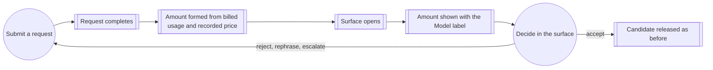

# Use case: observe-request-cost

## Level

!

## Actors

- Terminal developer
- Supporting: Watn
- Supporting: Provider

## Goal

Know the amount the provider billed for the request one just made.

## Trigger

A provider request the terminal developer submitted has completed with a
response.

## Preconditions

- A provider and a usable model are configured.
- The request reached the provider and completed with a response.
- The path is review-eligible: an interactive terminal with the review surface enabled, or an existing command submitted for explanation with a usable model configured.

## Main flow

1. Terminal developer submits a question or hands an existing command to be
   explained; Watn requests one completion from the selected model.
2. Provider reports the billed usage with the completed response; Watn pairs
   that usage with the recorded price of the model the provider reported into
   the request's Amount.
3. Watn opens the review surface for the completed response.
4. Watn shows the Amount with the Model label of the surface.
5. Terminal developer reads the Amount and continues with the surface's
   decisions; the Amount stays visible while the surface is open.
6. Surface closes; the Amount leaves with it.

## Extensions

- 1: The request fails, is interrupted, or ends before a complete response → no Amount appears on any surface the existing failure contract opens, and that contract is unchanged; protects the Minimal guarantee.
- 2: The model the provider reported has no recorded price → no Amount exists; step 4 shows the Model label alone with nothing in the Amount's place; protects "no Amount is invented".
- 2: The completed response carries no usage report → no Amount exists even when a price is recorded; step 4 shows the Model label alone; protects "a request the provider did not account for is never shown as free".
- 2: The completed response cannot be adopted as a structured review response or explanation → the surface still opens under its existing purpose-unavailable contract and the Amount still appears, because the request completed and the provider billed it.
- 3: The surface names no model → no Amount is shown; protects "no Amount appears without a Model label".
- 4: The Model label and the Amount cannot both fit → the Model label is shortened first so the Amount keeps its width; protects "the Amount is visible while it can be". Where the terminal is too narrow for the Amount itself, the existing layout behaviour applies and this case claims nothing.
- 5: The developer rejects the candidate, rephrases the intent, or escalates to another model and the next request succeeds → the surface shows the new request's Amount in place of the previous one; protects the Success guarantee for the candidate on screen.
- 5: The next request fails or is interrupted → the preserved candidate keeps its own request's Amount, which still describes the candidate on screen; protects the Success guarantee for the candidate on screen.
- 5: The developer closes the explanation-only card → the Amount leaves with the card; nothing is released, and the explained command is never generated, edited, accepted, or executed.

## Rules

- The Amount is the value the request's cost computation produces: the usage the provider reported for the completed request, paired with the recorded per-million price of the model the provider reported, expressed in cents. This case owns showing that value in the surface; the computation and its rules stay with the corpus substrate.
- Usage means the response carried a usage report. The surface distinguishes that presence from a reported zero, which the existing stderr line cannot.
- The Amount is never estimated, assumed, or substituted: no fallback price, no per-million rate, no session total, no comparison.
- The Amount is shown only when the request reported usage and a recorded price matches the model the provider reported. Otherwise the Model label stands alone.
- The Amount belongs to the model the provider billed for, and the Model label keeps naming the model the request was sent with. When the two differ, the Amount is still shown: it is the billed truth.
- A request the provider did not account for is never displayed as zero; a request the provider did account for shows what it was billed, including a genuine zero.
- No Amount appears without a Model label.
- The Amount appears with the Model label, in every view of the surface, for as long as the Amount fits.
- The Amount is transient: it exists only while the surface is open.
- The Amount is rendered on the controlling-terminal channel and never becomes command output, in any form.
- The Amount gates nothing: accepting, editing, cancelling, rejecting, regenerating, escalating, and disabling behave exactly as they do without it.
- A surface belonging to a request that never completed displays the existing failure contract and no Amount.

## Examples

- `watn "find the 5 largest files in the commit history"` with a model priced 0.15 input and 0.60 output per million tokens and a response reporting 1200 prompt and 90 completion tokens: the Amount is 0.0234 cents, shown with the model name.
- The same invocation with a model configured by hand and no recorded price: the Model label appears with no Amount and no substitute for it.
- After a rejection, the candidate is regenerated with a model priced 2.50 input and 10.00 output per million tokens and a response reporting 1500 prompt and 200 completion tokens: the surface shows 0.575 cents in place of the previous Amount.
- The request is sent with `openai/gpt-4o` while the provider reports `gpt-4o-2024-08-06`, which carries the recorded price: the Model label keeps the requested name and the Amount comes from the reported model — 1000 prompt and 100 completion tokens is 0.35 cents.
- `watn explain 'git log --oneline | head -5'` with a priced model and a response reporting 800 prompt and 120 completion tokens: the card shows 0.0192 cents with the model name; closing it releases nothing.
- A 40-column terminal: the Model label is shortened and the Amount stays visible.

## Minimal guarantee

When the request reported no usage or no recorded price matches the model the
provider reported, no Amount and no substitute for it is displayed, and the
surface behaves exactly as it does without this case.

## Success guarantee

The terminal developer sees, in the surface that their request produced, the
Amount the provider billed for that request, shown with the Model label, for as
long as the terminal is wide enough to carry it.

## Personas

- terminal-developer--interactive

## Capabilities

- visible-request-amount

## Interactions

| Capability | Consumer action | E2E scenario |
|---|---|---|
| visible-request-amount | ask interactively and read the billed amount in the review surface | The review surface shows the billed amount of the request that produced it |
| visible-request-amount | explain an existing command and read the explanation request's billed amount | The explanation card shows the billed amount of its explanation request |

## Includes

- fragment: corpus-infra

## Extends

- none

## Out of scope

- Choosing model tiers, catalog sources, and reasoning, and capturing a model's price from a catalog (configure-model).
- Configuring the provider endpoint and credential (configure-provider).
- Reviewing, editing, rejecting, or returning a candidate, and replacing the shell buffer (use-shell) — this case displays an Amount inside that surface and changes none of its decisions.
- Predicting or comparing spend for requests not yet made; session totals; budget alarms; spending limits.
- Provider invoices, reconciliation, currencies other than USD, refunds.

## Diagram

