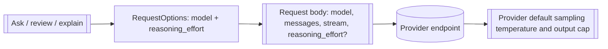

# Design: omit-request-defaults

## Overview

Every provider request currently carries a sampling temperature (forced to
`0.7`) and an output-token limit (forced to `1024`, or `4096` on the review and
explanation paths). Some usable models reject one or both parameters, so the
request fails before any content streams. This change removes both parameters
from the request entirely: a request carries only the model, the messages, the
stream flag, and — when configured — the reasoning effort. The provider's own
defaults apply, and no Watn-invented fallback exists to reject.

## Architecture impact

| Module | Change |
|---|---|
| `src/provider/mod.rs` | `RequestOptions` drops `temperature` and `max_tokens`; it keeps `model` and `reasoning_effort` |
| `src/provider/openai_compat.rs` | The request body is built without `temperature` and `max_tokens`; `reasoning_effort` is inserted only when present, as today |
| `src/main.rs` | The three `RequestOptions` constructions (ask/review `:496`, explanation `:962`, regeneration `:1247`) drop the removed fields |
| `tests/steps/interactive_shell_shortcut_steps.rs` | The two in-process `RequestOptions` literals (`:3173`, `:3374`) drop the removed fields |
| `tests/features_runner.rs` | `WatnWorld` gains `pending_mock_no_generation_defaults_assert` |
| `tests/steps/ask_steps.rs` | The new Given sets the flag; registered from `tests/steps/mod.rs` |
| `tests/steps/mod.rs` | `ensure_test_env` registers blocking provider twins when the flag is set, before the answering mock in both mock-setup branches |



## Data model

After the change:

```rust
pub struct RequestOptions {
    pub model: String,
    pub reasoning_effort: Option<String>,
}
```

Body construction in `OpenAICompatibleProvider::chat_completions_streaming`:

```rust
let mut body = serde_json::json!({
    "model": options.model,
    "messages": /* … */,
    "stream": true,
});

if let Some(effort) = &options.reasoning_effort {
    body["reasoning_effort"] = serde_json::json!(effort);
}
```

The two removed fields are not replaced by a configuration surface: no user
configuration sets them anywhere in the codebase, so keeping them as `Option`
fields would leave three call sites that can reintroduce a rejected parameter.
Removing the fields makes the release contract compile-time enforced.

## Decisions

- **Decides D1: Watn sends neither a sampling temperature nor an output-token
  limit; both are removed from `RequestOptions` and from the request body.**
  Realized in `src/provider/mod.rs`, `src/provider/openai_compat.rs`, and the
  three `src/main.rs` call sites; asserted by the scenario `Ask succeeds
  against a provider that rejects generation parameters`.
- **Decides design-review Q2: removing the two fields breaks the
  published crate's public Rust API; the operator chose removal over keeping
  dormant fields.** The implementing revision is marked breaking
  (`feat(ask)!:` with a `BREAKING CHANGE` footer naming `RequestOptions`), and
  the 0.x minor bump covers it per Cargo convention. Realized in
  `src/provider/mod.rs` and every `RequestOptions` literal.
- **Decides design-review Q1: the rejecting-provider scenario is a
  regular scenario, not a new end-to-end interaction.** The rejecting provider
  is an error variant of the existing ask action; the `ask` capability already
  carries its `@e2e` coverage, and the scenario still drives the real CLI
  subprocess under `verify.command`. Realized in
  `givn/changes/omit-request-defaults/specs/fragments/ask.feature`.
- **D2 (review truncation under provider defaults): carried as out of scope**,
  as recorded in the proposal. The existing unusable-response recovery names a
  truncated review response and keeps the provider-written command reviewable;
  a continuation safeguard would be a separate change if truncation is
  observed. Owner: the operator, revisited on observation.

## Step definitions and runner

- **New step**: the Given `a provider that rejects a request carrying a
  sampling temperature or an output-token limit` in
  `tests/steps/ask_steps.rs` — the `ask` capability's single step file — sets
  `world.pending_mock_no_generation_defaults_assert = true`.
- **Mock wiring**: `ensure_test_env` registers three blocking twins before the
  answering chat mock when the flag is set — bodies containing `"temperature"`,
  `"max_tokens"`, or `"max_completion_tokens"` receive HTTP 400. httpmock
  matches the first registered mock, so a request that still carries a removed
  parameter fails with a non-zero exit; a request that carries none reaches the
  answering mock. The registration is added to both mock-setup branches so a
  later scenario cannot silently lose the block.
- **Runner**: `verify.command` is `./run-tests.sh`; `verify.e2e_command` is
  `./run-tests.sh --e2e` (`givn/commands.yaml`). Both collect
  `givn/specs/**` and every `givn/changes/*/specs/**`
  (`tests/features_runner.rs:171`, `:176`).
- **Single-scenario run**:
  `./run-tests.sh --name "Ask succeeds against a provider that rejects generation parameters"`.
- **Strict mode**: cucumber-rs `.fail_on_skipped()` (`tests/features_runner.rs:210`)
  plus the non-zero exit when any scenario is skipped (`:227`). The
  not-implemented marker is `@wip`, which `run-tests.sh` excludes until the
  steps exist; the implementing revision removes `@wip` in the same commit as
  the step and `givn lint --change omit-request-defaults` must exit 0 before
  review. A stub body would use `unimplemented!()` and fail the scenario.

## Use-case traceability

The `ask` capability lives in the shared corpus-infra fragment; its contract is
the base chat-completion path shared by ask, review, and explanation.

| Contract | Technical decision | Capability | Scenario evidence |
|---|---|---|---|
| A request carries only explicitly required generation parameters | `RequestOptions` drops `temperature`/`max_tokens`; body built without them | ask | Ask succeeds against a provider that rejects generation parameters (regular, real subprocess) |
| Reasoning effort behavior is unchanged | `reasoning_effort` still inserted only when present | ask | existing `reasoning` scenarios, unchanged |
| Model selection, streaming, usage, and Amount behavior are unchanged | Body keys for model, messages, and stream are untouched; usage parsing untouched | ask | existing ask and `observe-request-cost` scenarios, unchanged |
| Persona impact: `terminal-developer--interactive` can use models that accept only provider defaults | the removed parameters never appear on the wire | ask | Ask succeeds against a provider that rejects generation parameters (regular, real subprocess) |

Actors in the scenario stay `Terminal developer`/`Watn`/`Provider`; the Persona
is the review lens, not an actor.

## Interaction Coverage Matrix

The `ask` capability already carries its `@e2e` coverage in the permanent
corpus (ten scenarios, e.g. `Ask with default tier returns a copy-pasteable
command`). This change adds no interaction to the fragment's inventory and no
new `@e2e` scenario: the rejecting provider is an error variant of the existing
ask action, so the canonical policy classifies it as a regular scenario. The
regular scenario still drives the real CLI subprocess through
`run_binary_with_state` against an `httpmock` loopback twin that returns HTTP
400 for any body carrying `temperature`, `max_tokens`, or
`max_completion_tokens`; success proves the body carries none.

## Visual Design Contract

- Interface: terminal
- Terminal sizes: the harness default; the scenario asserts command output, not
  layout
- Design system: `docs/design/design-system.md` (unchanged by this change)

- **Design tokens**: none change; the visible output uses the existing command
  output styling.
- **Component primitives**: none; the scenario reads the existing command
  output channel.
- **Accessibility**: no new key binding, focus state, or rendered surface.
- **Screens covered**: none. The change removes request fields; the only
  visible result is that an existing command succeeds instead of failing. No
  screen's rendering changes.
- **Rendered reference**: none; no screen is introduced or visibly changed, so
  no transcript or screenshot is committed.
- **Capture mechanism and evidence path**: none; this change adds no `@e2e`
  scenario, so the terminal-transcript rule does not apply.
- **Motion**: none added; no transient surface is involved.

## E2E smoke test infrastructure

- **E2E runner command**: `./run-tests.sh --e2e`, which selects
  `@e2e and not @wip` through `verify.e2e_command`.
- **E2E step definition location**: no new `@e2e` scenario is added; the `ask`
  capability's existing `@e2e` steps remain in `tests/steps/ask_steps.rs`.
  The change's new Given is shared glue in the same file.
- **Local test infrastructure**: no containers and no external network. The
  provider is the existing in-process `httpmock` loopback server; the binary is
  the debug build produced by `run-tests.sh`.
- **E2E framework choice and justification**: cucumber-rs with the existing
  real-subprocess harness — the real interface is the CLI, and the harness
  invokes the actual binary.
- **E2E strict-mode proof**: the same `.fail_on_skipped()` builder and
  skipped-count exit as the unit run (`tests/features_runner.rs:210`, `:227`).

## Local runnability and digital twins

- **Local run command**: `./run-tests.sh` (regular) and `./run-tests.sh --e2e`
  (smoke) run the whole system locally with no external service.
- **Isolated network**: none needed; every provider interaction is served by
  the loopback mock.
- **Digital twins**: the provider endpoint is the only third-party dependency,
  and its twin already exists — the `httpmock` loopback server. This change
  adds no new dependency, so no new twin is required.
- **Anticipated interface obstacles**: none. The scenario drives the real
  binary as a subprocess; the mock twin is reachable on loopback and the
  failure mode under test (a 400 from the twin) is deterministic.

## Coverage process boundaries

The coverage addon is enabled (`givn/config.yaml`, `addons.coverage: true`), so
the archive gate uses `./measure-coverage.sh` and `./merge-coverages.sh`.

| Process | Started by | Instrumented artifact | Profile output | Merge step | Non-zero production probe |
|---|---|---|---|---|---|
| Regular runner | `./measure-coverage.sh` | `cargo llvm-cov` over `features_runner` | collision-safe profile in the runner temp dir | `./merge-coverages.sh` | the request-body construction in `openai_compat` via the in-process mock path |
| E2E runner | `./measure-coverage.sh` | the `test-support` debug `watn` binary | separate profile path from the regular run | `./merge-coverages.sh` | `chat_completions_streaming` reached through the real binary |

## Version freshness

No version-bearing choice is introduced: no new language, runtime, framework,
library, database, container image, or browser driver. Rust stays on the
repository's pinned toolchain (`rust-toolchain.toml`) and every crate is
already in `Cargo.lock`. The design therefore records no version number.

## Black-Box-First

The single scenario drives the real binary through the real CLI against a
rejecting provider twin. No in-process duplicate is added: the request body is
built once in `openai_compat`, and the scenario observes its effect end-to-end.
The existing in-process scenarios that construct `RequestOptions` are
compile-forced to the new shape and are not behavior duplicates.

## arc42 impact

`arc42.md` in this change carries the 12-row assessment. The `Provider default`
glossary term was added when the proposal was written; the building-block and
crosscutting chapters describe the request shape and are updated in this
change.