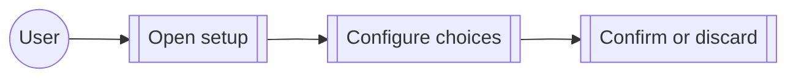

<!-- givn:base-sha256:b9985f498c52aa2ffbf3ce09d234c25233e34436669ffc2a2da7d54f5d8a6450 -->
# Use case: configure-interactive

## Level

!

## Actors

- Watn user

## Goal

Complete Watn's guided setup flows and persist a working configuration.

## Trigger

The user runs setup or quick setup.

## Preconditions

- The terminal supports the interactive setup surface.

## Main flow

1. Open setup.
2. Navigate provider, model, reasoning, and shell choices.
3. Confirm or discard the configuration.

## Extensions

- Cancellation before confirmation leaves no unconfirmed state.

## Rules

- Active inputs remain visible and responsive during delayed discovery.

## Examples

- Quick setup persists answers and installs integrations.

## Minimal guarantee

Cancelled or failed setup does not persist partial configuration.

## Success guarantee

The selected configuration is persisted and usable on the next run.

## Personas

- none

## Capabilities

- unified-setup-wizard
- setup-persistence
- quicksetup
- responsive-setup-model-filtering
- highlight-active-setup-input
- auto-init-config

## Interactions

| Capability | Consumer action | E2E scenario |
|---|---|---|
| unified-setup-wizard | navigate setup pages | Setup wizard guides provider and model configuration page by page |
| unified-setup-wizard | open models command | Models command opens the shared wizard on Small Model |
| unified-setup-wizard | discard setup | Escape asks whether to save or discard current setup |
| setup-persistence | reject failed catalog before confirmation | Interactive model catalog failure before final confirmation persists nothing and sends no request |
| setup-persistence | cancel before credential confirmation | Cancelling before credential confirmation does not save a provider |
| setup-persistence | cancel after credential confirmation | Cancelling after credential confirmation preserves the provider |
| setup-persistence | assign tiers without replacing settings | Assigning tiers does not replace the active provider or catalog settings |
| quicksetup | start quick setup on first run | First run without a configuration starts the quick setup |
| quicksetup | persist quick setup answers | Quick setup stores answers and installs integrations |
| quicksetup | overwrite explicit quick setup | Explicit quick setup overwrites an existing configuration |
| quicksetup | abort first-run quick setup | Aborting quick setup with Ctrl-C on the first run leaves no configuration |
| quicksetup | prefill quick setup with parameters | Quick setup parameters prefill the dialog with an environment credential |
| quicksetup | seed remaining tiers from a small-model parameter | A small-model parameter seeds the remaining tiers |
| quicksetup | override tiers with parameters | Tier parameters override the shared model prefill |
| responsive-setup-model-filtering | filter a delayed catalog | The terminal model filter stays responsive during a delayed search |
| highlight-active-setup-input | inspect initial focus | The initial provider input has a green border |
| highlight-active-setup-input | move focus to API key | The green border follows API key focus |
| highlight-active-setup-input | move focus to model | The green border follows model focus |
| highlight-active-setup-input | move focus to shortcut | The green border follows optional shortcut focus |

## Includes

- usecase: configure-provider
- usecase: configure-model
- fragment: corpus-infra

## Extends

- none

## Out of scope

Shell use after setup is complete.

## Diagram

