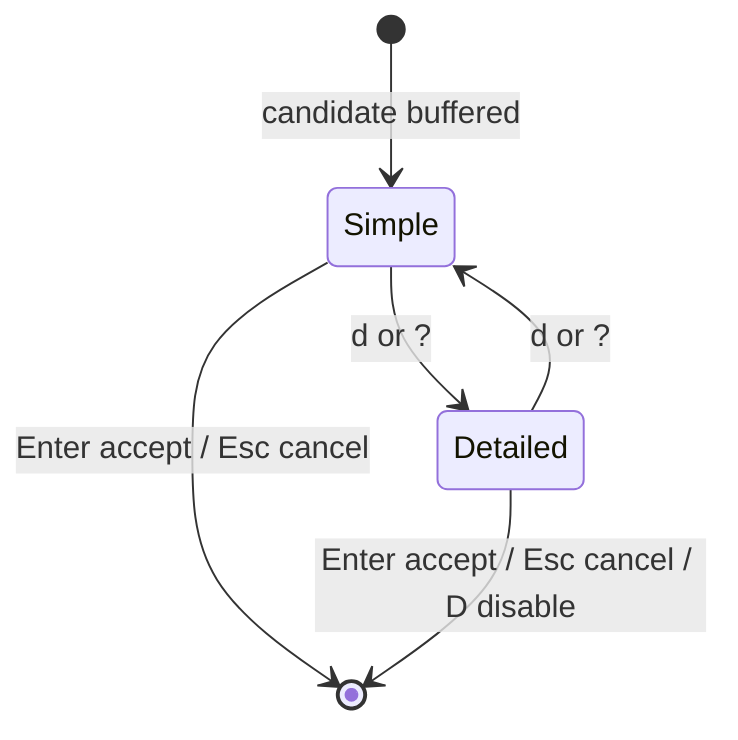

# Design: refine-review-panel-views

## Use-Case Traceability

| Contract (usecase.md) | Design decision | Evidence |
|---|---|---|
| The review surface opens in a simple view that names only the model | `ReviewPanelState.details: bool` starts `false`; the simple frame renders `model_short_name` only | "The simple review view names only the model without provider or tier" |
| The simple view stacks the command-flow stages with their separators | `CommandStage.separator` carries the operator that followed a stage; the stack renderer emits one row group per stage with the separator at the end of the last row | "The simple view stacks the command flow with its separators", "A long stage continues on the next stack rows and keeps its separator" |
| The selected stage's purpose appears below the stack | The purpose rows are rendered after the stack groups in both views, with a `↳` marker | "The selected stage is marked and its purpose follows the arrow keys", "The purpose below the stack is marked and readable" |
| A direct shortcut switches to the detailed view and back | `d`/`?` toggle `ReviewPanelState.details`; the detailed view keeps Intent, flow, position, edit and reject | "The view toggle switches between the simple and detailed reviews", "The card's edit shortcut opens the command editor" |
| Permanently disabling the review releases the current candidate, tells how to re-enable, and ends the invocation | `main.rs` prints the candidate to stdout, the re-enable instruction naming `watn --review-panel` to stderr, then exits 0 | "The panel can permanently disable the review" |
| The review-panel switches without a request only persist the setting | An early `main.rs` branch handles `--review-panel`/`--no-review-panel` when no question resolves | "The review surface switches configure without a request" |
| Review stays small, transient, inline | The stack is windowed to the existing `max_rows` bound with `⋮` edge markers | "A narrow terminal keeps the inline review bounded and readable", "A stage longer than the stack window is truncated with a marker" |
| Review never evaluates generated text | No new evaluation path; the disable release is the existing command-output channel | Existing no-evaluation scenarios |

## View State And Input Mapping



`ReviewPanelState` gains `details: bool`, default `false`. The detailed layout
renders when `details || explain_only || input_mode != Review`, so the
explanation card and every sub-mode (editor, chooser) always use the detailed
layout without changing their decision set. Input mapping in `handle_review_key`:

| Key | Simple | Detailed |
|---|---|---|
| `↑` `↓` `←` `→` | move selected stage | move selected stage |
| `Enter`, `a` | accept | accept |
| `Esc`, `c` | cancel | cancel |
| `d`, `?` | switch to detailed | switch to simple |
| `D` (plain, no Ctrl/Alt) | disable permanently | disable permanently |
| `e` | open command editor and switch to detailed | open command editor |
| `r` | open model chooser and switch to detailed | open model chooser |

`d`/`?` are plain `Char` matches that do not intersect Ctrl/Alt, so Shift is
allowed (`?` arrives as `Char('?')`). The old `Char('d') | Char('D')` disable
match is split into `d`/`?` toggle and `D` disable. `D` is accepted in both
views; only the detailed hints advertise it, which keeps the simple view minimal
while preserving the power decision. `e` and `r` stay available in the simple
view so an experienced developer is not forced to toggle first; opening either
promotes the surface to the detailed layout.

## Stage Separator Model

`CommandStage` gains `separator: Option<String>`. A new
`following_separator(command, end)` scans from `end` past whitespace and records
the longest immediate operator (`&&`, `||`, `|`, `;`). `command_stage` and
`push_stage` set it. The xargs sub-split has a space gap, so its first part has
`separator: None`; the operator stays attached to the stage that really ends a
pipeline segment. Provider stage splits go through `command_stage`, so they get
the same treatment. The scan cannot misread a quoted operator: `provider_stage_split`
already rejects any gap containing anything but whitespace and separators, so a
quote cannot sit between two accepted stages.

Rendering uses the separator only at display time: the stage's last wrapped row
is followed by ` <operator>` colored amber (`Ink::amber`). A stage with
`separator: None` ends without one. The command text is never rewritten.

## Rendering

`src/review/card.rs` grows a stack renderer used by both views:

- `wrap_stage(text, width)`: word-aware wrapping; a single word wider than the
  row is hard-split at a char boundary. The last row reserves
  `separator.len() + 1` columns when a separator exists.
- `stage_rows(state, stage_index, width, marker)`: returns the wrapped rows with
  a `  ▶ ` amber marker on the selected stage and `    ` otherwise; appends the
  separator, and appends the amber `…` for a stage the flow could not decompose
  (own row when the last row is full).
- `stack_rows(state, width, budget)`: builds every stage's row group, then
  selects a contiguous window around the selected stage inside `budget`. Edge
  `⋮` (dim) markers consume one row each and mean "more stages hidden here";
  groups are dropped from the end farthest from the selection first; a selected
  group that alone exceeds the budget is truncated with a trailing unstyled `…`.
  The selected stage is always visible. The amber `…` stays reserved for a stage
  the flow could not decompose, so the two conditions never share a glyph.
- Purpose rows follow the stack in both views: first row `    ↳ <purpose>`,
  continuation rows indented under the text. `Ink::purpose_marker()` is cyan
  (`38;5;81`) and `Ink::purpose()` is light gray (`38;5;252`), neither dim nor
  italic. `purpose_text` and sanitization are unchanged, so a missing purpose
  still renders its purpose status.

Simple layout: frame with `watn · review` and `◆ <model short name>`; blank;
stack; blank; purpose; blank; hints
`⏎ accept · ↑↓ stage · d/? details · esc cancel`; frame bottom.

Detailed layout: today's card with the `Command` single line replaced by the
labeled stack and the purpose below it, and `Stage x/y` reduced to position and
support. Hints become
`⏎ accept · ↑↓ stage · e edit · r reject · c cancel · d/? simple · D disable · esc`.
Intent, flow strip, editor, chooser, error rows, and the full header
(`◆ tier · provider/model`) stay as they are.

`model_short_name(model)`: drop everything through the last `/`, strip a leading
`~`, then drop everything from the first `:`. Empty input falls back to the
configured model string unchanged. Example:
`~anthropic/claude-haiku-latest:nitro` → `claude-haiku-latest`.

The row budget keeps the existing `max_rows` contract: the simple view spends
its budget on stack and purpose; the detailed view keeps the existing priority
pruning for optional rows (chooser, error, editor), with the stack windowed to
the remaining budget. Every rendered line is padded to `layout.width`, so the
`ControllingTerminal::render_lines` move-up/clear cycle stays artifact-free
across view switches and height changes.

`visible_len` switches from codepoint counting to terminal display width via the
`unicode-width` crate (`0.2.2`, already present in `Cargo.lock` through
ratatui). The stack now renders full untrusted stage text on many rows, so a
wide CJK or emoji character that used to sit in one truncated command row would
otherwise break the exact-width padding and reintroduce the stale-row artifact
class. A unit test pins the wide-character pad.

## Disable And Flag-Only Flow

`src/main.rs`:

- `PanelOutcome::DisableReviewPermanently`: clone the current candidate, persist
  `[review] panel = false`; on success call `panel.finish()`,
  `println!("{}", candidate.command)`, print
  `review surface disabled — re-enable with: watn --review-panel` to stderr,
  and exit 0. Persist failure keeps today's behavior (error shown in the panel,
  no candidate released). The branch sits before execution routing, so `D` under
  eligible `-x` releases the candidate to stdout and never executes it.
- Flag-only path, placed after subcommand dispatch and before question
  resolution: when the positional question is empty and `--review-panel` or
  `--no-review-panel` is set, read stdin once; a non-empty stdin buffer becomes
  the question and the invocation continues normally. When nothing is left to
  ask, persist only if a configuration file already exists (so a clean machine
  keeps its first-run onboarding path), print `review surface enabled|disabled`
  to stderr, and exit 0. A persist failure prints the error and exits with the
  error's exit code; a clean machine reports that the default already applies.
  The later persistence block (flag with a question) is unchanged.

`--review-panel` without a request therefore no longer reaches the
`Usage: watn <question>` exit.

## Interfaces And Step Migration

- `src/review/flow.rs`: separator field and scan.
- `src/review/panel.rs`: `details` state, toggle and key promotion, model helper.
- `src/review/card.rs`: stack renderer, view layouts, purpose styling,
  display-width padding.
- `src/main.rs`: disable release and flag-only branch.
- Regular steps: `tests/steps/interactive_shell_shortcut_steps.rs`. Add a
  `model` field to `ReviewState`, make `review_context` use it, render helper
  updates (`review_shows_framed_card` no longer requires `Flow`/`Stage`,
  `review_compact_overview` expects the window marker instead of `1/8`), new
  steps for frame model naming, stack rows, separators, markers, purpose
  placement, view toggle, narrow windowing, and flag-only runs.
- Modified permanent scenarios stay in sync with their delta bodies while the
  change is implemented (the runner executes permanent and delta copies side by
  side; `@givn.removed` only suppresses removed titles).
- E2E steps: `tests/steps/interactive_shell_shortcut_e2e_steps.rs`. New steps
  write `?` and `D` through the existing PTY helpers; the disable scenario runs
  a script that captures the exit code and stdout file; the flag-only scenario
  uses `run_binary_with_state` with empty stdin.
- Delta feature:
  `givn/changes/refine-review-panel-views/specs/use-shell/interactive-shell-shortcut.feature`.
- Interaction inventory update:
  `givn/changes/refine-review-panel-views/specs/use-shell/usecase.md`.
- `Cargo.toml`: add `unicode-width = "0.2"` (lock already holds `0.2.2`).

## Test Runner

- Unit/integration: `./run-tests.sh`
- E2E: `./run-tests.sh --e2e`
- Single scenario:
  `./run-tests.sh --name 'The simple view stacks the command flow with its separators'`
- Strict mode: `tests/features_runner.rs:208` calls `.fail_on_skipped()`;
  not-yet-implemented steps use `unimplemented!()`.
- `@wip` scenarios are excluded from both scopes until their step definitions
  exist; each task removes `@wip` with its RED/GREEN commit.
- Toolchain: `rust-toolchain.toml` pins `1.97.1`. One new direct dependency,
  `unicode-width = "0.2"` (resolved from `Cargo.lock` to `0.2.2`, already
  transitive via ratatui; version verified in `Cargo.lock` during this design).
  Existing libraries stay at their locked versions (`crossterm 0.29.0`,
  `cucumber 0.23`, `portable-pty 0.9`).

## Interaction Coverage Matrix

| Inventory entry | @e2e scenario title | Real interface | Driving mechanism |
|---|---|---|---|
| review and accept a generated candidate from Ctrl-W | Developer accepts an explained candidate from Ctrl-W | Bash Ctrl-W widget | PTY: invoke widget, wait `⏎`, press Enter, read `LINE<<`/`HIST<<` |
| switch to the detailed review view during a Ctrl-W review | Developer switches to the detailed review view during Ctrl-W review | Bash Ctrl-W widget | PTY: invoke widget, wait `⏎`, write `?`, wait `Intent`, press Enter |
| disable the review surface from a candidate review | The panel can permanently disable the review | watn CLI in a PTY | PTY: run watn, wait `⏎`, write `?`, write `D`, read stdout file, stderr PTY output, config, exit code |
| configure the review surface from the command line without a request | The review surface switches configure without a request | watn CLI | Real subprocess: `watn --no-review-panel` then `watn --review-panel` with empty stdin; assert exit 0, empty stdout, persisted config |
| cancel a candidate review from Ctrl-W | Developer cancels a review without changing the shell buffer | Bash Ctrl-W widget | PTY: invoke widget, wait `⏎`, press Esc |
| review and accept a direct interactive request | Developer accepts a candidate from an interactive terminal request | watn CLI in a PTY | PTY: run watn, wait `⏎`, press Enter, read stdout file |
| review and execute an accepted eligible -x candidate | Developer accepts an eligible -x candidate and it executes once | watn CLI in a PTY | PTY: run `watn -x`, wait `⏎`, press Enter |
| reject a candidate and regenerate with another model | Developer rejects a candidate and regenerates with another model | watn CLI in a PTY | PTY: run watn, wait `⏎`, press `?`, press `r`, pick tier |
| validate generated shell configuration | Generated Bash, Zsh, and Fish configurations pass shell syntax checks | Shell executables | Real `bash -n`, `zsh -n`, `fish -n` on the generated files |
| inspect generated Bash widget | The generated Bash widget keeps the request visible and does not evaluate the command | Bash | Real Bash process with the generated widget sourced |
| use Fish Ctrl-W shortcut | Fish replaces the buffer with the generated command after Ctrl-W | Fish | Real Fish process with the generated widget sourced |
| generate Bash completions | Built Bash completion generation emits the current command tree | watn CLI | Real subprocess: `watn completions bash`, assert script output and exit 0 |

## E2E Infrastructure

No new infrastructure: the existing PTY harness (`portable_pty`), mock provider
server, and isolated `XDG_CONFIG_HOME` cover the new driving mechanisms. The
simple view keeps the `⏎` wait label, so existing accept/cancel waits are
unaffected. The disable scenario needs the exit capture added to its shell
script; the flag-only scenario needs no PTY because no review surface opens.

## Failure Outcomes

| Condition | Outcome |
|---|---|
| Purpose unavailable | Status text renders in the purpose row with the same marker |
| Stage list longer than budget | Selected stage plus nearest stages shown; `⋮` edges mark the hidden rest |
| Single stage longer than budget | Selected group truncated with a trailing unstyled `…`; purpose stays visible |
| Separator not found between stages | No separator glyph; rows stay separate |
| Persist on disable fails | Panel stays open with the error; no candidate released |
| `D` under eligible `-x` | Current candidate released to stdout, never executed, exit 0 |
| Flag-only switch on a clean machine | Nothing written, information on stderr, exit 0; onboarding path unchanged |
| Flag-only persist fails | Error on stderr, non-zero exit code |
| Model string empty | Frame falls back to the raw model value |

## ADR Qualification And Routing

### Disable release refinement against ADR-0015

```json
{
  "qualification": "QUALIFIED",
  "alternatives": "PASS",
  "architectural_impact": "PASS",
  "durable_consequence": "PASS",
  "lower_level_artifact": "PASS",
  "existing_adr_check": "PASS",
  "must_be_shared": "SUPPORTING",
  "routing": "AMEND_ADR",
  "canonical_artifact": null,
  "target_adr": "ADR-0015",
  "replacement_adr": null,
  "evidence": {
    "alternatives": [
      "A permanent disable can discard the current Candidate, or release it to the same command-output channel that explicit acceptance uses."
    ],
    "architectural_impact": [
      "The choice fixes the release boundary of the command-output channel for a second terminal decision and keeps review-surface text out of stdout."
    ],
    "durable_consequence": [
      "Changing the release rule later touches the Ctrl-W buffer, direct output, and eligible -x authorization paths."
    ],
    "lower_level_artifact": [
      "ADR-0015 owns the explicit-release gate; this change is a mode-specific refinement, not a parallel stream decision."
    ],
    "existing_adr_check": [
      "ADR-0015 is the active record for the review release gate; no separate ADR covers the disable release."
    ]
  }
}
```

ADR-0015 is amended, not duplicated: the explicit-final-decision gate now
includes a permanent disable that releases the current Candidate to the
command-output channel and instructs how to re-enable the review. Chapter 09
keeps its ADR-0015 register entry; chapter 11 records the added consequence.

### Simple and detailed review views

```json
{
  "qualification": "NOT_QUALIFIED",
  "alternatives": "PASS",
  "architectural_impact": "FAIL",
  "durable_consequence": "FAIL",
  "lower_level_artifact": "PASS",
  "existing_adr_check": "PASS",
  "must_be_shared": "NO",
  "routing": "CANONICAL_ARTIFACT",
  "canonical_artifact": "givn/changes/refine-review-panel-views/design.md",
  "target_adr": null,
  "replacement_adr": null,
  "evidence": {
    "alternatives": [
      "One adaptive card or two explicit views with a toggle are both viable; the two-view contract was confirmed with the developer."
    ],
    "architectural_impact": [],
    "durable_consequence": [],
    "lower_level_artifact": [
      "View layout, stack windowing, separators, and purpose styling are presentation contracts owned by this design and its Gherkin scenarios."
    ],
    "existing_adr_check": [
      "No ADR owns review view presentation; ADR-0015 owns only the stream and release boundary."
    ]
  }
}
```

### Flag-only review switch

```json
{
  "qualification": "NOT_QUALIFIED",
  "alternatives": "PASS",
  "architectural_impact": "FAIL",
  "durable_consequence": "FAIL",
  "lower_level_artifact": "PASS",
  "existing_adr_check": "PASS",
  "must_be_shared": "NO",
  "routing": "CANONICAL_ARTIFACT",
  "canonical_artifact": "givn/changes/refine-review-panel-views/design.md",
  "target_adr": null,
  "replacement_adr": null,
  "evidence": {
    "alternatives": [
      "A flag without a request can keep failing with a usage error, or persist the review preference and exit."
    ],
    "architectural_impact": [],
    "durable_consequence": [],
    "lower_level_artifact": [
      "The early-exit branch is CLI argument handling owned by the CLI building block and covered by the Gherkin scenario."
    ],
    "existing_adr_check": [
      "ADR-0024 owns atomic config replacement; the flag-only path reuses it and introduces no new boundary."
    ]
  }
}
```

## Architecture Impact

- Chapter 03 context-and-scope: the CLI gains flag-only configuration without a
  request; the disable decision releases the candidate to the command-output
  channel.
- Chapter 04 solution-strategy: the review strategy names the two views, the
  model short name, the stage stack, and the disable release.
- Chapter 05 building-block-view: the Review surface and Review card renderer
  own the simple and detailed views and the windowed stage stack.
- Chapter 06 runtime-view: the review narrative, lifecycle diagram, and
  channel-routing alternatives record the toggle, disable release, and
  flag-only exit.
- Chapter 09 architecture-decisions: ADR-0015 is amended for the disable
  release; no new ADR.
- Chapter 10 quality-requirements: QS-067, QS-070, and QS-073 are
  re-expressed for the views and the disable release.
- Chapter 11 risks-and-technical-debt: R-073 wording follows the
  explicit-final-decision gate; R-078 records the disable release risk.
- Chapter 12 glossary: new terms for the two views, the stage stack, the model
  short name, and the view toggle.
- Chapters 01, 02, 07, 08: unchanged.

## Verification Contract

The existing Cucumber runner (`./run-tests.sh` and `./run-tests.sh --e2e`)
remains the executable specification; the delta `.feature` file is the
authoritative test surface and no parallel test file is created.
