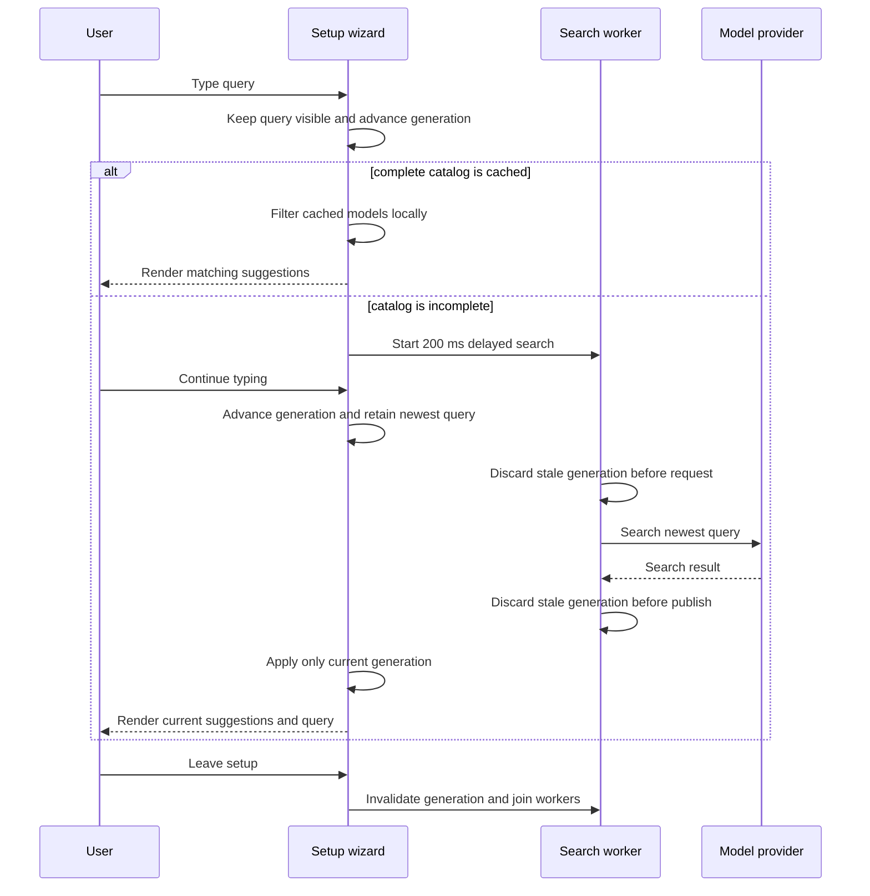

# Design: Responsive Setup Model Filtering

## Technical Approach

The setup wizard already owns the model query, current suggestions, selection,
and generation counter. Extend that state instead of adding a second picker
loop or changing the public configuration model.

The catalog is classified when it is loaded:

- A response shorter than the configured page limit is treated as a complete
  local catalog. Non-empty queries filter the cached entries directly with the
  existing word-matching rule and do not start a provider search.
- A full page means the complete catalog is not known locally. Non-empty
  queries use the provider-backed search path after the existing 200 ms quiet
  interval.
- Empty queries restore the cached suggestions immediately in either mode.

The active query is rendered in the model-page title or adjacent filter region
so the terminal user can see the exact text being edited while results are
pending. The model table remains visible during a search; an empty result is
represented by the existing no-results status rather than by hiding the query
or blocking keyboard input.

Each remote search carries its generation. The worker checks the generation
before the delayed request, before publishing its result, and the event loop
checks it again before applying a result. A worker handle is retained by the
wizard. On wizard shutdown the generation is advanced and all retained handles
are joined, so no search worker survives the setup process. Finished handles
are reaped as new searches are started to prevent unbounded handle growth.

## Architecture Impact

Production changes are limited to the existing setup and model-list modules:

- `src/setup.rs` gains the local/remote catalog mode, visible query rendering,
  retained search handles, local filtering path, and shutdown cleanup.
- `src/models/list.rs` exposes enough catalog completeness information for the
  wizard to distinguish a short complete page from a full page whose remaining
  entries are unknown. Existing model parsing and request authentication remain
  unchanged.
- `src/models/picker.rs` keeps the shared word-matching and provider-search
  behavior; the wizard selects the local or remote path before calling it.

No new dependency, persisted value, public API, provider protocol, or shell
integration behavior is required.

## Search Lifecycle



## Step Definition Locations

All scenarios for this terminal capability use the capability-specific file
`tests/steps/responsive_setup_model_filtering_steps.rs`, registered from
`tests/steps/mod.rs`. The steps drive the existing PTY helpers for the E2E
scenario and use isolated loopback model-provider twins for request-count and
ordering assertions in regular scenarios. No step asserts only on an internal
wizard field.

## Test Commands

The configured regular command in `givn/commands.yaml` is:

```text
./run-tests.sh
```

It builds the default and `test-support` binaries, then runs
`tests/features_runner.rs` over both permanent specs and active change specs
with the `not @wip and not @e2e` tag filter.

The configured E2E command is:

```text
./run-tests.sh --e2e
```

It uses the same strict Gherkin runner with the `@e2e and not @wip` filter.
The runner calls `.fail_on_skipped()` in `tests/features_runner.rs`. New Rust
step bodies use `unimplemented!()` during RED; undefined or pending steps
therefore fail the targeted command rather than passing silently.

The single-scenario command used for every RED/GREEN/REFACTOR run is:

```text
root=$(mktemp -d /tmp/watn-transport.XXXXXX) && trap 'rm -rf "$root"' EXIT && cargo build --locked --bin watn && cp target/debug/watn "$root/default-debug" && cargo build --locked --features test-support --bin watn && cp target/debug/watn "$root/test-support-debug" && WATN_DEFAULT_DEBUG_BIN="$root/default-debug" WATN_TEST_SUPPORT_DEBUG_BIN="$root/test-support-debug" cargo test --locked --test features_runner --features test-support -- --name '<SCENARIO TITLE>'
```

## E2E Infrastructure

This is a CLI terminal UI capability. The real interface is the `watn setup`
process rendered into a pseudo-terminal, not an HTTP endpoint or an internal
Rust value. The E2E step starts the real debug `watn` binary through the
existing `portable-pty` harness, sends endpoint, credential, model, and filter
keystrokes, and asserts the rendered filter text and model suggestions.

The model provider is an in-process `httpmock` digital twin created by the
scenario. No live provider, Docker service, database, or external network is
needed. The configured E2E command builds and cleans up the instrumented child
and the test twin within one run.

The anticipated interface obstacle is incremental Ratatui redraw output. The
steps wait for the latest terminal snapshot, search the reconstructed screen
for the visible filter title and model row, and send the next keystroke only
through the PTY. They do not inspect `SetupWizard` fields or replace the PTY
assertion with a direct provider request.

## Coverage Process Boundaries

| Process | Started by | Instrumented artifact | Profile output | Merge step | Non-zero production probe |
|---|---|---|---|---|---|
| `watn setup` | PTY steps in `features_runner` | `target/llvm-cov-target/debug/watn` | `coverage/profraw/%p-%m.profraw` | `merge-coverages.sh` | `src/setup.rs` model draw, local filter, and worker lifecycle |
| `features_runner` | `measure-coverage.sh` | `cargo llvm-cov test --test features_runner --features test-support` | Same collision-safe profile pattern | Cobertura reports then `merge-coverages.sh` | PTY steps, mock setup, and runner lifecycle |
| Library tests | `measure-coverage.sh` | `cargo llvm-cov test --lib --features test-support` | Same collision-safe profile pattern | Included in each Cobertura report | `src/models/picker.rs` matching and stale-generation paths |
| `httpmock` model twin | `features_runner` | Test process instrumentation | Runner profile | Included in runner report | Deterministic catalog/search responses |

Profiles are cleared before each measurement and flushed when the instrumented
runner and child processes exit. Both non-E2E and E2E reports are merged before
the final coverage summary is accepted.

## Interaction Coverage Matrix

| Inventory entry | @e2e scenario title | Real interface | Driving mechanism |
|---|---|---|---|
| type a model filter in the setup wizard and observe the query and matching results update while the catalog search is delayed | The terminal model filter stays responsive during a delayed search | CLI/terminal UI | `portable-pty` starts `watn setup`, sends real filter keystrokes before and after the delayed provider response, and asserts the rendered query, suggestions, and continued input response |

## Design Decisions

- Keep the 200 ms debounce in the worker boundary so rapid input advances the
  generation immediately while delaying only provider work.
- Prefer cached filtering when completeness is known; remote searching remains
  available for catalogs whose full contents are not loaded locally.
- Retain the existing generation counter as the authority for result ordering;
  do not add a second query-ordering mechanism.
- Join workers at wizard shutdown rather than weakening the E2E assertion to a
  repository-only check.
