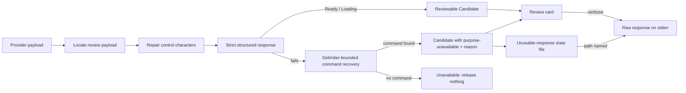

# Design: robust-review-response-recovery

## Overview

Review mode asks the provider for one structured review response. When that
response cannot be read strictly — literal line breaks inside string values,
unescaped quotation marks, or a payload cut off before its closing brace — the
current code stops recognizing it as a structured response and treats the whole
payload as the command. The card then shows raw JSON as the Candidate with the
bare status `purpose-unavailable`, and the Ctrl-W path reports no reason.

This change makes response reading tolerant in three layers, adds a
plain-language reason to the card, captures every unusable response for bug
reports, and extends `-v`/`--verbose` to print the raw provider response after
the review surface closes:

1. **Repair** raw control characters inside JSON string values, then parse
   strictly; a repaired response is treated exactly like a valid one, so
   model-written Stage purposes are adopted under the existing exact-match
   rules.
2. **Recover** the `command` value from a JSON-shaped review payload with a
   delimiter-bounded scan when strict parsing still fails; the recovered
   command is shown with `purpose-unavailable` and a named reason.
3. **Refuse** to show a review-shaped payload as a command. Only text that is
   not review-shaped can still be treated as command-only output.

Nothing about the trust contract changes: Watn never invents a command or a
Stage purpose, and nothing is released without explicit acceptance.

## Visual Design Contract

- **Interface:** terminal
- **Viewports:** not applicable to a terminal surface; the test PTY is 120x40
  and the card stays a bounded inline panel (existing `InlineLayout`).
- **States:** the card's purpose row gains one additional unavailable state
  (`purpose-unavailable · <reason>`); no new screen, frame, or control.
- **Design system:** `docs/design/design-system.md`; no new token or primitive.
  The reason reuses the existing purpose row and `Ink` styling.
- **Screens covered:** the review card (Ctrl-W/direct review and
  explanation-only card) when Stage purposes are unavailable.
- **Rendered reference:** the existing card renderer (`src/review/card.rs`); the
  reference view is the purpose row with `↳ purpose-unavailable · the provider
  response was incomplete`.
- **Capture mechanism and evidence path:** no new `@e2e` scenario is added; the
  existing `@e2e` transcripts remain the terminal evidence. The new regular
  scenarios assert the rendered card and the stderr diagnostics; no visual
  baseline is committed.
- **Motion:** none; static text with cursor movement, so no motion rule or
  `prefers-reduced-motion` handling applies.
- **Terminal baseline:** the reason is an English sentence fragment with no
  internal identifiers; it is rendered through the existing sanitizer so it
  stays on one row and cannot corrupt the panel.

## Use-Case Traceability

Owning use-case ID: `use-shell`
Ideation source: none
Confirmed Persona IDs: `terminal-developer--interactive`

| Use-case contract element | Technical decision | Capability / evidence |
|---|---|---|
| Main flow: show exact stage text and model-written purposes or purpose-unavailable | Repaired responses flow through the unchanged strict validation; recovered responses keep the provider command with unavailable purposes | `interactive-shell-shortcut`: "A review response with literal line breaks in its values is read as a structured response"; `explain-command`: "An explanation response with literal line breaks in its values is read as a structured response" |
| Extension: an unsupported command-flow portion remains visible and reviewable | A recovered command is a normal Candidate with locally derived flow; acceptance/edit/reject stay unchanged | "A review response cut off after a complete command stays reviewable"; "A review response whose command contains unescaped quotation marks is still read" |
| Extension: an unusable explanation response keeps the command reviewable and names the unusable response | The reason is carried on the Candidate and rendered in the card; the stderr diagnostic gains the saved-response path | "The explanation card names why stage purposes are unavailable"; "An unusable explanation response is saved for bug reports" |
| Extension: an unusable review response keeps the provider-written command reviewable, names the reason, and is captured; a review-shaped payload is never shown as the command | Repair, recovery, `unavailable_reason`, the capture helper, and the post-surface stderr diagnostics | "A review response with literal line breaks and tabs in its values is read as a structured response"; "A review response cut off after a complete command stays reviewable"; "A review response whose values contain unescaped quotation marks is still read"; "An unusable provider response is saved for bug reports" |
| Rule: the raw provider response is printable with `-v` | Verbose raw-response printer on stderr after the surface closes | "Verbose review prints the raw provider response after the surface closes"; "Verbose explain prints the raw provider response after the card closes" |
| Extension: provider failure releases no command | A review-shaped payload with no recoverable command yields `Unavailable`; input is preserved | "A review response cut off inside the command releases nothing" |
| Rule: review-surface text renders through the controlling-terminal channel | The reason is part of the card, not stderr, while the card is open; the file path and raw response are printed only after the surface closes | All card scenarios; "Verbose review prints the raw provider response after the surface closes" |
| Rule: purpose loading only for a structured response that supports it | Loading handling is unchanged; recovered/repaired responses never claim loading | "A review response with literal line breaks in its values is read as a structured response" |
| Persona `terminal-developer--interactive` | A failed response stays reviewable and now names why, plus a capture for bug reports | All new scenarios |

Actors remain `Shell user`, `Terminal developer`, and `Shell line editor`;
Personas stay a review lens.

## Technology Decisions

No new dependency, language, or runtime is introduced. Versions are read from
the project lockfile during this design:

| Technology | Version | Resolution |
|---|---|---|
| Rust edition 2021 | toolchain pinned 1.97.1 | `Cargo.toml`, `rust-toolchain.toml` |
| cucumber (cucumber-rs) | 0.23.0 | `Cargo.lock` |
| serde_json | 1.0.151 | `Cargo.lock` |
| crossterm | 0.29.0 | `Cargo.lock` |
| httpmock | 0.8.3 | `Cargo.lock` (dev-dependency) |
| portable-pty | 0.9.0 | `Cargo.lock` (dev-dependency) |

Decisions:

- **Tolerant reading stays in `src/review/response.rs`** next to the strict
  contract. The repair step is a pure string transform; the recovery scan is a
  small delimiter-bounded scanner over the located payload. No JSON5/serde
  fork or new parser dependency is added.
- **Repair normalizes before validation.** `parse_structured_review_response`
  escapes raw C0 control characters inside string values, and
  `candidate_from_provider_response` / `apply_explanation_outcome` compare the
  normalized response command with the normalized candidate command, so a
  line-broken command reaches `Ready` through strict validation, not only
  through the stage-split fallback.
- **The recovery scanner never treats end-of-input as a command delimiter.**
  The command value ends at the next review field (`","stages"`,
  `","purpose_status"`, or `","purpose_request"`) or at a closing quote that is
  followed by the end of the payload. A payload cut off inside the command has
  no closing quote and recovers nothing.
- **A review-shaped payload is recognized by its review fields.**
  `looks_like_review_payload` matches a JSON object (after fence/prose
  location, even when `serde_json::Value` cannot parse it) whose text contains
  the quoted keys `"review_version"`, `"command"`, or `"purpose_status"`.
  Command-only text such as `awk '{print $1}' file.txt` stays a command.
- **Truncation uses the provider's `finish_reason` when available and a payload
  shape check otherwise.** `StreamingResponse` gains `finish_reason:
  Option<String>`; `parse_sse_stream` records the last non-null
  `choices[].finish_reason`. A payload that does not end in `}` after repair is
  treated as incomplete, so the in-process scenarios need no provider. A
  strictly valid response is always usable: `finish_reason=length` only names
  the Purpose reason when validation fails, and it is threaded into the
  initial review parse in `run_review_path` as well as into regeneration.
- **The unusable-response capture is a state file, not a log.** One file,
  overwritten per unusable response, resolved from `$XDG_STATE_HOME` with the
  `~/.local/state` fallback, created with Unix mode `0600` like the config
  file. It is written best-effort; a write failure warns and never changes the
  review outcome.
- **Verbose output goes to stderr after the surface closes.** The card owns the
  controlling terminal while open; writing the raw response earlier would
  corrupt the inline panel. stdout stays the command-output channel. The
  `Explain` subcommand gains its own `-v/--verbose` flag because the root flag
  is not accepted after a subcommand; the root flag continues to work for the
  question path, and `run_explain_command` accepts either.
- **Review and explain requests raise their completion cap to 4096 tokens.**
  The provider currently defaults `max_tokens` to 1024, which a structured
  response with several stages and purposes can exceed, producing exactly the
  truncated payloads this change must also tolerate. This is defence in depth,
  not a replacement for the recovery path.
- **Diagnostics scenarios drive the real binary.** The verbose, capture, and
  warning behaviors are exercised through the compiled `watn` binary in a
  `portable-pty` session (the same harness the explain scenarios use), because
  the in-process review harness has no stderr channel. The PTY merges stdout
  and stderr into one transcript, which is where the assertions read the
  diagnostics; the redirected stdout file proves the command-output channel.

## Purpose reason wording

The card renders `purpose-unavailable` followed by the Purpose reason. The
mapping is fixed so the step assertions cannot drift:

| Condition | Card reason |
|---|---|
| JSON-shaped payload that cannot be read | `the provider response was not valid JSON` |
| Payload cut off before completion | `the provider response was incomplete` |
| Version outside the contract | `the provider response version is not supported` |
| Empty command value (explain path; the review path releases nothing) | `the provider response command is empty` |
| Command mismatch | `the provider response did not match the command` |
| Stage text mismatch | `the response stages did not match the command` |
| Missing stage purpose | `the provider response is missing a stage purpose` |
| No delayed-purpose request | `the provider response has no delayed-purpose request` |

`ReviewResponseError::card_reason()` owns the card wording for both paths;
`explain_reason()` keeps the longer stderr wording for the
`explain response was not usable` diagnostic. Neither may use the anti-term
`candidate`.

On the review path, command-only text (a provider response with no review
shape at all) keeps the bare `purpose-unavailable` label: it is not a
Structured review response, no `ReviewResponseError` describes it, and no
reason is attached. It is still captured as an unusable provider response,
like every other unavailable candidate. On the explain path every unreadable
response, review-shaped or not, is named: command-only text maps to
`the provider response was not valid JSON`.

## Step Definitions

One file per capability; both files already exist and are registered in
`tests/steps/mod.rs`:

| Capability | Step definition file |
|---|---|
| `interactive-shell-shortcut` | `tests/steps/interactive_shell_shortcut_steps.rs` |
| `explain-command` | `tests/steps/explain_command_steps.rs` |

Test runner command (`verify.command` in `givn/commands.yaml`):

```
./run-tests.sh
```

Single-scenario run command (used by every RED/GREEN check in tasks.md):

```
./run-tests.sh --name "<scenario title>"
```

E2E runner command (`verify.e2e_command`):

```
./run-tests.sh --e2e
```

No new `@e2e` scenarios are added, so no new E2E step files are created.

## Step Responsibilities

| Step | Behaviour |
|---|---|
| `the provider returns a structured review response with literal line breaks and tabs inside its values` | Build the raw payload with real `\n` and `\t` bytes inside a purpose value (not JSON escapes) and store it as the structured response |
| `the provider returns a structured review response cut off after the command "df -h"` | Truncate the payload after the command's closing quote and before `"stages"` |
| `the provider returns a structured review response cut off inside the command` | Truncate the payload inside the command value so no closing quote follows |
| `the provider returns a structured review response whose values contain unescaped quotation marks` | Put the unescaped quotes in a stage purpose; the command value stays `df -h` |
| `the provider returns a review response with mismatched stage text` | Existing fixture; change its status from `incomplete` to `ready` so validation reaches the stage-mismatch reason instead of invalid JSON |
| `the review surface should name that ...` | Assert the rendered card contains the Purpose reason sentence (existing `assert_review_rendered_contains` helper) |
| `a configured provider that serves this structured review response:` | Set the structured payload as the mock output for the real-binary direct review scenarios |
| `I run \`watn -v\` for "..." in an eligible terminal` | Start the compiled binary in a PTY with `-v`, the question, and stdout redirected to a file |
| `I run \`watn\` for "..." in an eligible terminal` | Same without `-v` |
| `I cancel the review surface` (direct path) | Press Escape in the PTY, finish the session, and capture the merged transcript |
| `the review invocation should report the raw provider response` | Assert the merged transcript contains the raw provider payload |
| `the review invocation should show the command "..."` | Assert the merged transcript contains the command |
| `the raw provider response should be saved to the unusable-response state file` | Read `$XDG_STATE_HOME/watn/last-unusable-response.txt` and compare it with the served payload |
| `the review invocation should name the unusable-response state file path` | Assert the transcript contains the resolved state-file path |
| `the unusable-response state directory cannot be created` | Point `XDG_STATE_HOME` at a path whose parent is a regular file |
| `the review invocation should warn that the unusable-response state file could not be written` | Assert the transcript contains the warning |
| `an unusable-response state file that already holds a previous response` | Write a sentinel into the state file before the run |
| `the unusable-response state file should still hold the previous response` | Read the file and compare it with the sentinel |
| `a configured provider whose explanation response contains literal line breaks inside its values` | Build the explanation SSE body with a JSON-serialized content string so a real newline survives the SSE frame |
| `a configured provider whose explanation response is cut off after the command` | Serve an unterminated JSON payload whose command echoes the developer's command |
| `the explanation card should show the stage purpose "..."` | Assert the card text contains the purpose |
| `the explanation card should name that ...` | Assert the card text contains the Purpose reason sentence |
| `I run \`watn explain -v\` with that command as one argument in a terminal` | PTY invocation of the real binary with the new subcommand flag |
| `I close the explanation card` | Existing close step reused |
| `the explain invocation should report the raw provider response` | Assert the finished PTY transcript contains the raw payload |
| `the explain invocation should name the unusable-response state file path` | Assert the transcript contains the resolved path |

The explain fixture change (echoing the developer's command with mismatched
stages) keeps the permanent scenario "An explanation that does not cover the
command is not trusted" green while making the stage-mismatch reason reachable.
The explain SSE fixtures must JSON-serialize their content instead of the
standard helper's quote-only escaping, because a literal newline in the
hand-built SSE frame would split the event.

## Internal Primitives

| Primitive | Location | Kind | Purpose |
|---|---|---|---|
| `repair_json_control_characters(payload)` | `src/review/response.rs` | pure string transform | Escapes raw C0 control characters inside JSON string values so serde can read them |
| `recover_command_value(payload)` | `src/review/response.rs` | tolerant scanner | Extracts the `command` string between its opening quote and the next review field or a closing quote followed by end-of-input; never accepts an unterminated value |
| `looks_like_review_payload(raw)` | `src/review/response.rs` | classifier | Distinguishes a review-shaped payload (never shown as a command) from command-only text by the quoted keys `review_version`, `command`, or `purpose_status` |
| `ReviewResponseError::IncompleteResponse` | `src/review/response.rs` | enum variant | Names a provider response that was cut off |
| `ReviewResponseError::card_reason()` | `src/review/response.rs` | wording map | Plain-language reason for the card, distinct from `Display` and `explain_reason()` |
| `ReviewCandidate::unavailable_reason` | `src/review/response.rs` | struct field | Carries why the purposes are unavailable to the card, including the validation error in the fallback path |
| `StreamingResponse::finish_reason` | `src/provider/mod.rs` | struct field | Provider completion signal (`stop`, `length`, ...), recorded from the last non-null SSE `finish_reason` |
| `capture_unusable_response(raw)` | `src/review/diagnostics.rs` (new) | filesystem write | Writes the raw provider response to the state file with mode `0600`; returns the path or an IO error |
| `config::unusable_response_path()` | `src/config/mod.rs` | path resolver | `$XDG_STATE_HOME/watn/last-unusable-response.txt` or `~/.local/state/watn/last-unusable-response.txt` |
| `render::print_raw_response(raw)` | `src/output/render.rs` | stderr diagnostic | Prints the labelled raw provider response when verbose |
| `Explain::verbose` | `src/main.rs` | CLI field | Makes `watn explain -v` parse and reach the verbose printer |
| `explain_command_candidate` return | `src/review/session.rs` | signature change | Also returns the `StreamingResponse` so explain can print the raw response after the card |

The recovery scanner never authors text: the command is the provider's own
substring with JSON escapes decoded, and Stage purposes are only adopted when
the strict validation or the existing `provider_stage_split` accepts them.

## Strict Mode

- Runner: cucumber-rs 0.23.0 with `.fail_on_skipped()` already set in
  `tests/features_runner.rs`, plus the runner's existing non-zero exit when
  `stats.skipped > 0`.
- Not-implemented stub for Rust: every new step body starts as
  `unimplemented!()` and is replaced by a real assertion in its scenario's
  GREEN step. An undefined step fails via `.fail_on_skipped()`; an empty body
  is impossible because `unimplemented!()` panics.
- Proof of strictness: the setup task temporarily adds a scenario with an
  undefined step, runs it with `./run-tests.sh --name "<temp title>"`, confirms
  a non-zero exit, then removes it.

## Local Runnability & Digital Twins

- **Local run command:** `cargo run --release -- --help` (declared
  `run.command`); a manual review run is
  `cargo run --release -- --review-panel "show disk usage"` against the
  configured provider.
- **Isolated network:** no new dependency and no container; tests run
  in-process.
- **Digital twin per external dependency:**

| External dependency | Digital twin | Runs where |
|---|---|---|
| OpenAI-compatible provider endpoint | `httpmock` in-process server | `tests/features_runner.rs` world; the isolated `$XDG_CONFIG_HOME/watn/config.toml` points at it |
| Terminal interaction | `portable-pty` session | Explain scenarios and the existing `@e2e` scenarios |

- **Anticipated interface obstacles and fixes:**
  1. *The card owns the terminal while open.* The reason is rendered inside the
     card; the raw response, the file path, and the save warning are printed to
     stderr only after `panel.finish()`.
  2. *The state file must not touch the developer's real state directory in
     tests.* The PTY scenarios set `XDG_STATE_HOME` to the scenario temp dir
     through `world.env_vars` (the runner already runs with
     `max_concurrent_scenarios(1)`), and the assertions read the file from that
     same directory.
  3. *Unwritable state file.* The scenario points `XDG_STATE_HOME` at a path
     whose parent is a regular file, so directory creation fails
     deterministically and the warning path is exercised.
  4. *The PTY merges stdout and stderr.* The diagnostics scenarios assert on the
     merged transcript (as the explain failure scenarios already do); the
     redirected stdout file proves the command-output channel stays clean.
  5. *SSE fixtures with literal control characters.* The standard mock helper
     escapes only quotes; the new line-break fixtures must JSON-serialize their
     content so a real newline survives the SSE frame.
  6. *A review-shaped payload must not accidentally match command-only text.*
     The classifier requires one of the quoted review keys; a command such as
     `awk '{print $1}' file.txt` stays a command.

## E2E Smoke Test Infrastructure

- **Interface type:** CLI — the compiled `watn` binary is the real interface.
- **E2E runner command:** `./run-tests.sh --e2e` (`verify.e2e_command`).
- **E2E step location:** `tests/steps/interactive_shell_shortcut_e2e_steps.rs`
  and `tests/steps/explain_command_e2e_steps.rs` (unchanged; no new `@e2e`
  scenarios).
- **Local test infrastructure:** in-process `httpmock` provider twin, isolated
  `$XDG_CONFIG_HOME`, `portable-pty` for terminal scenarios. No live service.
- **E2E framework choice and justification:** cucumber-rs 0.23.0 with the
  project's `features_runner`, already used for every capability.
- **E2E strict-mode proof:** same `.fail_on_skipped()` configuration as the
  regular runner.

### Interaction Coverage Matrix

No inventory entry is added or changed: every new behavior is a variant of the
existing actions `invoke Ctrl-W`, `submit an eligible interactive request`, and
`run watn explain`. Per the canonical specs policy, variants add regular
scenarios, not `@e2e` scenarios. Every inventory entry for the two touched
capabilities keeps its existing `@e2e` evidence:

| Inventory entry | @e2e scenario title | Real interface | Driving mechanism |
|---|---|---|---|
| interactive-shell-shortcut / validate generated shell configuration | Generated Bash, Zsh, and Fish configurations pass shell syntax checks | CLI | Real `watn` binary; generated blocks validated by the target shell parser |
| interactive-shell-shortcut / inspect generated Bash widget | The generated Bash widget keeps the request visible and does not evaluate the command | CLI | Real `watn` binary in a `portable-pty` Bash session; read the rendered widget |
| interactive-shell-shortcut / use Fish Ctrl-W shortcut | Fish replaces the buffer with the generated command after Ctrl-W | CLI | Real `watn` binary in a `portable-pty` Fish session; press Ctrl-W and read the buffer |
| interactive-shell-shortcut / review and accept a generated candidate from Ctrl-W | Developer accepts an explained candidate from Ctrl-W | CLI | Real `watn` binary in a `portable-pty` Bash session; press Ctrl-W, accept the card, read the buffer and history |
| interactive-shell-shortcut / switch to the detailed review view during a Ctrl-W review | Developer switches to the detailed review view during Ctrl-W review | CLI | Real `watn` binary in a `portable-pty` session; press the view toggle and read the card |
| interactive-shell-shortcut / disable the review surface from a candidate review | The panel can permanently disable the review | CLI | Real `watn` binary in a `portable-pty` session; press `D` and read the released command and stderr |
| interactive-shell-shortcut / configure the review surface from the command line without a request | The review surface switches configure without a request | CLI | Real `watn` binary with `--review-panel`/`--no-review-panel` and no request; read the persisted configuration |
| interactive-shell-shortcut / cancel a candidate review from Ctrl-W | Developer cancels a review without changing the shell buffer | CLI | Real `watn` binary in a `portable-pty` Bash session; press Escape and read the unchanged buffer |
| interactive-shell-shortcut / review and accept a direct interactive request | Developer accepts a candidate from an interactive terminal request | CLI | Real `watn` binary in a `portable-pty` session; accept the card and read the redirected stdout |
| interactive-shell-shortcut / review and execute an accepted eligible -x candidate | Developer accepts an eligible -x candidate and it executes once | CLI | Real `watn` binary in a `portable-pty` session with `-x`; accept and observe exactly one execution |
| interactive-shell-shortcut / reject a candidate and regenerate with another model | Developer rejects a candidate and regenerates with another model | CLI | Real `watn` binary in a `portable-pty` session; press `r`, choose a tier, read the replacement card |
| explain-command / explain an existing command in the review card | Developer explains an existing command in the review card | CLI | Real `watn` binary in a `portable-pty` session; pass one argv element, read the transcript, close the card |

Normalization note: repair, recovery, reason naming, capture, and verbose raw
output are variants of the same three actions above (input shape, diagnostic
visibility), so they add regular scenarios and no inventory entry or `@e2e`
scenario.

## Architecture Impact



- `src/review/response.rs`: repair, recovery scan, review-shape classifier,
  `IncompleteResponse`, `card_reason()`, `unavailable_reason` plumbing.
- `src/review/diagnostics.rs` (new): unusable-response capture.
- `src/review/session.rs`: pass `finish_reason` into parsing; return the
  `StreamingResponse` from `explain_command_candidate`.
- `src/provider/mod.rs`, `src/provider/openai_compat.rs`: capture
  `finish_reason`.
- `src/output/render.rs`: verbose raw-response printer.
- `src/config/mod.rs`: state-directory resolver.
- `src/main.rs`: review path and explain path write the capture, name the path,
  print the raw response under `-v`, and raise the review/explain completion
  cap.
- No new component, endpoint, or deployment fact.

## Data Model Changes

- `StreamingResponse` gains `finish_reason: Option<String>` (in-memory only).
- `ReviewCandidate` gains `unavailable_reason: Option<ReviewResponseError>`
  (in-memory only).
- `ReviewResponseError` gains `IncompleteResponse`.
- The `Explain` subcommand gains a `verbose: bool` field; the root `verbose`
  field is unchanged.
- No persisted schema changes; the state file is a plain overwritten text file
  created with Unix mode `0600`, not configuration.

## Open Technical Questions

None. The operator decided both open questions during design review:

1. **Review/explain completion cap:** raised to 4096 tokens for review and
   explanation requests only.
2. **State-file privacy:** accepted; one overwritten file under the user's
   state directory, created with Unix mode `0600`, no history, documented path.
