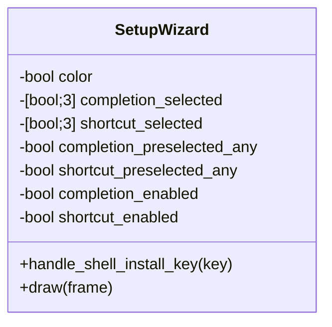

# Design: setup-shell-and-style

## Technical Direction

Watn remains a Rust command-line application on the pinned toolchain and
locked dependency set. The change adds no dependency. The setup wizard stays a
Ratatui/Crossterm surface; the review panel's visual language is reproduced
with Ratatui `Style`s (indexed colors, bold, dim) rather than raw ANSI, because
the review card writes to the controlling terminal while setup renders through
the Ratatui backend.

Two changes are combined:

1. **Shell selection** — the completion and Ctrl-W pages become list-first.
   Preselection is derived at wizard construction from the shell binaries on
   `PATH` plus existing watn-managed blocks.
2. **Shared visual language** — the review panel's palette, symbols, emphasis,
   and key-hint markup are applied to every setup page.

Color capability is one decision shared with the review panel: setup calls
`crate::review::terminal_supports_color(no_color, term, colorterm)` once at
construction. When color is unavailable, every style falls back to the default
style and no indexed color is emitted; the symbols still render.

## Data Model and State

- `ShellInstallFocus` is removed; the shell pages have a single list focus.
- `completion_preselected_any` / `shortcut_preselected_any` record whether the
  page opened with any selection.
- Preselection for both pages, for every entry point:
  `selected[shell] = shells_available_on_path()[shell] || has_managed_block(shell)`.
  `ShellEnvironment::detected_shells()` and its `$SHELL` basename rule are
  removed with the scenarios that described them.
- On advancing a shell page:
  `enabled = preselected_any || selected.iter().any()`.
  This preserves the no-op decline when nothing was detected and nothing is
  selected, keeps removal working when a preselected shell is deselected, and
  enables installation when the user selects a shell manually.
- Focused `watn shell`: `apply_shell_result` is unchanged. Selected shells are
  installed; deselected shells have only their managed block removed; disabled
  performs no target write.
- Coordinated `watn setup`: `apply_result` keeps its existing install-only
  behavior for the selected lists. It does not remove blocks for deselected
  shells; `watn shell` remains the removal path.

## Visual Language

Palette (same roles as `src/review/card.rs::Ink`):

| Role | Style | Use |
|---|---|---|
| border | default foreground + `DIM` | panel borders, separators |
| label | indexed `81` | section/field labels, active tab |
| key | indexed `81` + `BOLD` | shortcut keys in hints |
| dim | attribute `DIM` | hints, secondary text, inactive tabs |
| white | indexed `97` | values, item text |
| green | `Color::Green` | focused input accent, selected marker |
| amber | indexed `214` | warnings, validation, attention |
| purpose | indexed `252` | guidance body |

Inactive borders use the default foreground plus the dim attribute. This keeps
the existing `highlight-active-setup-input` SGR checks valid, which treat any
non-default foreground as a mismatch for an inactive panel.

Symbols:

| Symbol | Meaning |
|---|---|
| `◆` | active page marker and context label |
| `▶` | highlighted list/table row |
| `●` | selected shell choice / current value |
| `○` | unselected shell choice |
| `↳` | guidance tied to the current choice |
| `⚠` | validation or warning |
| `·` | hint/tab separator |
| `⏎`, `↑↓`, `␣`, `esc` | key hints |

Application by surface:

- **Frame**: dim border, `watn` white + ` · setup` dim title.
- **Tabs**: active page `◆ <title>` in cyan bold; inactive pages dim; ` · `
  divider; block title `Setup pages` retained so layout tests stay valid.
- **Header line**: `Page N of M`, page title, and focus label as cyan labels
  with white values and dim separators.
- **Panel block**: dim border; focused panel border green with a bold title.
- **Lists**: `▶ ` highlight symbol, cyan bold highlighted row, no background
  fill.
- **Model table**: cyan bold header, selected row prefixed `▶ ` and bold, no
  background fill.
- **Shell list**: `● name` green when selected, `○ name` dim when not;
  highlighted row keeps the `▶ ` marker.
- **Reasoning/review**: label spans cyan, values white, current selection
  green, incomplete values amber, guidance `↳` dim.
- **Validation**: empty state is a dim `↳` hint; failures are `⚠ <message>` in
  amber.
- **Footer**: block title `Controls` with a dim border; hints as bold cyan keys
  with dim labels joined by ` · `.

Focused borders keep `Color::Green`; the four
`highlight-active-setup-input` scenarios keep their green-border assertions,
and only the shortcut-focus scenario changes to the list-first transition.

## Architecture Impact

- `src/setup.rs`
  - Remove `ShellInstallFocus` and the question branches in key handling,
    drawing, focus labels, and footer text.
  - Add a `SetupInk` helper (styles or defaults according to
    `terminal_supports_color`), used by every draw function and `setup_block`.
  - Restyle all pages listed above.
  - Derive shell preselection from managed blocks and
    `shells_available_on_path()`; compute the per-integration `enabled` at
    advance time.
- `src/shell_shortcut.rs`: remove `ShellEnvironment::detected_shells` if no
  production caller remains after preselection changes (YAGNI).
- `src/models/dialog.rs`, `src/config/*`: unchanged.
- Tests
  - `tests/steps/mod.rs`: `start_pty_command` isolates `HOME` and
    `XDG_CONFIG_HOME` by passing them directly to the spawned command when the
    scenario has not set them (never through `env_vars`, which `Drop` strips
    from the runner process), and removes inherited `NO_COLOR` before applying
    scenario env vars.
  - `tests/steps/streamlined_setup_steps.rs`: PATH-fixture givens, list-first
    shell steps, `●`/`○` assertions, `no shell binaries are on PATH`, style
    thens, and removal of now-dead question steps.
  - `tests/steps/streamlined_setup_e2e_steps.rs`: choose-no-integration steps
    deselect every rendered selected shell before Enter.
  - `tests/steps/ask_steps.rs`: the model-table selected-row assertion moves
    from `> model-12` to the `▶` marker.
  - `tests/steps/setup_wizard_steps.rs`: skip steps deselect all shown choices;
    new style assertions.
  - `tests/steps/highlight_active_setup_input_steps.rs`: scenario 4 drives
    completion list → shortcut list, no `y` question step.
  - `tests/steps/interactive_shell_shortcut_steps.rs`: remove the step
    bindings used only by the three removed `use-shell` scenarios.
- `docs/adr/0018-...md`: amendment records that the opt-in question,
  Enter-as-decline default, and `$SHELL`-basename preselection are superseded
  for interactive setup; installer safety and widget decisions are unchanged.

## Shell Interaction Contract

Key handling for both shell pages (`handle_shell_install_key`):

| Key | Effect |
|---|---|
| Up / Down | move the highlighted shell |
| Space | toggle the highlighted shell |
| Enter / Tab | apply the page (`enabled` rule) and advance |
| Shift-Tab / BackTab | back one page |
| Esc | save/discard prompt |

Preselection examples:

| PATH binaries | Managed blocks | Preselected |
|---|---|---|
| bash, zsh | none | bash, zsh |
| bash, fish, zsh | Bash completion | all three |
| none | Bash completion | Bash |
| none | none | none (advance is a no-op) |

## Use-Case Traceability

### configure-model (`streamlined-setup`)

| Use-case guarantee / rule | Technical decision | Evidence |
|---|---|---|
| Main flow 2: navigate model and shell choices | List-first shell pages with visible toggle markers | `Shell setup independently configures completion and Ctrl-W integrations` (modified) |
| Main flow 3: confirm or discard the configuration | `enabled` computed from preselection/selection; Esc discards | `Shell setup prefills installed integrations and removes only managed blocks when deselected`; `Declining shell setup writes no shell target` |
| Minimal guarantee: cancelled or failed setup does not persist partial state | Esc path unchanged; empty preselection advances with `enabled=false` | `Declining shell setup writes no shell target`; `Shell setup refuses malformed managed markers` |
| Success guarantee: selected configuration is persisted and usable | `apply_shell_result` unchanged for the focused flow | `Detected shells are preselected on the shell pages`; `A managed shell without a binary stays selected` |

### configure-interactive (`unified-setup-wizard`, `highlight-active-setup-input`)

| Use-case guarantee / rule | Technical decision | Evidence |
|---|---|---|
| Main flow 1–2: open setup and navigate choices | Review-style frame, tabs, focus, hints across every page | `Setup surfaces use the review visual language` |
| Rules: active inputs remain visible during discovery | Focus accent, marker language, and warning markup stay visible while loading | `Setup warnings use amber attention markup`; permanent delayed-search scenario |
| Extensions: cancellation leaves no unconfirmed state | Esc prompts unchanged | Permanent `Escape asks whether to save or discard current setup` |
| Focus follows the active shell list | Focused border green on both shell lists | `The green border follows the shell lists` |
| Plain-terminal usability | Style fallback when `terminal_supports_color` is false | `Setup renders readable text without color support` |

## Interaction Coverage Matrix

### `givn/specs/configure-model/usecase.md`

| Inventory entry (capability · action) | @e2e scenario title | Real interface | Driving mechanism |
|---|---|---|---|
| reasoning-policy · persist minimal reasoning | Minimal reasoning is persisted and sent | CLI | subprocess + `httpmock` body assertion |
| streamlined-setup · coordinate all setup choices | Coordinated setup completes provider models reasoning and shell choices | CLI (terminal) | PTY, key-driven wizard |
| streamlined-setup · configure provider from environment | Provider setup configures an OpenAI provider with an environment credential | CLI (terminal) | PTY, key-driven wizard |
| streamlined-setup · configure all model roles | Models setup configures all three roles from an available catalog | CLI (terminal) | PTY, typed filter + Enter |
| streamlined-setup · configure shell integration | Shell setup independently configures completion and Ctrl-W integrations | CLI (terminal) | PTY, list toggle + Enter |
| streamlined-setup · reject incomplete request | Incomplete interactive request opens setup and does not send the original request | CLI (terminal) | PTY + request-count mock |
| reasoning · send thinking reasoning | Thinking tier sends reasoning without printing it | CLI | subprocess + body/print assertion |
| reasoning · print verbose thinking reasoning | Thinking tier with verbose flag prints reasoning to stderr | CLI | subprocess + stderr assertion |
| reasoning · print small-tier reasoning | Verbose flag with small tier prints reasoning if present | CLI | subprocess + stderr assertion |
| reasoning · suppress small-tier reasoning | Small tier without verbose flag does not print reasoning | CLI | subprocess + stderr assertion |
| reasoning · preserve default-tier behavior | Verbose flag with default tier does not alter existing model behavior | CLI | subprocess + body assertion |
| reasoning · inspect verbose help | Help output includes verbose flag | CLI | subprocess + stdout assertion |
| reasoning · combine verbose and execute | Thinking tier with verbose and execute flags | CLI | subprocess + stdout/stderr |
| ratatui-model-picker · configure three levels | Configure model and reasoning for all three levels in the dialog | CLI (terminal) | PTY, typed filter/reasoning |
| ratatui-model-picker · browse model list | Browse the model list with arrow keys and page keys | CLI (terminal) | PTY, arrow/page keys |
| ratatui-model-picker · filter model suggestions | Type a filter and see the matching suggestions | CLI (terminal) | PTY, typed filter |
| ratatui-model-picker · revise previous level | Return to a previous level and change its selection before confirming | CLI (terminal) | PTY, back navigation |
| ratatui-model-picker · apply per-level reasoning | Configured per-level reasoning takes effect on a request | CLI | subprocess + body assertion |
| credential-sources · discover with environment credential | Interactive model discovery uses an OpenRouter environment credential | CLI (terminal) | PTY + env credential |
| credential-sources · prefer saved credential | A literal saved credential is authoritative over environment fallback | CLI (terminal) | PTY + auth-header mock |
| models · discover and assign tiers | Discover models and select tiers interactively | CLI | piped subprocess + catalog mock |
| models · browse without LiteLLM | Model explorer without LiteLLM endpoint configured | CLI | subprocess + guidance assertion |
| catalog-source · use configured LiteLLM catalog | Configured LiteLLM is used for model catalog requests | CLI | subprocess + mock hits |
| catalog-source · preserve chat provider | LiteLLM discovery does not replace the active chat provider | CLI | subprocess + saved config |
| model-autosuggest · find a model outside first page | Find a model outside the initial page while assigning tiers | CLI (terminal) | PTY search + mock |

### `givn/specs/configure-interactive/usecase.md`

| Inventory entry (capability · action) | @e2e scenario title | Real interface | Driving mechanism |
|---|---|---|---|
| unified-setup-wizard · navigate setup pages | Setup wizard guides provider and model configuration page by page | CLI (terminal) | PTY, key-driven wizard |
| unified-setup-wizard · open models command | Models command opens the shared wizard on Small Model | CLI (terminal) | PTY `watn models` |
| unified-setup-wizard · discard setup | Escape asks whether to save or discard current setup | CLI (terminal) | PTY, Escape + discard keys |
| setup-persistence · reject failed catalog before confirmation | Interactive model catalog failure before final confirmation persists nothing and sends no request | CLI (terminal) | PTY + failing `/models` mock |
| setup-persistence · cancel before credential confirmation | Cancelling before credential confirmation does not save a provider | CLI (terminal) | PTY, Escape flow |
| setup-persistence · cancel after credential confirmation | Cancelling after credential confirmation preserves the provider | CLI (terminal) | PTY, Escape flow |
| setup-persistence · assign tiers without replacing settings | Assigning tiers does not replace the active provider or catalog settings | CLI (terminal) | PTY `watn models` |
| quicksetup · start quick setup on first run | First run without a configuration starts the quick setup | CLI | piped subprocess, plain-line answers |
| quicksetup · persist quick setup answers | Quick setup stores answers and installs integrations | CLI | piped subprocess |
| quicksetup · overwrite explicit quick setup | Explicit quick setup overwrites an existing configuration | CLI | subprocess |
| quicksetup · abort first-run quick setup | Aborting quick setup with Ctrl-C on the first run leaves no configuration | CLI | subprocess + signal |
| quicksetup · prefill quick setup with parameters | Quick setup parameters prefill the dialog with an environment credential | CLI | subprocess with flags |
| quicksetup · seed remaining tiers from a small-model parameter | A small-model parameter seeds the remaining tiers | CLI | subprocess with flags |
| quicksetup · override tiers with parameters | Tier parameters override the shared model prefill | CLI | subprocess with flags |
| responsive-setup-model-filtering · filter a delayed catalog | The terminal model filter stays responsive during a delayed search | CLI (terminal) | PTY, typed filter + delayed mock |
| highlight-active-setup-input · inspect initial focus | The initial provider input has a green border | CLI (terminal) | PTY + SGR parse |
| highlight-active-setup-input · move focus to API key | The green border follows API key focus | CLI (terminal) | PTY + SGR parse |
| highlight-active-setup-input · move focus to model | The green border follows model focus | CLI (terminal) | PTY + SGR parse |
| highlight-active-setup-input · move focus to shell pages | The green border follows the shell lists | CLI (terminal) | PTY + SGR parse |

### `givn/specs/use-shell/usecase.md`

The three removed scenarios describe the retired `$SHELL`-basename question
flow, not a consumer action in the inventory. The `interactive-shell-shortcut`
inventory entries (syntax checks, installation, partial failure, buffer
behavior) are untouched and remain mapped to their `@e2e` scenarios.

## Step Definition Locations

| Capability | Step file | New or changed bindings |
|---|---|---|
| streamlined-setup | `tests/steps/streamlined_setup_steps.rs` | PATH-fixture givens, list-first shell steps, `●`/`○` assertions, `no shell binaries are on PATH`, `I accept the completion selection`, `I accept the Ctrl-W selection`, style thens |
| streamlined-setup | `tests/steps/streamlined_setup_e2e_steps.rs` | choose-no-integration steps deselect all rendered selected shells |
| unified-setup-wizard | `tests/steps/setup_wizard_steps.rs` | frame label, `◆` marker, key-hint, palette, warning, and plain-fallback assertions; skip steps deselect shown choices |
| unified-setup-wizard | `tests/steps/ask_steps.rs` | model-table selected-row assertion uses `▶` |
| unified-setup-wizard | `tests/steps/model_picker_layout_steps.rs` | shared PTY start/wait helpers reused unchanged |
| highlight-active-setup-input | `tests/steps/highlight_active_setup_input_steps.rs` | shortcut-focus scenario drives the shell lists; question steps removed |
| interactive-shell-shortcut | `tests/steps/interactive_shell_shortcut_steps.rs` | step bindings used only by the three removed scenarios deleted |

## Test Runner

- Regular: `./run-tests.sh`; e2e: `./run-tests.sh --e2e`; single scenario:
  `./run-tests.sh --name "<scenario title>"`.
- Strict mode: `.fail_on_skipped()` plus non-zero exit on skipped/failed in
  `tests/features_runner.rs`. The setup task re-proves strictness with an
  undefined step.
- `verify.e2e_command` stays `./run-tests.sh --e2e`, a strict subset of
  `./run-tests.sh`.

## E2E Infrastructure

- PTY sessions at 120x40 via `portable_pty`; provider/catalog HTTP via
  in-process `httpmock`; shell targets in the world temp directory.
- `start_pty_command` passes an isolated `HOME` and `XDG_CONFIG_HOME` to the
  child when the scenario has not set them, removes inherited `NO_COLOR`
  before applying scenario env vars, and honors `path_override` for PATH
  fixtures. Scenario-provided `HOME`/`XDG`/PATH always win.
- Strictness identical to the regular runner.

## ADR Qualification

| Candidate | Verdict | Route |
|---|---|---|
| Shell preselection from PATH binaries plus managed blocks and the list-first enabled rule | QUALIFIED refinement of ADR-0018's opt-in/default-decline/preselection clauses | `AMEND_ADR` `docs/adr/0018-safe-shell-shortcut-installation-and-native-widgets.md` |
| Setup adopts the review visual language | NOT_QUALIFIED — presentation convention; no durable boundary | `design.md`; arc42 chapter 8 |
| Shared color-capability fallback | NOT_QUALIFIED — refinement of the existing review color rule; no ADR boundary | `design.md`; arc42 chapter 8 |

Existing-ADR check: ADR-0012 (structured widget composition) and ADR-0026
(plain-line quick setup) reviewed; neither is amended. ADR-0018 is amended with
an explicit note that installer safety and widget decisions are unchanged and
only the interactive preselection/default-decline clauses are superseded.

## Version Freshness

No version-bearing technology is added or changed; the toolchain and crates
stay as pinned.

## Local Runnability and Digital Twins

- Local run: `cargo run -- setup` in a terminal; no external service.
- Tests: `./run-tests.sh` / `./run-tests.sh --e2e` bring up every dependency
  in-process. Provider and catalog twins are `httpmock` servers on loopback;
  shell targets are temp files; no scenario depends on a live service.

## Justification of Technical Choices

1. **Why derive `enabled` at advance time?** It preserves the existing
   no-write decline without reintroducing an opt-in question, while keeping
   deselection-based removal working in the focused shell flow.
2. **Why drop the `$SHELL` basename source?** `PATH` detection covers every
   installed shell, including the one in use; the `$SHELL`-only rule and its
   three scenarios described the removed question flow, so they are retired
   with an ADR-0018 amendment.
3. **Why keep the green focus accent and default-foreground dim borders?**
   The review palette also uses green for current/selected state, and
   default-foreground dim borders preserve the existing inactive-border SGR
   contract instead of rewriting four focus scenarios.
4. **Why Ratatui styles instead of the review card's raw ANSI?** Setup draws
   through the Ratatui backend; constructing `Style` values keeps the widget
   composition and lets the fallback disable indexed color by returning default
   styles.
5. **Why pass isolated HOME/XDG directly to the PTY command?** `WatnWorld::drop`
   strips every `env_vars` entry from the runner process, so putting test-only
   HOME/XDG there would mutate the developer's environment; direct command
   env keeps isolation without that side effect.
