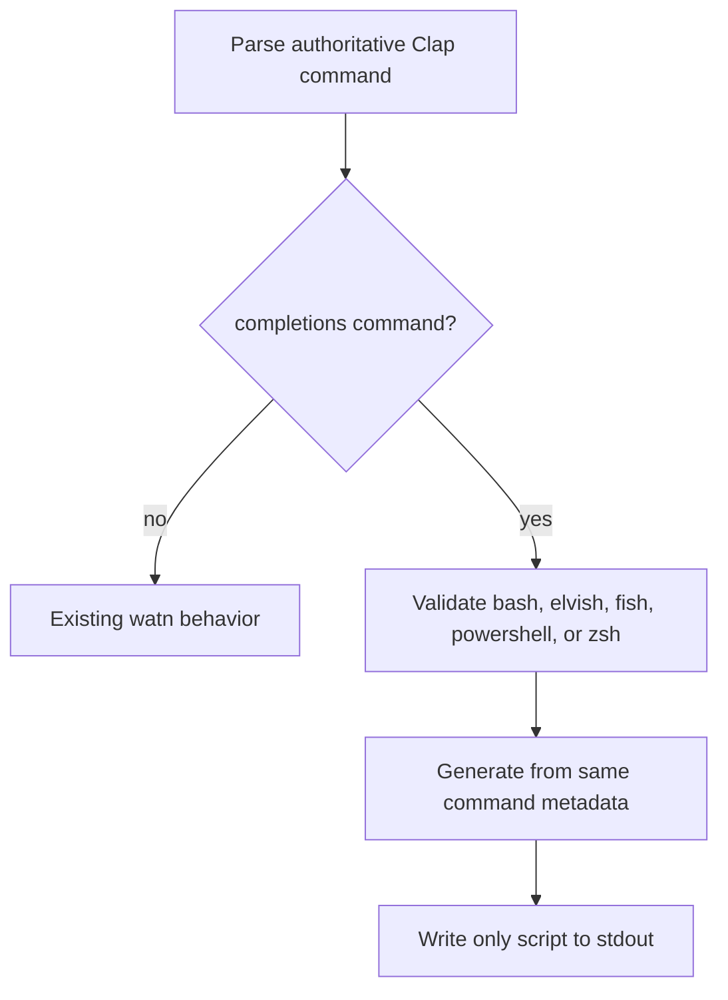

# Design: shell-completions

## Scope And Decisions

- Use the existing Clap command definition as the only command metadata source.
- Add the current `clap_complete` release compatible with the repository's
  existing Clap dependency; resolve the exact package version through Cargo at
  implementation time rather than duplicating a version from memory.
- Add a `completions` subcommand with a local, closed `CompletionShell` selector.
  Its accepted command-line values are the lowercase literals `bash`, `elvish`,
  `fish`, `powershell`, and `zsh`, mapping to the corresponding five variants
  in `clap_complete::Shell`. The CLI must not expose `clap_complete::Shell` as
  its argument type; the local selector owns the stable error wording while
  remaining aligned with the pinned library's complete native shell set.
- Parse unsupported values through a local `CompletionShell` value parser that
  returns the literal argument-error contract
  `unsupported shell '<value>'; choose bash, elvish, fish, powershell, or zsh`. Clap may add its
  normal argument-error framing around this parser message, but the literal
  contract and rejected value remain stable. This keeps the error wording stable
  while the completion renderer remains mapped to the broader library types only
  at generation time.
- Generate directly to stdout. The command returns before configuration loading,
  config-file auto-init, provider resolution, model discovery, or spinner setup.
- Do not create files, alter shell startup files, or maintain shell scripts in
  the repository.

## Architecture Impact

`src/main.rs` will import Clap's `CommandFactory` and derive completion input
from `Cli::command()`, the same metadata used by parsing and help output. The
completion branch executes immediately
after argument parsing and before any configuration, auto-init, provider setup,
model discovery, or spinner setup. `CompletionShell` maps explicitly to the
corresponding Bash, Elvish, Fish, PowerShell, or Zsh renderer from
`clap_complete` only at the renderer boundary and writes the successful script
to stdout. A successful generation has no stderr output and creates no config
file.

The shell selector is a closed set. Adding a new shell requires changing this
selector and the command tree, so generated output cannot silently diverge from
the supported contract. The subcommand help contract includes
`Usage: watn completions <SHELL>`, the values `bash`, `elvish`, `fish`,
`powershell`, and `zsh`, and the
fact that the generated script is written to stdout for the caller to install
or source. The new subcommand reserves the unquoted first token `completions`:
`watn completions ...` is parsed as the completion command, while question text
whose first token is `completions` must be quoted as one argument or passed after
`--` (for example, `watn -- completions find files`).



## Test Infrastructure

### Step definitions

- `tests/steps/shell_completions_steps.rs`: the separate regular-subprocess step
  file for Bash, Elvish, Fish, PowerShell, Zsh, help, the unsupported-shell error, the authoritative
  root tree, stdout-only success, determinism, shell-parser checks, and the
  closed selector. Supported-shell invocations call
  `run_binary_with_state`, which captures `WatnWorld.output`,
  `WatnWorld.stderr_output`, and `WatnWorld.exit_status`.
- The same regular step file owns the no-config fixture and its before/after
  snapshots. It creates a `tempfile::TempDir`, sets `XDG_CONFIG_HOME` to that
  directory, sets `WATN_PROVIDER=openai` and
  `WATN_OPENAI_API_KEY=sentinel-key`, and sets
  `WATN_TEST_ENDPOINT_OVERRIDE` to a local `httpmock` server. The server has a
  provider-request sentinel matching `POST /chat/completions` whose id is
  retained in `WatnWorld.mock_server.1`. The scenario records the absent
  `<temp>/watn/config.toml` and zero sentinel hits before invocation, then
  asserts that the file remains absent, no file is written in the isolated
  config directory, and the sentinel remains at zero after invocation. The
  environment makes an accidental provider request observable without creating
  a provider configuration or contacting the network.
- `tests/steps/shell_completions_e2e_steps.rs`: the separate step file for the
  one real built-binary Bash completion invocation. It uses a unique `When`
  wording, launches the binary from `WATN_TEST_SUPPORT_DEBUG_BIN` with
  `std::process::Command`, captures stdout/stderr, and asserts the generated
  script, determinism, and exit status. Shared regular parser steps perform
  shell acceptance checks. It contains no
  alternate-shell E2E variant.
- `tests/steps/mod.rs`: add `pub mod shell_completions_steps;` and
  `pub mod shell_completions_e2e_steps;`. Reuse the existing `WatnWorld` output,
  temp-directory, and mock-server fields; no new runner-wide state is needed.
- `tests/features_runner.rs`: retain the existing feature collection from
  `givn/specs/` and active change specs, `.fail_on_skipped()`, and
  `.max_concurrent_scenarios(1)`. No separate runner or tag filter is added.

The existing subprocess helpers provide explicit binary paths. The local
provider sentinel is only an observability seam for the no-config scenario; a
successful completion request must not reach it.

The regular shell assertions invoke each supported shell twice and compare
output bytes for deterministic generation. Bash, Elvish, Fish, PowerShell, and
Zsh parser/source checks use the corresponding installed shell executable (or
`pwsh` for PowerShell); if a shell is unavailable, the scenario reports an
explicit environment limitation rather than treating syntax as verified. Each
supported-shell scenario asserts the complete generated root option list and
all root subcommands. Bash also asserts the selector values `bash`, `elvish`,
`fish`, `powershell`, and `zsh`; selector values are only asserted where the
selected shell renderer exposes positional value suggestions.

### Local runnability and E2E

The system is a single CLI and needs no application server, database, or
third-party service. The exact current wrapper commands are:

```text
./run-tests.sh
./run-tests.sh --e2e
```

`./run-tests.sh` runs `not @wip and not @e2e`; `./run-tests.sh --e2e` runs
`@e2e and not @wip`. Both wrappers first build `target/debug/watn`, copy it to
`default-debug`, build the `test-support` debug binary, copy it to
`test-support-debug`, and pass those paths through `WATN_DEFAULT_DEBUG_BIN` and
`WATN_TEST_SUPPORT_DEBUG_BIN` to `cargo test --test features_runner
--features test-support -- --tags '<tags>'`. These wrapper commands remain the
full verification commands; the change-local scenario command below is only a
focused RED/GREEN aid.

The real interface is CLI-only. The E2E scenario runs a real built subprocess
and asserts its Bash script, stdout-only contract, deterministic second output,
shell-parser acceptance, and exit status. `.fail_on_skipped()` in
`tests/features_runner.rs` is the strict-mode configuration; RED step bodies use
`unimplemented!()` and are never left empty.

The anticipated interface obstacle is preventing provider setup during a
completion request. The production branch handles completions before config
loading, and the no-provider regular scenario uses an isolated XDG directory
to prove that behavior.

## Coverage Process Boundaries

| Process | Started by | Instrumented artifact | Profile output | Merge step | Non-zero production probe |
|---|---|---|---|---|---|
| Cucumber runner and child watn binaries | `measure-coverage.sh` | instrumented runner and explicit debug binaries | `coverage/profraw/%p-%m.profraw` | `merge-coverages.sh` per-line union | supported completion generation and unsupported-shell error |

Branch coverage remains explicitly unclaimed on the stable toolchain; line
coverage and the Gherkin runner are measured by the existing coverage wrappers.

## Interaction Coverage Matrix

| Inventory entry | @e2e scenario title | Real interface | Driving mechanism |
|---|---|---|---|
| run `watn completions <shell>` for a supported shell and receive its script | Built Bash completion generation emits the current command tree | CLI | `tests/steps/shell_completions_e2e_steps.rs` invokes the explicit `WATN_TEST_SUPPORT_DEBUG_BIN` path as a real subprocess and asserts stdout, stderr, determinism, selector values, and exit status; the shared regular parser step handles Bash syntax acceptance. |

Elvish, Fish, PowerShell, and Zsh are regular variants of the same
completion-generation action; they are not additional E2E interactions. The
regular step file also covers the authoritative root-tree assertions, Bash
selector values, help output, the unsupported `nushell` literal error contract,
the no-config/no-provider-request snapshots, determinism, shell-parser
acceptance, and the stdout-only success contract. These cases use the existing
subprocess runner and do not add rows to the E2E inventory.

The authoritative root tree asserted by the regular scenarios is:

| Root options | Root subcommands |
|---|---|
| `-1`, `--small` | `setup` |
| `-2`, `--normal` | `models` |
| `-3`, `--thinking` | `provider` |
| `--model` | `completions` |
| `-x`, `--execute` | |
| `-v`, `--verbose` | |
| `--provider` | |
| `--set-small` | |
| `--set-normal` | |
| `--set-thinking` | |
| `--help` | |
| `--version` | |

The `completions` selector value suggestions are exactly `bash`, `elvish`,
`fish`, `powershell`, and `zsh`; `nushell` and every other value are rejected by
the local parser.

## Single-Scenario Command

Use the explicit binary bootstrap and Cucumber name filter for the regular
authoritative-tree scenario:

```text
root=$(mktemp -d /tmp/watn-completions.XXXXXX) && trap 'rm -rf "$root"' EXIT && cargo build --bin watn && cp target/debug/watn "$root/default-debug" && cargo build --features test-support --bin watn && cp target/debug/watn "$root/test-support-debug" && WATN_DEFAULT_DEBUG_BIN="$root/default-debug" WATN_TEST_SUPPORT_DEBUG_BIN="$root/test-support-debug" cargo test --test features_runner --features test-support -- --name "completion exposes the authoritative command tree"
```

The configured wrappers remain the full verification commands and execute both
permanent and active-change feature trees through the Cucumber runner.

## Implementation Order

1. Add the dependency, shell selector, and early completion branch.
2. Implement regular Elvish/Fish/PowerShell/Zsh/unsupported/help/no-config scenarios.
3. Implement the Bash E2E scenario and prove the wrapper count subset.
4. Run full verification, coverage, hygiene checks, review, and archive.
