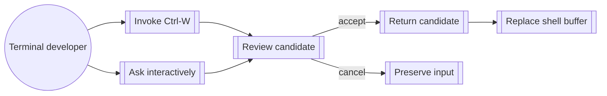

<!-- givn:base-sha256:d3bebbeb57b99ff9c464150b0b8459b7cbe05f035747c47f0206948ebc25ff84 -->
# Use case: use-shell

## Level

!

## Actors

- Shell user
- Terminal developer
- Shell line editor

## Goal

Use Watn as a native shell tool with an interactive shortcut that can explain
and refine generated commands before returning them.

## Trigger

The terminal developer invokes the shortcut or submits an eligible interactive
command request.

## Preconditions

- Watn is installed.
- A provider and usable model are configured for generation.
- The shell shortcut is installed when the user invokes Ctrl-W.

## Main flow

1. Invoke the shell shortcut or submit an eligible interactive command request.
2. Preserve the existing progress line while a candidate is generated.
3. Buffer the complete candidate until `[DONE]` and open the optional small
   transient review surface after the candidate exists.
4. Show the candidate's command flow, exact stage text, and model-written stage
   purposes or purpose-unavailable status.
5. Let the developer inspect the command flow, accept, edit at the insertion point, reject and regenerate with another model, cancel, rephrase, escalate, or interrupt an in-progress operation.
6. Require explicit final acceptance before releasing a candidate.
7. Route the accepted candidate to the existing consumer: replace the shell
   buffer for Ctrl-W, use the existing command-output channel for direct paths,
   or authorize execution for eligible `-x`.

## Extensions

- Disabled review-surface behavior preserves the existing direct replacement, output, and execution-confirmation contracts.
- Enhanced Presentation adapter failure falls back to the portable inline review surface.
- Portable review-surface failure preserves the original input and releases no command.
- Provider or explanation failure preserves review state when a selected candidate exists; initial generation failure releases no command.
- An unsupported command-flow portion remains visible and reviewable.
- Non-TTY and redirected requests retain raw or existing confirmation behavior.
- Active eligible `-x` requires `-x` and review acceptance, without a second prompt; disabled or non-review `-x` retains the existing confirmation.

## Rules

- The review surface is small, transient, and inline; it does not switch to a full-screen alternate-screen interface.
- The existing progress line appears before the review surface.
- The review surface is enabled by default, configurable persistently, overridable per invocation, and may select an enhanced presentation adapter automatically.
- Eligible review output is buffered until final acceptance.
- Review decisions are direct shortcuts; the command flow is active when the card opens and Enter accepts the current candidate.
- Review-surface text is rendered through the controlling-terminal channel; accepted command text remains the only command-output channel content.
- Direct command editing preserves the original intent and refreshes explanation state; it never evaluates the edited candidate.
- Every candidate requires explicit final acceptance.
- Review never evaluates generated or edited text.
- Purpose loading is shown only for a structured response that supports delayed purpose completion; otherwise purpose-unavailable is shown.

## Examples

- Ctrl-W records the original request as a history comment and replaces the buffer with the accepted candidate.
- A complex `git log | xargs git show && printf` candidate shows its stages and purposes in the review surface.
- A cancelled review preserves the original buffer and history.
- Rephrasing replaces the visible active intent and starts a new candidate cycle; the prior intent remains only in current-review history.
- Rejecting a candidate opens a model chooser with the configured tiers, a model field, and provider catalog suggestions; choosing one regenerates the candidate.
- A higher-tier request uses the next configured tier. At the highest tier it opens the existing provider catalog picker for one explicit model selection.
- A rejected candidate is not released and the active intent is unchanged; leaving the model chooser keeps the current candidate.
- An interrupted generation, purpose operation, or model selection preserves the selected candidate and review state.

## Minimal guarantee

When the review surface is enabled and eligible, the shell shortcut never
changes or executes a Candidate without explicit final acceptance. Cancellation
and failure preserve the original input. Disabled review retains the existing
Ctrl-W replacement contract.

## Success guarantee

The developer can understand and refine a generated command in the terminal,
then place exactly the accepted candidate into the shell buffer without
evaluation.

## Personas

- terminal-developer--interactive

## Capabilities

- interactive-shell-shortcut
- shell-completions

## Interactions

| Capability | Consumer action | E2E scenario |
|---|---|---|
| interactive-shell-shortcut | validate generated shell configuration | Generated Bash, Zsh, and Fish configurations pass shell syntax checks |
| interactive-shell-shortcut | inspect generated Bash widget | The generated Bash widget keeps the request visible and does not evaluate the command |
| interactive-shell-shortcut | use Fish Ctrl-W shortcut | Fish replaces the buffer with the generated command after Ctrl-W |
| interactive-shell-shortcut | review and accept a generated candidate from Ctrl-W | Developer accepts an explained candidate from Ctrl-W |
| interactive-shell-shortcut | cancel a candidate review from Ctrl-W | Developer cancels a review without changing the shell buffer |
| interactive-shell-shortcut | review and accept a direct interactive request | Developer accepts a candidate from an interactive terminal request |
| interactive-shell-shortcut | review and execute an accepted eligible -x candidate | Developer accepts an eligible -x candidate and it executes once |
| interactive-shell-shortcut | reject a candidate and regenerate with another model | Developer rejects a candidate and regenerates with another model |
| shell-completions | generate Bash completions | Built Bash completion generation emits the current command tree |

## Includes

- fragment: corpus-infra

## Extends

- none

## Out of scope

- Semantic command-risk validation.
- Non-TTY review surfaces.
- Persistent candidate history across reviews or sessions.
- Provider and model configuration.

## Diagram

