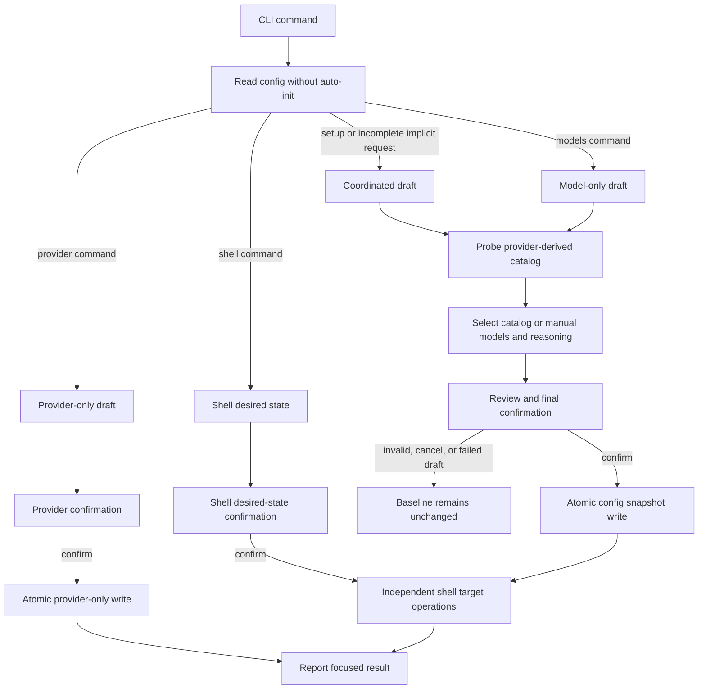

# Design: streamlined-setup-flow

## Technical Direction

Watn remains a Rust command-line application using the versions locked in
`Cargo.lock`. The change adds no runtime dependency. Ratatui and Crossterm
remain the terminal UI stack, the blocking OpenAI-compatible HTTP transport
remains in use, and the existing `cucumber-rs` integration runner remains the
executable specification runner.

The setup implementation is a draft state machine. It reads the existing
configuration into an immutable baseline, copies values into an in-memory
draft, validates and probes against the draft, and does not mutate persistent
configuration until the applicable command reaches its final confirmation.



## Hardening Decisions

The following decisions are binding for this change and supersede the earlier
planning assumptions that conflict with them.

1. Coordinated `watn setup` uses final-confirmation-only persistence. Accepting
   a credential is not a save boundary. A cancelled flow, a catalog failure, or
   a model-validation failure leaves the complete existing configuration
   unchanged. No provider is saved before the final review is confirmed.
2. Model discovery uses the selected provider's catalog endpoint and resolved
   credential. Independent `[litellm]` discovery is removed from this
   capability. A legacy `[litellm]` section remains readable and is preserved
   as unrelated configuration, but it is not consulted, migrated, or silently
   used for setup/model requests.
3. Reasoning is persisted as a string. `off` is the only special value and
   causes `reasoning_effort` to be omitted from a chat request. Any other
   non-empty value, including a custom value or an existing unknown value, is
   preserved and sent verbatim. Whitespace-only custom input is invalid; a
   non-empty value is not trimmed before persistence or transmission.
4. Setup canonicalizes the selected provider name. The normalized standard
   OpenRouter endpoint uses `openrouter`; every other endpoint uses `custom`.
   When setup is run against an existing arbitrary provider name, the selected
   entry migrates to `custom` at the final write. The old selected key is
   removed only as part of that successful write. An existing `custom` entry is
   a deterministic collision: the selected entry wins for endpoint, persisted
   credential source, and provider-local catalog state; its `default_model`
   wins when present, otherwise the colliding `custom.default_model` is kept.
   If neither entry has a default model, the field remains absent. A second run
   against the resulting `custom` entry is idempotent and does not create a
   second provider key.

These decisions do not change chat request routing, tier names, tier flags,
credential reference syntax, shell marker syntax, or the no-replay rule after
implicit first-use setup. They do change the catalog source, the coordinated
configuration write boundary, the accepted reasoning value domain, and the
canonical provider-key migration described below.

The persistence boundary is command-specific. Coordinated `watn setup` writes
configuration exactly once, after its review is confirmed. Focused `watn
provider` and `watn models` write only their owned domain after their own final
confirmation; `watn shell` never writes configuration. Cancellation and draft
failure are non-persistent in every command, while a focused command that
completes its owned flow is expected to save its owned changes.

## Architecture Impact

### CLI entry points

`src/main.rs` retains the request flags and dispatches these focused commands:

- `watn setup` loads a read-only baseline and runs the complete coordinator.
- `watn provider` runs provider identity, completion endpoint, and credential
  questions, then confirms only provider-domain changes. It never probes the
  catalog and never opens model questions.
- `watn models` requires a locally ready provider, derives or reuses that
  provider's catalog endpoint, and runs the three model/reasoning questions. It
  never opens provider questions and never changes provider identity,
  endpoint, credential, or default model.
- `watn shell` asks for completion and Ctrl-W desired states independently. It
  never writes provider configuration and never performs target writes before
  the shell confirmation.

The implicit request path reads readiness locally before resolving a request
model. A provider with a usable endpoint and credential is not sufficient when
one or more required `small`, `normal`, or `thinking` roles is missing. Such an
implicit interactive request opens coordinated setup. A non-interactive
request prints setup guidance, performs no catalog or chat request, and does not
enter the coordinated draft. The coordinated setup entry point reads without
auto-initializing a config file, so first-run cancellation leaves the destination
absent.
Successful implicit setup exits without replaying the original question.

### Setup modules

The setup capability remains split into one setup module and one step-definition
module per capability:

- `src/setup.rs` owns the coordinator, focused entry ranges, draft state,
  validation, catalog status, review, and terminal restoration.
- `src/config/mod.rs` owns read-without-create, candidate snapshot assembly,
  atomic configuration replacement, mode `0600` enforcement, and fixed-name
  provider migration. The candidate writer is shared by coordinated and
  focused config saves, but the caller decides which domain is allowed to
  change.
- `src/models/list.rs` owns provider-derived catalog URL construction,
  `GET /models` probing, response validation, pagination, and model metadata.
- `src/models/picker.rs` retains local filtering, debounced remote search, and
  stale-generation protection for the provider-derived source.
- `src/provider/setup.rs` owns endpoint normalization, credential-source
  validation, fixed provider naming, and provider draft construction.
- `src/shell_completion.rs` and `src/shell_shortcut.rs` apply the two shell
  desired states after confirmation, independently per target.
- `tests/steps/streamlined_setup_steps.rs` contains regular feature steps.
- `tests/steps/streamlined_setup_e2e_steps.rs` contains the five real CLI
  terminal smoke flows. Both are registered by `tests/steps/mod.rs`.

The model picker preserves the existing table, filtering, pagination, metadata,
and stale-search behavior. Catalog availability changes model selection to
manual mode rather than terminating a valid setup draft.

## Command Persistence Boundaries

Every command begins from a baseline snapshot. A draft is not a second config
file and cannot be observed by another Watn process until the command commits.

| Command | Persisted at final confirmation | Preserved and not owned by the command |
|---|---|---|
| `watn setup` | Canonical provider, endpoint, credential source, provider catalog endpoint only when a candidate probe succeeds, all three role/model/reasoning values, then selected shell desired-state operations | Unrelated providers, pricing, legacy `[litellm]` bytes/values, and other config fields |
| `watn provider` | Canonical provider, completion endpoint, credential source, default-provider field, and the existing provider-local catalog endpoint only when the completion endpoint remains the same; this command never probes the catalog | Tier assignments, reasoning, pricing, unrelated providers, legacy `[litellm]`, and the selected provider's existing default model |
| `watn models` | Selected role models/reasoning and a successful provider-derived catalog endpoint replacement | Provider identity, endpoint, credential source, provider default model, pricing, unrelated providers, and legacy `[litellm]` |
| `watn shell` | No configuration fields; selected shell target files are updated after confirmation | The entire configuration file and every unselected shell target |

For `watn provider`, changing the completion endpoint clears a stale
provider-local catalog endpoint in the candidate because the focused command
does not have evidence that the old catalog belongs to the new endpoint. The
next model/setup flow derives and probes the new endpoint. Keeping the
completion endpoint unchanged preserves an existing provider catalog endpoint.

For `watn models`, a catalog probe may be required before the focused command
can present model choices, but the probe is not a persistence boundary. Manual
model values can be committed after an unavailable catalog. A failed new or
edited catalog endpoint is never promoted to configuration.

The focused-command boundary is not a hidden coordinated checkpoint: provider
confirmation saves provider-owned values even though it does not discover
models, and model confirmation saves model-owned values even when those values
were entered in manual mode. Both writes start from a fresh baseline and carry
through every unrelated field that the config representation can preserve.

## Final Confirmation and Atomicity

The coordinated flow keeps the baseline and complete draft separate until the
review is confirmed. The following events do not write configuration or shell
targets:

- accepting or replacing a credential;
- deriving, editing, or probing a catalog endpoint;
- selecting a model or reasoning value;
- moving backward or forward through the draft;
- opening the review;
- cancelling or failing validation.

The review confirmation is the only coordinated configuration write boundary.
Before writing, the coordinator validates every required role, every selected
reasoning value, the provider credential source, the catalog status, and the
shell desired-state request. A catalog failure is not itself fatal when all
three roles are supplied manually; it is fatal to catalog-backed selection and
the review blocks until the user switches to manual values or corrects the
endpoint. A missing role, an invalid value, a pending probe, or a mandatory
reasoning value of `off` blocks confirmation. An existing failed catalog may
remain visible in the review while manual values are confirmed; a new failed
catalog remains unset, and a failed edit with a prior saved base never promotes
the edit.

The candidate configuration is serialized once from the baseline plus the
confirmed draft. The writer creates a same-directory temporary sibling, writes
and flushes the complete TOML, applies mode `0600`, and renames it over the
destination only after serialization and write validation succeed. A failed
serialization, temporary write, permission update, or rename leaves the
previous destination in place and prevents shell operations from starting.
An absent destination is created only by a successful final confirmation. The
same atomic snapshot rule applies to a focused provider or model save at that
command's final confirmation.

This is atomic for one configuration file, not a transaction across shell
files. After a successful config rename, each selected shell target is handled
independently with its own same-directory temporary file and rename. A later
shell failure does not roll back an earlier target or the already committed
configuration; the command reports every target and returns a non-zero result
if any selected operation fails.

## Provider, Catalog, and Migration Model

### Provider configuration

`ProviderConfig` gains an optional `catalog_endpoint` field with a serde default
of `None`. It stores a normalized provider catalog base, not a request path;
the probe path is appended by the catalog URL builder. Existing TOML without
the field remains readable.

The provider draft stores the exact persisted credential representation: a
literal value or `${VARIABLE}`. It never stores a resolved environment secret
in the candidate configuration. Standard completion endpoint defaults remain:

- OpenRouter: `https://openrouter.ai/api/v1`;
- OpenAI: `https://api.openai.com/v1`;
- Custom: no endpoint default; a valid HTTP or HTTPS endpoint is required.

### Provider-derived catalog resolution

The catalog source is resolved only from the selected provider:

1. Use a saved provider `catalog_endpoint` when it belongs to the current
   provider and has not been invalidated by an endpoint/provider change.
2. Otherwise derive the catalog base from the accepted provider completion
   endpoint.
3. Probe the candidate with the draft's resolved credential, without saving it.
4. Promote a missing or edited catalog base to the candidate configuration only
   after a successful response with valid model data.

The initial probe is exactly `GET <catalog-base>/models`. When the provider
credential resolves to `sk-catalog-key`, the request contains exactly
`Authorization: Bearer sk-catalog-key`. No probe sends `POST
/chat/completions` or `POST /v1/chat/completions`.

The source state is explicit:

| State | Meaning | Candidate/persisted result |
|---|---|---|
| Missing | No provider-local catalog base exists | Derive from the provider; if probing fails, leave the field unset and use manual models |
| Available | The current or edited base returned valid model data | Use it and persist the normalized base at final confirmation |
| Existing failed | A saved base could not be reached or parsed | Preserve the saved base, show a warning, and allow manual models or correction |
| Edited failed with prior available | A replacement base failed but an older saved base exists | Keep the older saved base; do not promote the edit; use the older catalog only if it can be revalidated, otherwise manual mode |
| Edited failed without prior available | A new base failed and no saved base exists | Leave the field unset and use manual models |

Empty `data`, a missing/non-array `data` field, a model item without a
non-empty string identifier, or duplicate model identifiers makes the response
unusable. The endpoint state follows the failure rules above; the model pages
switch to manual entry and do not invent or deduplicate model identifiers.
Manual model identifiers are validated as non-empty values and are persisted
verbatim when the final review is confirmed.

Provider change is a revalidation boundary. Changing provider identity,
completion endpoint, or credential invalidates the current catalog status and
triggers a new probe against the new provider-derived base. Existing model
choices remain visible as draft values but cannot be confirmed unless they are
present in the new catalog or are replaced by manual values while catalog mode
is unavailable. The old provider, endpoint, catalog, roles, and credential
remain on disk if the new provider cannot be validated or the user cancels.

The `[litellm]` section is a legacy unrelated configuration section for this
change. It remains readable and is carried through candidate writes unchanged,
but it no longer supplies the endpoint, authentication, pagination, or search
for `watn setup` or `watn models`. No migration copies its endpoint into
`ProviderConfig.catalog_endpoint`; doing so would silently retain an independent
catalog service after the source decision changed.

### Fixed provider names and default models

Setup canonicalizes the selected endpoint to `openrouter` only for the
normalized standard OpenRouter endpoint and to `custom` for every other
endpoint. This applies even when the baseline's selected provider has an
arbitrary name such as `legacy`.

At final migration, the selected arbitrary source entry is moved to `custom`
and its old key is removed. An existing `custom` entry is an intentional
collision and is replaced with the newly confirmed endpoint and credential.
The collision does not erase the destination's `default_model`: if the
destination has one, it remains; if no destination exists, the source
arbitrary entry's `default_model` is carried to `custom`; if neither has one,
the value remains absent. Setup never invents or clears a default model merely
because the provider command does not ask about it. Providers not selected by
the setup draft remain unchanged.

The three tier roles are separate from `ProviderConfig.default_model`. A
provider change revalidates required tier roles against the new catalog, but a
focused provider command preserves the default model verbatim and does not
guess a replacement.

## Model and Reasoning Data

Each role draft contains `small`, `normal`, or `thinking`, a model identifier,
and a reasoning string. Catalog mode restricts model identifiers to valid
entries. Manual mode accepts a non-empty identifier when the catalog is empty,
malformed, or unavailable. All three required roles must be present before
final confirmation; a focused `watn models` command may update only the roles
it owns, but its normal flow requires all three selections before saving.

The reasoning control displays supported catalog values and a custom entry when
metadata is present, and displays `off`, `low`, `minimal`, `medium`, `high`, and
custom when metadata is absent or unusable. Catalog metadata supplies defaults
and indicates whether `off` is allowed; it does not turn the persisted string
into a closed enum. A mandatory model cannot confirm `off`, but any non-empty
custom value is valid, including an existing unknown value. An all-whitespace
custom value is rejected without altering the baseline.

The config keeps the selected string, including explicit `off`. Request
construction maps `off` to no `reasoning_effort` field and maps every other
non-empty string to an exact top-level `reasoning_effort` value. No lowercase,
trimming, enum conversion, or fallback changes a custom value.

## Setup State Machine, Review, and Back Navigation

The coordinated question order is:

1. provider choice;
2. completion service endpoint;
3. credential source and value;
4. provider-derived catalog endpoint and reachability status;
5. small model;
6. small reasoning;
7. normal model;
8. normal reasoning;
9. thinking model;
10. thinking reasoning;
11. shell completion desired state;
12. Ctrl-W shortcut desired state;
13. compact review and final confirmation.

`watn provider` enters at provider choice and ends after its provider
confirmation. `watn models` enters at small model and ends after model
confirmation. `watn shell` enters at shell desired state and ends after its
confirmation. Each focused command uses the same draft validation and
cancellation rules for the domain it owns.

Forward navigation validates the current value. Shift-Tab/back navigation
keeps all draft values and never writes. Returning from review goes to the last
editable page with the draft intact. If provider identity, endpoint, or
credential changes, downstream catalog status and catalog-backed model validity
are marked stale; the new provider must be probed and affected roles must be
revalidated before review can confirm. Returning to a model or reasoning page
does not silently reset an unrelated role. Escape opens the review
save/discard decision; Ctrl-C returns cancellation status 130.

The review contains:

- canonical provider name and completion endpoint;
- catalog endpoint value plus one of Available, Existing failed, or Unset;
- credential source and masked/ reference status, never the resolved secret;
- every role's model identifier and exact reasoning string;
- any retained provider default model and the arbitrary-name-to-`custom`
  migration/collision notice;
- completion and shortcut desired shell sets, including removals of existing
  managed blocks;
- validation warnings that explain why confirmation is blocked.

The confirmation control remains disabled or loops back to the invalid page
when a required role is missing, a catalog-backed model is stale, a credential
or endpoint is invalid, a custom reasoning value is whitespace-only, a
mandatory model is set to `off`, or a catalog probe is still pending. The
review itself is read-only.

## Shell Desired-State Operations

Completion shells and shortcut shells are independent desired sets over Bash,
Fish, and Zsh. The state describes the final desired filesystem state, not only
which installers to run:

- selected with no valid managed block: install one block;
- selected with one valid block: replace that block atomically;
- deselected with one valid managed block: remove exactly that block;
- deselected with no managed block: do nothing;
- any duplicated, unmatched, or reversed marker layout: report an error before
  creating a temporary file and leave the target bytes unchanged.

Declining either optional shell question returns without reading target content,
creating parent directories, creating temporary files, changing shell files,
or changing configuration. If the user opts in, target inspection populates
preselection and each selected/deselected target is then processed
independently. Bytes outside the exact Watn-managed block are preserved.

Shell changes are applied only after a successful coordinated config rename,
or after the focused `watn shell` confirmation. A successful completion install
or removal remains if a later shortcut target fails. The command reports each
target and returns non-zero for any failure; there is no multi-file rollback.

## First-Use Readiness

Readiness is local and side-effect free. A provider is usable only when its
endpoint is valid and its literal credential or exact `${VARIABLE}` reference
resolves to a non-empty value. Saved credential sources are authoritative;
missing saved references do not fall through to another environment variable.
Provider readiness never probes the network and never consults the test
transport override.

An implicit request requires coordinated setup when no provider is ready or
when any required role is missing, even if a provider has a `default_model`.
The interactive path enters the coordinator and does not send the original
question before or after setup. The non-interactive path prints concise
guidance to run `watn setup` or `watn provider`, exits non-zero, does not
initialize Ratatui, does not create a config template, and sends neither a
catalog request nor a chat request. A complete ready configuration bypasses
setup. Explicit `--provider` and `WATN_PROVIDER` selections retain their
existing unknown-provider and missing-credential errors and never trigger
automatic onboarding.

## Test Design

### Feature runner

The verification command is `./run-tests.sh`. It builds the normal and
`test-support` binaries, starts the Cucumber runner, and collects both
`givn/specs/**` and the active change's `specs/**`. Strict mode is enforced by
`Cucumber::fail_on_skipped()` in `tests/features_runner.rs:177-179`; undefined
and pending steps fail the run. No new step body may be empty or a no-op.

The exact single-scenario command is:

```text
cargo test --locked --test features_runner --features test-support -- --name "<scenario title>"
```

The title is passed to the Cucumber runner so one RED/GREEN check can run one
scenario without running unrelated features.

### Step definition locations

Regular steps for this capability live in
`tests/steps/streamlined_setup_steps.rs`. The five terminal smoke scenarios
use separate real-interface steps in
`tests/steps/streamlined_setup_e2e_steps.rs`. Both modules are registered by
`tests/steps/mod.rs`. Generic existing steps may be reused only when their
wording does not create a duplicate global registration.

### E2E runner and infrastructure

The E2E command is `./run-tests.sh --e2e`. It selects `@e2e and not @wip` and
uses the same `Cucumber::fail_on_skipped()` strictness. The E2E step definitions
are separate from regular steps.

This capability has a CLI terminal interface, not a browser UI or API-only
interface. `portable-pty` launches the real Watn binary, sends key sequences,
and asserts visible prompts, review contents, and exit status. The primary
assertion is terminal output; config and mock request observations are
secondary assertions.

`httpmock` loopback twins are the digital twin for the OpenAI-compatible
provider catalog and chat service. The twin records exact method, path, query,
Authorization, response source, and request counts. Each scenario receives a
temporary `XDG_CONFIG_HOME`, HOME-backed shell targets, and isolated mock state.
No live third-party endpoint is contacted. There is no database, queue, or
application server for this CLI capability, so no docker-compose dependency is
required.

The five interaction-inventory entries have exactly one `@e2e` scenario each:

| Inventory entry | `@e2e` scenario title | Real interface | Driving mechanism |
|---|---|---|---|
| invoke `watn setup` and complete the coordinated configuration flow | Coordinated setup completes provider models reasoning and shell choices | CLI terminal | `portable-pty` launches `watn setup`, drives the ordered questions and final review, then reads the visible result |
| invoke `watn provider` and configure a provider independently | Provider setup configures an OpenAI provider with an environment credential | CLI terminal | `portable-pty` launches `watn provider`, selects OpenAI, accepts the endpoint and environment source, and reads the success output |
| invoke `watn models` and configure the three model roles independently | Models setup configures all three roles from an available catalog | CLI terminal | `portable-pty` launches `watn models`, selects each catalog model/reasoning value, and reads the completion output |
| invoke `watn shell` and configure shell integrations independently | Shell setup independently configures completion and Ctrl-W integrations | CLI terminal | `portable-pty` launches `watn shell`, chooses different desired shell sets, and reads the result and isolated target files |
| invoke an interactive `watn "question"` request when setup is incomplete | Incomplete interactive request opens setup and does not send the original request | CLI terminal | `portable-pty` launches the request with a missing role, observes the coordinator, cancels before review confirmation, and checks the chat twin received zero requests |

Regular scenarios cover catalog endpoint variants, malformed data, manual
selection, provider migration, reasoning round trips, review blocking,
back-navigation, atomicity, shell desired-state removal, readiness, focused
command preservation, and exact negative-path transport behavior without
creating additional E2E scenarios for the same five interactions.

### Local runnability

The full local verification command is `./run-tests.sh`. It starts all required
test infrastructure in the command and cleans temporary binaries, config,
mock-server state, PTYs, and shell targets on completion. The test world is
serialized and uses isolated paths. The PTY is retained for the whole scenario
so terminal restoration, visible review content, and final status are observed
through the real CLI boundary.

## Coverage Process Boundaries

| Process | Started by | Instrumented artifact | Profile output | Merge step | Non-zero production probe |
|---|---|---|---|---|---|
| Cucumber feature runner | `./run-tests.sh` or `./measure-coverage.sh` | `features_runner` integration test and test-support Watn binary | collision-safe paths created by the existing coverage scripts | `./merge-coverages.sh` | setup draft, provider-derived catalog probe, atomic config boundary, and shell desired-state path |

The change adds no production process. Coverage scenarios launch the
test-support binary supplied by the runner, and coverage data is flushed before
the runner exits as required by the existing coverage scripts.
