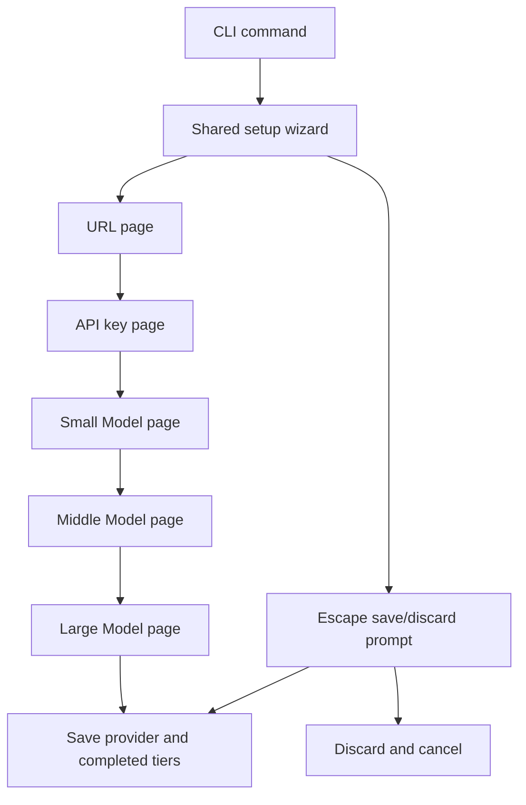

# Design: unified-setup-wizard

## Technology Decisions

| Concern | Decision | Rationale |
|---|---|---|
| Wizard renderer | Add one shared Ratatui/Crossterm setup dialog | Provider credentials and model tiers are one user workflow and must share page state, save behavior, and navigation. |
| Widget composition | Use `Block`, `Tabs`, `Paragraph`, `Table`, `TableState`, and `Scrollbar` | The active page, current prompt, cursor line, model selection, and long-list position must be visible without rendering unrelated pages at once. |
| Ratatui API | Use the repository's locked Ratatui 0.30.2 API, verified in `Cargo.lock` and current 0.30 documentation | `Table::new(rows, widths)`, `Tabs::select`, `Paragraph::wrap`, and stateful table/scrollbar rendering match the installed dependency. |
| Search | Reuse the existing 200 ms debounce, worker thread, and generation guard | Model pages must remain responsive while preserving newest-result-wins behavior. |
| Credential storage | Keep a page-local storage choice with `Configuration` and `Environment variable` options | The choice determines whether the next input is a literal key or an environment variable name, while persistence remains the existing literal/reference format. |
| Model reasoning | Parse each model's optional reasoning metadata and expose a dedicated reasoning focus toggled with Ctrl-R | Supported efforts, defaults, and mandatory reasoning can differ by model; reasoning options must never be offered as if they were global. |
| Cursor presentation | Render a visible block cursor on the active editable line and a highlighted active page/row | PTY output contains a reliable visible indication of both insertion position and current page without depending on terminal cursor visibility settings. |
| Compatibility entry points | Add `watn setup`; route `watn provider` to URL through API key and `watn models` to Small Model | The unified command is the primary workflow while existing commands remain usable entry points with explicit starting pages. |

The Ratatui dependency version above was checked in the repository's
`Cargo.lock`. No dependency update is required.

## Architecture Impact

### New module: `src/setup.rs`

`SetupWizard` owns the shared terminal loop. Its page set is fixed and ordered:

```text
Url -> ApiKey -> SmallModel -> MiddleModel -> LargeModel
```

The implementation uses a `SetupPage` enum with five values and a
`SetupEntryPoint` that selects the initial and final page:

- `Setup`: URL through Large Model.
- `Provider`: URL through API key.
- `Models`: Small Model through Large Model, seeded from the configured
  provider.

The wizard result contains a provider draft and zero or more completed model
choices. The caller persists the validated provider and only model pages
confirmed with Enter. Uncompleted tiers remain unchanged. A final Large Model
confirmation returns all three choices and saves/exits successfully.

The URL page renders:

- `URL` as the active tab.
- An explanation that the endpoint must be OpenAI/LiteLLM compatible.
- One highlighted input line containing the endpoint and a block cursor.
- The current page position, such as `Page 1 of 5`.

The API key page renders:

- A selectable storage list with `Configuration` and `Environment variable`.
- A highlighted input line for the key or variable name, with a block cursor.
- No resolved secret when the environment option is selected.

The model pages render:

- The active model tab and page position.
- A stateful table with model id, context, pricing, and features.
- The model's supported reasoning efforts, default effort, and mandatory state.
- A selected row marker and highlight.
- A scrollbar only when the catalog exceeds the visible table rows.
- Search/status text and a model-specific reasoning control. Ctrl-R toggles
  focus between the model table and reasoning control; Up/Down changes the
  selected supported effort while reasoning focus is active. A mandatory model
  cannot select `off`; a model with reasoning disabled offers `off` only.
- When a model changes, the reasoning selection resets to that model's default
  or first valid supported effort.

The save prompt is rendered inside the same bordered wizard block after
Escape. It says `Save current settings? [y] Save [n] Discard`, keeps the tabs and
current page visible, and accepts:

- `y`, `Y`, or Enter: validate and return the current provider/completed choices
  for persistence; invalid URL or credential input returns to its page with an
  inline error. Valid provider progress is saved even if model pages are not
  complete.
- `n`, `N`: discard all unsaved changes and return cancellation.
- Escape: return to the current page without saving.

No configuration is written by the widget loop itself.



### Modified module: `src/provider/setup.rs`

- Keep provider result types, endpoint normalization, provider naming, and
  credential validation as shared pure functions.
- Remove the old all-information provider renderer and delegate interactive
  rendering to `crate::setup`.
- Preserve `SetupCancellation` so command callers retain current exit mapping.
- Keep the existing pure endpoint and credential validation helpers available to
  the wizard.

### Modified module: `src/models/dialog.rs`

- Keep `ReasoningStrength` and `LevelChoice` as model-selection domain types.
- Remove the separate interactive event loop and expose model reasoning metadata
  through `ModelEntry`/`ModelReasoning`.
- Remove the separate interactive event loop from the model dialog path; the
  shared wizard owns model-page rendering, search, selection, and navigation.

### Modified module: `src/models/mod.rs`

- Expose model discovery and persistence helpers for the shared wizard.
- Route `run_models_result` through the wizard with `Models` as its entry point.
- Preserve non-TTY index selection and `--set-*` behavior.

### Modified module: `src/main.rs`

- Add `Commands::Setup`.
- Route `watn setup` through the full wizard.
- Route `watn provider` through the provider-only page range.
- Route `watn models` through the model page range starting at Small Model.
- Replace automatic first-use provider-then-model chaining with one full wizard
  invocation; save valid provider progress and completed tiers before exiting.

## Keyboard Contract

| Key | URL/API page | Model page | Save prompt |
|---|---|---|---|
| Enter / Return | Validate and advance; API storage focus first moves to its input | Confirm current model and advance | Save current settings |
| Tab | Advance to the next page | Advance to the next page | No-op |
| Shift-Tab / BackTab | Return to the previous page | Return to the previous page | No-op |
| Up / Down | Select credential storage | Move selected model row, or change effort while reasoning focus is active | No-op |
| PageUp / PageDown | No-op | Move one model page | No-op |
| Printable character / Backspace | Edit the active input | Filter models while table focus is active | No-op |
| Ctrl-R | No-op | Toggle focus between model table and model-specific reasoning control | No-op |
| Escape | Open save prompt | Open save prompt | Return to page |
| Ctrl-C | Cancel with interruption | Cancel with interruption | Cancel with interruption |

`Tab` is never used for reasoning cycling. This is the deliberate keyboard
contract change required by the wizard pages. `Shift-Tab` is represented by
Crossterm `KeyCode::BackTab` and the PTY sequence `ESC [ Z`.

## Entry-Point Boundaries And Migration

`watn setup` requires a TTY. Without one it prints the existing actionable
provider guidance and exits without initializing Ratatui. `watn provider` has
the same TTY boundary and stops after the API key page. `watn models` keeps its
non-TTY index-selection and `--set-*` paths; only a TTY enters the wizard and it
starts at Small Model. Tab on Large Model and Shift-Tab on URL are no-ops at the
page boundaries.

The permanent provider-layout and model-picker scenarios are migrated through
`@givn.modified` deltas. Existing PTY step drivers are updated to use Enter for
page advance, `ESC [ Z` for back-page navigation, and Ctrl-R followed by
Up/Down for reasoning focus. Their scenario intent remains covered; only the
obsolete Tab-reasoning and Escape-back key mapping is replaced.

Model discovery occurs after the URL/API key draft is validated. A dedicated
discovery helper receives the draft endpoint and a separately resolved
credential, while the wizard retains the persisted literal or `${VARIABLE}`
representation. A discovery error is rendered inline with Retry and the normal
Escape save/discard path; it does not terminate the wizard or write an invalid
provider.

## Data Model

No persisted schema changes. Existing provider entries, `${VARIABLE}` API-key
references, model tier names, and per-tier reasoning values remain the storage
contract. New runtime-only state includes:

- current `SetupPage` and page range;
- credential storage choice and input focus;
- endpoint/key/environment draft values;
- per-tier selected row, query, pending search, and completed choice;
- per-model reasoning metadata, available efforts, focus, and selected effort;
- save-prompt state.

`ModelEntry` gains optional runtime-only reasoning metadata parsed from provider
model-list data:

```text
ModelReasoning {
    default_effort: Option<String>,
    default_enabled: bool,
    mandatory: bool,
    supported_efforts: Vec<String>,
}
```

If metadata is absent, the existing off/low/medium/high choices remain the
fallback. If metadata is present, supported efforts and mandatory/default flags
control the page-local choices.

## Step Definitions

The Cucumber-rs runner registers steps globally. New E2E steps use one file for
this capability and unique step text:

| Capability | File | Responsibility |
|---|---|---|
| Unified setup wizard | `tests/steps/setup_wizard_steps.rs` | Start `watn setup` and `watn models` through the existing PTY harness; drive page navigation, credential choices, model selections, Escape save/discard, and assert the live terminal output/config result. |
| Step registration and PTY lifecycle | `tests/steps/mod.rs` | Register the setup wizard step module and reuse existing readiness, writer, snapshot, and cleanup helpers. |

Existing provider/model step modules remain for permanent scenarios that cover
pure validation, transport, persistence, and legacy non-TTY paths. The new
wizard steps drive the actual terminal process as their primary assertion.

## Test Runner And Strict Mode

- Regular verification: `cargo test --test features_runner -- --tags 'not
  @wip and not @e2e'`
- E2E verification: `cargo test --test features_runner -- --tags '@e2e and
  not @wip'`
- Single scenario: `cargo test --test features_runner -- --name 'Setup wizard
  guides provider and model configuration page by page'`
- Strict mode: `.fail_on_skipped()` in `tests/features_runner.rs`.

The Cucumber runner collects permanent features under `givn/specs/**` and
active-change features under `givn/changes/*/specs/**`.

## E2E Smoke-Test Infrastructure

- Interface: CLI terminal UI.
- Driver: existing `portable-pty` subprocess harness with a 120-column by
  40-row terminal, timed keystroke sequences, and reader-drain cleanup.
- HTTP twin: existing loopback `httpmock::MockServer` serves `/models`; no live
  provider is contacted.
- E2E step location: `tests/steps/setup_wizard_steps.rs`.
- E2E strict mode: same `.fail_on_skipped()` runner and `@e2e and not @wip`
  filter.

The main interface obstacle is Ratatui output containing cursor-position escape
sequences between words. Assertions check stable visible words and explicit
cursor/page markers rather than assuming raw byte adjacency. The PTY world
cleanup kills and reaps a live child if an assertion fails.

## Local Runnability And Digital Twins

- Local command: `cargo run -- setup`.
- The application is a single binary; no database, queue, or container is
  required.
- Provider model discovery is represented by per-scenario loopback
  `httpmock::MockServer` fixtures.
- No dependency uses a shared external network in tests.

## Interaction Coverage Matrix

| Inventory entry | @e2e scenario title | Real interface | Driving mechanism |
|---|---|---|---|
| run `watn setup` and complete the provider and model wizard | Setup wizard guides provider and model configuration page by page | CLI | `portable-pty` starts `watn setup`, sends endpoint/API-key/page-navigation/model keys, and asserts the rendered tabs, cursor, active page, table, and saved result. |
| run `watn models` with provider information configured and enter model selection | Models command opens the shared wizard on Small Model | CLI | `portable-pty` starts `watn models` against a loopback model catalog and asserts Small Model is active with provider tabs available. |
| leave the setup wizard with Escape and choose whether to discard current settings | Escape asks whether to save or discard current setup | CLI | `portable-pty` starts `watn setup`, sends Escape then `n`, asserts the save prompt and unchanged terminal/config outcome. |
| open the existing provider setup entry point and identify the active wizard page | Provider setup separates choices, details, and guidance | CLI | `portable-pty` starts `watn provider`, sends Enter to move from URL to API key, and asserts the active page and visible cursor. |
