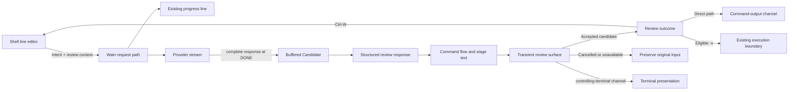

# Design: use-explanatory-shell-shortcut

## Use-Case Traceability

| Contract | Design decision | Evidence |
|---|---|---|
| Permanent owner is `use-shell` | Extend `interactive-shell-shortcut`; direct positional, interactive-stdin, and eligible `-x` requests are consumer interactions, not new capabilities | Proposal routing, change use case, interaction matrix |
| Ctrl-W preserves intent, history, buffer, and no-evaluation behavior | Review mode returns an accepted candidate to the existing widget; only the widget repaints and replaces the shell line-editor buffer | Accepted/cancelled Ctrl-W scenarios and existing shortcut contract |
| Existing progress line appears first | Keep the current diagnostic progress line during provider generation; open the review surface only after `[DONE]` and candidate assembly | Candidate buffering scenario and progress ordering assertion |
| Model-written stage purposes remain visible | Review mode uses the structured review response contract; no locally invented purpose text is used | Complex-flow fixture, purpose loading, and purpose-unavailable scenarios |
| Complete candidate is buffered until `[DONE]` | Review-eligible mode suppresses the incremental command-output sink and retains the complete candidate until the completion marker | Buffering-before-review scenario and ADR-0015 refinement |
| Final acceptance is the release gate | Only `Accepted(candidate)` releases output, changes the Ctrl-W buffer, or authorizes eligible `-x` execution | Acceptance, cancellation, rejection, and routing scenarios |
| Disabled and non-review paths retain current behavior | Resolve review mode before generation; a disabled or ineligible path uses the existing stream, output, history, buffer, and `-x` confirmation code | Disabled Ctrl-W/direct/stdin/`-x` scenarios and non-review `-x` scenario |
| Review surface is compact and inline | Use a bounded portable inline panel on the controlling-terminal channel; no alternate screen or full-screen UI | Bounded-layout and no-alternate-screen assertions |
| Enhanced presentation failure is recoverable | Select an enhanced `Presentation adapter` through a seam; retry the portable inline panel with the same review state | Enhanced fallback scenario and renderer seam test |
| Portable presentation failure releases nothing | Return `Unavailable`, preserve the original input, and write no candidate to stdout or the shell line-editor buffer | Portable failure scenario and failure matrix |
| Shell repaint remains owned by the line editor | Watn removes its review surface and restores terminal state; the shell widget performs the final prompt repaint | Shell repaint scenario and channel contract |

The confirmed Persona `terminal-developer--interactive` is a review lens, not a
Gherkin actor. The Gherkin actors are `Terminal developer` and `Shell line
editor`; the latter is the boundary that owns the shell line-editor buffer and
shell repaint.

## Scope And Ownership

This change extends the existing `use-shell` use case and its
`interactive-shell-shortcut` capability. It does not create a new use-case root,
capability root, or permanent review capability. `review-command-candidate`
and `route-reviewed-command` remain design subfunctions of this capability.

The `corpus-infra` include remains valid: this capability consumes the existing
provider streaming and interruption infrastructure. No new fragment capability
is introduced. Shell completions are not an interaction in this change and are
not present in the interaction matrix.

The review surface applies to these review-eligible consumers:

- Ctrl-W from an installed Bash, Zsh, or Fish shortcut.
- Direct positional questions with terminal stdin and stderr and a usable
  controlling terminal.
- Interactive stdin questions with terminal stdin and stderr and a usable
  controlling terminal.
- `-x` questions with terminal stdin and stderr and a usable controlling
  terminal when review is enabled.

Non-TTY, redirected, disabled, and otherwise non-review paths retain their
current behavior. No semantic command-risk evaluation is introduced.

## Review Mode Resolution

The effective review setting is resolved before provider generation:

1. `--review-panel` or `--no-review-panel` is the per-invocation override.
2. `[review].panel` is the persisted setting.
3. The built-in default is enabled.

The two CLI overrides are mutually exclusive. Review mode additionally requires
terminal stdin and stderr and a usable controlling terminal. The effective
setting and eligibility are captured for the request and do not change during a
review.

Stdout is deliberately not part of the eligibility requirement: the installed
Ctrl-W widget invokes `watn` through command substitution, and stdout is
reserved for the accepted candidate on every review-eligible path. The review
surface uses the controlling-terminal channel only, so a captured stdout never
receives review bytes.

Disabled review has no review state, no command-flow derivation, no review
surface, and no review buffering. It follows the existing behavior for each
consumer: Ctrl-W replacement and shell history, direct command-output channel,
interactive stdin output, and the existing `Execute now?` confirmation for
`-x`.

## Candidate And Purpose Contract

### Candidate state

A `Candidate` is a selectable generated or directly edited command in the
current review. It contains:

- The exact candidate command text.
- The current `Intent` that produced it.
- The configured tier and concrete provider/model context.
- The locally derived `Command flow` with exact `stage text` values.
- A `Purpose status` and any model-written `stage purpose` values.

The review owns one selected candidate. Additional candidates are retained only
when the developer explicitly chooses comparison. Candidate history is scoped
to the current review process and is not persisted.

### Structured review response

Review mode asks the provider for the following logical response contract. This
is a structured model response inside the existing provider completion, not a
new HTTP endpoint or a new provider adapter.

Ready response:

```json
{
  "review_version": 1,
  "command": "git log --since='7 days ago' | xargs -n1 git show --stat",
  "stages": [
    {
      "stage_text": "git log --since='7 days ago'",
      "purpose": "Collect commit identifiers from the recent history."
    },
    {
      "stage_text": "xargs -n1 git show --stat",
      "purpose": "Inspect each collected commit with a compact change summary."
    }
  ],
  "purpose_status": "ready"
}
```

Delayed-purpose response:

```json
{
  "review_version": 1,
  "command": "git log --since='7 days ago' | xargs -n1 git show --stat",
  "stages": [
    {"stage_text": "git log --since='7 days ago'"},
    {"stage_text": "xargs -n1 git show --stat"}
  ],
  "purpose_status": "loading",
  "purpose_request": "provider-owned opaque continuation"
}
```

The delayed operation returns the same `review_version`, the exact stage text,
the model-written purpose for each stage, and `purpose_status: "ready"`. Watn
does not display a loading state for a command-only response, malformed JSON,
an unsupported version, missing stage text, or a purpose response that does not
match the current stage texts. Those cases display `purpose-unavailable` while
keeping the Candidate reviewable.

The provider contract rules are:

- `command` must be non-empty and must be the complete candidate.
- `stage_text` must be the exact text of a locally derived stage.
- `purpose` is model-written plain text and is advisory; Watn does not generate
  a replacement purpose locally.
- `purpose_status: "loading"` is valid only with a valid structured response
  and a supported delayed-purpose operation.
- An invalid or absent structured response does not invalidate the candidate;
  it changes only the Purpose status to `purpose-unavailable`.
- A stale purpose response cannot replace the state of a newer Candidate.

### Purpose lifecycle

1. The provider stream completes at `[DONE]`.
2. Watn validates the structured response and derives the Command flow.
3. The review surface opens with `ready`, `loading`, or
   `purpose-unavailable` according to the contract above.
4. A valid delayed response updates the current Candidate in place.
5. A purpose failure leaves the Candidate and review decisions available.
6. A direct command edit creates refreshed Candidate state and repeats the
   validation; failure produces `purpose-unavailable` or unsupported flow.

## Candidate Lifecycle

| Review decision | State transition | Release rule |
|---|---|---|
| Accept | Selected Candidate -> `Accepted(candidate)` | Release exactly the selected Candidate after review-surface cleanup |
| Cancel | Review -> `Cancelled` | Release nothing; preserve original input |
| Reject | Selected Candidate -> current Intent | Release nothing; offer regeneration or rephrase |
| Edit command | Selected Candidate -> refreshed Candidate | Enter commits; Escape discards; final acceptance remains required |
| Rephrase intent | Current Intent -> new current Intent -> new Candidate cycle | Replace visible active Intent; prior Intent remains only in current-review history |
| Regenerate | Current Intent -> replacement Candidate | Replace current Candidate unless comparison retention was explicit |
| Request higher tier | Current Intent -> next-tier Candidate | Show tier and provider/model context; at highest tier open catalog model selection |
| Select explicit model | Catalog selection -> one next Candidate | Apply the selected model only to that next Candidate |
| Retain for comparison | Current Candidate -> candidate history | Retain only for this review; no persistent history |
| Select candidate | Candidate history -> selected Candidate | Only selected Candidate can be accepted |
| Interrupt operation | In-progress operation -> prior review state | Preserve selected Candidate and release nothing |

Rejection is not cancellation: rejection returns to the current Intent and keeps
the review available for another Candidate. Cancellation closes the review.
Final acceptance is required after every generated, regenerated, escalated,
selected, or directly edited Candidate.

## Stream Ordering And Output Channels

The following channel vocabulary is canonical for this change:

| Channel | Meaning | Review-mode contract |
|---|---|---|
| `stdout` / command-output channel | Existing command result stream consumed by a direct caller or Ctrl-W widget | Empty until final acceptance for review-eligible requests; then contains only the accepted Candidate in the existing command-output format |
| `stderr` / diagnostic channel | Existing progress line, diagnostics, errors, and non-review confirmation | Progress remains first; review-surface text is not written here as a substitute for the controlling-terminal channel |
| controlling-terminal channel | Terminal descriptor used for the transient review surface and ANSI cleanup | Carries the review surface only; never stdout and never captured as command output |
| shell line-editor buffer | Buffer owned by Bash Readline, Zsh ZLE, or Fish `commandline` | Changed only by the existing widget after `Accepted(candidate)` from Ctrl-W |
| shell history | Native shell history owned by the widget | Review-mode Ctrl-W records the flattened original Intent only after acceptance |
| execution stdio | Inherited streams used by the existing execution boundary | Eligible `-x` reaches execution only after review acceptance; execution output is not review output |

The existing progress line is started before provider generation and remains the
first user-visible feedback. In review mode the provider's synchronous content
sink appends to an in-memory Candidate buffer rather than the command-output
channel. The provider aggregate is accepted only after `[DONE]`; only then may
the review surface open. The review surface is removed and the controlling
terminal is restored before any accepted output is released.

The mode-specific buffered sink is a refinement of the synchronous callback and
completion boundary recorded by ADR-0015. Non-review mode retains its existing
incremental sink and exact-once output behavior.

## Presentation And Keyboard Contract

### Presentation adapter selection

`Presentation adapter` is the renderer boundary. The portable inline adapter is
mandatory and writes the bounded review surface to the controlling-terminal
channel. An enhanced adapter may be selected automatically when available. A
configured or selected enhanced adapter that is unavailable or fails is
replaced by the portable inline adapter without losing the Candidate or focus
state. A portable adapter failure returns `Unavailable`.

The controlling-terminal writer and the adapter selection seam are testable
boundaries. Tests can provide a deterministic terminal writer, fixed dimensions,
and an enhanced adapter that fails on open or render. Product code still uses
the controlling terminal and never redirects review-surface bytes to stdout.

### Bounded inline layout

The portable inline review surface is a small transient region. It is not an alternate
screen and does not occupy a full-screen viewport. The bounded layout contains:

- A compact status line with the current Intent and tier/provider/model context.
- A Flow region showing all stages when they fit, or an overview plus one
  readable selected stage when they do not.
- The selected stage's exact stage text and model-written stage purpose or
  purpose-unavailable status.
- A Candidates region for the selected Candidate and explicit comparison.
- An Actions region for review decisions.

Candidate and Intent text are sanitized for terminal control sequences. Every
exit path restores cursor visibility, raw-input state, and occupied inline rows.
After cleanup, the shell line editor owns prompt repaint.

### Exact keyboard contract

The review surface has exactly three focus regions: `Flow`, `Candidates`, and
`Actions`.

- `Tab` advances focus in the order `Flow` -> `Candidates` -> `Actions` ->
  `Flow`.
- `Shift-Tab` moves focus in the reverse order.
- Up/Down arrows navigate within the focused region.
- Left/Right arrows navigate horizontally within the focused region when the
  region has horizontal choices; otherwise they do not change the selection.
- `Enter` activates the selected action or Candidate and opens the separate
  command editor when `Edit command` is selected.
- `Escape` cancels the review from the review surface.
- In the separate command editor, `Enter` commits the edit and `Escape`
  discards it and returns to the review surface. These editor keys do not accept
  or cancel the review itself.

When a Candidate is ready, `Actions` is the initial focus and final acceptance
is selected. The Flow region remains visible and navigable. The same keyboard
contract applies after regeneration, rephrase, escalation, comparison, and
purpose failure.

## Consumer Routing

| Consumer | Review enabled and eligible | Review disabled or not eligible |
|---|---|---|
| Ctrl-W | Buffer complete Candidate; review; on acceptance release only the Candidate to stdout; widget records the original Intent in shell history and replaces the shell line-editor buffer without evaluation | Existing Ctrl-W direct replacement, history, repaint, and no-evaluation behavior |
| Direct positional | Buffer complete Candidate; review; on acceptance write only the accepted Candidate to stdout in the existing command-output format; review surface remains on controlling terminal | Existing direct command-output behavior |
| Interactive stdin | Buffer complete Candidate; review; on acceptance write only the accepted Candidate to stdout in the existing command-output format; no shell history or buffer replacement | Existing interactive-stdin command-output behavior |
| Eligible `-x` | Buffer complete Candidate; review; final acceptance is the sole execution authorization; execute once through the existing execution boundary with no second confirmation | Existing `Execute now?` confirmation |
| Redirected/non-TTY `-x` | Not review-eligible | Existing `Execute now?` confirmation |

On Ctrl-W, review acceptance records history only after acceptance. Cancellation,
rejection, failure, empty Candidate, and portable-panel failure record no new
review-mode history comment and release no Candidate. Existing disabled behavior
is not rewritten by this rule.

## Failure Outcomes

| Failure or decision | Review outcome | Input/output effect |
|---|---|---|
| Provider fails before `[DONE]` | Generation failure | Close progress; no review surface and no Candidate release |
| Empty complete Candidate | Unavailable | Preserve original input; release nothing |
| EOF or read failure before `[DONE]` | Existing network failure | Preserve buffered internal text only; no review surface or release |
| Structured response missing/invalid | `purpose-unavailable` Candidate | Keep Candidate reviewable; no locally invented purpose |
| Delayed purpose operation fails | `purpose-unavailable` Candidate | Keep selected Candidate and review decisions |
| Flow derivation is incomplete | Unsupported flow | Keep raw Candidate and mark unsupported portions |
| Enhanced adapter unavailable/fails | Retry portable inline adapter | Preserve Candidate and review state |
| Portable inline adapter fails | `Unavailable` | Preserve original input; stdout, shell buffer, and history unchanged |
| Escape in review surface | `Cancelled` | Remove surface; release nothing; preserve input |
| Escape in command editor | Edit discarded | Return to review; selected Candidate remains |
| Rejection | Return to current Intent | Release nothing; offer another Candidate cycle |
| Interrupt during generation, purpose refresh, or model selection | Operation cancelled | Preserve selected Candidate and review state |
| Final acceptance | `Accepted(candidate)` | Cleanup first, then route exactly one accepted Candidate |

## Architecture Impact



Affected responsibilities:

- CLI request path resolves review mode, starts the existing progress line,
  buffers review-eligible output, and routes typed Review outcomes.
- Provider aggregation preserves the existing synchronous stream and `[DONE]`
  completion boundary while exposing the structured review response to review
  mode.
- Review state owns Intent, Candidate history, Command flow, Purpose status,
  focus, keyboard actions, and final acceptance.
- The portable inline panel owns bounded rendering and terminal cleanup through
  a deterministic writer seam.
- The presentation adapter boundary owns enhanced selection and fallback.
- The existing shell shortcut remains the capability owner for shell history,
  shell line-editor buffer replacement, and shell repaint.

## Configuration And Renderer Test Seams

The persisted configuration contains an optional `[review] panel` boolean. The
CLI override is tri-state so an absent flag does not override configuration.
Review eligibility is determined from terminal descriptors, not from the
selected renderer.

The renderer test seam must allow these observable cases without a real enhanced
terminal:

- Enhanced adapter selected and rendered successfully.
- Enhanced adapter selected but fails to open; portable adapter receives the
  unchanged Candidate and focus state.
- Portable adapter receives fixed terminal dimensions and renders a bounded
  layout.
- Portable adapter fails; the request returns `Unavailable` with no output
  release.
- Cleanup runs on acceptance, cancellation, interruption, generation failure,
  and renderer failure.

The provider fixture seam must allow command chunks before `[DONE]`, structured
ready responses, structured delayed-purpose responses, command-only responses,
invalid purpose responses, purpose failures, and complete candidates using an
explicit provider/model context.

## Interaction Coverage Matrix

The matrix covers only the four normalized consumer interactions in the owning
use case. Shell completions are intentionally absent from this change.

| Inventory entry | @e2e scenario title | Real interface | Driving mechanism |
|---|---|---|---|
| review and accept a generated candidate from Ctrl-W | Developer accepts an explained candidate from Ctrl-W | CLI / terminal | Real Bash PTY invokes the installed widget, sends Ctrl-W and Enter, then observes the prompt, buffer, history, and no execution |
| cancel a candidate review from Ctrl-W | Developer cancels a review without changing the shell buffer | CLI / terminal | Real Bash PTY invokes the installed widget, sends Ctrl-W and Escape, then observes the unchanged buffer and history |
| review and accept a direct interactive request | Developer accepts a candidate from an interactive terminal request | CLI / terminal | Real `watn` subprocess with terminal stdin/stderr and a usable controlling terminal; command-output channel captured separately |
| review and execute an accepted eligible `-x` candidate | Developer accepts an eligible `-x` candidate and it executes once | CLI / terminal | Real `watn -x` subprocess in a PTY accepts the review and observes one execution with no second confirmation |

The real interface is a CLI subprocess. Bash PTY scenarios use the existing
E2E driver and the configured loopback provider twin; direct and `-x` scenarios
use the existing subprocess and loopback seams. Review-surface assertions are
on terminal-visible output, while stdout assertions remain on the
command-output channel.

## Local Verification Contract

The existing Cucumber runner remains the executable specification. The feature
runner is `./run-tests.sh`; the E2E command is `./run-tests.sh --e2e`. No live
provider is used. The loopback provider twin supplies deterministic response
fixtures, including the structured review response above.

The review renderer tests must use a deterministic terminal writer and adapter
selection seam. They must not weaken a terminal assertion to inspect an
internal state when the real interface exposes the result. No scenario may
remove its `@e2e` tag to bypass an unavailable E2E hook.

## ADR Qualification And Routing

### Review buffering refinement against ADR-0015

```json
{
  "qualification": "QUALIFIED",
  "alternatives": "PASS",
  "architectural_impact": "PASS",
  "durable_consequence": "PASS",
  "lower_level_artifact": "PASS",
  "existing_adr_check": "PASS",
  "must_be_shared": "SUPPORTING",
  "routing": "AMEND_ADR",
  "canonical_artifact": null,
  "target_adr": "ADR-0015",
  "replacement_adr": null,
  "evidence": {
    "alternatives": [
      "Review-eligible requests can keep the existing incremental sink or buffer the complete Candidate until [DONE]."
    ],
    "architectural_impact": [
      "The choice fixes the command-output channel release boundary and preserves the synchronous provider callback without sending review bytes to stdout."
    ],
    "durable_consequence": [
      "Changing the release gate would alter Ctrl-W, direct-output, and eligible -x authorization behavior across consumers."
    ],
    "lower_level_artifact": [
      "The existing ADR owns the stream boundary; this change is a mode-specific refinement and is not a parallel provider architecture decision."
    ],
    "existing_adr_check": [
      "ADR-0015 is the active record for synchronous callbacks and [DONE]; no separate ADR covers review buffering."
    ]
  }
}
```

The existing ADR-0015 is amended, not duplicated. The amendment records that
review-eligible mode uses the same synchronous callback and `[DONE]` boundary
with a buffered sink, while non-review mode retains incremental output. Chapter
09 keeps the existing ADR-0015 register entry; chapter 11 records the added
buffering and output-isolation consequences. No new ADR is created.

### Structured review response and inline presentation

```json
{
  "qualification": "NOT_QUALIFIED",
  "alternatives": "PASS",
  "architectural_impact": "PASS",
  "durable_consequence": "FAIL",
  "lower_level_artifact": "FAIL",
  "existing_adr_check": "PASS",
  "must_be_shared": "SUPPORTING",
  "routing": "CANONICAL_ARTIFACT",
  "canonical_artifact": "givn/changes/use-explanatory-shell-shortcut/design.md",
  "target_adr": null,
  "replacement_adr": null,
  "evidence": {
    "alternatives": [
      "A coherent structured response and an adaptive command-first explanation response are supported; a command-only response is the unavailable fallback."
    ],
    "architectural_impact": [
      "The response shape and renderer seam are contracts for this capability's implementation, not new provider or deployment boundaries."
    ],
    "durable_consequence": [],
    "lower_level_artifact": [],
    "existing_adr_check": [
      "ADR-0015 covers stream completion; ADR-0018 covers the shell widget boundary; neither requires a new ADR for this local review contract."
    ]
  }
}
```

The complete rationale for these choices is canonical in this design and the
Gherkin scenarios. The review surface is documented in Arc42 chapters 3, 4, 5,
6, 8, 10, and 11; it does not receive a new ADR.

## Risks And Mitigations

- A model may return invalid or stale purpose data. Validate the structured
  response against the current Candidate and display purpose-unavailable.
- Buffering can increase perceived latency. Preserve the existing progress line
  first and open the review surface immediately after `[DONE]`.
- Inline cleanup can conflict with prompt wrapping. Bound the panel, restore
  terminal state on every path, and leave repaint to the shell line editor.
- Review bytes can contaminate stdout. Use only the controlling-terminal channel
  for the review surface and assert stdout separately in direct and Ctrl-W E2E.
- Enhanced renderer availability differs by terminal. Keep the portable adapter
  mandatory and test fallback through the adapter seam.
