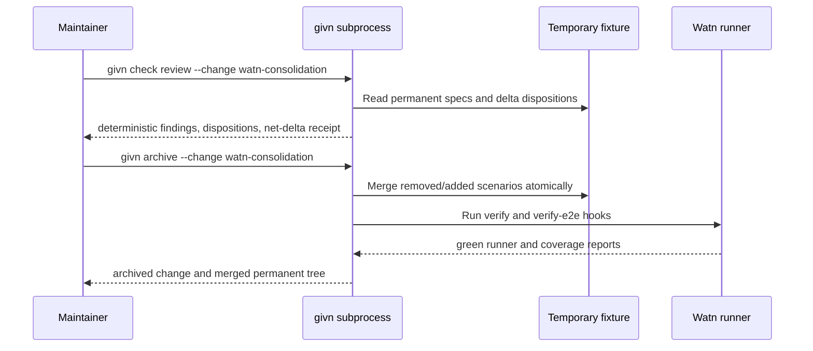

# Design: watn-consolidation

## Scope

This change is a repository-wide specification consolidation in the Watn
consumer repository. It does not change the Watn executable's runtime code.
The implementation surface is the permanent Gherkin tree, the active delta,
the review disposition evidence, and only those test-support bindings that
become provably orphaned after scenario removal.

The initial consolidation set is deliberately limited to findings with direct
evidence:

| Finding | Source evidence | Scenario | Decision | Retained contract | Assertion delta |
|---|---|---|---|---|---|
| F1 | `provider-setup.feature:187-195` vs `credential-sources.feature:17-26` | `A literal saved credential is authoritative over environment fallback` | Remove duplicate | The real-request scenario in `credential-sources` | Retained scenario proves the literal key on the actual request; removed scenario resolves the key through a weaker seam |
| F2 | `search-concurrency.feature:3-8` vs `model-autosuggest.feature:28-33` | `The newest search result stays visible when an older result arrives later` | Remove duplicate regular seam | The model-picker/stale-result E2E boundaries | Retained coverage asserts exact newer results and excludes stale results; removed regular seam only asserted state presence |
| F3 | `config.feature:45-50` vs `auto-init-config.feature:3-8` | `Missing config file prints provider setup guidance` | Remove subset | `auto-init-config` also proves no config is created | Retained scenario adds the no-file invariant to the same guidance contract |
| F4 | `interactive-shell-shortcut.feature:13-17` vs `:203-209` | `The generated Bash widget runs through Bash without evaluating its result` | Remove subset | The later Bash E2E scenario also proves request preservation | Retained scenario adds the preserved request comment assertion |
| F5 | `interactive-shell-shortcut.feature:131-137` vs `:188-194` | `Failed or empty generation preserves the original buffer` | Remove subset | `Failed or empty output preserves the original command line` | Retained scenario keeps exact buffer assertions for both failure and empty output |
| F6 | `model-autosuggest.feature:23-26` vs `ratatui-model-picker.feature:59-63` | `No matching model produces a clear empty state` | Remove subset | `ratatui-model-picker` proves the picker empty state and retained filter | Retained scenario also verifies the entered filter remains visible |

Each removal is represented by a `@givn.removed` delta in the original
capability. The consolidation review records the retained scenario title,
the boundary decision, and any step binding that becomes unused. No scenario
is removed solely because the overlap tool emitted a warning; the reviewer
must confirm the stronger contract first.

## Consolidation Procedure

1. Run the complete active-tree lint and record duplicate titles, shape matches,
   subsets, and long-scenario findings.
2. Add only evidence-backed removals to the delta. Do not rename a scenario to
   conceal a duplicate; remove it when a stronger canonical contract exists.
3. Run the active change review. Every finding involving the delta receives an
   explicit disposition. Removed-plus-added replacements use one change so
   the archive operation and net-delta receipt remain atomic.
4. Archive only after the complete Watn runner, non-E2E runner, E2E runner,
   coverage reports, and permanent-tree duplicate scan are green.
5. Re-run the repository-wide lint after archive and record the remaining
   warnings as deliberate boundary decisions, not as ignored output.

## Interfaces and Components

| Component | Path | Change |
|---|---|---|
| Consolidation delta specs | `givn/changes/watn-consolidation/specs/<capability>/` | Removed scenarios plus two executable gate scenarios |
| Active review evidence | `givn/changes/watn-consolidation/review.md` | Dispositions and retained-contract rationale |
| Consolidation rollback steps | `tests/steps/watn_consolidation_steps.rs` | Non-E2E black-box steps for the isolated failing-archive fixture |
| Consolidation CLI E2E steps | `tests/steps/watn_consolidation_e2e_steps.rs` | E2E steps for isolated givn review/archive fixtures |
| Shared fixture helpers | `tests/steps/watn_consolidation_support.rs` | TempDir setup, subprocess invocation, snapshots, and title checks |
| Step module registration | `tests/steps/mod.rs` | Register the regular, E2E, and shared consolidation modules |
| Orphaned bindings | `tests/steps/*.rs` | Keep bindings while old permanent scenarios run during the active delta; remove only after archive and a repository-wide usage scan prove no active scenario references them |
| Permanent specs | `givn/specs/` | Updated only by `givn archive` |

No Watn production module, public CLI contract, provider implementation, or
configuration schema is changed. The step definitions invoke a real `givn`
subprocess against an isolated temporary project for the gate/archive smoke
tests; they do not call Watn internals.

## Review and Archive Flow



The isolated fixture uses the installed `givn` executable selected by
`GIVN_BIN`, falling back to `givn` on `PATH`. Its verify and e2e commands are
deterministic local commands, so the consolidation smoke tests do not depend
on a live LLM provider or network access. The actual Watn repository runner
remains the final archive gate.

## Test Runner and Strictness

The existing Watn runner is the executable-spec runner. It collects active
`givn/specs/**/*.feature` files and active change feature files, excludes
`givn/archive`, and uses cucumber-rs `.fail_on_skipped()` in
`tests/features_runner.rs`.

The exact commands are:

```text
./run-tests.sh
./run-tests.sh --e2e
./run-tests.sh --name "<one scenario title>"
./run-tests.sh --e2e --name "<one scenario title>"
```

The default project commands are recorded in `givn/commands.yaml`. The e2e
command is a strict `@e2e` subset. Both filters also exclude
`@givn.removed` placeholders because those scenarios are archive instructions,
not executable behavior. The archive post-merge runner executes the resulting
permanent tree after the removals have been applied. The setup task must prove
non-zero failure for an undefined or pending consolidation step before any
scenario is marked GREEN.

The named commands are valid only for added or modified executable scenarios.
Removal placeholders are never targeted by `--name`; they are verified only
through the full filtered run and then disappear on archive. This avoids the
Cucumber CLI limitation that prevents combining a name filter with the tag
expression.

## E2E Infrastructure

The interface type is CLI/terminal. The driving mechanism is a real
`givn` subprocess with an isolated temporary project root. No browser driver,
HTTP client, application server, database, queue, or third-party digital twin
is required for the consolidation capability. Watn's existing mock transport
and PTY infrastructure is not substituted for the givn subprocess in these
scenarios; it remains available to the permanent Watn scenarios.

The non-E2E rollback step file is `tests/steps/watn_consolidation_steps.rs`.
The CLI E2E step file is
`tests/steps/watn_consolidation_e2e_steps.rs`, separate from the non-E2E
capability bindings. Shared fixture helpers live in
`tests/steps/watn_consolidation_support.rs`. Primary assertions are on givn
stdout, exit status, and the generated permanent-spec tree. Filesystem
assertions are secondary checks of the CLI archive result.

## Local Runnability & Digital Twins

The exact local commands are `./run-tests.sh` for the non-E2E suite and
`./run-tests.sh --e2e` for the E2E suite. Together they build the Watn debug
binaries and run the complete Gherkin suite. The consolidation steps additionally
invoke the installed `givn` CLI against a `tempfile::TempDir`; no service
process is started and no shared filesystem is mutated. There is no application
server, database, queue, or third-party API in this capability, so no digital
twin is required. The fixture's verify and e2e commands are local deterministic
commands and do not contact a provider.

The primary interface obstacle is archive mutation: every givn command is
started with the fixture directory as its current directory, and the temporary
directory is retained until all Then assertions complete. A failed archive is
asserted to leave the fixture permanent tree unchanged.

The fixture layout is explicit:

```text
<temp>/givn/specs/<capability>/*.feature
<temp>/givn/changes/fixture-consolidation/{proposal.md,design.md,design-review.md,tasks.md,review.md}
<temp>/givn/changes/fixture-consolidation/specs/<capability>/*.feature
<temp>/givn/config.yaml
<temp>/givn/commands.yaml
```

The review fixture contains one permanent scenario titled `Obsolete behavior`
and one delta that removes it and adds `Canonical retained behavior`. Its
review evidence contains the exact retained-contract disposition. The review
smoke test therefore observes `net delta: 1 added, 0 modified, 1 removed`, and
the archive smoke test observes the canonical title after merge and a clean
duplicate-title scan, and asserts that `Obsolete behavior` is absent.
The fixture also has a failing-hook variant whose pre-archive permanent-tree
snapshot must remain byte-for-byte unchanged after a failed archive.
`GIVN_BIN` is resolved to an absolute executable when supplied and falls back
to `givn` on `PATH`.

The fixture is initialized with `givn init --no-addons`. It intentionally runs
only the review, archive, and rollback hooks needed by these smoke scenarios;
coverage is measured by the Watn repository's configured coverage commands,
not by the temporary fixture.

## Interaction Coverage Matrix

| Inventory entry | @e2e scenario title | Real interface | Driving mechanism |
|---|---|---|---|
| Run `givn check review --change <fixture-change>` to verify repository-wide dispositions | Repository-wide review accepts the consolidation dispositions | CLI | Real `givn check review --change fixture-consolidation` subprocess in an isolated fixture; assert stdout and exit status |
| Run `givn archive --change <fixture-change>` to publish the consolidated permanent specs | Archive publishes the consolidated permanent specifications | CLI | Real `givn archive --change fixture-consolidation` subprocess in an isolated fixture; assert stdout, exit status, and resulting tree |

## Data and Invariants

- A scenario title is unique across the active permanent tree after archive.
- Every removed scenario has a retained-contract or boundary explanation in
  `review.md`.
- A removal that is paired with a stronger addition is archived atomically;
  partial permanent-tree writes are rolled back by the existing archive gate.
- Existing Watn runtime behavior remains unchanged; this is proven by the full
  permanent runner after archive.
- A removed scenario's step bindings may be deleted only after searching every
  active feature and every registered binding usage.

## Risks and Mitigations

| Risk | Mitigation |
|---|---|
| A removal deletes a real production boundary | Require the F1-F6 retained-contract table and an explicit review disposition before archive. |
| A removed scenario leaves an orphaned binding or a retained scenario loses its only binding | Search active feature text and registered step modules before deleting support code; run the complete runner after each batch. |
| The E2E smoke test archives the active change recursively | Use the isolated `fixture-consolidation` id in a fresh temporary current directory. |
| A fixture archive mutates the developer checkout | Hold every fixture file under `TempDir`; assert the checkout snapshot remains unchanged. |
| A disposition is incomplete or unsupported by output | Assert exact net-delta counts, retained title, archive output, and the final duplicate-title scan. |

## Coverage

Coverage is measured through the project-owned `measure-coverage.sh` and
`merge-coverages.sh` commands after all permanent and delta scenarios pass.
The Gherkin runner and every process started by the consolidation fixtures are
included. Any uncovered consolidation step is classified as dead code,
missing test coverage, or concretely hard to test; no fourth category is used.
