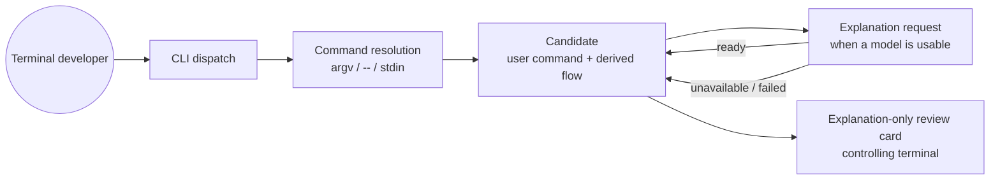

# Design: explain-command

## Scope

`watn explain '<command>'` opens the existing explanation-only review card for
a command the developer already has. The command is authoritative: watn never
replaces, joins, re-splits, evaluates, or executes it. When a usable model is
available, a dedicated explanation request fills in the model-written stage
purposes; otherwise the card shows the locally derived stages with
`purpose-unavailable`. The change reuses the review card, the structured review
response contract, and the provider/session machinery. No new dependency is
introduced.

## The argument-passing contract (first-class requirement)

The developer's core question is how a complex command reaches watn safely.
The contract has one invariant:

> The shell performs quoting and expansion before watn starts. Watn receives
> the explained command as literal argument bytes or as literal standard-input
> bytes and passes those bytes unchanged to the explanation card. Watn never
> calls `eval`, never starts a shell to interpret the command, never re-splits
> or joins the argument, and never executes the command.

### Canonical invocation forms

1. **Single-quoted positional argument (canonical).**
   `watn explain '<command>'`. The shell removes the single quotes and hands
   watn exactly one argv element. Single quotes suppress every shell
   metacharacter (`&&`, `||`, `;`, `|`, `&`, `[]`, `<>`, `$`, backticks) and
   preserve embedded newlines. A single quote cannot appear inside the
   argument; a shell-level trick is needed to embed one (`'"'"'` or a heredoc).
2. **Double-quoted positional argument.** Used when the command contains
   single quotes and no `$`, backticks, or `$(...)`: `watn explain "awk
   '{print $1}' file"`. Inside double quotes the calling shell still expands
   `$VAR`, `` `cmd` ``, and `$(...)`; escape them (`\$`) or use form 4.
3. **Option terminator.** `watn explain -- '-text'`. Clap stops option parsing
   at `--`, so a command whose text begins with `-` is accepted as the single
   positional value.
4. **Standard input / heredoc.** `watn explain -` reads the command from
   standard input; `watn explain` with piped standard input does the same when
   no positional argument is present. A quoted heredoc
   (`watn explain - <<'EOF'`) disables all expansion and handles embedded
   single quotes, both quote kinds, newlines, `$`, and backticks:

   ```sh
   watn explain - <<'EOF'
   printf '%s\n' "$HOME" && echo `date`
   EOF
   ```
5. **Piped standard input without the marker.**
   `printf '%s' "$cmd" | watn explain` is equivalent to `watn explain -` when
   no positional argument is present. `"$cmd"` must already be the literal
   command (for example, read from a file or a single-quoted literal).

### Precedence and normalization

- A positional argument other than `-` wins; standard input is not read at
  all (no silent consumption of a pipe).
- The single positional argument `-` selects standard input.
- No positional argument plus non-terminal standard input selects standard
  input.
- No positional argument plus terminal standard input is a usage error.
- An empty argument, or standard input that is empty after removing exactly one
  trailing `\n` or `\r\n`, is a usage error (exit 2, no card). No other
  trimming happens: leading/trailing spaces, internal newlines, and tabs are
  part of the command.
- A second positional argument is a clap usage error. Joining words would
  silently change token boundaries, so the interface deliberately refuses it.

### Worked examples

| Developer wants to explain | Safe invocation | Why it is safe |
|---|---|---|
| `git log --oneline \| head -5 && echo done` | `watn explain 'git log --oneline \| head -5 && echo done'` | Single quotes stop the shell from acting on `\|` and `&&` |
| `find . -name '*.log' -mtime +7` | `watn explain "find . -name '*.log' -mtime +7"` | Double quotes carry the embedded single quotes; there is no `$` or backtick to expand |
| `awk '{print $1}' access.log` | `watn explain "awk '{print \$1}' access.log"` or a quoted heredoc | `$1` would otherwise expand inside double quotes |
| `printf '%s\n' "$HOME"` | `watn explain - <<'EOF'` … `EOF` | The quoted delimiter keeps `$HOME` literal |
| `grep -E 'a\|b' < in > out` (both quote kinds) | quoted heredoc via `watn explain -` | Single quotes inside single quotes are impossible; the heredoc avoids nesting |
| `-x --flag` (leading dash) | `watn explain -- '-x --flag'` | `--` ends clap option parsing |
| multi-line `while … do … done` | `watn explain -` with a quoted heredoc | Newlines survive as part of the command |
| `$()` command substitution | single-quoted argument or quoted heredoc | The caller's shell would otherwise run the substitution before watn starts |
| empty text | `watn explain ''` | Rejected with a usage error; no card |
| two unquoted words | `watn explain 'two words'` | A second positional argument is a usage error rather than a lossy join |

The last row is the honest limit: watn's guarantee begins at argv. It cannot
undo an expansion the caller's own shell already performed. The card always
shows the bytes watn actually received, so the developer can verify the result.

## Architecture impact



- `src/main.rs`: new `Commands::Explain { command: Option<String> }`
  subcommand; `run_explain_command` orchestration; `explain_system_prompt`;
  `run_explanation_card` refactored to accept a prepared `ReviewCandidate` and
  `ReviewContext` and to return a result, so the explain path exits non-zero
  when the card cannot open while the `-x` explain choice keeps its current
  best-effort behavior.
- `src/review/response.rs`: new pure `apply_explanation(command, raw) ->
  ReviewCandidate`. It never replaces the developer's command.
- `src/review/session.rs`: new `explain_command_candidate(...)`, reusing
  `generate_candidate` (streaming worker, interrupt grace, spinner).
- `src/review/panel.rs`: new `explanation_terminal_is_usable()`; extract the
  controlling-terminal availability check from `controlling_terminal_is_usable`
  so the stdin/heredoc form is not rejected for having piped stdin.
- `src/review/mod.rs`: export the new functions.
- No data-model change: `ReviewCandidate`, `ReviewResponse`, `PurposeStatus`,
  `CommandFlow`, `ReviewContext`, `ReviewPanelState` are reused unchanged.

### Explain runtime flow

```mermaid
sequenceDiagram
    participant User as Terminal developer
    participant CLI as watn explain
    participant Config
    participant Provider as OpenAI-compatible API
    participant Card as Explanation-only review card

    User->>CLI: watn explain '<command>' / -- / - (stdin)
    CLI->>CLI: reject -x; resolve one command string; reject empty
    CLI->>CLI: require /dev/tty and a terminal stderr
    CLI->>Config: load config (absent file = defaults)
    alt provider and model usable
        CLI->>Provider: POST /v1/chat/completions (explain prompt + exact command)
        Provider-->>CLI: SSE content + [DONE]
        CLI->>CLI: apply_explanation(command, payload)
    else provider not ready, request failed, or stages untrusted
        CLI->>CLI: keep the command with purpose-unavailable
    end
    CLI->>Card: open with candidate and context
    User->>Card: arrows / Enter / Escape
    Card-->>CLI: close (nothing released)
    CLI-->>User: exit 0
```

### Purpose application semantics

`apply_explanation` is deliberately strict and never trusts the model's
command:

1. Build the candidate from the developer's command (`ReviewCandidate::
   from_command`), which derives the command flow locally.
2. Parse the provider payload with the existing `ReviewResponse` contract. If
   the payload validates and its `command` equals the developer's command and
   its stages equal the locally derived flow, adopt the model-written purposes
   (`PurposeStatus::Ready`).
3. Otherwise, if the payload is JSON-shaped and its `stages` form an ordered,
   non-overlapping, verbatim cover of the developer's command with a non-empty
   purpose per stage (the existing trusted-split rule), adopt that split and
   its purposes.
4. Otherwise keep the developer's command and the locally derived flow with
   `purpose-unavailable`. A `loading` status is treated as unavailable because
   this path implements no delayed purpose fetch.

The provider's own `command` text is never displayed and never replaces the
developer's command.

### Explanation system prompt

```text
You are a command explanation engine. The user provides one existing shell
command. Explain it without changing it and without executing it.
Respond with exactly one JSON object and nothing else.
Schema: {"review_version":1,"command":"...","stages":[{"stage_text":"...","purpose":"..."}],"purpose_status":"ready"}
Rules:
- command must repeat the user's command exactly, character for character. If
  the command contains line breaks, encode them as \n inside the JSON string.
- Split the command into stages at top-level pipes, ||, &&, ; and newline
  boundaries. stage_text must be the exact text of each stage as it appears in
  the command.
- purpose is plain text explaining why the stage is present and what it
  contributes; never evaluate or execute anything.
- purpose_status must be exactly ready and every stage must have a non-empty
  purpose.
- Do not wrap the response in a markdown code fence and do not add prose before
  or after the object.
Operating System: {os} ({arch}). Shell: {shell}.
```

## CLI behavior decisions

- **`-x` / `--execute`:** rejected. `watn -x explain '<command>'` prints
  `explain never executes a command; remove -x` to stderr and exits 2.
  `watn explain -x '<command>'` is a clap unknown-argument error (exit 2).
  Explain never executes on any path.
- **Provider readiness:** no hard gate. Explain resolves provider, tier, and
  model for the card context, then calls the model only when
  `provider_ready && model_roles_ready` (the same readiness predicate the
  generation path uses). Not ready means skip the call, no network request, and
  `purpose-unavailable` in the card. An explicit `--provider`/`--model`/
  `WATN_PROVIDER` selection resolves strictly and reports its existing errors.
  A malformed config file is reported and exits 1; an absent file is not an
  error and does not trigger onboarding.
- **Review-panel switches:** `--review-panel` and `--no-review-panel` have no
  effect on explain and are not persisted. The explanation card is the
  explicit purpose of the invocation, so the persisted preference does not
  gate it; there is no alternative output to fall back to.
- **`-v`:** accepted, no effect on the explanation card.
- **Exit status:** 0 after the card closes; 2 for usage errors and `-x`
  rejection; 1 when no controlling terminal or the card cannot open; 130 when
  Ctrl+C interrupts the purpose fetch (existing interrupt contract).

## Use-case traceability

| Use-case element (`use-shell`) | Technical decision | Evidence |
|---|---|---|
| Capability `explain-command` | New subcommand under `use-shell` ownership | `givn/changes/explain-command/specs/use-shell/explain-command.feature` |
| Rule: an explained command is never evaluated, re-split, joined, or executed | Single-argument contract; `apply_explanation` never replaces the command; `-x` rejected | `@e2e` "Developer explains an existing command in the review card"; "Explain never executes the command" |
| Rule: the entry point is independent of the persisted review-surface preference | Explain bypasses `resolve_review_enabled`; switches are inert | "The explanation card opens even when the review surface is disabled" |
| Precondition: a usable model is optional | Tolerant readiness; skip the call when not ready; degrade on failure | "A configured provider without a usable credential is not contacted"; "A failed explanation keeps the command reviewable" |
| Extension: unsupported flow remains visible | Reuse `derive_command_flow`; unsupported spans are marked internally and never rewrite the command | "Shell metacharacters and embedded quoting reach the card unchanged" |
| Persona `terminal-developer--interactive` | Explanation-only card keeps the review surface's model/purpose presentation and close-only decisions | All card scenarios |

## Test runner, strict mode, and single-scenario runs

- **Regular runner:** `./run-tests.sh` (tags `not @wip and not @e2e`), wrapping
  `cargo test --locked --test features_runner --features test-support`.
- **E2E runner:** `./run-tests.sh --e2e` (tags `@e2e and not @wip`).
- **Single scenario:** `./run-tests.sh --name "Developer explains an existing
  command in the review card"`.
- Feature files are collected from `givn/specs/**` and
  `givn/changes/*/specs/**` by `tests/features_runner.rs:166-183`.
- **Strict mode:** `.fail_on_skipped()` is already set at
  `tests/features_runner.rs:210`, and the runner exits 1 when
  `stats.skipped > 0` (`tests/features_runner.rs:227`). Rust has no
  empty-step-pass hazard: every new step body starts as `unimplemented!()`
  until implemented, which fails the scenario. Undefined steps fail via
  `.fail_on_skipped()`.
- **Proof of strictness (setup task):** temporarily add a scenario with an
  undefined step, run it with `./run-tests.sh --name "<temp title>"`, confirm a
  non-zero exit and a skipped/undefined finding, then remove the temporary
  scenario before implementation.

## Version freshness

No new language, framework, library, database, or container version is
introduced. Versions below come from the project lockfile (`Cargo.lock`, the
source of truth for existing dependencies):

| Technology | Version | Source |
|---|---|---|
| Rust edition | 2021 | `Cargo.toml:5`; toolchain pinned by `rust-toolchain.toml` |
| clap | 4.6.6 | `Cargo.lock` |
| cucumber (cucumber-rs) | 0.23.0 | `Cargo.lock` |
| crossterm | 0.29.0 | `Cargo.lock`; `tty_fd()`/`enable_raw_mode()` read `/dev/tty` when stdin is not a TTY (verified in the 0.29.0 source) |
| portable-pty | 0.9.0 | `Cargo.lock` (dev-dependency) |
| httpmock | 0.8.3 | `Cargo.lock` (dev-dependency) |

## Step definition locations

One capability, two files following the existing `interactive_shell_shortcut`
pattern:

- Regular/integration steps: `tests/steps/explain_command_steps.rs`, module
  `explain_command_steps`, registered in `tests/steps/mod.rs`.
- E2E smoke steps: `tests/steps/explain_command_e2e_steps.rs`, module
  `explain_command_e2e_steps`, registered in `tests/steps/mod.rs`.

Reused existing steps: `no config file exists` (`ask_steps.rs`); `the persisted
review surface is disabled` and `the review surface should be disabled in the
configuration` (`interactive_shell_shortcut_steps.rs`); `watn should exit
successfully` (`interactive_shell_shortcut_e2e_steps.rs`). Shared helpers:
`ensure_test_env`, `run_binary_with_state`, `start_pty_command`, `pty_write`,
`pty_snapshot`, `pty_wait_for_label`, `finish_pty_session`, `find_binary`.

New step responsibilities:

| Step | Behavior |
|---|---|
| `a configured provider whose explanation covers the command:` | Configure the loopback mock with a structured response whose stage split covers the docstring command; store the command for the When |
| `a configured provider without a usable credential` | Write a provider config with an endpoint but no credential; register the chat mock so zero hits are observable |
| `a configured provider whose explanation request fails` | Mock returns an HTTP error |
| `a configured provider whose explanation does not cover the command` | Mock returns stages that do not cover the developer's command |
| `the configuration file is malformed` | Write a `config.toml` with an unterminated TOML table header into the isolated `$XDG_CONFIG_HOME/watn` directory |
| `I run \`watn explain\` with that command as one argument in a terminal` | `@e2e`: start the compiled binary in a `portable-pty` session via `sh -c`, with the command held in an environment variable and passed as exactly one quoted argv element (`"$WATN_BIN" explain "$WATN_COMMAND" > "$WATN_OUT"`); stdout is redirected so the card renders through `/dev/tty`; this step also writes the ANSI-stripped PTY transcript to the scenario's evidence path |
| `I run \`watn explain\` with this single argument:` | Start the real binary in a PTY, passing the docstring as exactly one argv element; stdout is redirected to the command-output channel file |
| `I run \`watn explain\` with this single argument in a terminal, then press Enter:` | Same PTY start; wait for the card's close hint, press Enter (not Escape), finish/wait the PTY session, and store `world.exit_status`, the merged PTY transcript, and the redirected stdout for the assertions |
| `I run \`watn explain --\` with this single argument:` | Same, with `--` before the value |
| `I run \`watn explain -\` in a terminal with this command on standard input:` | Write the docstring to a temp file and run `watn explain - < file` inside the PTY (stdin is a pipe; the card uses `/dev/tty`) |
| `I run \`watn explain\` in a terminal with the command {string} piped on standard input` | Write the literal command to a temp file and run `watn explain < file` inside the PTY with no positional argument; the piped standard input selects the stdin form without the `-` marker |
| `I run watn explain with the argument {string} in a terminal with the command {string} on standard input` | Positional-vs-stdin precedence |
| `I run \`watn explain\` with an empty argument` / `with empty standard input` | Empty-input rejection through `run_binary_with_state` |
| `I run watn explain with the arguments {string} and {string}` | Run `watn explain <first> <second>` through `run_binary_with_state` and capture exit status and output |
| `I run \`watn -x explain\` with this single argument:` / `I run \`watn explain -x\` with this single argument:` | `-x` rejection and no-execution proof: start the real binary in a PTY, finish/wait the PTY session, and assert on `world.exit_status` plus the merged PTY transcript (the card never opens) |
| `I run \`watn explain --no-review-panel\` with this single argument:` | Same PTY start as the plain form, with the inert switch before the positional value; the card still opens |
| `I run \`watn explain 'echo test'\` without a controlling terminal` | Captured-stderr subprocess (no PTY) with a non-empty positional command so the terminal gate is reached instead of the empty-input usage error |
| `I close the explanation card` | Wait for the card, send Escape (the labeled close control), finish the PTY session, capture redirected stdout |
| `the explanation card should show the stage:` | ANSI-stripped PTY snapshot, whitespace-collapsed, contains the docstring stage text; matching against the collapsed snapshot prevents line-break or join differences from producing a false pass |
| `the explanation card should show the stages {string} and {string} as separate stages` | Boundary assertion: both stage texts appear on distinct stage rows with a stage separator between them in the ANSI-stripped snapshot; one joined line fails |
| `the explanation card should show each model-written stage purpose` | Snapshot contains every mocked purpose |
| `the explanation card should show the close hint {string}` | ANSI-stripped PTY snapshot contains the close hint (for example `esc close`) |
| `the explanation card should name {string}` | ANSI-stripped PTY snapshot contains the surface name (for example `watn`) |
| `the explanation card should not show internal identifiers` | ANSI-stripped PTY snapshot contains no internal identifier such as `explain_only` |
| `the explanation card should show purpose-unavailable` | Snapshot contains the status label |
| `the explanation card should not show the text {string}` | Snapshot lacks the text |
| `the command-output channel should contain no command` | Redirected stdout file is empty |
| `the file {string} should not exist` | Execution marker absent |
| `watn should report a usage error` | Exit status 2 and the captured stderr or merged PTY transcript contains a usage error |
| `watn should report that explain never executes` | Exit status 2 and the merged PTY transcript names the never-executes contract |
| `watn should report that the explanation requires a terminal` | Non-zero exit and stderr names the terminal requirement |
| `watn should report a configuration error` | Finish/wait the PTY session, assert exit status 1, and assert the merged PTY transcript names a TOML parse error |
| `no explanation card should open` | Captured output or merged PTY transcript has no card frame |
| `no provider request should have been made` | The registered chat mock's call count is 0 |

## E2E smoke test infrastructure

- **E2E runner command:** `./run-tests.sh --e2e` (`verify.e2e_command` in
  `givn/commands.yaml`), filtered to `@e2e and not @wip`.
- **E2E step location:** `tests/steps/explain_command_e2e_steps.rs`, separate
  from the regular steps.
- **Real interface:** the compiled `watn` binary in a `portable-pty` session
  (`portable-pty` 0.9.0). The command is held in an environment variable and
  passed as one quoted argv element through `sh -c` (`"$WATN_BIN" explain
  "$WATN_COMMAND" > "$WATN_OUT"`), matching the existing direct-review E2E
  pattern; stdout is redirected to a file so the card renders through
  `/dev/tty`, and the card is driven with real keystrokes (`Escape` to close)
  and read from the PTY transcript.
- **Local test infrastructure:** the existing in-process `httpmock` mock server
  (`MockServerWrap` in `tests/features_runner.rs`) is the digital twin for the
  OpenAI-compatible provider; the harness writes an isolated
  `$XDG_CONFIG_HOME/watn/config.toml` whose provider endpoint is the mock. No
  container, database, port, or live network access is needed.
- **Framework choice:** cucumber-rs 0.23 with the project's `features_runner`
  harness; it already provides PTY helpers, the mock twin, and scenario
  filtering.
- **E2E strict-mode proof:** the same `.fail_on_skipped()` configuration as the
  regular runner; the setup task's proof-of-strictness check covers the shared
  runner, so both scopes fail on undefined or pending steps.

## Local runnability and digital twins

- **Local run:** `cargo run --release -- explain 'git log --oneline | head -5'`
  (manual). The declared `run.command` remains `cargo run --release -- --help`
  (`givn/commands.yaml`).
- **External dependencies:** the only external service is the configured
  LLM provider endpoint. In tests it is replaced by the in-process `httpmock`
  twin; no scenario contacts a live service.
- **Anticipated interface obstacles and fixes:**
  1. *Piped stdin vs the existing terminal gate.* `controlling_terminal_is_usable()`
     requires terminal stdin, so `watn explain - < file` would be refused.
     Fix: the explain path uses `explanation_terminal_is_usable()`
     (terminal stderr + `/dev/tty` open + `TERM != dumb`), and
     `ControllingTerminal::open` validates only that availability. crossterm
     0.29.0 reads events and enables raw mode through `/dev/tty` when stdin is
     not a TTY, so the card still works.
  2. *A non-TTY test could still find a controlling terminal.* The regular
     runner captures stderr, so the `stderr.is_terminal()` requirement makes
     the no-terminal scenario deterministic even when cargo test runs inside a
     terminal.
  3. *PTY timing.* Wait for the card's decision hint before sending keys
     (`pty_wait_for_label`), matching the existing review E2E steps.
  4. *Multi-line stdin inside a PTY.* Write the command to a temp file and
     redirect it (`< file`) rather than embedding it in a shell string.
  5. *Zero-hit sentinel.* Register the chat mock with an explicit mock id and
     assert `httpmock::Mock::new(id, server).calls() == 0` after the run.
  6. *Transcript path.* The E2E step writes the ANSI-stripped snapshot to the
     evidence path computed from `CARGO_MANIFEST_DIR`.

## Visual Design Contract

- **Interface:** terminal
- **Viewports:** not applicable to a terminal surface; the test PTY is 120x40
  and the card is a bounded inline panel (existing `InlineLayout`).
- **Design system:** `docs/design/design-system.md` (created by this change;
  it records the existing card/setup tokens, symbols, and motion rules). This
  change adds no new token or primitive.
- **Screens covered:** the explanation-only review card for `watn explain`
  (existing card, `explain_only` state, detailed layout, close-only hints).
- **Rendered reference:** the existing review-card renderer
  (`src/review/card.rs`); no new reference view is added.
- **Capture mechanism and evidence path:** the `@e2e` scenario commits an
  ANSI-stripped PTY transcript at
  `givn/changes/explain-command/evidence/visual/developer-explains-an-existing-command-in-the-review-card/transcript.txt`.
  Intermediate captures are not used.
- **Motion:** none; the card is static text with cursor movement and performs
  no animation, so no motion rule or `prefers-reduced-motion` handling applies.
- **Terminal baseline (asserted by the E2E scenario):** the card frame is
  visible; the close hint is asserted by the explicit step `the explanation
  card should show the close hint {string}` (for example `esc close`); the
  header name is asserted by `the explanation card should name {string}` (for
  example `watn`); the absence of internal identifiers is asserted by `the
  explanation card should not show internal identifiers` (for example
  `explain_only`); the command stages and purposes are not duplicated; the
  explanation is in the terminal's configured language (English); no error
  state exists on the happy path.

## Interaction Coverage Matrix

| Inventory entry | @e2e scenario title | Real interface | Driving mechanism |
|---|---|---|---|
| explain-command / explain an existing command in the review card | Developer explains an existing command in the review card | CLI | Real `watn` binary in a `portable-pty` session: the command is passed as exactly one argv element, the PTY transcript is read for the card's stages and purposes, `Escape` closes the card, and the redirected stdout plus a filesystem marker prove nothing was released or executed |

## Black-Box-First policy

Every scenario in `explain-command.feature` drives the real `watn` binary. The
only internal tests are unit tests for `apply_explanation` in
`src/review/response.rs`. They are retained because the response-shape matrix
(exact echo, covering split, mismatched command, fabricated stages, non-JSON
payload, `loading` status) is infeasible to drive exhaustively through the
binary without a mock per shape; the Gherkin scenarios cover representative
shapes end-to-end and remain the executable contract.

## Executable-spec invariant

`verify.command` (`./run-tests.sh`) executes the Gherkin scenarios in
`givn/specs/**` and `givn/changes/explain-command/specs/**` through the
cucumber-rs `features_runner`. There is no parallel hand-maintained test file.

## Risks introduced

- The `explain` subcommand shadows natural-language questions whose first token
  is `explain`; such questions must be quoted or passed after `--` (same class
  as the `completions` reservation).
- The single-argument rule rejects unquoted multi-word commands; the error is
  deliberate but stricter than the question path.
- Shell expansion of `$`, backticks, and `$(...)` happens before watn starts;
  watn cannot prevent it and only shows the received bytes. The design's worked
  examples and the card display are the mitigation.
- A provider that ignores the "echo the command exactly" instruction still
  cannot change the displayed command; its purposes are dropped unless its
  stage split provably covers the developer's command.
