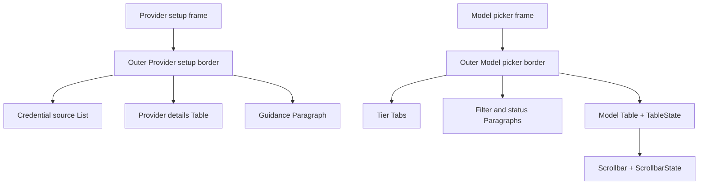

# Design: provider-setup-widget-layout

## Technology Decisions

| Concern | Decision | Rationale |
|---|---|---|
| TUI rendering | Keep the existing Ratatui and Crossterm terminal loop | The behavior and input handling already work; the change is a presentation refactor rather than a new interaction model. |
| Ratatui API | Use the currently locked `ratatui` 0.30.2 API, verified in `Cargo.lock` and against the 0.30 widget documentation | `Block`, `List`, `Table`, `Paragraph`, `Tabs`, `TableState`, and `ScrollbarState` provide the requested structure and keep selection/overflow behavior stateful. |
| Provider setup composition | One outer bordered block containing fully stacked credential-source list, provider-details table, and guidance paragraph | Each part of setup has a distinct visual role while the existing endpoint, credential, validation, and confirmation stages remain unchanged. Stacking keeps the layout legible at the supported terminal size. |
| Model picker composition | An outer bordered block containing fully stacked tier tabs, filter/status paragraphs, and a stateful model table with a right-side scrollbar | The active tier, model metadata, selected row, and list position are visible at the same time without relying on a horizontal split. |
| Selection state | Continue storing the active tier and selected row in the existing dialog loop; create `TableState` and `ScrollbarState` from that state for each render | Keyboard behavior and persistence do not need a new domain model. The table automatically keeps the selected row visible. |
| Model columns | Render model id, context length, pricing, and supported features as separate columns | The existing metadata formatter is useful for text output but does not provide scan-friendly alignment. |
| Model search | Debounce typed queries for 200 ms, execute the blocking provider search on a worker thread, and discard stale generations | Search cannot block frame redraws; the existing generation counter gives newest-result-wins behavior without changing the provider API. |
| Terminal test driver | Existing `portable-pty` harness with `httpmock` loopback fixtures | Provider setup and model picking are CLI interactions; a PTY observes the actual rendered terminal output and keeps tests independent of live provider APIs. |

The dependency version above was checked in the repository's `Cargo.lock` on
the design date. No dependency update is required.

## Architecture Impact

### `src/provider/setup.rs`

- Replace the paragraph-only `draw_setup` body with a widget composition.
- Render `Block::bordered().title("Provider setup")` over the complete frame.
- Render the credential choices as a stateful `List`, selecting Paste or
  Environment according to the existing `CredentialSource` state.
- Render endpoint, credential source, and masked/current value as rows in a
  `Table`.
- Render the stage hint and validation text in a wrapped `Paragraph`.
- Use a vertical layout: source list first, details table second, and guidance
  last. The layout is designed for the existing 120-column by 40-row terminal
  harness and does not introduce a provider-selection list.
- Remove direct cursor movement and raw stdout writes from the renderer. The
  Ratatui frame is the single source of visible setup output.
- Leave `run_interactive_inner`, validation, cancellation, and draft creation
  unchanged.

### `src/models/dialog.rs`

- Keep the existing guided small, normal, thinking flow, search behavior,
  reasoning cycling, and key mappings, while moving search work off the draw
  loop.
- Change `draw` to render an outer `Block` titled `Model picker`.
- Render the three `TIERS` as `Tabs`, selecting the current `level`.
- Render the current query and the existing status/help text as paragraphs.
- Convert each `ModelEntry` into a `Row` with separate model, context, price,
  and feature cells. Render rows with a `TableState` selected at the current
  index and a row highlight style.
- Render a vertical `Scrollbar` beside the table using a `ScrollbarState` whose
  content length is the number of suggestions and whose position is the current
  selection. The scrollbar remains present when the list overflows; it is
  hidden when the list fits the table viewport or has no rows.
- Render empty results and unsupported-search messages in the status paragraph,
  with no selectable placeholder row. Long cells are allowed to truncate, but
  model IDs remain the first table column.
- Keep an `Active tier: <name>` label in the frame so navigation tests and users
  can distinguish the highlighted tab without depending on color escape codes.

The provider setup layout is fully stacked: a credential-source list, then a
details table, then a guidance/status paragraph. The model picker is also fully
stacked: header, tier tabs, filter, model table, and status/help. The scrollbar
occupies the right edge of the table region.

### Asynchronous search

On each non-empty query change, increment the existing generation counter and
start a short-lived worker that waits 200 ms. If the generation is still current,
the worker calls `execute_search` and sends the result to the dialog event loop
through a channel. A newer query invalidates older workers before they issue a
request and invalidates any older result before it is applied. The event loop
continues drawing and reading keys while the worker is pending. Empty queries
restore the full catalog immediately. Search errors retain the existing fallback
models and expose the error in the status paragraph; an empty successful result
exposes `(no models found)` without creating a selectable row.

The model picker keeps its current interaction contract: Up/Down and PageUp /
PageDown move the selected model, typed characters filter it, Tab cycles the
reasoning strength, Enter advances through the tier tabs, and Escape returns to
the previous tier. Enter is ignored while a debounced search is pending. The
tabs reflect that active tier; this change does not introduce a second
navigation path with different persistence semantics.

## Data Model Changes

None. `ProviderDraft`, `CredentialSource`, `ModelEntry`, tier selection, search
results, and persisted configuration remain unchanged.

## Step Definitions

The existing Cucumber-rs runner registers modules globally, so the new E2E
bindings are isolated by capability and use unique step text:

- `tests/steps/provider_setup_layout_steps.rs` — reuses the existing provider
  PTY start step and asserts the bordered setup panel, credential list, details
  rows, guidance paragraph, validation message, and masked value in the real
  terminal output. It must not redeclare the provider start step.
- `tests/steps/model_picker_layout_steps.rs` — starts `watn models` through the
  existing PTY harness and asserts the bordered picker, tier tabs, aligned
  column headings, scrollbar output, active-tier label, and navigation result.
- `tests/steps/mod.rs` — registers the two capability-specific step modules.

Existing Given steps provide the no-provider and long-model-list fixtures. The
new Then steps assert stable visible labels from the real PTY output; they do
not claim pixel or coordinate alignment. PTY helpers wait for a stable title,
snapshot the frame, send Escape or Ctrl-C, reap the child, and drain the reader
even when an assertion fails.

## Test Runner And Strict Mode

- Verify all non-E2E scenarios: `cargo test --test features_runner -- --tags
  'not @wip and not @e2e'`
- Verify this change's E2E scenarios: `cargo test --test features_runner --
  --tags '@e2e and not @wip'`
- Run one scenario: `cargo test --test features_runner -- --name 'Provider
  setup separates choices, details, and guidance'`
- Strict mode is enforced by `.fail_on_skipped()` in
  `tests/features_runner.rs`; undefined or pending steps fail the runner.

The configured commands are in `givn/commands.yaml` and execute the feature
files under both `givn/specs/` and the active change's `givn/changes/*/specs/`.

## E2E Smoke-Test Infrastructure

- Interface type: CLI terminal UI.
- Driver: the existing `portable-pty` subprocess harness, which starts the
  compiled `watn` binary with a real PTY, sends no selection input for these
  layout smoke tests, and reads the rendered terminal stream.
- Provider fixture: `httpmock::MockServer` is used by existing setup fixtures;
  the provider-layout scenario only needs the setup screen and does not call a
  live provider.
- Model fixture: the existing long-list model endpoint is served by
  `httpmock::MockServer` on loopback, so the table has enough rows to require a
  scrollbar.
- E2E strict mode uses the same Cucumber-rs `.fail_on_skipped()` builder and
  the `@e2e and not @wip` filter.

The PTY is opened at 120 columns by 40 rows. Assertions use stable titles,
column headings, status text, and active-tier labels rather than terminal
coordinates or color escape sequences. Exact-fit and empty-list behavior is
covered by the model search status path; narrow-terminal rendering is limited
to the declared truncation and wrapping policy.

## Local Runnability And Digital Twins

- Application command: `cargo run -- provider` or `cargo run -- models`.
- Full verification command: `cargo test --test features_runner -- --tags
  'not @wip and not @e2e'`; the E2E command above exercises the real binary.
- No Docker service, database, queue, or shared network is required. The
  project is a single CLI and all provider calls in tests use loopback mocks.
- Digital twin for every external dependency: provider model/chat HTTP APIs are
  represented by `httpmock::MockServer`; no scenario contacts a live provider.

The interface obstacle is terminal control sequences in captured PTY output.
The layout steps normalize those sequences before checking stable visible text,
while the process still runs through the real PTY and Ratatui renderer.

## Interaction Coverage Matrix

| Inventory entry | @e2e scenario title | Real interface | Driving mechanism |
|---|---|---|---|
| start `watn provider` in a terminal and inspect the provider setup layout | Provider setup separates choices, details, and guidance | CLI | `portable-pty` starts `watn provider`; the step waits for the titled frame, checks stable panel/list/table/paragraph labels, then sends Escape and reaps the child. |
| start `watn models` in a terminal and inspect the model picker layout | Model picker makes tiers and long model lists easy to scan | CLI | `portable-pty` starts `watn models` against a loopback `httpmock` catalog with 40 models, checks tabs/table/scrollbar labels, sends Down + Enter to observe the normal-tier label, then cleans up. |
