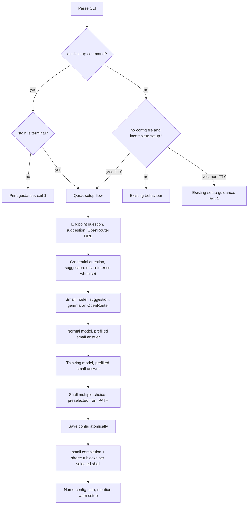

# Design: quicksetup-first-run

## Scope And Decisions

- The quick setup is a plain-line interactive flow: one question at a time,
  printed to stdout, answered by reading a line from stdin. No ratatui, no
  raw mode, no alternate screen. An empty answer accepts the shown
  suggestion; a suggestion is rendered in brackets after the prompt.
- New module `src/quicksetup.rs` (registered in `src/lib.rs`). It owns the
  prompt sequence, validation, persistence, and shell installation. The
  existing wizard in `src/setup.rs` is not modified.
- New subcommand `quicksetup` (`Commands::Quicksetup` in `src/main.rs`) with
  dispatch through a `run_quicksetup_command()` that mirrors the guard
  pattern of the other setup commands: non-TTY prints guidance and exits 1;
  TTY loads the config and runs the flow.
- First-run interception in the request path (`src/main.rs` TTY branch of the
  incomplete-setup check): when no config file exists, the quick setup runs
  instead of `watn::setup::run_with_config(.., SetupEntryPoint::Setup)`. When
  a config file exists but is incomplete, the existing full wizard stays.
  Detection via a new `pub fn config_file_exists()` in `src/config/mod.rs`
  (`xdg_config_path().exists()`); `load_config()` alone cannot distinguish
  "missing" from "default".
- Suggestions:
  - Endpoint: `OPENROUTER_ENDPOINT` (`https://openrouter.ai/api/v1`).
  - Credential: when `suggested_api_key_env(endpoint)` names an environment
    variable that is set and non-empty, suggest the reference form
    `${ENV_NAME}` (persisted verbatim, resolved at request time by the
    existing expansion); otherwise suggest nothing and require input.
  - Small model: `google/gemma-4-flash` when the accepted endpoint is the
    OpenRouter endpoint, otherwise nothing.
  - Normal and thinking models: prefilled with the accepted small-model
    answer.
- Validation reuses existing seams: `normalize_endpoint` for the endpoint
  (invalid input re-asks), non-empty check for credentials and models
  (empty answer with empty suggestion re-asks). No network probing: the
  endpoint is never contacted, no catalog request is made. The configured
  endpoint is stored as given (normalized).
- Reasoning: no reasoning question is asked and no reasoning value is
  written. `tiers.*.model` are set; `tiers.reasoning` stays absent. The
  existing request-time semantics are unchanged (unset thinking reasoning
  still defaults to `high` when that tier is used).
- Shell question: one multiple-choice list for Bash, Zsh, and Fish rendered
  with `[ ]`/`[x]` rows. Plain-line answer contract (no raw mode): typing one
  or more shell names (space-separated, case-insensitive) toggles those rows
  and re-renders the list; an empty line confirms the current selection. A
  selected shell receives BOTH the completion block and the Ctrl-W shortcut
  block. Rows are pre-selected from a new PATH-based detection: for each
  `Shell`, scan `$PATH` directories for an executable file named exactly the
  shell's lowercase name. This is a new helper (`Shell::available_on_path()` /
  `shells_available_on_path()` in `src/shell_shortcut.rs`); the existing
  `$SHELL`-based `detected_shells()` keeps its semantics and callers.
- Persistence at confirm: derive the provider name from the endpoint with
  the existing `provider_name()` (openrouter/openai/custom), build the draft
  with `build_provider_draft`, store endpoint and credential through the
  existing provider-draft migration path (`config::update_provider_draft`),
  set `defaults.provider`, write the three tier models, save with
  `save_config` (atomic, 0600). Then install, for every selected shell,
  `shell_completion::install_with_environment` and
  `shell_shortcut::install_with_environment`. Installation runs only after a
  successful config save; a failed save installs nothing and reports the
  error; a failed install after a successful save keeps the saved
  configuration and reports a nonzero aggregated result (mirroring
  `apply_result`).
- Closing output names the config file location and states that
  `watn setup` changes the configuration later. The run ends there; an
  original request that triggered the first-run quick setup is not sent
  automatically.
- Prompt output contract: every prompt is written to stdout and flushed
  (`io::stdout().flush()`) before the line read; Rust's line buffering would
  otherwise withhold prompt text without a trailing newline and PTY
  assertions would time out.
- Entry-contract placement: the quick setup replaces the wizard only inside
  the existing implicit-selection gate in the request path
  (`!explicit_provider && !explicit_model`, where `WATN_PROVIDER` counts as
  explicit). A first run with `WATN_PROVIDER`, `--provider`, or `--model`
  never reaches the quick setup; the placement of the `config_file_exists()`
  check must stay inside that gate.
- Ctrl-C is not trapped on the quick setup path: default SIGINT terminates
  the process before any write (nothing is persisted before the final
  confirm), so abort is side-effect free by construction. Abort scenarios
  assert state, not exit status (signal death is not reported as exit code
  130 through the PTY harness).
- No new dependencies. crossterm/portable-pty/tempfile are already in the
  tree and unused by the quick setup itself.



## Architecture Impact

- `src/lib.rs`: `pub mod quicksetup;`
- `src/quicksetup.rs`: new. Public surface: `run_quicksetup(...) -> Result<QuickSetupOutcome, Error>` and `QuickSetupOutcome` (saved/cancelled). Internal: prompt helpers, suggestion resolution, shell-selection state.
- `src/main.rs`: new `Commands::Quicksetup` variant + dispatch; the TTY first-run branch swaps to the quick setup when `config::config_file_exists()` is false.
- `src/config/mod.rs`: `pub fn config_file_exists() -> bool`.
- `src/shell_shortcut.rs`: PATH-based availability helper alongside the existing detection.
- No config schema change; no changes to the wizard, models, provider transport, or output modules.

## Step Definitions

- `tests/steps/quicksetup_steps.rs` — the one step file for this capability.
  It implements the quicksetup Given/When/Then steps: isolation fixture,
  PATH stubs, PTY start, per-question answers (accept suggestion, enter
  value, empty answer, shell-list toggles), abort, config and shell-target
  assertions, non-TTY guidance run. PTY driving reuses
  `start_pty_session` / `pty_write` / `pty_wait_for_label` /
  `finish_pty_session` from `tests/steps/mod.rs`.
- `tests/steps/mod.rs`: add `pub mod quicksetup_steps;`
- `tests/steps/shell_completions_e2e_steps.rs`: update the authoritative
  options-and-subcommands list inside the built-binary e2e step ("authoritative
  root options and subcommands") to include `quicksetup`. The table-driven
  regular steps in `tests/steps/shell_completions_steps.rs` read the scenario
  tables and need no change.

## Test Infrastructure

### Real-configuration protection (mandatory)

The quick setup writes real user files (config.toml, ~/.bashrc, ~/.zshrc,
fish config). The test harness must never let a scenario touch the runner's
real files.

- Every step in `tests/steps/quicksetup_steps.rs` that starts a subprocess or
  PTY session calls `isolate_quicksetup_env(world)` first. The helper:
  1. creates a fresh `tempfile::TempDir` (stored in `WatnWorld.temp_dir`),
  2. sets `HOME` and `XDG_CONFIG_HOME` in `world.env_vars` to that directory
     (both override the inherited values because the PTY/subprocess env loop
     applies `world.env_vars` last),
  3. **replaces** `PATH` in `world.env_vars` with exactly `<tmp>/bin` —
     prepending is insufficient because the real PATH still contains real
     shell binaries (e.g. `/usr/bin/fish` on this runner) that availability
     detection would find. Replacement is safe: the watn binary is spawned
     by absolute path (`find_binary` → `CommandBuilder::new(binary)`), and
     shell rc targets resolve via `HOME`/`XDG_CONFIG_HOME`, not `PATH`,
  4. then asserts — panics otherwise — that `HOME` and `XDG_CONFIG_HOME` are
     set and point inside the temp directory. This fail-fast guard makes an
     un-isolated spawn impossible to miss.
- Shell-availability stubs are empty executable files named `bash`, `zsh`,
  `fish` created in `<tmp>/bin` as each scenario requires ("fish not
  available" simply omits the stub). Real shell binaries are never invoked;
  shell rc targets resolve under the isolated `HOME` at child runtime
  (`ShellEnvironment` reads the environment in the spawned process).
- Nothing is persisted before the final confirm, so abort and re-ask paths
  write nothing at all; the guard ensures any accidental write lands in the
  temp directory, never in the real `config.toml`, `~/.bashrc`, `~/.zshrc`,
  or fish config. The existing `WATN_TEST_FAIL_CONFIG_WRITE` seam stays
  available for write-failure paths.
- Mechanical audit before archive: grep `tests/steps/quicksetup_steps.rs` and
  confirm every `start_pty_session` / `run_binary_with_state` call site is
  preceded by `isolate_quicksetup_env`; the helper's panic is the runtime
  enforcement.

### Local runnability and E2E

- The system is a single CLI: no application server, database, or third-party
  service. No digital twin is required; the quick setup performs no network
  requests. An httpmock sentinel via `WATN_TEST_ENDPOINT_OVERRIDE` is
  installed in the first-run and overwrite scenarios purely as an
  observability seam to prove zero requests; the first-run sentinel steps
  must not set `WATN_PROVIDER`, which would skip the quick setup branch
  entirely.
- E2E runner command (givn/commands.yaml `verify.e2e_command`):
  `./run-tests.sh --e2e` — runs `--tags '@e2e and not @wip'` against the real
  built binaries. Regular scenarios: `./run-tests.sh` (`not @wip and not
  @e2e`).
- Real interface: CLI in a real PTY (portable-pty, 40x120,
  `TERM=xterm-256color`), driven by writing actual keystrokes and asserting
  rendered output and persisted files — the same fidelity the existing setup
  wizard e2e steps use.
- Strict mode: `.fail_on_skipped()` in `tests/features_runner.rs` (already
  configured) fails undefined/pending steps; RED step bodies use
  `unimplemented!()`, never empty bodies.
- Version freshness: no new or upgraded dependencies are introduced; all
  crates used already exist in `Cargo.toml`/`Cargo.lock` at their pinned
  versions.

### Interaction Coverage Matrix

| Inventory entry | @e2e scenario title | Real interface | Driving mechanism |
|---|---|---|---|
| start quick setup automatically on the first run without a config file | First run without a configuration starts the quick setup | CLI | `quicksetup_steps.rs` starts `watn "hello"` in a PTY after `isolate_quicksetup_env`, asserts the announcement and endpoint suggestion in the rendered output |
| complete quick setup: answer questions, choose shell integrations, confirm | Completing the quick setup stores the answers and installs the chosen integrations | CLI | PTY session driven by `pty_write` keystrokes (Enter and typed shell names) through all five questions and the shell list; `finish_pty_session` captures exit, then config and rc-file assertions run against the isolated HOME |
| run `watn quicksetup` explicitly with an existing configuration | Explicit quick setup overwrites an existing configuration | CLI | PTY session with typed endpoint/credential/model answers and typed shell-name deselects; asserts overwritten config, zero sentinel requests, unchanged shell targets |
| abort quick setup with Ctrl-C | Aborting quick setup with Ctrl-C on the first run leaves no configuration | CLI | PTY session started by the first-run trigger and aborted with the Ctrl-C keystroke; asserts no config file, unchanged shell targets, and zero sentinel requests under the isolated HOME |

The remaining scenarios are regular variants and distinct invariants of these
four actions: no-reasoning questions, PATH-based pre-selection, re-ask on
empty required input, the OpenAI endpoint suggestion variant, the explicit
provider-selection bypass, explicit-run abort, non-TTY guidance, config-write
failure, and shell-install failure after a successful save.

## Single-Scenario Command

```text
root=$(mktemp -d /tmp/watn-quicksetup.XXXXXX) && trap 'rm -rf "$root"' EXIT && cargo build --bin watn && cp target/debug/watn "$root/default-debug" && cargo build --features test-support --bin watn && cp target/debug/watn "$root/test-support-debug" && WATN_DEFAULT_DEBUG_BIN="$root/default-debug" WATN_TEST_SUPPORT_DEBUG_BIN="$root/test-support-debug" cargo test --test features_runner --features test-support -- --name "First run without a configuration starts the quick setup"
```

The configured wrappers `./run-tests.sh` and `./run-tests.sh --e2e` remain
the full verification commands.

## Implementation Order

1. `config_file_exists()` and the PATH-based shell availability helper.
2. `src/quicksetup.rs`: prompts, suggestions, validation, persistence, shell install.
3. CLI wiring: `quicksetup` subcommand, non-TTY guidance, first-run branch swap.
4. `tests/steps/quicksetup_steps.rs` with `isolate_quicksetup_env` guard and PATH stubs; RED→GREEN per scenario.
5. Update the shell-completions authoritative-tree step data; run full verify, review, archive.
