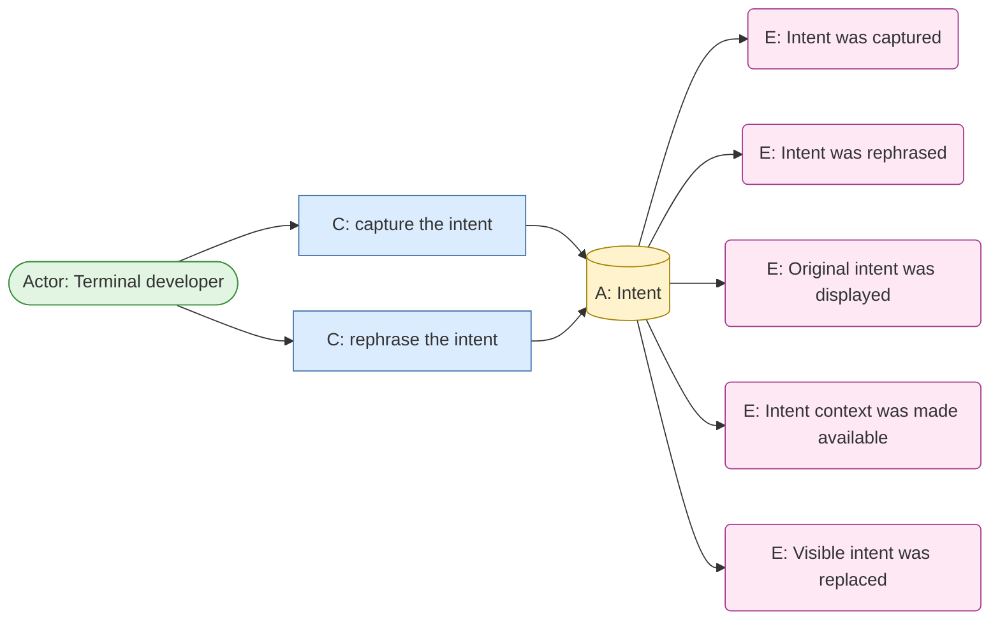
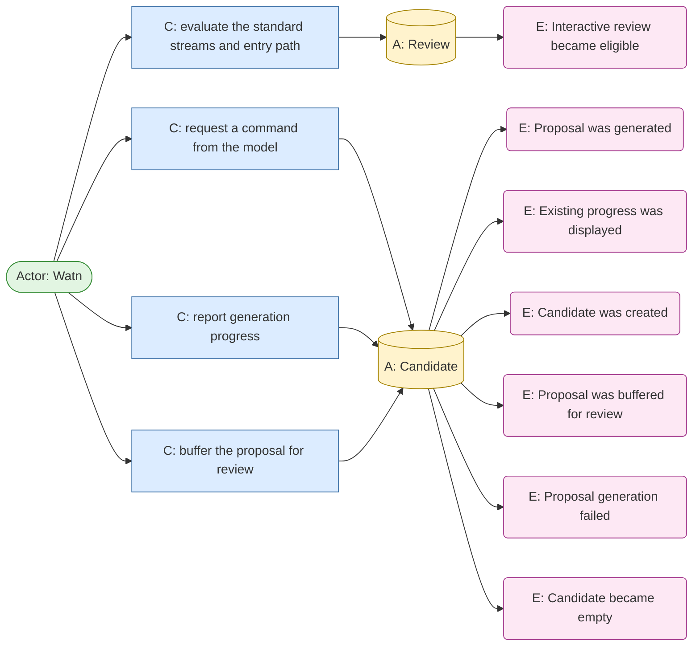
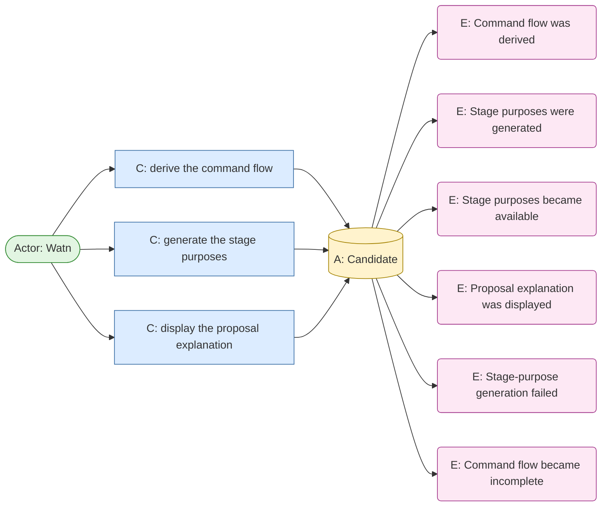
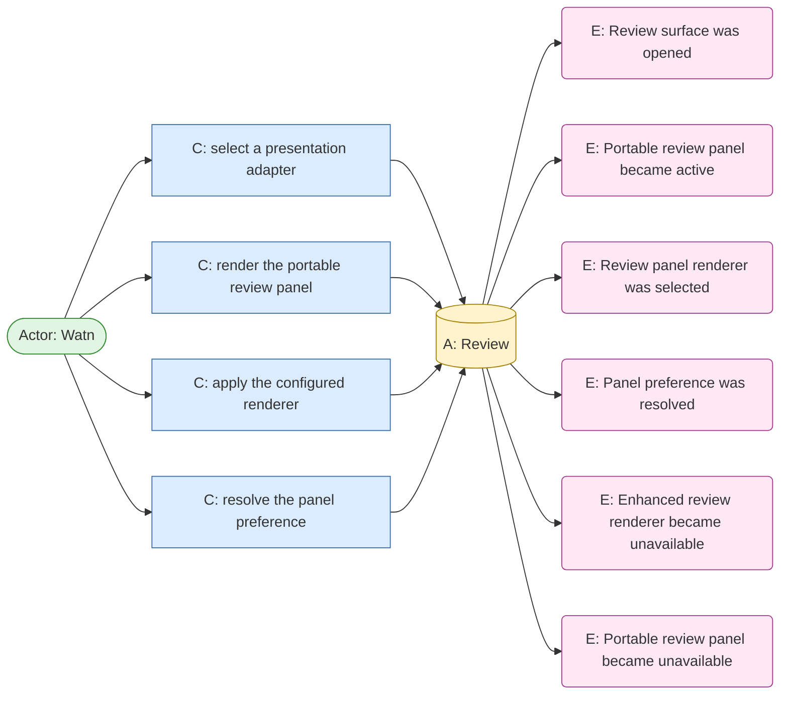
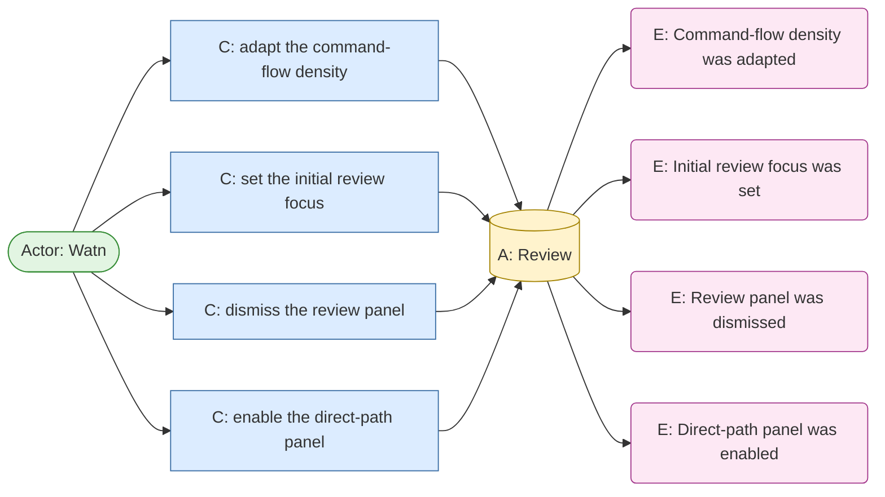
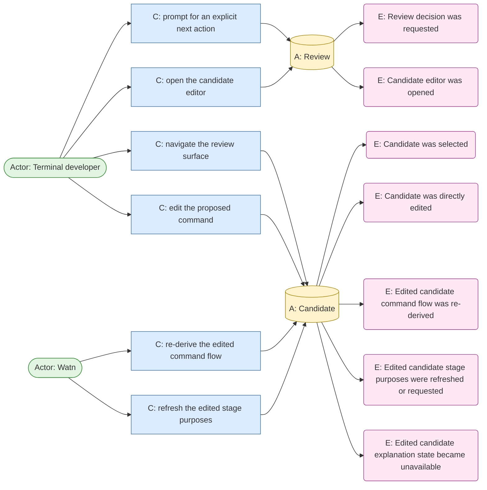
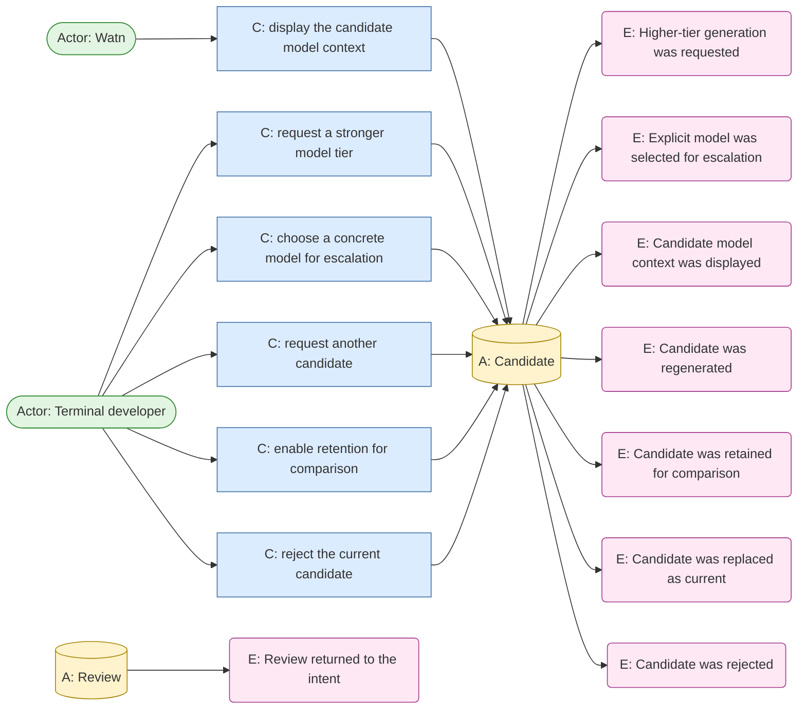
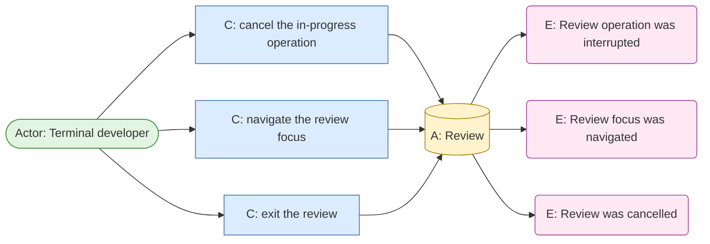
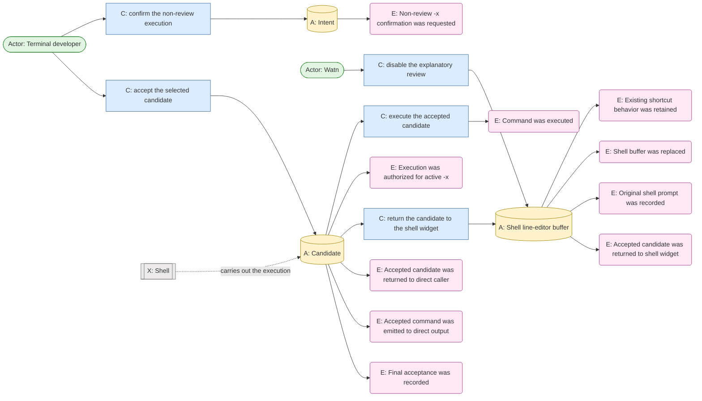

# Event Storming: terminal-wow-factor

## Boundary

The event storm covers the interactive explanatory review interaction. The
permanent user-goal owner is `use-shell` for Ctrl-W and shell-buffer
replacement. Existing asking/execution behavior consumes the same interaction
for direct positional questions, interactive stdin, and `-x`.

Non-TTY pipes retain the existing raw output contract and are outside this
interactive event chain.

## Initial event chain

| Domain event | Actor / command | Aggregate | Policy | Actor reads | Existing ownership |
|---|---|---|---|---|---|
| Intent was captured | Terminal developer invokes Ctrl-W or submits an interactive question | Intent | Capture the complete intent without shell expansion or loss of context | Current shell buffer or interactive question | Existing `use-shell` shortcut / asking behavior |
| Interactive review became eligible | Watn evaluates the three standard streams and entry path | Review | Open review only when direct invocation has terminal stdin, stdout, and stderr; preserve raw behavior otherwise | TTY state and entry path | New boundary over existing TTY behavior |
| Proposal was generated | Watn requests a command from the selected model | Candidate | Preserve the existing provider request, streaming, failure, and tier rules | Generated command content and completion metadata | Existing asking behavior |
| Existing progress was displayed | Watn reports generation progress before a candidate exists | Candidate | Preserve the familiar progress feedback across all review renderers | Generation status and elapsed time | Existing asking behavior |
| Candidate was created | Watn records the generated command as a selectable candidate | Candidate | Give each candidate a review identity for comparison and selection | Candidate command and generation context | New shared review boundary |
| Proposal was buffered for review | Watn withholds eligible proposal output from command stdout | Candidate | No command leaves an eligible review path before final acceptance | Buffered candidate content and output destination | New shared review boundary |
| Command flow was derived | Watn examines the generated command structure | Candidate | Show syntactic pipeline and control-flow structure without claiming semantic safety | Command text, pipeline stages, pipes, `&&`/`||`, redirections, and `xargs` boundaries when present | New capability; exact parse coverage open |
| Stage purposes were generated | Watn receives or requests model-written purposes for command-flow stages | Candidate | Prefer one coherent response; fall back to a separate explanation operation; keep the command reviewable if explanation fails | Stage purposes and explanation status | New capability; provider contract parked for Design |
| Stage purposes became available | Explanation operation completes while the review panel is active | Candidate | Update the visible candidate explanation without changing candidate selection | Candidate and stage-purpose state | Shared review boundary |
| Review surface was opened | Watn selects a presentation adapter | Review | Use a Kitty overlay when available and a portable fallback otherwise; presentation must not become command output | Terminal capability and current review state | New capability; transport mechanics parked for Design |
| Portable review panel became active | Watn renders a small transient UI through the controlling terminal while reserving stdout for the accepted command | Review | Use ordinary ANSI terminal behavior so menus, redraw, and timer animation work across modern terminal emulators without switching to a full-screen alternate display | Controlling-terminal availability and review state | Shared review boundary; exact TTY descriptor and shell repaint mechanics parked for Design |
| Review panel renderer was selected | Watn applies the configured/default renderer after the progress phase | Review | Enable the default panel unless disabled; permit a Kitty-specific or future renderer to replace it without changing review behavior | Renderer preference and terminal capabilities | Shared review boundary; renderer discovery mechanics parked for Design |
| Panel preference was resolved | Watn combines persistent preference, per-invocation override, and detected renderer capabilities | Review | Explicit invocation override wins; otherwise use the configured default and auto-select an enhanced renderer when available | Configured preference, CLI override, and terminal capabilities | Shared review boundary |
| Existing shortcut behavior was retained | Panel is disabled by configuration or invocation override | Shell line-editor buffer | Skip explanatory review and preserve current direct command replacement | Panel preference and current shell buffer | `use-shell` |
| Command-flow density was adapted | Panel dimensions cannot show every stage at full detail | Review | Show all stages when possible; otherwise show a compact overview and one readable selected stage | Terminal dimensions and stage selection | Shared review boundary; layout mechanics parked for Design |
| Initial review focus was set | Panel opens with a candidate ready | Review | Focus final acceptance while keeping the command-flow view visible and navigable | Candidate and focus state | Shared review boundary |
| Review panel was dismissed | Candidate was accepted or review was cancelled | Review | Remove the transient panel immediately and restore the shell prompt | Review outcome and original/accepted buffer | `use-shell` for Ctrl-W; shared consumer boundary for direct paths |
| Direct-path panel was enabled | Eligible direct positional, interactive-stdin, or `-x` invocation uses the default-on setting or override | Review | Apply the same review interaction to every eligible path | Entry path, stream eligibility, panel preference | Shared review boundary consumed by asking/execution behavior |
| Accepted command was emitted to direct output | Direct positional or interactive-stdin review was finally accepted | Candidate | Emit only the selected command through normal command output; keep flow and explanation in the controlling-terminal panel | Selected candidate and output destination | Existing asking behavior |
| Original shell prompt was recorded | Ctrl-W review was finally accepted | Shell line-editor buffer | Record the flattened original natural-language prompt in shell history before replacing the buffer | Original shell prompt and accepted candidate | `use-shell` |
| Proposal explanation was displayed | Review surface presents the command, derived flow, and model-written stage purposes | Candidate | Keep the proposed action legible; explanations are advisory and never semantic safety verdicts | Generated command, flow representation, stage purposes, model/tier context | New capability |
| Review decision was requested | Review surface prompts for an explicit next action | Review | Offer accept, edit, reject, cancel, rephrase, and higher-tier request | Current proposal and available actions | New capability |
| Candidate was selected | Terminal developer navigates the review surface | Candidate | One candidate is the target of final acceptance | Retained candidates and current selection | New shared review boundary |
| Candidate was directly edited | Terminal developer edits the proposed command | Candidate | Direct editing does not alter the original intent; it creates refreshed candidate explanation state | Edited command text and original intent | New shared review boundary |
| Edited candidate command flow was re-derived | Watn examines the edited command | Candidate | Recalculate structure for the current edited candidate | Edited command and derivation result | New shared review boundary |
| Edited candidate stage purposes were refreshed or requested | Watn obtains updated purposes for the edited candidate | Candidate | Prefer coherent response and use adaptive fallback; preserve reviewability on failure | Edited candidate, purpose status | New shared review boundary |
| Edited candidate explanation state became unavailable | Explanation refresh or flow derivation failed after a direct edit | Candidate | Keep the raw edited command reviewable and mark explanation unavailable or unsupported | Edited candidate and explanation status | New shared review boundary |
| Intent was rephrased | Terminal developer changes the original request | Intent | Start a new proposal cycle; replacement is default unless comparison is explicitly retained | Original intent and revised intent | Shared review interaction |
| Higher-tier generation was requested | Terminal developer requests a stronger model tier | Candidate | Generate a new candidate using the selected higher tier; replacement is default unless comparison is explicitly retained | Current intent, selected tier, existing candidates | Existing asking behavior plus shared review interaction |
| Explicit model was selected for escalation | Terminal developer chooses a concrete model when no higher configured tier exists | Candidate | Generate the next candidate with the selected model without changing the intent | Current intent, explicit model, existing candidates | Existing asking behavior plus shared review interaction |
| Candidate model context was displayed | Review surface presents tier or explicit model context beside each retained candidate | Candidate | Make model differences visible during comparison without treating model choice as a quality verdict | Candidate list and model context | New shared review boundary |
| Original intent was displayed | Review surface keeps the captured intent visible beside the current or compared candidates | Intent | Direct command editing must not silently alter the intent | Original intent and candidate history | New shared review boundary |
| Intent context was made available | Review surface provides a persistent collapsible context panel for the original intent | Intent | Keep intent context available without forcing it to occupy the primary command-flow view | Original intent and panel state | New shared review boundary |
| Visible intent was replaced | Terminal developer explicitly rephrases the request | Intent | Show the rephrased intent as active while retaining prior intent only in current-review history | Current and prior intent history | Shared review interaction |
| Review operation was interrupted | Terminal developer cancels generation, explanation, or model selection | Review | Cancel only the in-progress operation and preserve the selected candidate and review state | Operation status and current review state | Shared review interaction |
| Review focus was navigated | Terminal developer uses Tab, Shift-Tab, or arrows | Review | Cycle Flow, Candidates, and Actions regions; navigate within the focused region | Focus region and selected stage/candidate/action | Shared review interaction |
| Candidate editor was opened | Terminal developer selects direct command editing | Review | Enter commits an edit; Escape discards it and returns to review | Selected candidate and editor buffer | Shared review interaction |
| Candidate was regenerated | Terminal developer requests another candidate for the current intent and tier | Candidate | Generate without changing the intent or tier | Current intent, tier, existing candidate history | Existing asking behavior plus shared review interaction |
| Candidate was retained for comparison | Terminal developer explicitly enables retention | Candidate | Keep generated and edited candidates from the current review available for comparison only | Current review history | New shared review boundary |
| Candidate was replaced as current | Review interaction applies default replacement after rephrase, escalation, or regeneration | Candidate | Remove the prior candidate from current selection while retaining it only if comparison was explicitly enabled | Candidate history and replacement choice | New shared review boundary |
| Candidate was rejected | Terminal developer rejects the current candidate | Candidate | Discard the current candidate from active selection and keep review active | Current intent and candidate state | New shared review boundary |
| Review returned to the intent | Review interaction exposes next actions after rejection | Review | Let the developer choose rephrase, higher-tier request, or regeneration | Original intent and available next actions | New shared review boundary |
| Review was cancelled | Terminal developer exits review | Review | Preserve original shell/input state and release no command | Original input snapshot | `use-shell` for Ctrl-W; consumers for direct paths |
| Final acceptance was recorded | Terminal developer accepts the currently selected candidate | Candidate | Every candidate, including directly edited candidates, requires explicit final acceptance | Selected candidate and explanation status | New shared review boundary |
| Accepted candidate was returned to direct caller | Review interaction completes for direct positional or interactive stdin input | Candidate | Release only the selected command after final acceptance | Selected candidate | Existing asking behavior consumes shared result |
| Accepted candidate was returned to shell widget | Review interaction completes for Ctrl-W | Shell line-editor buffer | Return only the selected command through the distinct review result channel | Selected candidate and original shell buffer | `use-shell` |
| Shell buffer was replaced | Shell widget applies the accepted candidate | Shell line-editor buffer | Replace only after final acceptance; never evaluate during replacement | Accepted candidate and shell buffer snapshot | `use-shell` |
| Execution was authorized for active `-x` | Terminal developer accepted a candidate with `-x` in an eligible review | Candidate | Require both `-x` opt-in and final acceptance; do not show a second confirmation prompt | Selected candidate and `-x` intent | Existing execution behavior consumes shared result |
| Command was executed | Execution boundary runs the accepted candidate for active `-x` | Candidate | Execute only after review authorization; no review generation or display alone executes | Authorized candidate | Existing execution behavior |
| Non-review `-x` confirmation was requested | Any direct `-x` path is not review-eligible | Intent | Preserve the existing `Execute now?` confirmation behavior | Generated command and stream eligibility | Existing execution behavior |
| Proposal generation failed | Provider request or stream failed before a reviewable candidate existed | Candidate | Preserve visible failure semantics and release no command | Request status and any partial provider output | Existing asking behavior |
| Candidate became empty | Proposal or edited command contained no usable command text | Candidate | Keep review from releasing an empty command | Candidate content and validation status | Shared review boundary |
| Stage-purpose generation failed | Adaptive explanation response or fallback operation failed | Candidate | Keep the command reviewable with explanation-unavailable status | Candidate, flow, and explanation status | Shared review boundary |
| Command flow became incomplete | Structural derivation could not cover all command syntax | Candidate | Mark unsupported portions visibly and preserve review decisions | Candidate command and derivation status | Shared review boundary |
| Enhanced review renderer became unavailable | Kitty, tmux/zellij, or another selected enhanced renderer could not open or continue | Review | Fall back to the portable small inline panel and preserve the current review state | Enhanced-renderer status and current review state | Shared review boundary; adapter mechanics parked for Design |
| Portable review panel became unavailable | The required small inline panel could not open or continue | Review | Abort safely, preserve the original input state, and release no command | Portable-panel status and original input snapshot | Shared review boundary; terminal mechanics parked for Design |

## Canvas

The chain is drawn as one diagram per coherent flow. Every event, its command,
its aggregate, and the issuing actor appear; the shape prefixes name the kind
(`E:` event, `C:` command, `A:` aggregate, `Actor:` actor, `X:` external
system, `Record:` record, `Spec:` specification, `Config:` configuration,
`RM:` read model). The aggregates are the closest roots this topic's own
records declare: `Intent` and `Candidate` are declared domain terms
(`domain-terms.md`, `docs/arc42/12-glossary.md`); `Review` is the interaction
named by the glossary's `Review decision`/`Review outcome`/`Review history`
family and by `docs/arc42/06-runtime-view.md` (*the review surface owns one
Candidate and process-local current-review history*) — the glossary's caveat
that the surface itself is *not the domain boundary* is why the boundary is
drawn as the `Review`, not the surface; and `Shell line-editor buffer` is the
declared glossary term for the Ctrl-W buffer. `Watn` is the system actor issuing
its own commands. `Shell` is external: execution stays the shell's
responsibility (`questions.md` Q2), so its execution fact is recorded against
the accepted `Candidate`.

Aggregate status: watn's glossary declares no aggregate list yet, so the four
roots above are **candidates** under the event storming rule — a new aggregate
is a domain term confirmed before a canvas relies on it. This retrofit draws
the roots the topic's own records name and flags them for confirmation
(`Intent`, `Candidate`, `Review`, `Shell line-editor buffer`).

### Intent capture and rephrasing

### Review eligibility and proposal generation

### Command flow and stage purposes

### Review surface opening and renderer

### Review layout, focus, dismissal, and the direct path

### Decisions, selection, and direct editing

### Escalation, regeneration, comparison, and rejection

### Interruption, focus navigation, and cancellation

### Acceptance, routing, buffer replacement, and execution

## Path-specific outcomes

| Entry path | After final acceptance | Non-review fallback |
|---|---|---|
| Direct positional question with all three streams attached to terminals | Selected command is returned through the direct interactive output path | Raw existing output when any standard stream is redirected |
| Interactive stdin with all three streams attached to terminals | Selected command is returned through the direct interactive output path | Raw existing pipe output when stdin is non-TTY or another stream is redirected |
| Ctrl-W shell shortcut | Selected command is returned to the shell widget and replaces the shell buffer | Original shell buffer remains unchanged on reject, cancel, failure, or empty result |
| `-x` with all three streams attached to terminals | Selected command executes after `-x` opt-in and final review acceptance; no second confirmation prompt | Existing `Execute now?` confirmation remains when review is unavailable |

The review surface never executes a command merely because it generated or
displayed one. Direct command return and shell-buffer replacement are distinct
from execution.

## Parked questions

- The exact decision transport is a Design question. The domain invariant is
  that explanatory UI never becomes command output and the shell widget receives
  a distinct review result plus any selected command.
- The exact syntactic coverage of command-flow derivation is unresolved; the
  user-visible incomplete state is confirmed.
- The required portable presentation is resolved as a small transient inline
  ANSI panel. Its controlling-terminal, shell repaint, resize, and adapter
  mechanics remain Design work.

## Reverse narrative to walk next

Start from `Shell buffer was replaced after explicit acceptance` and walk
backwards through the selected proposal, review decision, review surface,
derived command flow, generated proposal, and captured intent. Then walk the
direct interactive and `-x` paths separately.

## Persona review

`terminal-developer--interactive` found the chain coherent with its goals:

- Control is preserved through buffering, explicit final acceptance, and
  separate execution authorization.
- Intent can be refined through rephrasing, escalation, regeneration, or direct
  command editing without requiring the developer to leave the terminal.
- Comparison and current-candidate selection make alternative proposals
  inspectable before acceptance.
- Unavailable explanations and incomplete command flows remain visible instead
  of being presented as semantic safety claims.

Persona demand: direct command editing must never silently alter the original
intent. Cancellation and failure must preserve the original shell/input state.

## Status

Initial chain confirmed by the user. Model-written stage purposes, adaptive
explanation, visible degradation, candidate lifecycle, output timing, and
path-specific outcomes are confirmed. Persona review is complete. Transport,
presentation fallback mechanics, provider response shape, and parser grammar
remain parked for Design.
