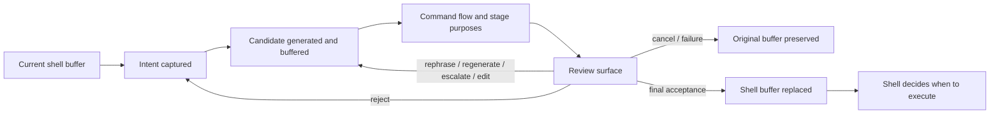

# Use case: use-explanatory-shell-shortcut

## Level

!

## Actors

- Terminal developer
- Shell line editor

## Goal

Use Ctrl-W to inspect a generated command as an explanatory command flow,
refine the intent or candidate, and replace the shell buffer only after explicit
acceptance without implicit execution.

## Trigger

The terminal developer presses Ctrl-W with a non-empty shell buffer in an
installed Watn shortcut.

## Preconditions

- Watn and the configured provider are available.
- The shell shortcut is installed for the active shell.
- The shell line editor provides the current buffer to the shortcut.
- The current buffer contains a non-empty intent.

## Main flow

1. Capture the complete shell-buffer intent without shell expansion.
2. Show the existing progress line while generating the candidate.
3. Generate a candidate for the intent and buffer it away from command output.
4. Derive the candidate's command flow.
5. Open the optional explanatory panel through the selected presentation
   renderer when enabled, showing stage purposes as loading.
6. Obtain model-written purposes for the command-flow stages, using the
   adaptive explanation path, and update the panel when they arrive.
7. Display the candidate, command flow, stage purposes, and explanation status.
8. Let the developer inspect, select, edit, rephrase, regenerate, request a
   higher tier, reject, cancel, or retain candidates for comparison.
9. Require explicit final acceptance of the selected candidate.
10. Return only the accepted candidate to the shell widget.
11. Replace the shell buffer with the accepted candidate without evaluating it.

## Extensions

- If the candidate is directly edited, re-derive its command flow and refresh or
  request stage purposes; preserve the original intent.
- If explanation generation fails, keep the raw candidate reviewable with an
  explicit unavailable explanation state.
- Open the panel as soon as the candidate exists while stage purposes load;
  update purposes in place when available.
- If command-flow derivation is incomplete, mark unsupported portions visibly
  and keep review decisions available.
- If a candidate is rejected, return to the original intent and let the
  developer choose rephrase, higher-tier request, or regeneration.
- If comparison is explicitly enabled, retain candidates from the current
  review and accept the currently selected candidate.
- If an enhanced renderer fails, fall back to the portable small inline panel
  and preserve the current review state.
- If the portable panel fails, or the review is cancelled, generation fails, or
  the candidate is empty, preserve the original shell buffer and release no
  command.
- Direct positional questions and interactive stdin consume the same review
  lifecycle but return the accepted candidate to their direct caller instead of
  replacing a shell buffer.
- An eligible `-x` invocation executes the accepted candidate after `-x` opt-in
  and final acceptance without a second confirmation prompt.
- A redirected or otherwise non-review-eligible `-x` invocation retains the
  existing `Execute now?` confirmation.

## Rules

- Review eligibility for direct invocation requires terminal stdin, stdout, and
  stderr; non-TTY pipes retain raw script-safe behavior.
- An eligible review path buffers candidate output until final acceptance.
- Rejection, cancellation, failure, and empty output release no command.
- Final acceptance is mandatory for generated and directly edited candidates.
- Direct command editing never changes the original intent.
- Rephrasing the intent starts a new candidate cycle.
- Higher-tier requests generate a new candidate for the current intent.
- Candidate replacement is the default after rephrase, escalation, or
  regeneration; retention for comparison is explicit.
- Comparison retention covers the current review only.
- The review surface always has one selected candidate for final acceptance.
- The explanation is advisory and never a semantic command-safety verdict.
- No review display or generation step executes a command.
- Ctrl-W replacement never evaluates the returned candidate.
- Active `-x` execution requires both `-x` opt-in and final review acceptance.

## Examples

- A shell buffer containing `find all large log files and compress them` opens
  a review surface showing the generated stages and a purpose for each stage.
- The developer edits `find` to narrow the path; Watn refreshes the command flow
  while retaining the original natural-language intent.
- The developer rejects a candidate, requests the thinking tier, compares both
  candidates, selects the stronger one, and accepts it.
- If the current candidate already uses the highest configured tier, the
  developer requests a higher tier, chooses an explicit model, and receives a
  new candidate for the same intent.
- When candidates use different tiers or explicit models, the review surface
  shows the model context associated with each candidate for comparison.
- The original natural-language intent remains visible while the developer
  directly edits a candidate or compares candidates.
- The original intent is available in a collapsible context panel throughout
  the review.
- When the developer rephrases the intent, the current visible intent replaces
  the prior one; the prior intent remains only in current-review history.
- Interrupting generation, explanation, or model selection cancels only that
  operation and preserves the selected candidate and review state.
- The required portable presentation is a small transient inline ANSI panel
  rendered on the controlling terminal; it does not switch to or occupy the
  full alternate screen, and stdout remains reserved for an accepted command.
- The existing progress line is always the baseline generation feedback. The
  explanatory panel is default-on but can be disabled or replaced by a
  terminal-specific renderer.
- Panel behavior is configured persistently, overridable per invocation, and
  enhanced renderers are selected automatically when available.
- When the panel is disabled, Ctrl-W retains the existing direct replacement
  behavior and skips command-flow review.
- The command-flow layout is adaptive: all stages are shown when they fit;
  otherwise the panel shows an overview and one readable selected stage.
- When a candidate is ready, final acceptance is the initial focused action while
  the command-flow view remains visible and navigable.
- Tab cycles the `Flow`, `Candidates`, and `Actions` focus regions. Arrow keys
  navigate within the focused region; Enter activates; Escape cancels review.
- Direct command editing opens a separate editor. Enter commits the edit and
  refreshes explanation state; Escape discards the edit and returns to review.
- Acceptance or cancellation removes the panel immediately and restores the
  shell prompt without lingering status UI.
- The same default-on panel applies to eligible direct positional, interactive
  stdin, and `-x` paths; redirected paths retain raw behavior.
- On direct positional or interactive-stdin acceptance, only the selected
  command is returned through the normal command output channel; flow and
  explanation text remain in the controlling-terminal panel.
- On Ctrl-W acceptance, restore the shell prompt with the selected command in
  the buffer and record the original natural-language prompt in shell history,
  matching the existing shortcut behavior. The accepted command is not executed
  by review acceptance.
- The developer cancels after a provider failure; the original shell buffer is
  unchanged.
- A command containing unsupported shell syntax remains visible with the
  unsupported portion marked, and the developer can still edit or accept it.
- For `git log --format='%H' --since='7 days ago' | xargs -n1 git show
  --stat --oneline && printf 'done'`, the review surface shows the `git log`
  stage, the pipe into `xargs`, the per-commit `git show` stage, and the `&&`
  success branch. Each stage has a model-written purpose.
- After the developer changes `--since='7 days ago'` to `--since='30 days ago'`,
  the original intent remains unchanged, the command flow is re-derived, and
  each stage purpose is refreshed before the candidate can be accepted.

This direct-edit example is derived from the confirmed rules that direct edits
preserve original intent, refresh explanation state, and require final
acceptance; it does not introduce a new decision.

## Minimal guarantee

Ctrl-W never executes generated or edited text while opening, displaying,
refining, or accepting the review surface. Without final acceptance, the
original shell buffer remains unchanged and no command is released.

## Success guarantee

The terminal developer receives an understandable command flow and stage
purposes, can refine or compare candidates without losing the original intent,
and can place exactly the explicitly accepted candidate into the shell buffer
without evaluation.

## Confirmed elaboration decisions

- Core contract confirmed by the user: Ctrl-W captures intent, opens an
  explanatory review, supports refinement and comparison, and changes the shell
  buffer only after explicit final acceptance. Otherwise the original buffer is
  unchanged and no command is released.

## Personas

- `terminal-developer--interactive`

## Capabilities

- review-command-candidate
- interactive-shell-shortcut

## Interactions

| Capability | Consumer action | E2E scenario |
|---|---|---|
| review-command-candidate | inspect and refine the current candidate | review panel, candidate editing, and comparison scenarios |
| interactive-shell-shortcut | replace the shell buffer after final acceptance | accepted candidate replaces the buffer and records the original prompt |

## Includes

- review-command-candidate
- route-reviewed-command

## Extends

- use-shell / interactive-shell-shortcut

## Out of scope

- Semantic command-risk validation.
- Non-TTY pipe review surfaces.
- Provider adapter and model-quality behavior.
- Presentation adapter implementation and decision transport protocol.
- Persistent proposal history across reviews or sessions.

## Diagram

