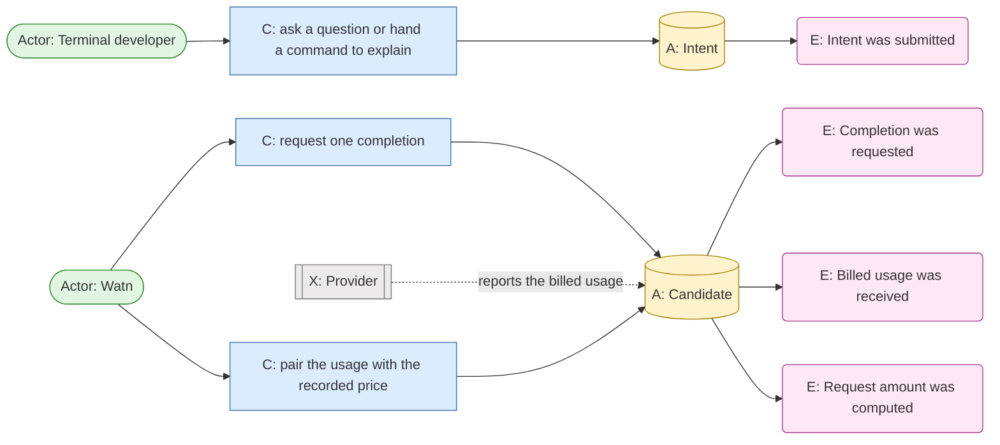
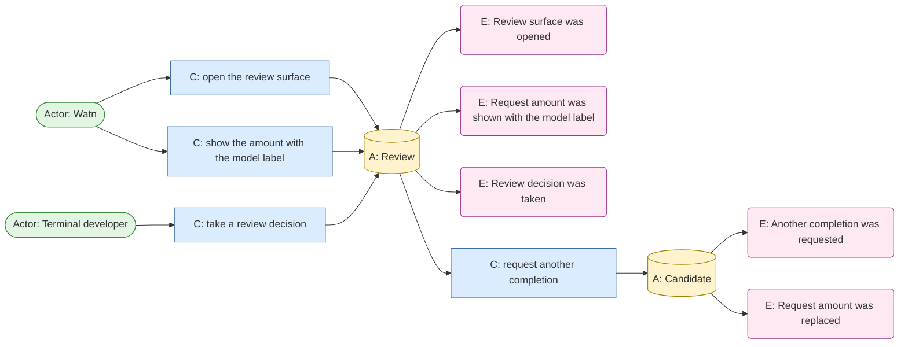

# Event Storming: visible-request-cost

## Boundary

The chain covers the amount the provider billed for one completed request and
its display in the review surface. It starts when the developer expresses an
intent and ends when the review surface closes.

- The permanent user-goal owner of the review surface is `use-shell`
  (capabilities `interactive-shell-shortcut` and `explain-command`).
- The post-request stderr metadata and the cost computation it uses are owned
  by the asking fragment (`givn/specs/fragments/ask.feature`); this chain does
  not change them.
- Pricing configuration, catalog prices, and price capture are owned by
  `configure-model` and are consumed here, not modified.
- Non-interactive paths and a permanently disabled review surface are outside
  the chain: no surface exists, so no amount is displayed.
- The chain contains events that belong to `use-shell`'s own flow — the
  candidate released, the surface disabled, the shell buffer replaced, the
  execution authorized. They are present because the amount's life is bounded
  by them, and they stay `use-shell`'s outcomes; this chain only records that
  the amount ends when they happen.

## Initial event chain

| Domain event | Actor / command | Aggregate | Policy | Actor reads | Existing ownership |
|---|---|---|---|---|---|
| Intent was submitted | Terminal developer asks a question (positional, stdin, Ctrl-W) or hands an existing command to `watn explain` | Intent | Capture the intent or the explained command without changing it | Current shell buffer, question, or explained command | Existing asking behavior and `use-shell` |
| Completion was requested | Watn sends one request to the selected tier or explicit model | Candidate | Existing provider, streaming, and tier rules; the review path buffers the complete candidate | Progress line | Existing asking behavior |
| Billed usage was received | Provider reports token usage with the completed response | Candidate | Take the usage the provider reported; a response that reports none yields no amount for this chain, even though the existing stderr line prints `$0.0000` for it | — | Existing provider behavior |
| Request amount was computed | Watn pairs the reported usage with the recorded price of the response model | Candidate | Multiply reported tokens by that model's recorded per-million prices; no recorded price for the response model means no amount exists | — | New in the surface; the computation it mirrors exists only inline on two paths (`src/main.rs:629`, `src/main.rs:1311`) |
| Review surface was opened | Watn opens the pane for the current eligible path | Review | Existing review eligibility, panel preference, and rendering rules | Pane | `use-shell` |
| Request amount was shown with the model label | Pane header presents the model label and the amount of the request that produced this candidate | Review | Shown in both views beside the label in the header right segment; shown only when an amount exists; when the response model has no recorded price the label stands alone and no marker replaces the amount (Q2 closed) | `◆ claude-haiku-4.5 · 0.06 ¢` | New; extends the pane header |
| Review decision was taken | Terminal developer accepts, edits, rejects, rephrases, escalates, or cancels | Review | Only final acceptance releases a candidate; only reject, rephrase, and escalation cause another request | Pane and its hints | `use-shell` |
| Another completion was requested | Watn sends a new request after reject, rephrase, or escalation | Candidate | The previous candidate leaves the pane together with its amount | Pane | `use-shell` |
| Request amount was replaced | Watn shows the new request's amount at the model label | Candidate | No accumulation and no history of amounts: one request, one amount, one pane | Pane | New |
| Candidate was released | Accepted candidate routed to its consumer | Candidate | Existing routing: command-output channel, shell buffer, or execution authorization | Command output or shell buffer | Existing asking behavior and `use-shell` |
| Review was abandoned | Cancel or Escape, or a failed or interrupted request | Review | Release no command; preserve the original input state; the amount disappears with the pane | Original input | `use-shell` |
| Review surface was disabled permanently | Terminal developer disables review from the pane | Review | Release the current candidate to the command-output channel and end the invocation; the stderr metadata remains the only money line | Command output and re-enable hint | `use-shell` |
| Explanation request was billed | `watn explain` obtains stage purposes for an existing command | Review | The explanation-only card shows the amount of that explanation request | Explanation-only card | `use-shell` / `explain-command` |
| Explanation request failed | Explanation request failed or returned an unusable response | Review | No usage, therefore no amount; the failure is reported on stderr and the card keeps the explained command with purpose-unavailable | Card and stderr | `explain-command` |
| Post-request metadata was printed | Watn prints the stderr metadata line for a completed request | Intent | Unchanged, and printed on the direct path and the review-accepted path only; `watn explain`, rejected and regenerated requests, a cancelled review, and an in-pane permanent disable print no metadata at all | `model · tok/s · $0.0007 · 1.2s · ¯\_(ツ)_/¯` | Existing asking capability |

## Canvas

The chain is drawn as one diagram per coherent flow. Every event, its command,
its aggregate, and the issuing actor appear; the shape prefixes name the kind
(`E:` event, `C:` command, `A:` aggregate, `Actor:` actor, `X:` external
system, `Record:` record, `Spec:` specification, `Config:` configuration,
`RM:` read model). The aggregates are the closest roots this topic's own
records declare: `Intent` and `Candidate` are declared domain terms
(`domain-terms.md`, `docs/arc42/12-glossary.md`); `Review` is the interaction
named by the glossary's `Review decision`/`Review outcome`/`Review history`
family and by `docs/arc42/06-runtime-view.md` (*the review surface owns one
Candidate and process-local current-review history*) — its state includes the
`Explanation-only card` the glossary declares. `Provider` is external: it is
the LLM API service (`docs/arc42/12-glossary.md`), so the usage it reports is
recorded against the `Candidate` the request produced. The `Amount` is a
computed value, not a boundary, so it appears in the event labels rather than
as an aggregate.

Aggregate status: watn's glossary declares no aggregate list yet, so the three
roots above are **candidates** under the event storming rule — a new aggregate
is a domain term confirmed before a canvas relies on it. This retrofit draws
the roots the topic's own records name and flags them for confirmation
(`Intent`, `Candidate`, `Review`).

### Intent, completion, and the request amount

### Surface, amount display, and the decision loop

### Release, abandonment, disable, explanation, and metadata

```mermaid
flowchart LR
    classDef event fill:#fde8f4,stroke:#a3378c
    classDef command fill:#dcecff,stroke:#3a6ea5
    classDef aggregate fill:#fff3cd,stroke:#a38200
    classDef actor fill:#e2f5e2,stroke:#3a8f3a
    W([Actor: Watn]) --> C10[C: route the accepted candidate] --> Cand[(A: Candidate)]
    Cand --> E10(E: Candidate was released)
    TD([Actor: Terminal developer]) --> C11[C: cancel or Escape] --> Rev[(A: Review)]
    Rev --> E11(E: Review was abandoned)
    TD --> C12[C: disable the review from the pane] --> Rev
    Rev --> E12(E: Review surface was disabled permanently)
    W --> C13[C: obtain stage purposes for an explained command] --> Rev
    Rev --> E13(E: Explanation request was billed)
    Rev --> E14(E: Explanation request failed)
    W --> C15[C: print the post-request metadata] --> Intent[(A: Intent)]
    Intent --> E15(E: Post-request metadata was printed)
    class C10,C11,C12,C13,C15 command
    class E10,E11,E12,E13,E14,E15 event
    class Cand,Rev,Intent aggregate
    class W,TD actor
```

## Reverse narrative

To display an amount, an amount must have been computed (5), which requires
billed usage (3), which requires a completed request (2), which requires a
submitted intent (1). To display it in a surface, that surface must have opened
(6), which requires an eligible interactive path and an enabled review surface.

- Walking backwards past the pane: without a completed request there is no
  usage, and without usage this chain forms no amount — even though the
  existing stderr line today prints `$0.0000` for a priced model with no
  reported usage. The surface will not repeat that.
- Walking backwards past the pricing: an amount also requires a recorded price
  for the response model (Q2 decides what is shown instead when there is none).
- The rate itself comes from a chain this topic does not own: the catalog price
  was captured at setup time into pricing configuration.

## Read models

| Read model | Content | Who reads it |
|---|---|---|
| Pane header | Model label plus the amount of the request that produced the candidate | Terminal developer |
| Explanation-only card header | Model context plus the amount of the explanation request | Terminal developer |
| Post-request stderr metadata | Model, throughput, amount, elapsed time | Terminal developer, scripts, logs |

## Policies and their state

- **No recorded price for the response model** — decided (Q2 closed): no amount
  is shown and nothing replaces it. Silent absence is the policy.
- **Precision of the cents display** — Q3 open, Design-level, not gating.
- **Which of the two survives a header too narrow for both** — decided (Q4
  closed): the amount keeps its width and the model label is shortened first,
  down to the width where the amount itself no longer fits.

## Term collisions found while modelling

- The user's "price" means an incurred amount; the durable glossary's `Pricing`
  and `Catalog price` mean a per-million rate. See `domain-terms.md`.
- The user's "the actions i take" spans Review decisions; the persona's
  "proposed action" means only the offered command. See `domain-terms.md`.
- The label names the model the request was sent with; the amount is keyed on
  the model the provider reports. Decided in Q5: the billed amount is shown
  under the requested label.

## Ownership note for Use Case Definition

The chain crosses two permanent owners: the review surface and its header
belong to `use-shell`, whose `interactive-shell-shortcut` and `explain-command`
capabilities own the pane; the amount computation and the stderr metadata
belong to the asking fragment. Whether the new display lands as one capability
under `use-shell` or as an extension of an existing capability is decided in
Use Case Definition.
