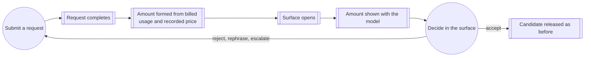

# Use case: observe-request-cost

## Level

!

## Actors

- Terminal developer (primary)
- Supporting: Watn
- Supporting: Provider

## Goal

Know the amount the provider billed for the request one just made.

## Trigger

A provider request the developer submitted has completed with a response.

## Preconditions

- A provider and a usable model are configured.
- The request reached the provider and completed with a response that reports
  usage.
- The path is review-eligible: an interactive terminal with the review surface
  enabled, or an existing command submitted for explanation with a usable model
  configured.

## Main flow

1. Terminal developer submits a question or hands an existing command to be
   explained; Watn requests one completion from the selected model.
2. Provider reports the billed usage with the completed response; Watn pairs
   that usage with the recorded price of the model the provider reports into the
   request's amount.
3. Watn opens the review surface for the completed response.
4. Watn shows the amount with the model the surface names.
5. Terminal developer reads the amount and continues with the surface's
   decisions; the amount stays visible while the surface is open.
6. Surface closes; the amount leaves with it.

## Extensions

- 1: The request fails, is interrupted, or ends before a complete response → no
  amount is shown on any surface the existing failure contract opens; protects
  the Minimal guarantee. A failed explanation still opens its card with the
  explained command and purpose-unavailable, exactly as today, and that card
  shows no amount.
- 2: The model the provider reports has no recorded price → no amount is
  formed; step 4 shows the model label alone and nothing takes the amount's
  place; protects "no amount is invented".
- 2: The completed response carries no usage report → no amount is formed even
  when a price is recorded; step 4 shows the model label alone; protects "a
  request the provider did not account for is never displayed as zero". A
  response that *does* report usage of zero tokens has been accounted for and
  shows a zero amount.
- 2: The completed response cannot be adopted as a structured review response
  or explanation → the surface still opens under its existing
  purpose-unavailable contract, and the amount still appears: the request
  completed and the provider billed it.
- 3: The surface names no model → no amount is shown; protects "the amount
  never appears without the model it belongs to".
- 4: The header's right segment cannot hold both the model label and the
  amount → the model label is shortened first so the amount keeps its width;
  protects "the amount is visible while it can be". Where the terminal is too
  narrow for the amount itself, the existing layout behavior applies and this
  case claims nothing.
- 5: The developer rejects the candidate, rephrases the intent, or escalates to
  another model and the new request succeeds → the surface replaces the
  previous amount with the new request's amount; protects the Success guarantee
  for the candidate on screen.
- 5: The new request fails or is interrupted → the preserved candidate keeps
  its own request's amount, because that amount still describes the candidate
  on screen; protects the Success guarantee for the candidate on screen.
- 5: The developer closes the explanation-only card → the amount leaves with
  the card and nothing is released; protects the Minimal guarantee.

## Rules

- The amount is the value the existing post-request cost computation produces
  for this request — the reported usage paired with the recorded per-million
  price of the model the provider reported — expressed in cents. This case owns
  showing that value in the surface; the computation and its rules stay with
  the corpus substrate.
- Usage means the response carried a usage report. The surface's computation
  tracks that presence separately from the cost value, because the existing
  computation cannot distinguish "no report" from "reported zero" on its own.
- The amount is never estimated, assumed, or substituted: no fallback price, no
  per-million rate, no session total, no comparison.
- The amount is shown only when the request reported usage and a recorded price
  matches the model the provider reported for the response. Otherwise the model
  label stands alone.
- The amount belongs to the model the provider billed for, and the label keeps
  naming the model the request was sent with. When the two differ, the amount is
  still shown: it is the billed truth, and hiding it over a naming difference
  would be the same silence the unpriced case gets.
- A request the provider did not account for is never displayed as zero; a
  request the provider did account for shows what it was billed, including a
  genuine zero.
- An amount never appears without the model it belongs to.
- The amount appears at the model label in the header, in every view of the
  surface, for as long as the amount fits the segment.
- The amount is transient: it exists only while the surface is open.
- The amount is rendered on the controlling-terminal channel and never becomes
  command output, in any form.
- The amount gates nothing: accepting, editing, cancelling, rejecting,
  regenerating, escalating, and disabling behave exactly as they do without it.
- The amount of the request that produced the explanation-only card is shown on
  that card; the explained command is still never generated, edited, accepted,
  or executed.
- A surface belonging to a request that never completed displays the existing
  failure contract and no amount.

## Examples

- `watn "find the 5 largest files in the commit history"` with a model priced as
  in the recorded configuration example (0.15 input, 0.60 output per million)
  and a response reporting 1200 prompt and 90 completion tokens: $0.000234, so
  the header reads `◆ gpt-4o-mini · 0.02 ¢` and the post-request stderr metadata
  line for the same request reads `$0.0002` — the same value at the two places'
  own precision.
- The same invocation with a model configured by hand and no recorded price:
  the header reads `◆ my-local-model` — no amount and no marker.
- After a rejection, the candidate is regenerated with a model priced 2.50 input
  and 10.00 output per million and a response reporting 1500 prompt and 200
  completion tokens: $0.00575, so the header replaces `0.02 ¢` with `0.57 ¢`.
  The stderr line for that request reads `$0.0057`.
- The request is sent with `openai/gpt-4o` while the provider reports
  `gpt-4o-2024-08-06`, which carries the recorded price: the label stays
  `◆ gpt-4o` and the amount comes from the reported model's price — 1000 prompt
  and 100 completion tokens at 2.50 and 10.00 per million is $0.0035, so the
  header reads `◆ gpt-4o · 0.35 ¢`.
- A completed response that carries no usage object: the header shows the model
  label alone, while the post-request stderr metadata line for the same request
  still prints `$0.0000` — the existing behavior of that line, unchanged here.
- `watn explain 'git log --oneline | head -5'` with the same 0.15/0.60 model and
  a response reporting 800 prompt and 120 completion tokens: $0.000192, so the
  card header reads `◆ gpt-4o-mini · 0.02 ¢`; Enter closes the card and releases
  nothing.
- A 40-column terminal: the right segment holds 19 columns, the amount suffix
  ` · 0.02 ¢` takes 9, and the label is shortened to what remains, so the header
  reads `◆ deepsee… · 0.02 ¢`. This is reachable only once the header reserves
  the amount's width before shortening the label; today's tail truncation would
  drop the amount instead.
- Ctrl-C during generation: no surface, no amount, and the existing interrupt
  contract.

## Minimal guarantee

When the request reported no usage or no recorded price matches the model the
provider reported, no amount and no substitute for it is displayed, and the
surface behaves exactly as it does without this case.

## Success guarantee

The developer sees, in the surface that their request produced, the amount the
provider billed for that request, at the model label, for as long as the
terminal is wide enough to carry it.

## Scenario skeletons

1. Given a configured model with a recorded price and a provider that reports
   usage for the completed request; When an interactive request completes and
   the review surface opens; Then the surface shows the amount for that request
   at the model label.
2. Given a configured model with no recorded price; When the request completes
   and the surface opens; Then the model label appears without an amount.
3. Given a recorded price and a completed response that reports no usage; When
   the surface opens; Then no amount is shown.
4. Given an open review with an amount visible; When the candidate is rejected
   and regenerated with another model; Then the surface shows the new request's
   amount in place of the previous one.
5. Given an existing command handed to `watn explain`; When the card opens;
   Then the card shows the explanation request's amount, and closing it
   releases nothing.
6. Given a request that fails, is interrupted, or is unusable; Then the
   existing failure or purpose-unavailable contract holds and no amount is shown
   for a request that never completed.
7. Given a 40-column terminal; Then the amount remains visible and the model
   label is shortened (`open: Q3` for the amount's decimals).
8. Given a non-interactive invocation; Then no surface opens and the existing
   stderr metadata line is unchanged.

Skeleton ownership: skeletons 1, 3, 4, and 7 assert behavior of this case's own
capability; skeleton 2 and the unusable-response extension rest on the
`interactive-shell-shortcut` capability's existing surface contract; skeleton 5
rests on `explain-command`; skeleton 8 asserts the `ask` capability's stderr
output, which this case does not change.

## Personas

- `terminal-developer--interactive` — cost stance, 2026-09-24.

## Capabilities

- `visible-request-amount`

## Interactions

- none yet; the executable end-to-end scenario is mapped at Handoff.

## Includes

- fragment: corpus-infra

## Extends

- none

## Out of scope

- Choosing model tiers, catalog sources, and reasoning, and capturing a model's
  price from a catalog (`configure-model`).
- Configuring the provider endpoint and credential (`configure-provider`).
- Reviewing, editing, rejecting, or returning a candidate, and replacing the
  shell buffer (`use-shell`) — this case displays an amount inside that surface
  and changes none of its decisions.
- Predicting or comparing spend for requests not yet made; session totals;
  budget alarms; spending limits.
- Provider invoices, reconciliation, currencies other than USD, refunds.

## Diagram

## Boundaries and dependencies

- The amount's computation and its stderr presentation are owned by the corpus
  substrate, specifically the `ask` capability's cost display
  (`givn/specs/fragments/ask.feature:60`) and the response-model keying pinned
  by `incremental-sse-rendering`
  (`givn/specs/fragments/incremental-sse-rendering.feature:27`). This case
  presents that value in one more place; it restates none of the computation's
  rules, but it does require the presence of a usage report to be tracked
  separately, which the two existing inline copies cannot express
  (`src/main.rs:629`, `:1311`).
- The review surface, its views, its decisions, and the model label belong to
  `use-shell`. This case owns what the amount is and that it appears at the
  label; the surface it appears in stays that goal's.
- The label names the model the request was sent with, while the amount is keyed
  on the model the provider reported. Q5 is closed on the billed amount: when
  the two differ, the amount is still shown under the requested label, because
  it is what was actually billed.
- A candidate preserved after a failed or interrupted regeneration keeps its own
  request's amount, matching the permanent rule that a failed regeneration
  preserves the selected candidate
  (`givn/specs/use-shell/interactive-shell-shortcut.feature:599`).

## Amendments this change will need

For Handoff and the later change, not applied during ideation:

- `givn/specs/use-shell/usecase.md` — the rule that the simple view "names only
  the model, stacks the command-flow stages with their separators, and shows the
  selected stage's purpose" must admit the amount at the model label.
- `docs/arc42/12-glossary.md` — the `Simple review view` and `Model short name`
  entries carry the same rule, and the durable term for the incurred amount is
  still missing (see `domain-terms.md`).
- No amendment to the `ask` or `incremental-sse-rendering` rules: this case
  consumes the amount computation and the response-model keying as they are.
- One scope item that is not an amendment: the explanation path today computes
  no amount at all (`src/main.rs:833`), so the explanation card's amount is new
  plumbing rather than a second display of an existing number.

## Recorded divergences

- A response with no usage object yields `Some(0.0)` in the existing computation
  (`src/main.rs:629`) and prints `$0.0000` on stderr (`src/output/render.rs:79`).
  This case does not change that line and does not repeat it: the surface shows
  nothing when no usage was reported. The divergence is deliberate and recorded.
- The money line is not printed on every path today: only the direct path
  (`src/main.rs:655`) and the review-accepted path (`src/main.rs:1336`) print
  it. `watn explain`, every rejected or regenerated request, a cancelled review,
  and an in-pane permanent disable print no metadata at all. This case therefore
  adds the amount to paths that never displayed one.

## Persona review

Critique from the cost stance of `terminal-developer--interactive`:

- The developer sees the money inside the pane that asks for the next decision,
  which is what the stance asks for.
- The case gates no decision, so the stance's control interest is untouched.
- Tension recorded: the stance says "a number whose absence is silent is not a
  number they can act on", while Q2 decided that silence is exactly what an
  unpriced model gets. The user arbitrated in favour of silence; the finding
  stays on record for Handoff.
- Tension recorded: the request that produced the explanation card is billed,
  yet today that path shows no money anywhere; the case closes that gap by
  adding a computation the path never had.
