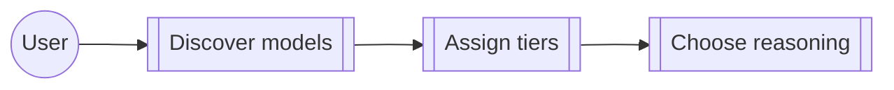

# Use case: configure-model

## Level

!

## Actors

- Watn user

## Goal

Choose model tiers, catalog sources, and reasoning behavior for Watn requests.

## Trigger

The user opens model setup or sends a request requiring a model tier.

## Preconditions

- A provider or catalog source is available.

## Main flow

1. Discover available models.
2. Assign model tiers.
3. Select reasoning behavior.
4. Persist and apply the choices.

## Extensions

- A missing catalog source leaves the active provider unchanged.

## Rules

- Per-level reasoning is applied only to the selected level.
- Verbose output keeps reasoning separate from command output.

## Examples

- The thinking tier sends reasoning without printing it by default.

## Minimal guarantee

Model discovery or cancellation does not corrupt existing configuration.

## Success guarantee

Requests use the selected model tier and reasoning policy.

## Personas

- none

## Capabilities

- reasoning-policy
- streamlined-setup
- reasoning
- ratatui-model-picker
- credential-sources
- models
- catalog-source
- model-autosuggest

## Interactions

| Capability | Consumer action | E2E scenario |
|---|---|---|
| reasoning-policy | persist minimal reasoning | Minimal reasoning is persisted and sent |
| streamlined-setup | coordinate all setup choices | Coordinated setup completes provider models reasoning and shell choices |
| streamlined-setup | configure provider from environment | Provider setup configures an OpenAI provider with an environment credential |
| streamlined-setup | configure all model roles | Models setup configures all three roles from an available catalog |
| streamlined-setup | configure shell integration | Shell setup independently configures completion and Ctrl-W integrations |
| streamlined-setup | reject incomplete request | Incomplete interactive request opens setup and does not send the original request |
| reasoning | send thinking reasoning | Thinking tier sends reasoning without printing it |
| reasoning | print verbose thinking reasoning | Thinking tier with verbose flag prints reasoning to stderr |
| reasoning | print small-tier reasoning | Verbose flag with small tier prints reasoning if present |
| reasoning | suppress small-tier reasoning | Small tier without verbose flag does not print reasoning |
| reasoning | preserve default-tier behavior | Verbose flag with default tier does not alter existing model behavior |
| reasoning | inspect verbose help | Help output includes verbose flag |
| reasoning | combine verbose and execute | Thinking tier with verbose and execute flags |
| ratatui-model-picker | configure three levels | Configure model and reasoning for all three levels in the dialog |
| ratatui-model-picker | browse model list | Browse the model list with arrow keys and page keys |
| ratatui-model-picker | filter model suggestions | Type a filter and see the matching suggestions |
| ratatui-model-picker | revise previous level | Return to a previous level and change its selection before confirming |
| ratatui-model-picker | apply per-level reasoning | Configured per-level reasoning takes effect on a request |
| credential-sources | discover with environment credential | Interactive model discovery uses an OpenRouter environment credential |
| credential-sources | prefer saved credential | A literal saved credential is authoritative over environment fallback |
| models | discover and assign tiers | Discover models and select tiers interactively |
| models | browse without LiteLLM | Model explorer without LiteLLM endpoint configured |
| catalog-source | use configured LiteLLM catalog | Configured LiteLLM is used for model catalog requests |
| catalog-source | preserve chat provider | LiteLLM discovery does not replace the active chat provider |
| model-autosuggest | find a model outside first page | Find a model outside the initial page while assigning tiers |

## Includes

- usecase: configure-provider
- fragment: corpus-infra

## Extends

- none

## Out of scope

Provider endpoint editing and shell integration behavior after setup.

## Diagram

