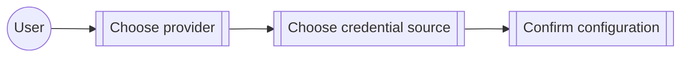

# Use case: configure-provider

## Level

!

## Actors

- Watn user

## Goal

Configure a model provider endpoint and credential source that Watn can use.

## Trigger

The user runs provider setup or uses a provider-backed command.

## Preconditions

- Watn configuration is writable.

## Main flow

1. Choose provider and endpoint.
2. Select credential source.
3. Confirm the provider configuration.

## Extensions

- An incomplete provider request opens setup before sending the original request.

## Rules

- Environment credentials are resolved without leaking literal saved values.

## Examples

- An OpenRouter credential is supplied through the environment.

## Minimal guarantee

An incomplete or cancelled provider setup does not save an invalid provider.

## Success guarantee

Watn can discover models or send requests through the configured provider.

## Personas

- none

## Capabilities

- provider-setup-widget-layout
- provider-setup
- providers

## Interactions

| Capability | Consumer action | E2E scenario |
|---|---|---|
| provider-setup-widget-layout | inspect provider setup layout | Provider setup separates choices, details, and guidance |
| provider-setup-widget-layout | inspect model picker layout | Model picker makes tiers and long model lists easy to scan |
| provider-setup | configure OpenRouter credential | Configure OpenRouter with an environment-backed credential |
| provider-setup | start setup on first normal use | First normal use starts provider setup and then model setup |
| providers | configure custom endpoint | Custom OpenAI-compatible provider from config |
| providers | configure LiteLLM discovery endpoint | LiteLLM endpoint in config for model discovery |
| providers | configure environment credential | Provider API key from environment variable |

## Includes

- fragment: corpus-infra

## Extends

- none

## Out of scope

Model tier selection.

## Diagram

