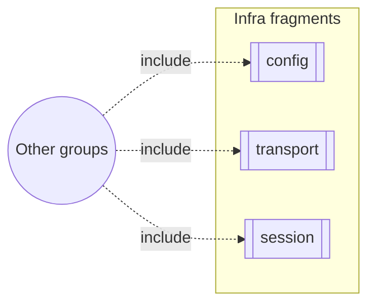

# Group: corpus-infra

## Actor

Any watn capability that depends on cross-cutting infrastructure.

## Goal

House the `«include»`-fragment capabilities — transport, config storage,
session behaviour, search concurrency, release truth, and the `ask` flow
— that other groups include rather than own.

## Main flow

1. A use-case capability needs config storage, streaming transport, or
   session infrastructure.
2. It includes the relevant corpus-infra capability.

## Interactions

- include config storage when persisting any setting
- include SSE streaming/transport for live model traffic
- include session handling for ask/cancel flows

## Includes

- none

## Extends

- every other group (infrastructure is included, not invoked directly)

## Out of scope

- Anything with a dominant command surface (belongs in that command's
  group).

## Diagram

