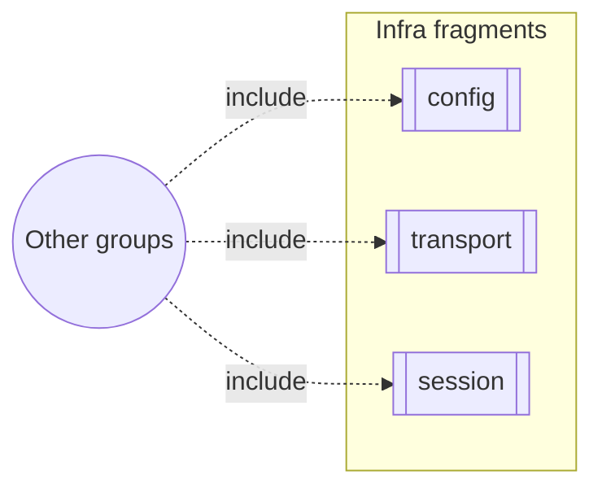

# Group: corpus-infra

## Actor

Any watn capability that depends on cross-cutting infrastructure.

## Goal

House the `«include»`-fragment capabilities — transport, config storage,
session behaviour, search concurrency, release truth, and the `ask` flow
— that other groups include rather than own.

## Main flow

1. A use-case capability needs config storage, streaming transport, or
   session infrastructure.
2. It includes the relevant corpus-infra capability.

## Interactions

- Ask with default tier returns a copy-pasteable command
- Explicit tier -1 uses the small/fast model
- Tier -2 uses the normal model
- Tier -3 uses the thinking/reasoning model
- Execute flag prompts for confirmation
- Execute flag with explicit "y" confirmation
- Execute flag with "n" answer skips execution
- Cost is displayed when pricing is configured
- Tokens/second is displayed after response completes
- Ask via stdin pipe
- One Ctrl+C cancels a completion waiting for streamed output
- One Ctrl+C cancels a completion waiting for a connection
- Configure model tiers in config file
- Environment variable overrides config file
- CLI flag overrides environment variable
- Model pricing configured for cost display
- Command text appears before a delayed stream completes
- Verbose streaming keeps reasoning on stderr and command text on stdout
- A mid-stream failure preserves visible content and exits unsuccessfully
- Raw terminal confirmation happens after the complete command arrives
- Piped confirmation remains available after streamed output
- Version flag reports the package version
- Normal debug requests ignore test routing settings
- Test-support requests use isolated routing without changing saved configuration
- Missing or whitespace test overrides fall back to the configured provider

## Includes

- none

## Extends

- none

(Use cases that include corpus-infra record the relationship on their
own side; corpus-infra holds no outgoing dependency.)

## Out of scope

- Anything with a dominant command surface (belongs in that command's
  group).

## Diagram

