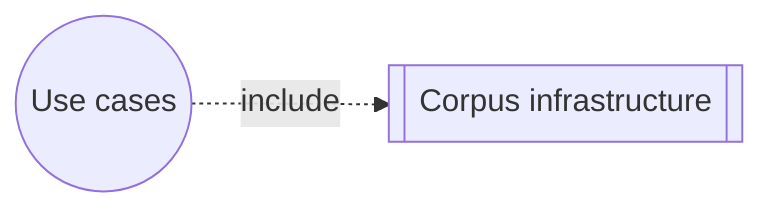

# Fragment: corpus-infra

## Capabilities

- ask
- cancel-running-completion
- config
- incremental-sse-rendering
- release-truth
- search-concurrency
- transport

## Interactions

- none

## Diagram

