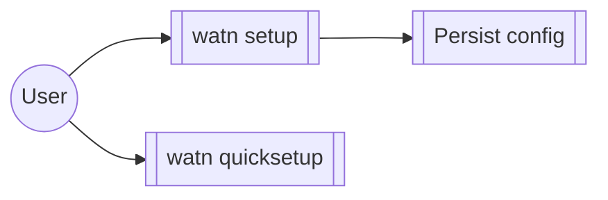

# Group: interactive-setup

## Actor

A watn user running the guided setup flows.

## Goal

Get a working watn configuration with minimal friction — the full
`watn setup` wizard, the minimal-question `watn quicksetup`, and the
persistence and responsiveness they rely on.

## Main flow

1. Run `watn setup` or `watn quicksetup`.
2. Answer the interactive questions; the active input is highlighted.
3. Configuration persists and re-runs pick up the saved state.

## Interactions

- The initial provider input has a green border
- The green border follows API key focus
- The green border follows model focus
- The green border follows optional shortcut focus
- First run without a configuration starts the quick setup
- Quick setup stores answers and installs integrations
- Explicit quick setup overwrites an existing configuration
- Aborting quick setup with Ctrl-C on the first run leaves no configuration
- The terminal model filter stays responsive during a delayed search
- Interactive model catalog failure before final confirmation persists nothing and sends no request
- Cancelling before credential confirmation does not save a provider
- Cancelling after credential confirmation preserves the provider
- Assigning tiers does not replace the active provider or catalog settings
- Setup wizard guides provider and model configuration page by page
- Models command opens the shared wizard on Small Model
- Escape asks whether to save or discard current setup

## Includes

- model-setup (model tier step)
- provider (provider step)
- corpus-infra (auto-init-config initialises config on first run)

## Extends

- none

## Out of scope

- Shell integration (shell group).

## Diagram

