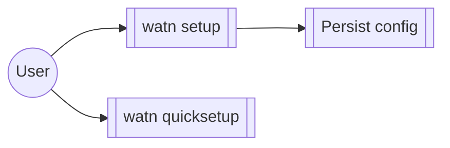

# Group: interactive-setup

## Actor

A watn user running the guided setup flows.

## Goal

Get a working watn configuration with minimal friction — the full
`watn setup` wizard, the minimal-question `watn quicksetup`, and the
persistence and responsiveness they rely on.

## Main flow

1. Run `watn setup` or `watn quicksetup`.
2. Answer the interactive questions; the active input is highlighted.
3. Configuration persists and re-runs pick up the saved state.

## Interactions

- run the full interactive setup wizard (`watn setup`)
- run the minimal-question quick setup (`watn quicksetup`)
- observe active input highlighting and responsive model filtering
- persist setup results for later runs

## Includes

- model-setup (model tier step)
- provider (provider step)
- corpus-infra (auto-init-config initialises config on first run)

## Extends

- none

## Out of scope

- Shell integration (shell group).

## Diagram

