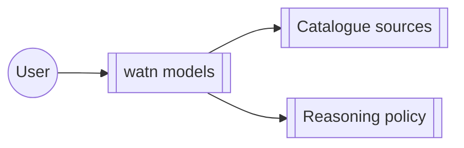

# Group: model-setup

## Actor

A watn user configuring model tiers, reasoning behaviour, and model
catalogue sources.

## Goal

Configure which models watn uses for which tier and how reasoning is
applied — via the interactive `watn models` flow and the catalogue it
draws from.

## Main flow

1. Open the interactive model picker (`watn models`).
2. Pick tiers from the catalogued sources; adjust reasoning policy.
3. Persist the selection and surface suggestions while editing.

## Interactions

- run the interactive model tier configuration (`watn models`)
- browse catalogue sources and credentials behind them
- pick models in the ratatui picker with autosuggest
- configure reasoning levels and reasoning policy

## Includes

- corpus-infra (config, transport)

## Extends

- interactive-setup (the models flow can run as part of full setup)

## Out of scope

- Provider endpoint and credential editing (provider group).

## Diagram

