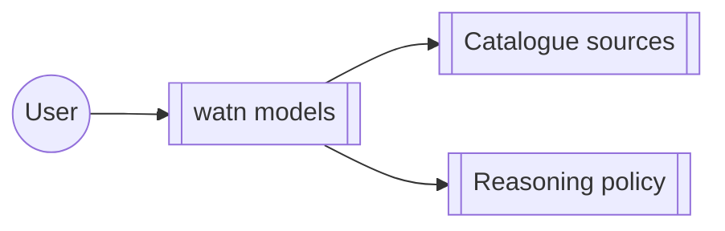

# Group: model-setup

## Actor

A watn user configuring model tiers, reasoning behaviour, and model
catalogue sources.

## Goal

Configure which models watn uses for which tier and how reasoning is
applied — via the interactive `watn models` flow and the catalogue it
draws from.

## Main flow

1. Open the interactive model picker (`watn models`).
2. Pick tiers from the catalogued sources; adjust reasoning policy.
3. Persist the selection and surface suggestions while editing.

## Interactions

- Configured LiteLLM is used for model catalog requests
- LiteLLM discovery does not replace the active chat provider
- Interactive model discovery uses an OpenRouter environment credential
- A literal saved credential is authoritative over environment fallback
- Find a model outside the initial page while assigning tiers
- Discover models and select tiers interactively
- Model explorer without LiteLLM endpoint configured
- Configure model and reasoning for all three levels in the dialog
- Browse the model list with arrow keys and page keys
- Type a filter and see the matching suggestions
- Return to a previous level and change its selection before confirming
- Configured per-level reasoning takes effect on a request
- Minimal reasoning is persisted and sent
- Thinking tier sends reasoning without printing it
- Thinking tier with verbose flag prints reasoning to stderr
- Verbose flag with small tier prints reasoning if present
- Small tier without verbose flag does not print reasoning
- Verbose flag with default tier does not alter existing model behavior
- Help output includes verbose flag
- Thinking tier with verbose and execute flags
- Coordinated setup completes provider models reasoning and shell choices
- Provider setup configures an OpenAI provider with an environment credential
- Models setup configures all three roles from an available catalog
- Shell setup independently configures completion and Ctrl-W integrations
- Incomplete interactive request opens setup and does not send the original request

## Includes

- corpus-infra (config, transport)

## Extends

- none

## Out of scope

- Provider endpoint and credential editing (provider group).

## Diagram

