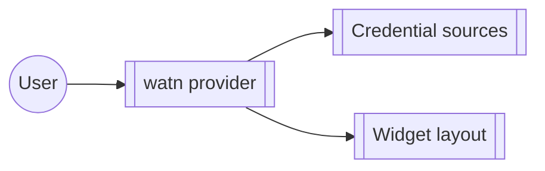

# Group: provider

## Actor

A watn user configuring a provider endpoint and its credential.

## Goal

Point watn at a model provider — endpoint, credential sources, and the
setup widgets that collect them.

## Main flow

1. Run the interactive provider setup (`watn provider`).
2. Choose credential sources; complete the widget layout.
3. Validate the endpoint against the transport layer.

## Interactions

- Provider setup separates choices, details, and guidance
- Model picker makes tiers and long model lists easy to scan
- Configure OpenRouter with an environment-backed credential
- First normal use starts provider setup and then model setup
- Custom OpenAI-compatible provider from config
- LiteLLM endpoint in config for model discovery
- Provider API key from environment variable

## Includes

- corpus-infra (config, credential storage via transport)

## Extends

- none

## Out of scope

- Model tier selection (model-setup group).

## Diagram

