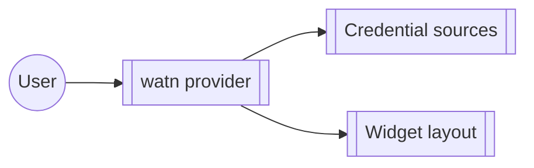

# Group: provider

## Actor

A watn user configuring a provider endpoint and its credential.

## Goal

Point watn at a model provider — endpoint, credential sources, and the
setup widgets that collect them.

## Main flow

1. Run the interactive provider setup (`watn provider`).
2. Choose credential sources; complete the widget layout.
3. Validate the endpoint against the transport layer.

## Interactions

- configure a provider endpoint interactively (`watn provider`)
- select a credential source for the provider
- edit provider setup through the widget layout

## Includes

- corpus-infra (config, credential storage via transport)

## Extends

- interactive-setup (provider setup is one leg of the full setup flow)

## Out of scope

- Model tier selection (model-setup group).

## Diagram

